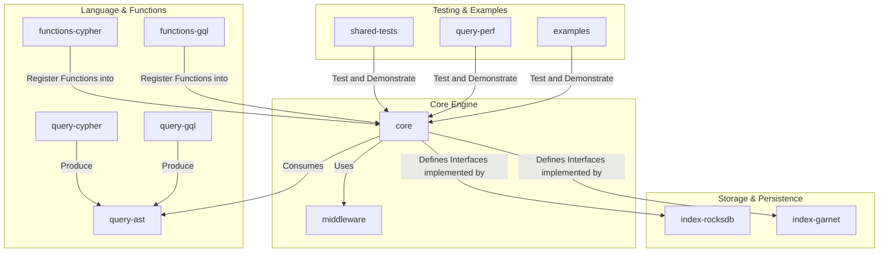

# AGENTS.md: `drasi-core`

`drasi-core` is a high-performance, embeddable library for executing **continuous queries** over streaming data. It processes streams of changes (inserts, updates, deletes) to incrementally compute result sets using a graph-based data model. The engine is modular, extensible, and backend-agnostic. The primary entry point is the `QueryBuilder` in the `core` crate.
See **`readme.md`**: Consult for concrete usage examples of `QueryBuilder` and `SourceChange` processing.

## Project Architecture

The repository is a Rust workspace organized into the following layers:

### Crate Breakdown
*   **`core`**: The engine's heart. Contains orchestration logic (`QueryBuilder`, `ContinuousQuery`), the evaluation pipeline, path solver, and abstract storage `interface` traits.
*   **`query-ast`**: Defines the language-agnostic Abstract Syntax Tree (AST), the common contract between parsers and the engine.
*   **`query-cypher` / `query-gql`**: Language frontends. They parse query strings into the `query-ast` structure.
*   **`functions-cypher` / `functions-gql`**: Standard libraries of language-specific functions (e.g., `toUpper`, `coalesce`) that register with the core engine.
*   **`middleware`**: A library of pluggable data transformation components (e.g., `unwind`) for pre-processing `SourceChange` events.
*   **`index-rocksdb`**: Persistent storage backend using embedded RocksDB.
*   **`index-garnet`**: Persistent storage backend using Garnet/Redis.
*   **`shared-tests`**: A reusable compliance test suite ensuring behavioral consistency across all storage backends.
*   **`query-perf`**: CLI tool for benchmarking and performance testing.
*   **`examples`**: Runnable programs demonstrating library usage.

## Build Prerequisites
*   **Rust**: Install via [rustup](https://rustup.rs/).
*   **libjq**: Required for the `middleware` crate.
    *   Install via package manager (e.g., `brew install jq`, `apt-get install libjq-dev`).
    *   Set `JQ_LIB_DIR` env var if the build fails to locate it (e.g., `/opt/homebrew/lib` on macOS).

## Project Rules & Requirements

### Code Conventions (Strictly Enforced)
*   **No `.unwrap()`**: Use `?` operator or explicit error handling. CI enforces `clippy::unwrap_used`.
*   **No `print!`/`println!`**: Use the `log` crate macros (`info!`, `error!`, etc.). CI enforces `clippy::print_stdout`.
*   **License Header**: Every new `.rs` file MUST start with the Apache 2.0 header.
*   **DCO Sign-off**: All commits MUST include a `Signed-off-by:` line. Use `git commit -s`.

### Key Architectural Principles
*   **Interface-Driven**: The `core` crate defines abstract `trait`s (`ElementIndex`, `ResultIndex`) to decouple logic from storage.
*   **Pluggable Backends**: Storage implementations are swappable at runtime via dependency injection in the `QueryBuilder`.
*   **Pipeline Processing**: Data flows linearly: `Middleware` -> `Path Solver` -> `Evaluator`.
*   **Declarative Config**: Queries and middleware pipelines are defined declaratively.

## Development Workflows

### Common Tasks
*   **Add a new Function**:
    1.  Implement `ScalarFunction` or `AggregatingFunction` traits (found in `core`).
    2.  Register the function in the `FunctionRegistry`.
    3.  Add validation tests in `shared-tests/src/use_cases`.

*   **Add a Storage Backend**:
    1.  Create a new crate implementing `ElementIndex`, `ResultIndex`, and `FutureQueue`.
    2.  Add `shared-tests` as a `dev-dependency`.
    3.  Create a test runner implementing `QueryTestConfig` to execute the standard suite.

*   **Add Middleware**:
    1.  Implement `SourceMiddleware` and `SourceMiddlewareFactory` in `middleware` crate.
    2.  Register in the middleware registry.

### CI Conventions
*   **`test.yml`**: Runs `cargo test`. Blocks PR merge.
*   **`ci-lint.yml`**: Runs `clippy` (no unwraps/prints) and `fmt`. Blocks PR merge.
*   **`devskim.yml`**: Security scanner. Blocks PR merge on findings.
*   **`coverage.yaml`**: Reports code coverage.