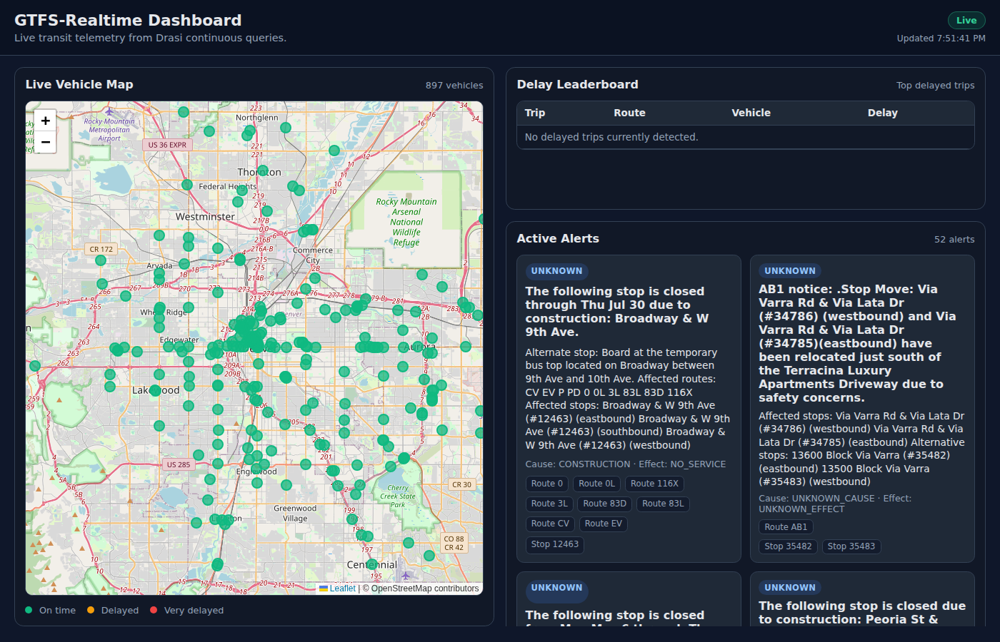

# GTFS-RT Source

A Drasi source that polls [GTFS-Realtime](https://gtfs.org/documentation/realtime/reference/) Protocol Buffer feeds and continuously emits graph change events. It turns any transit agency's public GTFS-RT feeds into a live, queryable graph — enabling real-time Cypher queries over vehicle positions, trip delays, and service alerts.



## Features

- Polls **TripUpdates**, **VehiclePositions**, and **Alerts** feeds at a configurable interval
- Two-level hash-based snapshot diffing (`xxhash64`) — only changed entities are decoded, and only changed graph nodes/relations are emitted
- Shared graph nodes across feeds (**Route**, **Trip**, **Vehicle**, **Stop**, **Agency**) — enabling powerful cross-feed queries
- Fine-grained insert/update/delete semantics with dependency-ordered emission
- Resilient per-feed fetching — a single feed failure doesn't disrupt the others
- Optional bootstrap integration with `drasi-bootstrap-gtfs-rt`
- Works with any transit agency that publishes standard GTFS-RT feeds (hundreds worldwide)

## Use cases

### Fleet monitoring & operations dashboard

Track every vehicle in a transit fleet in real time. Show positions on a map, highlight delayed vehicles, and surface active service alerts — all powered by continuous Cypher queries.

```cypher
MATCH (v:Vehicle)-[:HAS_POSITION]->(vp:VehiclePosition)
RETURN v.vehicle_id, v.label, vp.latitude, vp.longitude, vp.speed, vp.bearing, vp.current_status
```

### Delay detection & alerting

Detect trips running behind schedule and trigger notifications when delays exceed thresholds. Drasi's continuous query engine re-evaluates automatically when trip update data changes.

```cypher
MATCH (t:Trip)-[:HAS_UPDATE]->(tu:TripUpdate)-[:HAS_STOP_TIME_UPDATE]->(stu:StopTimeUpdate)-[:AT_STOP]->(s:Stop)
WHERE tu.delay > 300
RETURN t.trip_id, t.route_id, tu.delay, s.stop_id, stu.arrival_delay
```

### Cross-feed correlation: alerts on delayed routes

Combine service alerts with vehicle positions to answer questions like "show me all vehicles currently on routes with severe alerts":

```cypher
MATCH (a:Alert)-[:AFFECTS_ROUTE]->(r:Route)<-[:ON_ROUTE]-(t:Trip)<-[:SERVES]-(v:Vehicle)-[:HAS_POSITION]->(vp:VehiclePosition)
WHERE a.severity_level = 'SEVERE'
RETURN v.label, r.route_id, vp.latitude, vp.longitude, a.header_text
```

### Stop-level arrival monitoring

Monitor expected arrivals at a specific stop — useful for passenger information displays, accessibility kiosks, or predictive analytics.

```cypher
MATCH (s:Stop)<-[:AT_STOP]-(stu:StopTimeUpdate)<-[:HAS_STOP_TIME_UPDATE]-(tu:TripUpdate)<-[:HAS_UPDATE]-(t:Trip)
WHERE s.stop_id = '20216'
RETURN t.trip_id, t.route_id, stu.arrival_delay, stu.arrival_time, stu.departure_time
```

### Route utilization analytics

Count active vehicles per route to understand fleet distribution and identify over- or under-served routes.

```cypher
MATCH (r:Route)<-[:ON_ROUTE]-(t:Trip)<-[:SERVES]-(v:Vehicle)
RETURN r.route_id, count(v) AS vehicle_count
```

### Geofenced vehicle queries

Find all vehicles within a geographic bounding box — useful for zone-based analytics, station proximity alerts, or regional dashboards.

```cypher
MATCH (v:Vehicle)-[:HAS_POSITION]->(vp:VehiclePosition)
WHERE vp.latitude > 39.7 AND vp.latitude < 39.8 AND vp.longitude > -105.0 AND vp.longitude < -104.9
RETURN v.label, v.vehicle_id, vp.latitude, vp.longitude, vp.speed
```

## Basic usage

```rust
use drasi_source_gtfs_rt::GtfsRtSource;
use drasi_bootstrap_gtfs_rt::{GtfsRtBootstrapProvider, GtfsRtBootstrapConfig};

// Create a bootstrap provider for initial data load
let bootstrap = GtfsRtBootstrapProvider::new(GtfsRtBootstrapConfig {
    trip_updates_url: Some("https://www.rtd-denver.com/files/gtfs-rt/TripUpdate.pb".into()),
    vehicle_positions_url: Some("https://www.rtd-denver.com/files/gtfs-rt/VehiclePosition.pb".into()),
    alerts_url: Some("https://www.rtd-denver.com/files/gtfs-rt/Alerts.pb".into()),
    headers: None,
    timeout_secs: Some(15),
    language: None,
});

// Build the source
let source = GtfsRtSource::builder("transit")
    .with_trip_updates_url("https://www.rtd-denver.com/files/gtfs-rt/TripUpdate.pb")
    .with_vehicle_positions_url("https://www.rtd-denver.com/files/gtfs-rt/VehiclePosition.pb")
    .with_alerts_url("https://www.rtd-denver.com/files/gtfs-rt/Alerts.pb")
    .with_poll_interval_secs(30)
    .with_bootstrap_provider(bootstrap)
    .build()?;
```

## Configuration

| Field | Description | Default |
|---|---|---|
| `trip_updates_url` | Trip updates feed URL | `None` |
| `vehicle_positions_url` | Vehicle positions feed URL | `None` |
| `alerts_url` | Alerts feed URL | `None` |
| `poll_interval_secs` | Poll interval in seconds | `30` |
| `timeout_secs` | HTTP timeout in seconds | `15` |
| `headers` | Optional HTTP headers (e.g. API keys) | `{}` |
| `language` | Preferred language for translated strings | `"en"` |
| `initial_cursor_mode` | First-poll behavior | `StartFromBeginning` |

At least one feed URL must be configured.

## Initial cursor modes

- `StartFromBeginning` — first poll emits inserts for all snapshot elements
- `StartFromNow` — first poll is treated as baseline (no inserts), later diffs are emitted
- `StartFromTimestamp(ms)` — first poll emits elements newer than timestamp, then normal diffing

## Graph model

The source builds a rich graph with shared nodes that are deduplicated across all three feed types. See the full [graph schema reference](../../docs/sources/gtfs-rt-graph-schema.md) for node types, relationship types, ID patterns, and properties.

```
(Alert)──[:AFFECTS_ROUTE]──▶(Route)◀──[:ON_ROUTE]──(Trip)◀──[:SERVES]──(Vehicle)
   │                                                  │                     │
   │                                          [:HAS_UPDATE]          [:HAS_POSITION]
   │                                                  ▼                     ▼
   │                                           (TripUpdate)         (VehiclePosition)
   │                                                  │
   │                                      [:HAS_STOP_TIME_UPDATE]
   │                                                  ▼
   └──[:AFFECTS_STOP]──▶(Stop)◀──[:AT_STOP]──(StopTimeUpdate)
                           ▲
                           └──[:CURRENT_STOP]──(VehiclePosition)
```

## How change detection works

The source uses a two-level hash-based diff on each poll:

1. **Entity level** — each `FeedEntity` is hashed with xxhash64. Only entities whose hash changed since the last poll are decoded. Unchanged entities are skipped at zero cost.
2. **Graph level** — for changed entities, the full subgraph (nodes + relations) is rebuilt and compared against the previous snapshot. Only the specific nodes/relations that actually changed produce `SourceChange` events.

Shared nodes (Route, Trip, Vehicle, Stop, Agency) are reference-counted across feed entities. A shared node is only deleted when no remaining entity references it.

## Example application

The [`examples/lib/gtfs-rt-getting-started/`](../../examples/lib/gtfs-rt-getting-started/) directory contains a complete standalone dashboard that connects to RTD Denver's public feeds and displays:

- **Live Vehicle Map** — Leaflet.js map with color-coded markers (green = on time, yellow = delayed, red = very delayed)
- **Delay Leaderboard** — auto-updating table of most delayed trips
- **Active Alerts** — service alert cards with severity, cause/effect, and affected routes/stops
- **Route Statistics** — Chart.js bar chart of vehicle counts per route

Run it with:

```bash
cd examples/lib/gtfs-rt-getting-started
cargo run
# Open http://localhost:8090
```

## Compatible feeds

Any transit agency publishing standard GTFS-RT feeds works with this source. A few examples:

| Agency | Region | Feed URLs |
|---|---|---|
| [RTD Denver](https://www.rtd-denver.com/open-records/open-spatial-information/real-time-feeds) | Denver, CO | Public, no API key |
| [MTA New York](https://api.mta.info/) | New York, NY | Requires API key (use `headers`) |
| [MBTA Boston](https://www.mbta.com/developers/v3-api) | Boston, MA | Requires API key |
| [TriMet Portland](https://developer.trimet.org/) | Portland, OR | Requires API key |
| [WMATA DC](https://developer.wmata.com/) | Washington, DC | Requires API key |

See the [Mobility Database](https://database.mobilitydata.org/) for a comprehensive catalog of GTFS-RT feeds worldwide.

## Testing

```bash
# Unit tests
cargo test -p drasi-source-gtfs-rt

# Integration test (uses mock HTTP server, no external dependencies)
cargo test -p drasi-source-gtfs-rt --test integration_test -- --ignored --nocapture
```
