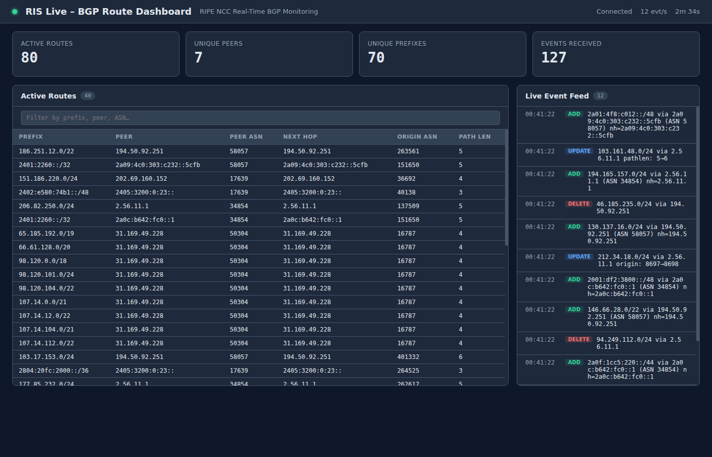

# RIPE NCC RIS Live Source

The RIS Live source streams real-time BGP events from [RIPE NCC RIS Live](https://ris-live.ripe.net/) over WebSocket and maps them into a continuously-queryable graph of BGP peers, IP prefixes, and the routing relationships between them.

## Overview

[RIS Live](https://ris-live.ripe.net/) is a free, public service operated by the RIPE NCC that streams Border Gateway Protocol (BGP) update messages collected by the [Routing Information Service (RIS)](https://www.ripe.net/analyse/internet-measurements/routing-information-service-ris/) route collectors deployed at Internet Exchange Points worldwide.

This source connects to `wss://ris-live.ripe.net/v1/ws/`, subscribes with optional filters, and maps the BGP data into a graph:

```
(:Peer)-[:ROUTES]->(:Prefix)
```

As BGP announcements and withdrawals arrive, the graph is kept in sync: new routes are inserted, changed routes are updated, and withdrawn routes are deleted — enabling continuous Cypher queries that react to the live routing table in real time.

## Use Cases

### 1. Route Visibility Monitoring

Track which peers are announcing a specific prefix. Useful for verifying that your network's prefixes are visible from different vantage points.

```cypher
MATCH (peer:Peer)-[r:ROUTES]->(p:Prefix)
WHERE p.prefix = '203.0.113.0/24'
RETURN peer.peer_ip AS peer,
       peer.peer_asn AS peer_asn,
       r.next_hop AS next_hop,
       r.path_length AS path_length
```

### 2. BGP Hijack / Origin Anomaly Detection

Detect when a prefix is originated by an unexpected AS. If AS 64500 is the legitimate origin, any other origin is suspicious.

```cypher
MATCH (peer:Peer)-[r:ROUTES]->(p:Prefix)
WHERE p.prefix = '203.0.113.0/24'
  AND r.origin_asn <> 64500
RETURN peer.peer_ip AS peer,
       r.origin_asn AS unexpected_origin,
       r.path_length AS path_length
```

### 3. AS Path Length Analysis

Find unusually long AS paths, which may indicate route leaks or misconfigurations.

```cypher
MATCH (peer:Peer)-[r:ROUTES]->(p:Prefix)
WHERE r.path_length > 8
RETURN p.prefix AS prefix,
       r.origin_asn AS origin,
       r.path_length AS path_length,
       peer.peer_asn AS seen_by
```

### 4. Peer Connectivity Dashboard

Monitor peer session states in real time. When `includePeerState` is enabled, the source tracks `RIS_PEER_STATE` messages so you can detect collector–peer session flaps.

```cypher
MATCH (peer:Peer)
WHERE peer.state IS NOT NULL
RETURN peer.peer_ip AS peer,
       peer.peer_asn AS asn,
       peer.host AS collector,
       peer.state AS session_state
```

### 5. Multi-Origin Prefix Detection (MOAS)

Find prefixes that are originated by more than one AS — a common indicator of hijacking or misconfiguration.

```cypher
MATCH (peer:Peer)-[r:ROUTES]->(p:Prefix)
RETURN p.prefix AS prefix,
       drasi.listDistinct(r.origin_asn) AS origins,
       count(r) AS route_count
```

### 6. Prefix Reachability from a Specific Collector

Monitor which prefixes are reachable from a particular RIS route collector (e.g. `rrc00` in Amsterdam).

```cypher
MATCH (peer:Peer)-[r:ROUTES]->(p:Prefix)
WHERE peer.host = 'rrc00.ripe.net'
RETURN p.prefix AS prefix,
       count(r) AS peer_count
```

## Graph Schema

For a detailed reference of all node types, relationship types, properties, ID formats, and lifecycle semantics, see [**docs/graph-schema.md**](docs/graph-schema.md).

### Quick Reference

| Element | Labels | ID Format | Key Properties |
|---|---|---|---|
| **Peer** node | `Peer` | `{host}\|{peer_ip}` | `peer_ip`, `peer_asn`, `host`, `state` |
| **Prefix** node | `Prefix` | `{prefix}` | `prefix` |
| **ROUTES** rel | `ROUTES` | `{peer_ip}\|{prefix}` | `next_hop`, `origin_asn`, `path_length`, `path`, `origin`, `community` |

### Event Lifecycle

| BGP Event | Graph Effect |
|---|---|
| Announcement (new route) | Insert `Peer` + Insert `Prefix` + Insert `ROUTES` |
| Announcement (existing route) | Update `ROUTES` (e.g. path change) |
| Withdrawal | Delete `ROUTES` |
| `RIS_PEER_STATE` | Insert or Update `Peer` with `state` property |

## Usage

### Builder API

```rust
use drasi_source_ris_live::RisLiveSource;

let source = RisLiveSource::builder("ris-source")
    .with_host("rrc00")
    .with_message_type("UPDATE")
    .with_prefix("203.0.113.0/24")
    .with_more_specific(true)
    .with_require("announcements")
    .with_include_peer_state(true)
    .with_reconnect_delay_secs(5)
    .with_start_from_now()
    .build()?;
```

### Basic Query

```cypher
MATCH (peer:Peer)-[r:ROUTES]->(p:Prefix)
RETURN peer.peer_ip AS peer,
       peer.peer_asn AS peer_asn,
       p.prefix AS prefix,
       r.next_hop AS next_hop,
       r.origin_asn AS origin_asn,
       r.path_length AS path_length
```

## Configuration

| Option | Type | Default | Description |
|---|---|---|---|
| `websocketUrl` | `string` | `wss://ris-live.ripe.net/v1/ws/` | RIS Live endpoint |
| `clientName` | `string?` | `null` | Optional client name (`?client=...`) |
| `host` | `string?` | `null` | Route collector filter (e.g. `rrc00`) |
| `messageType` | `string?` | `null` | RIS message type filter (e.g. `UPDATE`) |
| `prefixes` | `string[]?` | `null` | Prefix filter list |
| `moreSpecific` | `bool?` | `null` | Include more-specific prefixes |
| `lessSpecific` | `bool?` | `null` | Include less-specific prefixes |
| `path` | `string?` | `null` | AS path filter |
| `peer` | `string?` | `null` | Peer IP filter |
| `require` | `string?` | `null` | Required field filter (e.g. `announcements`) |
| `includePeerState` | `bool` | `true` | Emit `RIS_PEER_STATE` updates |
| `reconnectDelaySecs` | `u64` | `5` | Reconnect backoff in seconds |
| `clearStateOnStart` | `bool` | `false` | Clear persisted mapper state before stream starts |
| `startFromBeginning` | `bool?` | `null` | Process from connection start |
| `startFromNow` | `bool?` | `null` | Process from current stream position |
| `startFromTimestamp` | `i64?` | `null` | Skip messages older than this timestamp (ms) |

## State Management

The source persists mapper state under key `ris-live.stream-state.v1` when a `StateStoreProvider` is available. Stored state tracks:

- **known peers** — which Peer nodes have been inserted
- **known prefixes** — which Prefix nodes have been inserted
- **active routes** — which ROUTES relationships currently exist

This preserves correct insert/update/delete semantics across restarts: a route that was inserted before a restart is correctly emitted as an *update* (not a duplicate insert) when re-announced after restart.

## Example

See [`examples/lib/ris-live-getting-started/`](../../../examples/lib/ris-live-getting-started/) for a full web dashboard example that streams live BGP data.



## Limitations

- **No bootstrap provider**: RIS Live is a real-time stream with no historical replay. The graph starts empty and fills as announcements arrive.
- **No ORDER BY**: Drasi continuous queries do not support `ORDER BY`.
- **High event volume**: Without filters, `rrc00` alone can produce thousands of events per second. Use `host`, `prefix`, or `require` filters to narrow the stream.
- **Public service fair use**: RIS Live is a shared public resource. Set a `clientName` to help RIPE NCC identify your connection and avoid excessive reconnects.

## Development

```bash
make build
make test
make integration-test
make lint
```

Integration test uses a local mock WebSocket server and is intentionally ignored by default:

```bash
cargo test -p drasi-source-ris-live --test integration_test -- --ignored --nocapture
```
