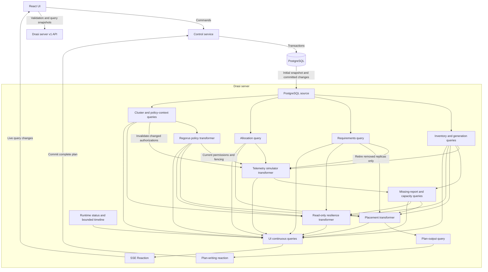

# GPU Cluster Lab

## About this guide

This is the specification for building, installing, and presenting a simulated GPU management demo. Give an implementer this file **and the [presenter runbook](gpu-cluster-demo-runbook.md)**.

**Current status:** the design and scripts are documented; the demo application, migrations, configuration, and launcher are not implemented in this workspace. Commands beginning with `./demo` below define the installation interface the implementer must deliver. They are not existing Drasi commands. Do not describe the installation as verified until those commands and the acceptance checks work on a clean machine.

| Reader | Read first |
|---|---|
| Someone evaluating the demo | Sections 1-4: purpose, experience, simulated environment, architecture |
| Person or agent implementing it | Sections 5-10: data, processing rules, APIs, UI, source dependencies and build plan |
| Someone installing the completed demo | Section 11: installation and operation |
| Presenter | Section 12 and the separate runbook |
| Reviewer | Section 13: acceptance checks and troubleshooting |

Technical names appear where needed for implementation. The important terms are:

| Term | Meaning here |
|---|---|
| Fleet | The single scheduling and plan-commit boundary, containing all regional clusters |
| Regional cluster | A named group of workers in one declared region |
| Worker | One simulated virtual machine containing two GPUs |
| Replica | One copy of a model-serving workload |
| Placement | The GPU assigned to each replica |
| Continuous query, or CQ | A query whose result is kept up to date as its inputs change |
| Transformer | A Drasi component that consumes change events and produces new change events, possibly maintaining state or using timers |
| Reaction | A component that acts on query results, such as writing to an HTTP endpoint or streaming updates to a browser |
| CDC | Change data capture: reading committed database changes without repeatedly polling its tables |
| SSE | Server-Sent Events: a persistent HTTP connection carrying updates from Drasi to the browser |
| Snapshot | A complete current set of records, used to initialize or recover a consumer |
| Input signature | A hash identifying exactly which scheduling facts a calculation used; it detects obsolete results |
| Processing policy | Rules defining which workload/data contexts may use which regional clusters |
| Fencing | Stopping a replica from processing more work; this requires an acknowledgement, not just a warning |

## 1. Use case and value

Imagine a team operating a shared GPU fleet for chat, document assistance, embeddings, and search reranking. The team needs to admit new workloads, respond to contention, recover from unavailable devices, preserve redundancy, and respect customer data-processing restrictions.

Ordinary dashboards show measurements. This demo **uses those measurements and deployment requirements to decide what should change, applies that decision, and observes the result**.

The audience should leave with these observations:

| Demonstration | Value shown |
|---|---|
| Increase competing load or stop a GPU's reports | A database edit or absence of an event can cause a useful operational response |
| Admit a large model when memory is scattered across GPUs | A global placement solver can rearrange work instead of merely declaring capacity exhausted |
| Add a workload that fits today but removes failure tolerance | The system can continuously answer a hypothetical operational question |
| Inspect a placement decision | Decisions can carry concrete reasons, constraints, and before/after evidence |
| Lose approved regional capacity while prohibited capacity stays healthy | Available hardware is not necessarily a permitted processing destination |
| Change a processing policy while workloads run | Existing placements must be reevaluated and prohibited processing stopped, even when no replacement fits |

Drasi's role is to connect **different forms of processing** in one computation graph: queries interpret data, a timed transformer simulates devices, a Regorus policy transformer determines permitted destinations, a solver transformer decides placement, and a reaction writes the result back to the database. Another query observes that write and changes the simulator's allocation.

**Policy determines where a workload may run; the solver determines where it fits.** Build one application, schema, graph, and UI. Baseline, fragmentation, and regional-boundary demonstrations are different fixtures, not separate implementations. Policy evaluation runs in every fixture; the original demonstrations use an explicit permissive policy, not a policy bypass.

This is not a claim that Kubernetes or other systems cannot recover workloads. The point is the composition of these capabilities, with explicit state and observable feedback, rather than a large custom controller hidden behind the UI.

## 2. What the user sees

The main screen groups GPUs by regional cluster and worker; a single-cluster fixture keeps the original compact view. Each GPU shows its hardware profile, memory reservations, competing demand, assigned replicas, reporting state, and detected health. Selecting a workload shows which clusters it may use and why.

The user can:

- Register a ready worker in a cluster, deregister a GPU, or recommission a vacant GPU slot.
- Change background demand; stop reports from a device or a whole worker.
- Simulate device, worker, or regional failure and recovery.
- Add a named workload, change replica count or its serving profile, and remove it.
- Inspect proposed, committed, and actually applied placements.
- Ask whether the current requirements could still be met, within policy, after losing another worker or region.
- Inspect or edit approved policy parameters, and observe placement reevaluation and fencing.

For example:

1. The user raises background demand on a GPU from 10 to 35.
2. The control service updates `gpu_telemetry` in PostgreSQL.
3. Drasi observes the change. A query updates that GPU's generation settings.
4. The generator's next report reflects the extra demand.
5. The placement solver finds a new assignment.
6. A reaction asks the control service to commit the complete plan.
7. A query sees that database record. The generator applies the new allocation.
8. Fresh reports confirm that the load has moved.

The UI never calls "recalculate," manufactures a failed-device event, or directly edits the placement.

### Four different kinds of state

Keep these visibly separate:

| State | Example |
|---|---|
| Configured | The operator has switched reporting off |
| Observed | The last device report is four seconds old |
| Desired | Plan 12 assigns Assistant-0 to GPU C/1 |
| Applied | The simulator has actually adopted plan 12 |

A successful save is not proof of application. A healthy stream connection is not proof of a healthy GPU.

## 3. The environment being simulated

### 3.1 Hardware and boundaries

Start with **three worker VMs, each with two NVIDIA H100 NVL GPUs**. Use Azure `Standard_NC80adis_H100_v5` as the reference: two GPUs with 94 GB nominal memory each, 80 vCPUs, and 640 GiB host RAM.

Workers are `inference-a`, `inference-b`, and `inference-c`; each has slots 0 and 1. They initially belong to `eu-primary` in `westeurope`. The shared UI hierarchy is fleet -> regional cluster -> worker VM -> GPU slot.

Package these constants as hardware profile `h100-nvl-pair-v1`. A worker registration creates both slots; an individual GPU registration uses the same profile to fill a vacant slot on an existing worker.

Give each GPU an **80 GiB / 81,920 MiB workload memory budget**, below its nominal board capacity. This deliberately leaves room for runtime overhead and uncertainty. Display nominal hardware memory and the workload budget separately. This is not an 80-GB H100 SXM.

`host_id` is fleet-unique and identifies a worker VM, not an asserted physical hypervisor host. The original fixtures model one region/availability zone; the regional fixture adds two regions. Replica separation remains across worker VMs, not regions. A worker failure affects both GPUs. A regional failure stops every worker in that region; it does not prove rack/zone resilience or uninterrupted service.

Keep the first version homogeneous and limited to **eight workers, 16 GPUs, and 32 requested replicas**. Host CPU, host memory, and network are assumed sufficient. GPU memories are not pooled.

### 3.2 Workloads and resource assumptions

This is a trusted **shared inference-serving platform**, comparable to a model server hosting several models on a GPU. It is not Kubernetes providing arbitrary fractional `nvidia.com/gpu` requests. Multiple model instances may share a device, but the serving platform must manage their memory and admission explicitly; there is no MIG-like isolation guarantee.

Use these fixed reference profiles:

| Profile ID | Model / role | Bounds | Memory per replica | Demand units |
|---|---|---|---:|---:|
| `assistant-v1` | `Qwen/Qwen2.5-32B-Instruct`, document assistance | BF16; at most 8 active sequences, 4096 total tokens each | 76 GiB / 77824 MiB | 55 |
| `chat-v1` | `meta-llama/Llama-3.1-8B-Instruct`, interactive chat | BF16; at most 4 active sequences, 8192 total tokens each | 24 GiB / 24576 MiB | 30 |
| `embeddings-v1` | `BAAI/bge-m3`, retrieval embeddings | FP16; input cap 512 tokens; batch cap 16 | 4 GiB / 4096 MiB | 20 |
| `reranker-v1` | `BAAI/bge-reranker-v2-m3`, search reranking | FP16; pair cap 512 tokens; batch cap 8 | 4 GiB / 4096 MiB | 25 |

Model names and sizes are real. **These reservations and demand scores are illustrative deployment assumptions, not published benchmarks.** Qwen's 32.5B BF16 weights alone need roughly 65 GB; the reservation includes bounded cache and workspace. The chat model's roughly 16-GB weights leave room for a smaller cache. The embedding/reranking reservations include batching and runtime overhead, not tens of GiB of weights.

Profiles must be measured against a chosen backend before real deployment. Do not enable a model's maximum advertised context length under the same reservation. Colocated LLM processes must not each reserve most of the whole GPU by default.

The simulation has a reference compute capacity of 100 **demand units** per GPU. Reserve 15 units of headroom, giving a planning ceiling of 85. With baseline background demand 10, 75 units remain for managed workloads.

Demand units approximate a workload's offered load under its profile. They are not GPU utilization percentages, TFLOPS, or guaranteed throughput. Background demand represents pinned batch/ingestion work outside this controller's placement scope.

### 3.3 Baseline layout

Deploy two replicas of each reference workload, with each service's replicas on different workers:

| Worker | Slot 0 | Slot 1 |
|---|---|---|
| `inference-a` | Assistant-0: 76 GiB / 55 units | Chat-0: 24 GiB / 30 units |
| `inference-b` | Assistant-1: 76 GiB / 55 units | Embeddings-0 + Reranker-0: 8 GiB / 45 units |
| `inference-c` | Chat-1 + Reranker-1: 28 GiB / 55 units | Embeddings-1: 4 GiB / 20 units |

Total managed demand is **260 units** and memory reservations total **216 GiB**. Losing any worker leaves four GPUs and 300 assignable units. A valid recovery puts Assistant + Embeddings on one GPU of each surviving worker, and Chat + Reranker on the other. Each service still spans two workers.

Fixture workload names are `assistant`, `chat`, `embeddings`, and `reranker`; display labels may capitalize them. Store fixture definitions using these names and worker/slot pairs, then resolve fresh UUIDs transactionally when loading them.

Losing two workers leaves 150 assignable units and only one worker. Both capacity and replica separation prevent full recovery. This is intentional, not a solver defect.

### 3.4 Explicit simplifications

| Included | Deliberately omitted |
|---|---|
| Realistic device grouping, model identities, reservations, worker separation | Actual GPU hardware, model downloads or inference |
| Heartbeats, load changes, missing-report detection | Thermal physics, power modeling, random telemetry |
| Simulated placement changes and observed confirmation | Model download/warmup/drain delays, active KV-cache transfer |
| Registration of an already-ready worker | Cloud VM provisioning, quota acquisition, automatic purchasing |
| Complete placement or explicit infeasibility | Priority/preemption and automatic partial placement |
| Read-only worker-loss and region-loss analysis | Rack/zone topology and production recovery-time guarantees |
| Explicit processing-locality policy and acknowledged fencing | General legal interpretation, PII discovery, or full data-residency enforcement |

A real move involves loading/warming a model, changing routing, and draining the old replica; failed work may be retried. The demo compresses those steps into one allocation change. It is **not GPU live migration**, and measured demo recovery time is not a production RTO.

### 3.5 Regional boundary fixture

The `regional-boundary` fixture extends the baseline using the same hardware/workload profiles, eight replicas, resource reservations, and original starting assignments:

| Cluster ID | Region | Worker IDs | GPUs |
|---|---|---|---:|
| `eu-primary` | `westeurope` | `inference-a`, `inference-b`, `inference-c` | 6 |
| `eu-recovery` | `northeurope` | `recovery-a`, `recovery-b` | 4 |
| `us-spare` | `eastus` | `us-a`, `us-b` | 4 |

All additional GPUs start healthy with background demand 10 and no managed assignments. Every baseline workload uses data profile `customer-eu-documents` and purpose `customer-support`. Its policy permits `westeurope` and `northeurope`, but not `eastus`.

This is a fictional, explicitly recorded customer/company requirement, **not a claim that GDPR requires all European personal data to stay in Europe**. The first version demonstrates processing locality only. Public model artifacts are available in each cluster, and the required customer-data access paths are ready in the permitted regions. Do not seed customer-data copies in the US merely to make the fixture convenient. Backups, logs, caches, downstream processors, discovery of PII, and deletion of previously accessed data are outside the demonstrated guarantee.

Failing West Europe leaves four permitted GPUs in North Europe with 300 assignable demand units: enough for the existing 260-unit workload and worker separation. Then failing `recovery-a` leaves only two permitted GPUs, 150 units, and one permitted worker. The US GPUs remain healthy but cannot be used for these workloads. Registering `recovery-c` in `eu-recovery` restores a valid placement and reaches the fleet limit of eight workers/16 GPUs.

The system is a fleet controller above regional clusters, not an ordinary Kubernetes scheduler spanning independent clusters. Cluster regions are trusted simulation inventory; local processes labeled with regions do not establish real geographical enforcement.

### 3.6 Shared fixtures and policy profiles

| Preset | Topology and workload fixture | Data profile / policy |
|---|---|---|
| `baseline` | Original three workers and four workload profiles | `demo-open` / `demo-permissive`, purpose `demo` |
| `fragmentation` | Same workers, three two-replica chat services | `demo-open` / `demo-permissive`, purpose `demo` |
| `regional-boundary` | Baseline plus recovery and US clusters | `customer-eu-documents` / `customer-eu-processing`, purpose `customer-support` |

Store shared hardware, workload, data, and policy definitions once. Fixture files refer to those definitions and supply topology/initial assignments. Only one fixture is active at a time. Use the same source, queries, components, UI query IDs, and reset path for all three; no `if regional_mode` scheduling branch.

## 4. Architecture and ownership

### 4.1 The three running services

| Service | Owns | Must not do |
|---|---|---|
| PostgreSQL | Durable clusters, inventory, generation settings, data/policy metadata, requirements, active fleet plan | Generate telemetry or choose placement |
| Control service + React assets | Validate database commands, accept plan writes, coordinate demo resets, proxy read-only Drasi endpoints | Maintain a competing UI read model or schedule workloads |
| Drasi server with the demo graph | Queries, simulator, Regorus policy evaluation, placement, resilience, enforcement status, SSE Reaction | Pretend a proposed plan has already executed or an unacknowledged stop succeeded |

The browser writes commands to the control service. It reads live business state only from Drasi continuous queries, through the SSE Reaction and query-result snapshots.



Feedback passes through PostgreSQL, not a direct cycle between graph components. A query computes an allocation description; the simulator transformer applies it. Queries do not execute hardware operations.

Policy invalidation/fencing is an additional safety input to the simulator, not an alternative placement writer. It can stop prohibited execution without waiting for a feasible replacement. Only the existing plan reaction commits complete allocations.

### 4.2 Components to reuse and build

| Reuse where compatible | New demo code |
|---|---|
| PostgreSQL source and PostgreSQL bootstrap provider | Database schema, validators, command service |
| Continuous-query transformer and future-time query functions | Telemetry simulator |
| SSE Reaction and `@drasi/react` package | Shared placement model and placement transformer |
| HTTP reaction infrastructure, if it exposes required responses | Read-only resilience transformer |
| Computation graph lifecycle, codecs and timer hooks | Structured explanations, UI views, fixtures, launcher |
| Microsoft Regorus Rust library | One policy transformer, policy input/output contracts, and simulator enforcement gate |

Use one pure scheduling model for placement and hypothetical checks, and one policy-evaluation library/bundle shared with plan-write validation. Rechecking a decision at the write boundary is not a second policy implementation. Do not duplicate schemas, queries, components, or UI pages for the regional fixture.

### 4.3 OpenTelemetry decision

For version one, the simulator emits **native Drasi change events**. Use device-like metric meanings, but do not send events over OTLP simply to connect internal components.

A common production path is GPU driver/DCGM -> DCGM Exporter's Prometheus endpoint -> optional OpenTelemetry Collector -> OTLP. GPUs do not ordinarily originate OTLP themselves.

| Signal | Meaning |
|---|---|
| `DCGM_FI_DEV_GPU_UTIL` | Busy percentage, bounded to 0-100; not free scheduling capacity |
| `DCGM_FI_DEV_FB_USED` | Actual framebuffer use in MiB, not unfulfilled memory requests |
| `DCGM_FI_DEV_XID_ERRORS` | Last XID error code, not an error counter or universal proof of failure |
| `demo.*` demand/reservation fields | Synthetic serving-platform accounting, not native DCGM metrics |

DCGM alone cannot reliably split this controller's work from background work. Production integration needs serving-runtime accounting or workload profiles.

An optional later adapter may export the same observations. For an OTLP input path, preserve GPU identity, allowlist the required metrics, and normalize them before health/capacity queries. The current Drasi OTel source requires `service.name`; configure metric identity attributes so different GPU UUIDs do not collapse. A service-level heartbeat does not prove every GPU is reporting. Never feed a native event and its OTLP echo into scheduling twice.

## 5. Persistent data

Use PostgreSQL 16 as the initial deployment target; pin its image digest when packaging. Schema name is `public`; database name is `gpu_demo`.

### 5.1 Common rules

All configuration rows have `revision bigint NOT NULL DEFAULT 1` and `updated_at timestamptz NOT NULL DEFAULT now()`. Database triggers increment the revision and update the timestamp on a meaningful change, including a direct SQL edit. A no-op update leaves them unchanged.

UUIDs identify devices/workloads. New hardware gets a new UUID, even when occupying a reused slot. A replica is `(workload_id, replica_index)`, starting at zero; scale-down removes the highest indices.

Use integers for MiB and demand units. API timestamps are UTC RFC 3339; event report timestamps use epoch milliseconds. Versions and sequence values crossing JSON boundaries are decimal strings where they could exceed JavaScript's safe integer range.

### 5.2 Tables

There are seven published tables: three context tables below plus the original four. `command_receipts` remains unpublished service bookkeeping.

#### `regional_clusters`

| Column | Type / constraint |
|---|---|
| `cluster_id` | Nonempty `text PRIMARY KEY`; regional identity, such as `eu-primary` |
| `name` | Nonempty `text NOT NULL` |
| `region` | `text NOT NULL`; version-one catalog: `westeurope`, `northeurope`, `eastus` |
| `revision`, `updated_at` | Common columns |

Store region here, not independently on every GPU. `cluster_id` and region are immutable after registration, including through ordinary SQL updates: moving a real cluster is not relabeling a row. Every worker belongs to exactly one cluster. Restrict cluster deletion while inventory refers to it.

#### `placement_policies`

| Column | Type / constraint |
|---|---|
| `policy_id` | Nonempty `text PRIMARY KEY` |
| `name` | Nonempty `text NOT NULL` |
| `customer_id` | Nonempty `text NOT NULL`; scope of this policy |
| `allowed_regions` | `jsonb NOT NULL`; unique region strings; empty means deny all |
| `allowed_purposes` | `jsonb NOT NULL`; unique purpose strings; empty means deny all |
| `allowed_classifications` | `jsonb NOT NULL`; unique classification strings; empty means deny all |
| `authority_ref` | Nonempty `text NOT NULL`; e.g. `demo-fixture` or `customer-eu-contract-v1` |
| `revision`, `updated_at` | Common columns |

`["*"]` in `allowed_regions` is supported only for the explicit `demo-permissive` policy, scoped to customer `demo`, classification `synthetic`, and purpose `demo`. A missing list is invalid, never a wildcard. Other policies use explicit region sets. Region/purpose/classification terms are validated against packaged catalogs.

Policies are parameters for the checked-in Rego bundle, not arbitrary executable text posted by the browser. Parameter edits are live database changes; changing the policy program requires a tested bundle release. This keeps the initial policy surface small while still executing genuine Rego rules.

#### `data_profiles`

These are trusted data-catalog facts, not model-serving profiles and not copies of the underlying documents.

| Column | Type / constraint |
|---|---|
| `data_profile_id` | Nonempty `text PRIMARY KEY` |
| `customer_id` | Nonempty `text NOT NULL` |
| `classification` | `text NOT NULL`; initially `synthetic` or `restricted` |
| `policy_id` | `text NOT NULL REFERENCES placement_policies`, delete restricted |
| `authority_ref` | Nonempty `text NOT NULL`; origin of the catalog classification |
| `revision`, `updated_at` | Common columns |

Seed `demo-open` as synthetic customer `demo` data under `demo-permissive`. Seed `customer-eu-documents` as restricted customer `customer-eu` data under `customer-eu-processing`, with `allowed_regions: ["westeurope","northeurope"]`, `allowed_purposes: ["customer-support"]`, and `allowed_classifications: ["restricted"]`. The policy's customer must match the profile's customer.

The first version binds one data profile to each workload. Do not infer classification from model names, accept self-declared purpose as evidence of legitimate use, or merge several datasets' restrictions by taking their union. Multi-dataset policy composition is outside this version.

#### `gpu_inventory`

| Column | Type / constraint |
|---|---|
| `gpu_id` | `uuid PRIMARY KEY` |
| `name` | Nonempty `text UNIQUE NOT NULL` |
| `cluster_id` | `text NOT NULL REFERENCES regional_clusters`, delete restricted |
| `host_id` | Nonempty `text NOT NULL`; worker VM identity |
| `gpu_index` | `smallint NOT NULL`, 0 or 1; unique with `host_id` |
| `model` | `text NOT NULL`; version-one value `NVIDIA H100 NVL` |
| `vm_size` | `text NOT NULL`; `Standard_NC80adis_H100_v5` |
| `nominal_vram_gb` | `integer NOT NULL`; 94, for the hardware badge |
| `memory_mib` | `integer NOT NULL`; workload budget 81920 |
| `compute_units` | `integer NOT NULL`; reference capacity 100 |
| `failure_domain` | `text NOT NULL`; equal to `host_id` in this demo |
| `scheduling_enabled` | `boolean NOT NULL DEFAULT true`; administrative admission switch |
| `revision`, `updated_at` | Common columns |

Hardware/profile and cluster-membership fields are immutable after registration. Enforce that both slots with a fleet-unique `host_id` have the same cluster. Version one does not pretend a slider physically resizes or relocates an H100. Allow name and scheduling-enabled edits; use new device registration for replacement.

#### `gpu_telemetry`

This table stores **generation instructions, not measurements**.

| Column | Type / constraint |
|---|---|
| `gpu_id` | `uuid PRIMARY KEY REFERENCES gpu_inventory ON DELETE CASCADE` |
| `powered_on` | `boolean NOT NULL DEFAULT true`; simulation switch |
| `reporting_enabled` | `boolean NOT NULL DEFAULT true` |
| `interval_ms` | `integer NOT NULL DEFAULT 1000`, range 250-2000 |
| `background_compute_units` | `integer NOT NULL DEFAULT 10`, range 0-200 |
| `background_memory_mib` | `integer NOT NULL DEFAULT 0`, range 0-81920; requested allocation |
| `revision`, `updated_at` | Common columns |

Create inventory and telemetry settings together. Registering a worker inserts two such pairs in one transaction. All rows for a worker must agree on its hardware profile. Missing generation settings are a visible configuration error, not invented defaults.

#### `workload_requirements`

| Column | Type / constraint |
|---|---|
| `workload_id` | `uuid PRIMARY KEY` |
| `name` | Nonempty `text UNIQUE NOT NULL` |
| `model_ref` | `text NOT NULL`; named model/checkpoint |
| `profile_id` | `text NOT NULL`; one reference profile or explicitly labeled custom profile |
| `data_profile_id` | `text NOT NULL REFERENCES data_profiles`, delete restricted |
| `purpose` | `text NOT NULL`; initially `demo` or `customer-support` |
| `replicas` | `integer NOT NULL`, range 0-32 |
| `memory_mib_per_replica` | Positive integer, at most 81920 |
| `compute_units_per_replica` | Positive integer, at most 200 |
| `allowed_gpu_models` | `jsonb NOT NULL`; nonempty unique array of model names, or `["*"]` |
| `spread_across_domains` | `boolean NOT NULL DEFAULT true` |
| `revision`, `updated_at` | Common columns |

The default profile fills in model and resource fields. Changing model/precision/context requires a matching profile; custom resource overrides must be labeled uncalibrated. Increasing replica count means requesting more instances at the stated per-replica load, not automatically dividing a fixed traffic total.

Serving `profile_id` and `data_profile_id` are different concepts. A workload creation command must provide both the data profile and purpose; the active fixture can preselect them in the form, but the server must not silently substitute `demo-open`. Editing policy/catalog bindings is an operator action in this demo, not a permission for real workload submitters to relabel customer data.

Enforce eight workers, 16 GPUs, and 32 total requested replicas at API admission. Validate the same limits in the graph so direct SQL cannot silently exceed the solver's supported size.

#### `gpu_placements`

Store the **complete active fleet plan in one singleton record**, so a consumer cannot act on half of a multi-row or cross-cluster plan.

| Column | Type / constraint |
|---|---|
| `fleet_id` | `text PRIMARY KEY CHECK (fleet_id = 'demo')` |
| `plan_version` | `bigint NOT NULL CHECK (plan_version >= 0)` |
| `decision_id` | `uuid NOT NULL` |
| `config_fingerprint` | `text NOT NULL`; hash of the scheduling configuration |
| `policy_signature` | `text NOT NULL`; complete policy batch used for the decision |
| `policy_bundle_hash` | `text NOT NULL`; exact evaluator bundle/contract identity |
| `assignments` | `jsonb NOT NULL`; complete assignment array |
| `decision_details` | `jsonb NOT NULL`; explanation object, bounded to 128 KiB |
| `committed_at` | `timestamptz NOT NULL DEFAULT now()` |

An assignment contains `workload_id`, `replica_index`, `gpu_id`, `model_ref`, `profile_id`, `data_profile_id`, `purpose`, `memory_mib`, `compute_units`, and `workload_revision`. Derive its destination cluster from inventory, not a caller-supplied region. Snapshot these fields in the plan: editing a requirement must not change consumption or the declared data use before the replacement plan is accepted.

`fleet_id` replaces the earlier design's ambiguous singleton `cluster_id`; regional identities exist only in `regional_clusters` and inventory references. There is still one atomic plan, one version sequence, and one plan writer. This workspace has no implemented database to migrate; any implementation based on the older design must migrate the singleton key and bootstrap fresh query state.

Seed version zero with an empty plan and hashes for the actual empty configuration/policy batch under the packaged bundle, before initial population. Preset loads subsequently increment versions. An optional read-only SQL view can expand assignments into rows. Normal UI actions cannot write placements.

An old plan may still reference deleted configuration. Do not silently rewrite the JSON through a cascade. Applied-state rules below retire removed replicas/devices; the UI marks the old plan out of date until replaced.

### 5.3 Database access and replication

Create separate roles: migration owner, configuration writer, placement writer, and Drasi replication reader. Only the migration/reset tooling can write both configuration and fixture placements. The replication role needs `LOGIN REPLICATION`, schema usage, and `SELECT` on the published tables.

Configure `wal_level=logical`, at least four replication slots, and at least four WAL senders. Create publication `gpu_demo_publication` for all seven tables and a single source slot `gpu_demo_slot`. Use full replica identity for predictable update/delete images:

```sql
ALTER TABLE regional_clusters REPLICA IDENTITY FULL;
ALTER TABLE placement_policies REPLICA IDENTITY FULL;
ALTER TABLE data_profiles REPLICA IDENTITY FULL;
ALTER TABLE gpu_inventory REPLICA IDENTITY FULL;
ALTER TABLE gpu_telemetry REPLICA IDENTITY FULL;
ALTER TABLE workload_requirements REPLICA IDENTITY FULL;
ALTER TABLE gpu_placements REPLICA IDENTITY FULL;

CREATE PUBLICATION gpu_demo_publication FOR TABLE
  regional_clusters, placement_policies, data_profiles,
  gpu_inventory, gpu_telemetry, workload_requirements, gpu_placements;
```

Migrations must be versioned and safe to rerun; the publication creation belongs in a once-applied migration. Use `DELETE`, not `TRUNCATE`, for normal fixture changes. Coordinate initial snapshot with CDC through the source's PostgreSQL bootstrap provider; do not read an unrelated SQL snapshot and hope no changes were missed.

## 6. Query and event contracts

### 6.1 Identities and encoding

Use database column names as snake_case fields throughout demo records and JSON. Every output has a schema version and stable domain key. Deletes must carry that key even if other fields are absent.

| Record | Key | Important content |
|---|---|---|
| `RegionalCluster` | Cluster ID | Region, display name, revision |
| `PolicyContext` | Workload UUID + cluster ID | Workload data/purpose, catalog facts, policy parameters, input fingerprint |
| `PlacementEligibility` | Workload UUID + cluster ID | `allow`, `deny`, or `unknown`; determining rules, revisions, input fingerprint |
| `PolicyAssessment` | `demo` | Complete eligibility batch, input/policy signatures, bundle hash, completion/error status |
| `PolicyEnforcement` | Replica identity | Current authorization fingerprint, running/suspended/fenced/pending status, acknowledgement time/reason |
| `GpuInventoryFact` | GPU UUID | All scheduling inventory fields and database revision |
| `GpuSimulationSpec` | GPU UUID | Hardware budget, generation settings, both row revisions |
| `WorkloadRequirement` | Workload UUID | Complete requirements and revision |
| `AllocationPlan` | `demo` | Complete committed plan and version |
| `GpuSample` | GPU UUID | Report time, demand, memory allocation, applied plan version |
| `GpuCapacity` | GPU UUID | Eligibility and background-adjusted budgets |
| `CandidatePlan` | `demo` | Decision ID, expected plan version, fingerprints, assignments, explanation |
| `AppliedPlan` | `demo` | Last fully applied version, attempted version, actual assignments, error |
| `PlacementStatus` | `demo` | Current signature, feasible/pending/infeasible/error, diagnostics |
| `DecisionExplanation` | Decision UUID | Immutable evidence for that decision |
| `ResilienceAssessment` | `demo` | Input/policy signatures and separate complete worker-loss and region-loss result lists |
| `RuntimeStatus` / `DemoEvent` | Component ID / epoch and event sequence | Operational status / bounded timeline |

Native computation ports carry `ChangeEnvelope`/`ChangeEvent`, not arbitrary JSON messages. Register schemas and validators; use the public graph/query codecs to cross graph-node and query-row boundaries. A generator output consumed by Cypher must become a labeled graph node through `GraphChangeCodec`; decode query-row outputs using the corresponding query codec. Do not treat bytes from a custom schema as automatically queryable.

Use one tested helper for legacy timestamp conversion. Domain timestamps are milliseconds; the helper must honor the actual metadata units required by the selected source/query APIs.

Graph element identities are namespaced by record kind, for example `GpuSample/<gpu-uuid>`, so a sample and an inventory fact cannot overwrite each other. Query result keys retain the raw UUID or `demo` key shown above.

For example, the generator's sample payload has this shape. Numeric counters/measurements are integers except the optional busy percentage:

```json
{
  "schema_version": 1,
  "gpu_id": "22222222-2222-4222-8222-222222222222",
  "observation_epoch": "44444444-4444-4444-8444-444444444444",
  "report_sequence": "18",
  "report_time_ms": 1800000000000,
  "inventory_revision": "1",
  "telemetry_revision": "8",
  "applied_plan_version": "13",
  "background_compute_units": 35,
  "managed_compute_units": 30,
  "total_compute_units": 65,
  "busy_percent": 65,
  "managed_memory_mib": 24576,
  "background_memory_requested_mib": 0,
  "background_memory_allocated_mib": 0,
  "modeled_memory_used_mib": 24576
}
```

Before any plan has applied, `applied_plan_version` is null. The envelope's authoritative producer sequence is separate from the per-device report counter. Output a new sample even when measurements are unchanged, because report time genuinely changed.

### 6.2 Processing graph

Implement these query definitions as checked-in files, with explicit subscriptions and joins:

| Query ID | Reads | Produces / rule |
|---|---|---|
| `regional-clusters` | Cluster table | All registered clusters, including empty ones |
| `gpu-inventory` | Inventory joined to clusters | All inventory facts and trusted region, including disabled/unavailable GPUs |
| `gpu-settings` | Inventory joined to telemetry on `gpu_id` | One complete generation specification; keep rows with reporting off |
| `workload-intent` | Requirements table | Complete workload records, including zero replicas |
| `placement-policy-inputs` | Requirements, data profiles, policy parameters, clusters | One context for every workload/cluster pair; retain missing/invalid context as unknown, never silently drop it |
| `active-allocation` | Placement singleton | One complete fleet plan; do not split application into independently actionable per-GPU or regional rows |
| `missing-gpu-reports` | Generator samples | One row per device whose last report is at least five seconds old |
| `gpu-capacity` | Inventory, sample presence, missing-report results | Eligibility plus current planning budgets |
| `placement-to-write` | Candidate plan nodes | Complete executable candidate for the plan-writing reaction only |
| `ui-*` | Relevant facts above | Browser read models described in section 9 |

Map the PostgreSQL source's actual labels and JSONB types explicitly. Use configured virtual joins where necessary; do not assume matching property names automatically create graph relationships. Invalid/missing settings produce a configuration status and no usable capacity.

The generator also observes `workload-intent` **only to retire deleted or scaled-down replicas**. It cannot use that input to assign new replicas or change existing reservations; those require a committed plan.

Hold initial solve/application until explicit snapshot-completion signals cover every required input, including empty sets. A quiet stream or a fixed sleep is not evidence of completed bootstrap. If the selected source/query adapter does not expose this boundary, add a tested adapter before proceeding.

Policy contexts must reflect complete committed source transactions, not arbitrary intermediate cross-query joins. Stage a transaction's context changes and invalidate affected permissions before publishing its complete replacement batch. If the PostgreSQL/query adapters do not preserve that boundary, implementing a transaction-aware context adapter is an integration prerequisite; a debounce delay is not a substitute. Unrelated telemetry changes do not invalidate policy contexts.

### 6.3 Missing reports

Maintain one sample node per GPU. Only a real simulated report updates it; configuration changes, plan application, and SSE transport keepalives do not refresh its timestamp.

This query is adapted from Drasi's existing heartbeat example. Verify it against the chosen codecs and clock with an integration test:

```cypher
MATCH (t:GpuSample)
WITH t, drasi.changeDateTime(t) AS last_seen
WHERE drasi.trueNowOrLater(
    last_seen + duration({ seconds: 5 }) <= datetime.realtime(),
    last_seen + duration({ seconds: 5 })
)
RETURN t.gpu_id AS gpu_id
```

Device health is `unknown` before its first report, `healthy` while fresh, and `unreachable` when the deadline expires. A fresh report removes the missing-report result.

The health/capacity queries must not read `powered_on` or `reporting_enabled` to infer failure. Missing telemetry establishes loss of observability, not proven hardware death.

### 6.4 Capacity, readiness, and input signatures

Assign a replica only if the GPU exists, scheduling is enabled, configuration is valid, a fresh report exists, and its workload/cluster pair has a current `allow` decision. GPU health/capacity remains global; policy eligibility is specific to a workload. Its assignable memory is the workload budget minus reported background memory **requested**. Its assignable demand is 85% of reference compute capacity minus reported background demand. Clamp assignable budgets at zero.

Managed reservations are charged once by the solver. Do not subtract total observed use and then charge the same models again. Do not use `100 - GPU utilization` as available capacity.

Expose three different service counts: required replicas, actually running simulated replicas, and **confirmed ready** replicas. Confirmed ready requires a matching applied model/profile/reservation/data context, current policy permission, and fresh device telemetry. Fenced replicas are not running or ready. Thus reporting loss can leave execution running but unverified; physical simulated failure removes execution immediately. The scheduler learns either device loss through the health query, not a hidden applied-state shortcut.

Use these hashes with different purposes:

- **Configuration fingerprint:** SHA-256 of complete cluster, inventory, workload, data-profile, and policy sets, including their database revisions. Use all persisted fields except `updated_at`, exclude telemetry settings, sort by stable primary key, and serialize fixed-order shared Rust structures. Set-valued JSON arrays are sorted first. Include a format-version prefix.
- **Policy input fingerprint:** hash of a pair's policy-relevant workload fields, referenced data/profile/policy revisions, and cluster attributes, plus the policy bundle hash. Exclude device health, telemetry, and capacity. Use these pair fingerprints to invalidate only affected permissions.
- **Policy signature:** hash of the complete sorted pair inputs and validated decisions, including denied and unknown entries, under a particular bundle. A partial batch cannot authorize a placement.
- **Scheduling signature:** configuration fingerprint, current policy signature, and sorted GPU eligibility/assignable budgets. Exclude sample time, event sequence, managed utilization, and applied plan version.

The service and solver share the fingerprint implementation and golden tests. A late solve or resilience batch must not overwrite the result for newer scheduling facts.

Report convergence only if current requirements are satisfied, the plan is fully applied, actual assignments match its resources/profiles/data context, every assignment is currently permitted, and assigned GPUs have fresh reports for that version. An old plan matching old applied state is not convergence when current requirements are infeasible or current authorization is unknown.

## 7. Transformer behavior

### 7.1 Telemetry simulator

Use one stateful fleet transformer. Mutable calls are serialized; each GPU has settings, a reporting deadline, and current execution. Keep one complete desired plan and one actual allocation map.

At startup, wait for configuration, policy, and allocation bootstrap to finish before applying a plan. Start a new observation epoch; no previous-run measurement or authorization counts as fresh.

| Input/action | Required behavior |
|---|---|
| New GPU | Register one timer; emit the first report promptly if on and reporting |
| Interval/settings change | Replace settings without creating duplicate timers; later report reflects the change |
| Reporting off | Preserve execution and last sample; emit no further reports |
| Simulated power off | Remove execution from this device; retain last sample until health expires |
| GPU removed | Cancel its timer, remove execution, retract sample and device state |
| Workload deleted/scaled down | Retire only the no-longer-requested replica identities, even if other requirements are infeasible |
| Policy/context invalidated | Close the affected execution gates; publish pending/fenced status independently of placement feasibility |
| Current policy denies a running pair | Stop those replicas, release their simulated reservations, and acknowledge fencing |
| New committed plan | Validate and atomically adopt the full allocation, or reject it visibly |

For each reporting tick, calculate:

| Field | Calculation |
|---|---|
| `background_compute_units` | Configured competing demand |
| `managed_compute_units` | Sum of currently running assignments' demand |
| `total_compute_units` | Background plus managed demand |
| `busy_percent` | Optional synthetic display gauge: total demand divided by reference capacity, capped at 100% |
| `managed_memory_mib` | Sum of resident assignment reservations, including policy-suspended replicas; this simulator allocates pools up front |
| `background_memory_requested_mib` | Configured requested background allocation |
| `background_memory_allocated_mib` | Smaller of requested background memory and remaining workload-budget memory |
| `modeled_memory_used_mib` | Managed allocation plus admitted background allocation |
| `report_time_ms`, `applied_plan_version` | Actual tick time and current fully applied version |

Label modeled memory as the simulated serving pool, not an exact whole-board DCGM measurement. Unadmitted background memory remains pending pressure; never invent memory usage beyond available memory. A demand score may exceed 100; busy percentage may not.

On plan application, validate target existence/power, unique replica ownership, resource fit against current local settings, and a current matching policy allowance for every assignment. Replace all assignments together, including clearing GPUs with no assignments. Reject superseded versions; allow retry of the latest version to restore execution after recovery only after current authorization is checked. If a target disappeared or reservations no longer fit, reject the whole new application, retain surviving **still-authorized** work, and emit attempted-version/error details. Reconsider the latest desired plan when relevant settings recover; never resurrect superseded or prohibited assignments.

Administrative retirements and policy fencing are allowed without a new feasible plan; they do not create a partial success plan. The old committed record remains visibly out of date. Power/reporting settings and policy denials never cause the generator to invent an alternative destination.

A central simulator guarantees one owner per replica. A real distributed implementation would need fencing/leases and a staged deployment protocol; these are not implied by the simulation.

Use the runtime's `Transformer::wakeup_source` / `on_wakeup` hooks and `WakeupSource`, available in the source revision listed in section 10. Use monotonic scheduling, generation checks on stale callbacks, and bounded emissions. Skip missed ticks instead of emitting a backlog of stale reports. Preserve producer sequence high-watermarks when restarting the same component; a newly constructed stream uses a new identity.

Stop cancels timers and waits for owned work. Do not launch detached background loops. Slow browser clients must not stall device reporting: verify the SSE reaction's client isolation/lag behavior and force slow clients to resynchronize rather than block the scheduling path.

### 7.2 Placement solver

Use `good_lp` with default features disabled and the `microlp` backend. It is a small mixed-integer allocation problem; the demo recomputes it, rather than claiming an incremental optimization algorithm.

Create a binary choice only for compatible replica/GPU pairs with a current policy allowance for the workload and the GPU's cluster. Enforce:

1. Every requested replica is assigned exactly once.
2. Targets are healthy/eligible, hardware-compatible, and policy-permitted.
3. Assigned memory and demand fit the background-adjusted budgets.
4. When separation is enabled, at most one replica of a service is on a worker.

First minimize moves of existing requested replicas relative to the committed plan. Then, fixing that minimum, minimize peak demand relative to the planning budget. New replicas are not counted as moves; removed replicas are retirements. Stable model ordering improves repeatability but does not guarantee the same equally optimal target.

If the committed assignment/reservation snapshot still satisfies current requirements and constraints, keep its destinations. Recovery or lower background demand must not cause pointless rearrangement. Resource/profile/data-context changes and a changed policy signature require an updated plan record even if GPU assignments are unchanged; the latter is reauthorization, not a replica move. Unchanged policy results and heartbeat-only updates must not create repeated plan writes.

Coalesce changes for about 100 ms. Run solves off the async runtime, with one shared bounded worker and real placement ahead of hypothetical checks. Check the scheduling signature again before publishing.

Set a two-second per-solve reporting budget for this small demo. If the backend cannot interrupt a running solve, report timeout, discard late results, and keep the worker occupied until it finishes; do not spawn unbounded replacement threads. Backend interruption support must be checked during implementation.

| Outcome | Required action |
|---|---|
| Complete feasible plan | Emit one candidate unless identical to committed/already-pending content |
| Infeasible | Emit explicit unmet-requirements status; do not erase the committed plan |
| Incomplete/invalid policy assessment | Emit `policy-pending` or `policy-error`; do not solve with missing pairs assumed allowed |
| Timeout/backend failure | Emit error/unknown, not infeasible |
| Inputs changed while solving | Discard obsolete result and process the latest snapshot |

On known policy-constrained infeasibility, a bounded, read-only **capacity-only diagnostic** may check the same snapshot with only the policy filter removed. Return feasibility/constraint facts, never an executable allocation. Only a completed feasible diagnostic justifies the label "Capacity available; no policy-compliant placement available." Aggregate free memory alone is not proof. A timeout remains unknown. This diagnostic has no connection to the plan-writing reaction.

### 7.3 Fragmentation

The runbook's fixture places one 24-GiB chat replica on each GPU: 336 GiB free in total, but only 56 GiB per GPU. Adding one 76-GiB assistant requires moving one chat replica.

Two chats fit together at 48 GiB / 60 demand units. The freed GPU fits the assistant at 76 GiB / 55 units. The existing solver handles this; the additional work is a reproducible fixture, before/after evidence, and assertions.

### 7.4 Resilience assessment

Reuse the same constraints and policy allowances, but ask only whether a feasible placement exists after excluding each currently eligible worker in turn. Other unavailable devices remain unavailable. Do not weaken replica separation, use prohibited capacity, or invent spare capacity.

The worker question is **"Could the required placement be recovered, within policy, after one additional worker loss?"** Also evaluate removal of all currently eligible GPUs in each registered region that still has eligible capacity. This is a separate region-loss result list and badge, not a different meaning for the worker badge. Neither promises uninterrupted requests, a recovery-time target, or rack/zone protection.

Capture one immutable scheduling/policy snapshot per batch. Check up to eight worker scenarios and three region scenarios, giving real placement priority between checks. Allow five seconds for a complete assessment batch; show `checking` while running. Publish only a complete batch for current input. Timeout/error is `unknown`; zero scenarios in a result list is `not-assessable`, not a pass. The original single-region fixture passes worker-loss checks but fails loss of its only region; do not merge those into one misleading green badge.

Emit only `ResilienceAssessment`, never `CandidatePlan`. There must be no edge from hypothetical output to the plan writer.

### 7.5 Explanations and timeline

Record a decision's trigger facts, input signature, configuration revisions, affected IDs, budget checks, and counts of moved/retained/new replicas. Use deterministic text templates, not an LLM.

Reason codes are `workload-added`, `requirements-changed`, `device-unreachable`, `administratively-disabled`, `capacity-pressure`, `memory-fragmentation`, `policy-changed`, `policy-restricted-capacity`, and `policy-fenced`. Fixture initialization uses the separate `fixture-setup` code. Policy evidence names the profile, authority reference, policy revision, region, and determining rule; it must not call a healthy but prohibited GPU failed.

For a moved replica, explain the global reason for change and the chosen target's memory/demand/compatibility/separation checks. A small replica may itself still fit on its old GPU but need to move to make space for a larger one. Do not invent a unique best target or a minimal explanation of infeasibility.

Keep the accepted explanation with the database plan. Retain at most 50 recent noncommitted explanations and 200 semantic timeline events in the runtime; emit deletes when evicting them. The timeline records transitions, not every report. Tie each entry to a decision/version and use epoch/event-sequence keys.

Implement runtime status as a lifecycle-owned producer observing component control/status notifications and bounded reporting channels from the demo components. Plan-writer errors and reset state use this same path. It is observability, not an alternative source of placement inputs or a second browser event service. When the graph itself is unavailable, show the HTTP command failure and stale/disconnected query state instead of manufacturing a CQ success row.

### 7.6 Regorus policy transformer and execution gate

Embed the Rust `regorus` library; do not run a separate OPA server or duplicate a policy-aware graph. Pin the tested crate/features and hash the checked-in Rego bundle with its input/output schema version. Regorus does not discover PII, infer purpose, or automatically make policy evaluation incremental.

For each workload/cluster pair, the query supplies:

| Input object | Required fields |
|---|---|
| `workload` | `workload_id`, `data_profile_id`, `purpose` |
| `data_profile` | Customer, classification, referenced policy, authority, revision |
| `policy` | Customer, allowed region/purpose/classification sets, authority, revision |
| `cluster` | `cluster_id`, `region`, revision |

The core rule is small; it is genuinely evaluated as Rego, not mirrored as a Rust region `if` statement:

```rego
package gpu.placement
import rego.v1

default allow := false

region_allowed if {
    input.cluster.region in input.policy.allowed_regions
}

region_allowed if {
    input.policy.allowed_regions == ["*"]
}

allow if {
    input.data_profile.customer_id == input.policy.customer_id
    input.data_profile.classification in input.policy.allowed_classifications
    input.workload.purpose in input.policy.allowed_purposes
    region_allowed
}
```

Implement determining-rule/reason output in this same bundle. Required denial codes are `region-not-permitted`, `purpose-not-permitted`, `classification-not-permitted`, and `customer-mismatch`. Validate inputs, wildcard scope, output types, and completeness before accepting a result. Missing rows, undefined/malformed output, and evaluation failures produce `unknown` with an error, never a permissive default or a claim of policy denial.

Cache by pair input fingerprint and reevaluate only changed contexts. Region/health changes do not mutate policy code. Changing a policy parameter reevaluates every pair referencing it, even without inventory or telemetry changes. Include zero-replica workload contexts for inspection; bound the fleet to 32 workload records, eight clusters, and 32 rows each for data profiles/policies. These bounds supplement the replica/GPU limits.

Publish individual pair changes for enforcement and a complete `PolicyAssessment` for placement/resilience. A complete batch covers every current workload/cluster pair, including denies and unknowns, and names its input signature. Discard obsolete evaluations. Retracting a pair invalidates it; deletion never means allow.

Use a dedicated bounded policy worker, separate from the potentially slow optimization worker. Bound evaluation time and pending work; on timeout report an error and keep affected permissions closed. Validate the chosen Regorus execution-limit facilities during the compatibility stage. Do not launch unlimited replacement jobs for a stalled evaluator.

**Live changes and fencing:**

1. On a committed context change, invalidate the affected cached permissions. The generator sees the context fingerprint as well as policy results, so an old allowance cannot override newer input.
2. While an affected decision is pending/unknown, suspend those replicas before further simulated processing. Suspended replicas retain resident memory but contribute no running demand or ready count. A known denial stops them and releases their reservations. Unaffected authorized replicas continue.
3. Emit `PolicyEnforcement` per replica with the relevant fingerprint, reason, and acknowledgement. A queued stop request is only `fencing-pending`; do not claim compliance or readiness until the stop is acknowledged. This control acknowledgement must not refresh the device's heartbeat.
4. A still-matching latest desired assignment can resume only after current explicit authorization, target power/existence, and resource-fit checks succeed against the actual fleet state. Otherwise keep it stopped/suspended with a visible reason. If the workload's data profile or purpose changed, require a new committed assignment with that context; never reinterpret old processing as a newly permitted purpose.
5. Replan using the current complete batch. Infeasibility must not undo fencing. Preserve the old desired plan for explanation, with actual execution/fenced replicas shown separately. A restored GPU or replayed plan cannot bypass this gate.

Loss of the required policy/source component invalidates its authorizations when that failure is observed; keep device reporting separate. On restart, permissions start unknown until a fresh complete bootstrap. No last-known permissive batch is a fallback for missing input.

There is an observation delay between a database commit and its arrival through CDC. Do not promise zero unauthorized processing from the instant of commit. Measure fencing latency from observed invalidation and report the source's health/lag. The simulator enforces the latest observed policy at its execution boundary; production would require authoritative admission/data-access checks, bounded authorizations, and real stop/fencing acknowledgements. This demo does not erase already accessed data or prove cache deletion.

The policy signatures accompany candidates, explanations, assessments, and enforcement acknowledgements. A new policy can make an old placement noncompliant while a replacement is pending; the UI must not hide that interval with an old green assessment.

## 8. Commands, plan writes, and resets

### 8.1 HTTP interface

The following are **demo-owned endpoints to implement**, not existing Drasi APIs. Normal commands are JSON; unknown fields and invalid values are rejected.

| Endpoint | Request / behavior |
|---|---|
| `POST /api/clusters` | `cluster_id`, name, catalog region; register an empty regional cluster |
| `POST /api/hosts` | `host_id`, `cluster_id`, hardware profile; insert both GPU slots and settings |
| `POST /api/gpus` | Existing `host_id`, vacant `gpu_index`, hardware profile; recommission one slot |
| `PATCH /api/gpus/{id}` | `expected_revision`, changes to name or scheduling-enabled |
| `DELETE /api/gpus/{id}` | Require expected revision; remove inventory/settings |
| `PATCH /api/gpus/{id}/telemetry` | Expected telemetry-row revision and changed generation settings |
| `PATCH /api/hosts/{id}/telemetry` | Expected revision for every current GPU setting row; atomically fail/recover or stop/resume reports |
| `PATCH /api/regions/{region}/telemetry` | Exact current GPU/revision map for every cluster in that region; atomically change power/reporting settings |
| `PATCH /api/policies/{id}` | Expected revision and allowed-region/purpose/classification parameters; privileged operator action |
| `POST /api/workloads` | Name, serving/data profile IDs, purpose, replicas, separation; server expands the serving profile |
| `PATCH /api/workloads/{id}` | Expected revision and requirement/profile changes |
| `DELETE /api/workloads/{id}` | Require expected revision |
| `POST /internal/placement-plans` | Full candidate plan; service assigns the next plan version |
| `POST /api/demo/presets/{id}` | Explicit local reset to `baseline`, `fragmentation`, or `regional-boundary` |
| `GET /health/live`, `GET /health/ready` | Process liveness / database and reset-controller readiness; not fleet health |

For DELETE, put the expected revision in `If-Match`; for PATCH it is in the JSON body. Host/region-wide commands contain a `gpu_revisions` map keyed by GPU UUID. Reject a stale member set or revision, including a GPU added since the form was opened. Regional failure only changes simulator settings; it must still reach the solver through missing reports, not a special region-down scheduling shortcut.

Example telemetry edit:

```json
{
  "expected_revision": "7",
  "changes": {
    "background_compute_units": 35
  }
}
```

Example new workload:

```json
{
  "name": "tenant-chat",
  "profile_id": "chat-v1",
  "data_profile_id": "demo-open",
  "purpose": "demo",
  "replicas": 2,
  "spread_across_domains": true
}
```

Example ready-worker registration:

```json
{
  "host_id": "inference-d",
  "cluster_id": "eu-primary",
  "hardware_profile_id": "h100-nvl-pair-v1"
}
```

For the regional fixture's capacity-restoration step, send `host_id: "recovery-c"` and `cluster_id: "eu-recovery"` with the same hardware profile. A policy edit body is `{"expected_revision":"1","changes":{"allowed_regions":["westeurope"]}}`; acknowledge commitment separately from policy evaluation and fencing. Display a warning before an operator submits a policy that may stop running work. Arbitrary Rego uploads, exception approval workflows, and legal-policy authoring are not part of this version.

Use a caller-generated `Idempotency-Key` for create requests. Derive or store stable request identities so a retried request cannot register another worker or duplicate a workload. Same key with different content is a conflict. Persist create receipts in a small **unpublished** `command_receipts` table; this is service bookkeeping, not another graph input.

Use that table for plan receipts too: `(operation_kind, request_key)` is the primary key, with `payload_hash`, `response jsonb`, and `created_at`. Insert a receipt in the same transaction as its mutation. Plan request keys are decision UUIDs. Keep receipts for the lifetime of the demo database, including across fixture resets, so delayed retries cannot replay old effects.

Commands return an acknowledgement such as `{"id":"...","revision":"8","status":"committed"}`. The UI still waits for its CQ to show the change. Use 201 for creation, 200 for updates, 204 for deletion, 202 for reset acceptance, 400/422 for invalid data, 404 for unknown IDs, 409 for version/conflicting-key errors, and 503 for temporary infrastructure/reset unavailability. Errors have `code`, `message`, and optional `current_revision`/field details.

Form drafts, request errors, and saving indicators are local UI state. Business state is not refreshed from a control-service `/api/state` endpoint; no such endpoint is needed.

### 8.2 Committing a placement

A candidate body contains:

```json
{
  "decision_id": "33333333-3333-4333-8333-333333333333",
  "expected_plan_version": "12",
  "config_fingerprint": "<sha256>",
  "policy_signature": "<sha256>",
  "policy_bundle_hash": "<sha256>",
  "scheduling_signature": "<sha256>",
  "assignments": [
    {
      "workload_id": "11111111-1111-4111-8111-111111111111",
      "replica_index": 0,
      "gpu_id": "22222222-2222-4222-8222-222222222222",
      "model_ref": "meta-llama/Llama-3.1-8B-Instruct",
      "profile_id": "chat-v1",
      "data_profile_id": "demo-open",
      "purpose": "demo",
      "memory_mib": 24576,
      "compute_units": 30,
      "workload_revision": "4"
    }
  ],
  "decision_details": {
    "reason_codes": ["capacity-pressure"],
    "moved_replicas": 1,
    "new_replicas": 0
  }
}
```

This is a shape example; a real request includes **all** requested replicas and complete evidence.

Only one plan write may be in flight per fleet. In a transaction, the service:

1. Obtains the same fleet-level advisory transaction lock used by all configuration writes and their database triggers.
2. Checks the receipt and current singleton. If this decision and content already committed, return its recorded version without another write; a reused ID with different content is 409.
3. Checks expected plan version, full database configuration fingerprint, and policy bundle identity.
4. Uses the shared Regorus evaluator on the current database policy contexts to verify the policy signature and assigned targets; validates unique/complete replica coverage, resources/profiles/data context, hardware, separation, static budgets, and explanation size.
5. Increments `plan_version` and replaces the whole record atomically.

Return `decision_id`, `plan_version`, `current_plan_version`, and `status` (`committed` or `already_committed`). An old receipt may acknowledge a version that has since been superseded; it must not restore it. Hash a canonical complete payload, including assignment reservations and explanation, not just its ID.

Use READ COMMITTED and read configuration **after** acquiring the lock. Configuration-table `BEFORE STATEMENT` triggers acquire that lock before row mutation; separate row triggers maintain revisions. Include clusters, policies, and data profiles in this protocol. API writers acquire it before issuing their statements. Use one documented advisory-lock key for this singleton fleet and a consistent lock order; retry database serialization/deadlock errors in a bounded way.

The service cannot independently verify live telemetry. Scheduling signatures document that basis; the solver rechecks before sending and the simulator rechecks before applying. New telemetry can invalidate a committed plan, and the next cycle repairs it. Database atomicity is not a transaction over the entire external world.

A policy-version/signature mismatch is 409; a forbidden assigned target is a rejected plan, not an invitation to bypass policy. Evaluator failure is 503 with a visible cause. The write guard reuses the same evaluator and contracts; it does not compute a different placement or maintain a second eligibility read model.

On network timeout, retry the same decision ID/content. On 409, wait for the newer CDC state and reconsider. A superseded decision cannot overwrite a newer plan. On an unrecoverable error, show it; do not report application success.

Use at most five attempts with backoff from 200 ms to two seconds for transient transport/5xx errors. Do not repeatedly resubmit a 409 payload. Rebuild from current query state; if the source is not advancing, mark reconciliation blocked rather than spinning. Keep retries scoped to the same current decision, and cancel their eligibility when it is superseded. Cancellation does not undo an HTTP request already committed.

The chosen HTTP reaction must expose response/failure outcomes to the coordinator. If the generic reaction does not, implement a thin plan-writer reaction around the same request logic. An enqueue acknowledgement is not a committed database write.

Send additions and replacement after-images only. When input changes invalidate a candidate, retract it and cancel queued retries; a query deletion is not a request to delete the committed database plan. A request already in flight may still commit, so observe its outcome and reconcile the current state rather than assuming cancellation rolled it back.

### 8.3 Application acknowledgement

Database CDC is the authoritative confirmation of commitment. `AppliedPlan` then reports the version actually adopted by the simulator. Device samples confirm its measured effect. The UI distinguishes **proposed -> committed -> applied -> measured**, plus current policy permission and per-replica fencing acknowledgements. An old applied version is not evidence that current policy allows it.

Application errors include attempted version and targets that failed validation. Do not emit a new successful plan record just to make these errors disappear.

### 8.4 Repeatable fixture reset

The browser's preset buttons and `./demo reset` use the same coordinator:

1. Reject new normal commands/plan writes; acquire an exclusive reset gate and drain admitted writes.
2. Stop the demo's managed graph and await cleanup. If this fails, stop and report the error before changing data.
3. In one transaction, remove old workload/inventory dependents before replacing cluster/data/policy rows, then load the selected fixture and its policy-validated starting placement. Use fresh GPU/workload UUIDs and an incremented plan version. Label the explanation `fixture-setup`.
4. Recreate/reinitialize only the owned demo graph and volatile query state, then bootstrap from the committed database. Never wait for CDC while holding an uncommitted transaction.
5. Reopen plan writes after configuration/policy initialization, then wait for fresh reports, applied state, and current policy/resilience assessments. Return visible failure if readiness times out.

Use the graph lifecycle API or a tested in-process management integration. Do not give the control service the Docker socket or shell access just to reset a scenario. The public graph branch has managed-graph stop/start/delete/create routes; test resource cleanup and fresh query state rather than assuming stop/start clears everything.

The preset endpoint returns an operation ID; while the graph is restarting, the browser can show "reset requested" alongside normal connection recovery. Once available, `ui-status` reports the operation's success/failure and scenario identity. A lost connection is not reset success.

Only an explicit fixture reset may seed placements. All demonstrated moves use the real solver/reaction path. Never regress plan versions or reuse deleted device UUIDs during a live run. Cluster/profile names can be reused after a reset because the owned graph, caches, and authorization epoch are rebuilt; no decision from the previous epoch can authorize execution.

## 9. React UI driven by continuous queries

Use [`@drasi/react` from the requested branch](https://github.com/drasi-project/drasi-server/tree/agentofreality-react-independent-examples/dev-tools/react). It is private/unpublished: build a tarball from source. Pin React and React DOM to **18.3.1**, use supported Node 22/24, and retain LICENSE/NOTICE. The package's simulated showcase is not evidence of live integration.

### 9.1 Read path

Pre-create instance `gpu-demo`, graph `gpu-cluster`, nine UI queries, and SSE reaction `gpu-demo-ui`. The graph ID remains a stable application resource name; it does not denote a single regional cluster.

| Query | Key / content |
|---|---|
| `ui-clusters` | Cluster ID; region, registered workers, observed healthy capacity, including empty clusters |
| `ui-gpus` | GPU UUID; cluster/region, worker/slot, settings/revisions, health, sample age, demand/memory |
| `ui-workloads` | Workload UUID; requirements/data profile/purpose, revisions, required/running/confirmed-ready/fenced counts |
| `ui-placements` | `demo`; complete desired/applied snapshots, policy enforcement acknowledgements, versions and convergence |
| `ui-resilience` | `demo`; separate worker/region results, current/analyzed scheduling and policy signatures |
| `ui-policy` | Workload UUID + cluster ID; context, policy parameters/revision/authority, allow/deny/unknown, reasons |
| `ui-decisions` | Decision UUID; bounded explanations, including persisted accepted evidence |
| `ui-status` | `demo`; component readiness, scheduling status, current signature, reset/scenario state |
| `ui-timeline` | Epoch/event ID; bounded semantic transitions and decision links |

`ui-policy` projects a raw string `id` formed as `<workload-uuid>/<cluster-id>` for its composite key; `PolicyEnforcement` uses `<workload-uuid>/<replica-index>`. Preserve these keys on sparse deletes. Suspended and fenced replicas are separate from current running/ready counts; pending stop requests must not appear as acknowledged stops.

The Drasi server must expose compatible instance-scoped query/reaction full-view DTOs and query snapshots. A bare embedded graph or SSE plugin `/snapshot` endpoint alone does not satisfy the React client's API.

```tsx
import { DrasiProvider } from '@drasi/react/react';
import '@drasi/react/styles.css';

const queryIds = [
  'ui-gpus', 'ui-workloads', 'ui-placements', 'ui-resilience',
  'ui-decisions', 'ui-status', 'ui-timeline',
  'ui-clusters', 'ui-policy',
];

// Inside the application's component tree:
<DrasiProvider
  serverUrl={window.location.origin}
  instanceId="gpu-demo"
  queryIds={queryIds}
  reaction={{
    id: 'gpu-demo-ui',
    endpoint: new URL('/events/gpu-demo', window.location.origin).href,
  }}
>
  <GpuDashboard />
</DrasiProvider>;
```

`GpuDashboard` is application code. Use `useDrasiQuery(queryId, {getKey, transform})` for cards, `DataTable` for shared query-backed tables, `QueryTable` for a standalone view, and `Modal` for forms.

Validate unknown raw fields in `transform`; `getKey` must work on sparse deletes. Hoist one hook per query: the provider shares an SSE connection, not a query cache. Do not mount a second subscription merely to render the same rows differently.

Keep the SSE Reaction's untemplated format supported by `sse034ResultAdapter`; verify actual plugin envelopes instead of assuming its name guarantees compatibility. Initialization and recovery use `GET /api/v1/instances/gpu-demo/queries/{id}/results`, not database polling.

### 9.2 Readiness and errors

Queries own health, service counts, constraints, and reconciliation. React may group, sort, format, animate, or edit drafts; it must not reimplement scheduling rules.

Cross-query UI updates are not atomic. Correlate plan versions, decision IDs, policy fingerprints, enforcement acknowledgements, and signatures; show pending if they disagree. Render each hook's `status`, `stale`, and scoped error. An open socket is not synchronized query state. The coherent policy input boundary in section 6 is an execution requirement, not a guarantee that every browser view updates atomically.

Use query-local retry for query errors and provider retry for connection errors. The package uses best-effort snapshot/SSE recovery, not exactly-once replay. Keep last-good rows visibly stale. Never let stale browser state authorize a placement.

### 9.3 Presentation and networking

Use worker panels with two GPU cards, workload tiles, a required/running/ready service list, a resilience panel, and a decision inspector. Distinguish demand from measured busy percentage and reservations from admitted memory. Show outline tiles for desired allocation until application is confirmed.

Reuse those panels inside collapsible regional groups. Baseline/fragmentation show the single group compactly; regional-boundary shows all groups. Selecting a workload highlights permitted, prohibited, and unknown destinations using `ui-policy`; never recolor a healthy GPU as failed because one customer cannot use it. Show processing-policy authority and revision beside the restriction.

Add **Load regional boundary**, region-level **Fail region / Recover region**, and cluster selection in **Register ready worker**. Policy parameter forms use `ui-policy` revisions and the existing command service. Keep separate worker-loss and region-loss badges; show known policy denial, insufficient resources, unknown policy, and pending fencing as distinct states. No second dashboard, provider, polling read model, or scenario-specific query set is needed.

The control service may transparently proxy:

- `/api/v1/instances/gpu-demo/...` GETs to Drasi server.
- `/events/gpu-demo` to the actual SSE Reaction.

Do not proxy arbitrary management writes to the browser or build a second event stream. Disable buffering/caching for SSE and use appropriate connection timeouts.

Bind the demo to loopback by default. Validate request Origin for browser commands; use an anti-CSRF token for mutating routes and an independent server-side token for internal plan/reset calls. Never embed internal credentials in JavaScript. Native EventSource cannot send custom authorization headers; use same-origin browser authentication or the package's supported custom transport if needed.

## 10. Implementation handoff

### 10.1 Source locations and compatibility

Source review found these concrete starting points:

| Purpose | Repository / branch | Reviewed commit |
|---|---|---|
| Computation runtime | `drasi-project/drasi-core`, `agentofreality-parallel-computation-graph` | `8dd63be461e510a3d649cf93cf39d9e2fec137c0` |
| Graph-aware server | `drasi-project/drasi-server`, `agentofreality-parallel-computation-graph` | `e302f97752eac76a5069aeb594492421b62ab832` |
| React package | `drasi-project/drasi-server`, `agentofreality-react-independent-examples` | `2a36f857526baa08304a698131854f222b40b108` |

These are **reviewed source starting points, not a tested three-way release combination**. Keep the React checkout separate from the graph-server checkout. The graph server uses a sibling `../drasi-core` and enables the computation feature; the React branch's live example uses a different backend dependency/plugin setup. Do not copy that example's backend pins into the graph server blindly.

The reviewed core exposes `Transformer`, `WakeupSource`, `InputEnvelope`, and `OutputEnvelope` in `lib/src/computation/v1/component.rs`, graph/query codecs in the same directory, and managed lifecycle support. Timed processing is therefore a concrete implementation path, not a reason to invent an unmanaged timer service.

Server exposes the instance ComputationGraph at `/api/v1/instances/{instance}/computation`, with component-batch admission and selected-component lifecycle operations. Verify that demo query results are also visible through the ordinary v1 query/reaction reads expected by the React package.

Before feature work, prove a tiny database -> query -> timed transformer -> query -> SSE browser path and a complete-plan write back to PostgreSQL. Verify snapshot/deletion behavior, transaction-coherent policy contexts, invalidation/fencing delivery, and HTTP error feedback. Also pin Regorus and exercise its Rego v1 evaluation, result validation, and execution limits. Record exact successful source revisions, Rust/Node versions, image digests, plugin versions/hashes, and the policy bundle hash in a checked-in `dependencies.lock.json`. A changed binary/plugin interface must fail visibly, not be "fixed" by weakening client validation.

### 10.2 Required deliverables

Use a compact layout; equivalent organization is acceptable if the responsibilities stay clear:

```text
demo                         # launcher: build, start, readiness, reset, stop, checks
compose.yaml                 # postgres, control, drasi
dependencies.lock.json        # exact tested upstream/artifact identities
.env.example                 # non-secret settings and port defaults
crates/contracts/            # typed records, validation, fingerprints, shared profile catalogs
crates/policy/               # single Regorus evaluator, used by transformer and write guard
crates/control/              # HTTP commands, database writes, reset coordinator
crates/gpu-components/       # generator, policy transformer, solver, resilience, enforcement/status
policies/                   # one checked-in Rego bundle and its test cases
queries/                    # shared internal and nine UI query definitions
config/                     # graph/source/reaction definitions, rendered at startup
migrations/                 # schema, roles, locks, revision triggers, publication
fixtures/                   # baseline, fragmentation, regional-boundary; references to catalogs
ui/                         # React application and locked dependencies
tests/                      # unit, integration, browser, scenario checks
docs/                       # this guide and presenter runbook
```

Add custom components through the graph's supported factories/registration mechanisms. Do not fork query logic into the control service. Use existing PostgreSQL/bootstrap/SSE adapters and public codecs; compile or load plugins according to the selected runtime's verified compatibility policy.

Recommended dependencies: Tokio/Axum/SQLx/Serde/UUID/SHA-256 for the service and contracts; `regorus` for policy; `good_lp` + `microlp` for solving; React/Vite and the built `@drasi/react` tarball for the UI. Keep policy evaluation deterministic and local: no network/time-dependent builtins are needed for these rules. No broker, separate policy server, CUDA installation, real model weights, or cloud account is required.

### 10.3 Build order

| Stage | Deliverable and exit condition |
|---|---|
| 1. Compatibility slice | Timer/CQ deadlines, coherent policy snapshots, Regorus, fencing control path, actual SSE/snapshots |
| 2. Data/contracts | Shared cluster/data/policy catalogs, migrations, validation, locks/idempotency, fingerprint golden tests |
| 3. Simulator and policy | One permissive-policy baseline, reporting/power semantics, current-policy gate, fencing acknowledgements |
| 4. Placement loop | Resource and policy constraints, minimal movement, fleet plan writes, stale-policy rejection, convergence |
| 5. Scenarios and analysis | Fragmentation, regional-boundary, worker/region resilience, read-only capacity diagnostics, explanations |
| 6. UI | Nine shared subscriptions, regional grouping, policy controls, errors/recovery and inspectors |
| 7. Packaging | Reproducible launcher/install, scenario resets, automated acceptance and presenter rehearsal |

Do not start with elaborate visuals while source/transformer/React integration is unproven.

The earlier estimate of 5-7 engineer-days covered fragmentation, worker resilience, and explanations after the core loop. It **does not cover** this policy/regional extension. Estimate that work separately after the transaction-context and enforcement integration checks; it includes shared schema evolution, policy evaluation, write guards, fencing, regional UI, and new scenarios, not a second application.

## 11. Installation and operation

### 11.1 What the completed package must support

Target macOS or Linux with Docker Engine/Desktop and Compose v2. Allocate a starting budget of four CPU cores, 8 GiB RAM, and 10 GiB disk; measure and update these recommendations during packaging. No physical GPU is needed.

The release package must include the same three built images or reproducible build instructions, seven-table migrations, shared configuration/catalogs, Rego bundle, all three fixtures, React assets, dependency lock, and launcher. Runtime must not download model weights or fetch policy code. There are no per-region services or additional policy-server containers. Test both amd64 and arm64 if claiming both; otherwise document the supported architecture and do not silently emulate it.

Only the UI/control port is published by default:

| Component | Container address | Host exposure |
|---|---|---|
| Control/UI | `control:8080` | `127.0.0.1:8090` |
| PostgreSQL | `postgres:5432` | None; use `./demo sql` |
| Drasi REST | `drasi:8080` | None; GET proxy through control |
| SSE Reaction | `drasi:8081` | None; stream proxy through control |

Keep all internal URLs configurable but supply working Compose defaults. `DEMO_HTTP_PORT` changes the host UI port. Fail clearly if occupied; never stop another application's listener.

### 11.2 First run of the completed demo

These commands are the **required launcher contract to implement**. Run them from the delivered demo directory:

```sh
./demo configure
./demo build
./demo up
./demo wait --timeout 120
./demo check --smoke
```

`configure` creates an ignored `.env` with per-install database passwords/internal tokens and safe defaults; it must not overwrite existing secrets without confirmation. `build` uses the locked source/artifacts and produces UI/control/Drasi images. A release may provide prebuilt images so this is a verification/import step.

`up` starts PostgreSQL, applies migrations once, establishes the initial baseline only on an empty installation, starts the control service and graph, and prints the UI URL and owned Compose project name. Existing data is not reset on restart.

The generated configuration must specify `DATABASE_URL` for the control service, separate source replication credentials, publication/slot names, `DRASI_API_URL=http://drasi:8080`, `DRASI_SSE_URL=http://drasi:8081`, `PLAN_WRITE_URL=http://control:8080/internal/placement-plans`, instance/graph/reaction IDs, and an internal plan-write token shared only by the reaction and service. Drasi plugin configuration is rendered using the pinned plugin's actual schema; do not invent YAML field names from environment variable names.

`wait` checks database/source bootstrap, actual UI query snapshots, current complete policy assessment, simulator initialization, and current scheduling/resilience results. For a feasible scenario require convergence and fresh reports from assigned GPUs; for an intentionally infeasible scenario require a current explicit result and any required fencing acknowledgements. Do not require failed GPUs to report or every resilience scenario to pass. It exits nonzero on infrastructure/policy errors or timeout, with the failing stage. A deliberately degraded scenario may still be ready for presentation.

`check --smoke` is non-destructive: validate running components, all nine query shapes/keys, SSE reachability, the shared bundle hash, and query-backed scenario state. Open **http://127.0.0.1:8090** or the printed override. Expected initial state: one regional cluster, three workers, six healthy GPUs, eight required/running/ready replicas, explicit policy allowances, and three passing worker-loss scenarios. Loss of the only region is correctly reported infeasible.

### 11.3 Building the React package from source

For implementers, obtain a separate checkout of the React branch and check out the locked commit. From that checkout:

```sh
npm --prefix dev-tools/react ci --ignore-scripts
npm --prefix dev-tools/react run build
(cd dev-tools/react && npm pack --ignore-scripts --pack-destination ../..)
```

Install the resulting `drasi-react-0.1.0.tgz` into the demo's `ui` project along with exact React/React DOM 18.3.1 peers, then commit the consumer lockfile. Use the tarball, not a development symlink or package source alias. `./demo build` must reproduce this automatically using the locked source revision.

Use the Rust toolchain declared by the pinned graph repositories, not the older generic minimum in a server README. Build the graph server with its compatible sibling core checkout. Capture required native build libraries in the Dockerfile; Linux builds may need libjq/Oniguruma and index-backend dependencies. The final user should not have to discover them.

### 11.4 Startup order and persistence

1. PostgreSQL is accepting connections; migrations and publication are valid.
2. Control service can accept internal plan writes.
3. Drasi registers schemas/components and starts consumers before producers.
4. Source/bootstrap completes; policy transformer publishes a complete batch; generator initializes settings, execution gates, and desired allocation.
5. New device samples establish health; placement may run.
6. UI query snapshots and the SSE Reaction are available; readiness checks finish.

Persist PostgreSQL configuration/policy data and plan receipts. Generated telemetry, timer state, policy decisions/authorizations, recent timeline, and resilience results are rebuilt. On restart, keep the existing desired plan but mark observations and authorizations unknown until fresh. Preserve replication-slot/snapshot coordination; do not replay stale samples or old-epoch allowances as current truth.

### 11.5 Daily commands and cleanup

| Command to deliver | Meaning |
|---|---|
| `./demo status` | Show owned services, graph/query health, current scenario, failing prerequisites |
| `./demo logs drasi` | Follow the selected owned service's logs |
| `./demo sql` | Open `psql` in the demo database with the configuration-writer role |
| `./demo reset baseline` | Explicit fixture reset through the same coordinator as the UI |
| `./demo reset fragmentation` | Load the fragmentation fixture |
| `./demo reset regional-boundary` | Load the regional fixture through the same reset coordinator |
| `./demo check --acceptance` | Run isolated scenario tests; use a separate database/project, not the presenter's live state |
| `./demo down` | Stop only this Compose project; preserve database and diagnostics |
| `./demo destroy --confirm gpu-demo` | Explicitly remove only this demo's named data volumes; warn that it is irreversible |

Never use global Docker prune, process-name killing, or recursive deletion of a repository/home directory. Secrets, generated config, runtime data, and logs stay out of Git. Logs contain IDs, stages, and errors, not credentials or full sensitive payloads.

## 12. Presentation instructions

Follow the [presenter runbook](gpu-cluster-demo-runbook.md). It contains the exact fixtures, buttons, values, expected results, and narration:

1. Live load redistribution and decision explanation.
2. Memory fragmentation repaired without new hardware.
3. Healthy now but unable to recover from a worker loss; add capacity.
4. Missing telemetry detected by time passing.
5. Actual simulated worker loss, infeasibility, and recovery.
6. Optional direct SQL and browser reconnect.
7. Regional recovery with prohibited spare capacity.
8. Policy change while replicas are running, acknowledged fencing, and permitted recovery.

Preset initialization is openly labeled fixture setup, not solver output. Scripts wait for query-backed state rather than guessing delays. The explanations use real decision evidence; hypothetical checks never execute their proposed changes.

The UI's **Register ready worker** does not claim to provision an Azure VM instantly. A later provisioning demonstration needs requested/provisioning/ready/failed states, quota/capacity failure, and model warmup. It is outside this version.

## 13. Acceptance and troubleshooting

### 13.1 Required checks

| Area | Pass condition |
|---|---|
| Startup/install | A clean machine follows section 11 without undocumented manual setup |
| Heartbeat | Reporting stops without a synthetic failure event; advancing time alone expires health; resumption recovers |
| Device controls | Per-GPU and whole-worker failure/reporting controls remain distinct; no health shortcut reads their switches |
| Load | Background pressure causes valid placement changes; managed demand is not counted twice |
| Memory | Actual allocation never includes refused requests; busy percentage never exceeds 100 |
| Updates/deletes | Zero/deleted workloads retire replicas; removed GPUs cancel timers; no stale assignments are resurrected |
| Plans | Complete, versioned, idempotent writes; duplicate/stale requests do not overwrite newer intent |
| Application | A commit alone is not "applied"; missing targets and rejected plans remain visible |
| Infeasibility | No success-shaped partial plan; only still-authorized surviving work continues |
| Stability | Identical heartbeats cause no new solve/write; lower pressure and recovery do not cause pointless moves |
| Baseline | Feasible after any single-worker loss; infeasible after two worker losses |
| Fragmentation | New 76-GiB assistant admitted with exactly one existing chat move and zero added workers |
| Resilience | Baseline + two tenant-chat replicas fits at 320 units but fails all three 300-unit worker-loss cases; a fourth worker restores recoverability |
| Policy parity | Baseline/fragmentation run through the same evaluator with explicit permissive parameters and preserve original placement results |
| Policy isolation | A cluster denied to one workload remains healthy and usable by an allowed workload |
| Policy errors | Missing rows, malformed/undefined results, stale batches and errors never become implicit allow |
| Policy coherence | Multi-row transactions produce coherent policy contexts; no transient join or old callback reauthorizes a revoked pair |
| Policy revocation | Affected replicas stop with acknowledgements even when no complete replacement fits; stale plan replay and GPU recovery cannot restart them |
| Regional scenario | West Europe loss recovers in North Europe; another recovery-worker loss is infeasible within policy despite healthy US capacity; `recovery-c` restores placement |
| Region resilience | Separate worker and region results use the same policy snapshot; a one-region fleet is not region-resilient |
| Policy race | A policy edit racing a plan invalidates its signature or rejects its targets at the write/apply boundary |
| Hypotheticals | Region/worker and capacity-only diagnostics never write plans; stale/error/incomplete results never produce a current green badge |
| Explanations | Evidence refers to the decision's snapshot, including after refresh or later data changes |
| React/SSE | Real package and reaction, valid raw keys/sparse deletes, no second UI state stream, visible reconnect/stale behavior |
| Reset/restart | Repeatable fixtures, monotonic versions, fresh observation epoch, no old timers or writes escaping |

Use an injectable clock for timing tests. Suggested local acceptance targets are expiry within 500 ms of the five-second deadline and feasible placement changes reflected in reports within three seconds of the relevant scheduling change. These measure the time-compressed demo, not hardware recovery.

Add a local fencing target of one second from the generator observing an invalidated authorization to its stop acknowledgement; report CDC delay separately. Test policy tightening/relaxing, empty allowed sets, a missing policy, policy worker failure, source loss, changed workload purpose, and delayed old permissions after a reset. Unknown policy must not be reported as ordinary capacity infeasibility.

Test slow SSE clients, stale solve completion, write timeout after commit, direct SQL racing a plan, missing generation settings, source disconnect, and repeated reset. Keep these automated cases separate from the presenter's database.

### 13.2 Troubleshooting

| Symptom | Check / action |
|---|---|
| UI loads but has no data | Confirm instance/query/reaction IDs, v1 proxy routes, and query snapshot errors; do not substitute static data |
| Stream open but views stale | Inspect each hook's query status; retry the failing query or shared connection as indicated |
| GPU never becomes healthy | Check settings join, first report, timestamp conversion, source bootstrap and generator lifecycle |
| Turning reporting off immediately reports failure | Remove the forbidden settings-to-health shortcut; only report age should expire |
| No replanning on load change | Confirm new telemetry, changed capacity signature, solver status, and pending-write errors |
| Solver repeatedly replans | Exclude heartbeat times/managed utilization from its signature; inspect pending/committed-plan comparisons |
| Plan committed but not applied | Check generator validation, missing/off targets, profile reservations, and actual applied version |
| Healthy US GPUs stay unused | Inspect the selected workload's policy; idle prohibited capacity is expected in the regional fixture |
| No policy-compliant placement | Inspect allowed pairs, worker separation and budgets; use completed capacity-only diagnostics, not an unguarded fallback |
| Workload remains fenced | Compare context fingerprints, current decision, desired data context and stop/resume acknowledgement; do not relabel the GPU healthy to bypass policy |
| All policy results unknown | Check all seven published tables, coherent bootstrap/transaction handling, bundle hash, and evaluator errors |
| CDC not advancing | Check logical WAL settings, publication, replication role/slot, source health, and bootstrap errors |
| Plugin/client incompatibility | Compare locked commits, plugin hashes/ABI, DTOs and SSE envelopes; do not weaken validation |
| Reset failed | Keep writes gated, show the failing lifecycle/DB stage, retry the owned coordinator; never edit browser state |
| Disk usage grows | Inspect the demo slot's retained WAL and source connectivity; bound logs; remove a slot only during explicit teardown |

The task is complete only when the implementation, installation commands, and all runbook scenarios work against the recorded dependency set. Documentation alone is not a claim of that result.

## References

- [Presenter runbook](gpu-cluster-demo-runbook.md)
- [Computation transformer/timer contracts at reviewed core commit](https://github.com/drasi-project/drasi-core/blob/8dd63be461e510a3d649cf93cf39d9e2fec137c0/lib/src/computation/v1/component.rs)
- [Computation graph and codec documentation](https://github.com/drasi-project/drasi-core/blob/8dd63be461e510a3d649cf93cf39d9e2fec137c0/lib/src/computation/v1/mod.rs)
- [Graph-aware server routes at reviewed commit](https://github.com/drasi-project/drasi-server/blob/e302f97752eac76a5069aeb594492421b62ab832/src/api/v1/routes.rs)
- [PostgreSQL source and bootstrap](https://github.com/drasi-project/drasi-core/tree/main/components/sources/postgres), [heartbeat query example](https://github.com/drasi-project/drasi-core/blob/main/shared-tests/src/use_cases/sensor_heartbeat/queries.rs), [SSE Reaction](https://github.com/drasi-project/drasi-core/tree/main/components/reactions/sse)
- [React package](https://github.com/drasi-project/drasi-server/tree/agentofreality-react-independent-examples/dev-tools/react), [connection contract](https://github.com/drasi-project/drasi-server/blob/agentofreality-react-independent-examples/dev-tools/react/docs/connection.md), [live examples](https://github.com/drasi-project/drasi-server/tree/agentofreality-react-independent-examples/dev-tools/react/examples)
- [Azure NCads H100 v5 hardware](https://learn.microsoft.com/en-us/azure/virtual-machines/sizes/gpu-accelerated/ncadsh100v5-series), [Triton concurrent model execution](https://docs.nvidia.com/deeplearning/triton-inference-server/user-guide/docs/user_guide/model_execution.html)
- [Qwen model](https://huggingface.co/Qwen/Qwen2.5-32B-Instruct), [Llama model family](https://github.com/meta-llama/llama-models/blob/main/models/llama3_1/MODEL_CARD.md), [BGE-M3](https://huggingface.co/BAAI/bge-m3), [BGE reranker](https://huggingface.co/BAAI/bge-reranker-v2-m3)
- [DCGM metric definitions](https://github.com/NVIDIA/dcgm-exporter/blob/main/etc/default-counters.csv), [OTel Prometheus receiver](https://github.com/open-telemetry/opentelemetry-collector-contrib/tree/main/receiver/prometheusreceiver), [Drasi OTel source](https://github.com/drasi-project/drasi-core/tree/main/components/sources/otel)
- [good_lp backend selection](https://github.com/rust-or/good_lp)
- [Microsoft Regorus](https://github.com/microsoft/regorus), [Rego policy language](https://www.openpolicyagent.org/docs/policy-language)
- [European Commission: international data transfers](https://commission.europa.eu/law/law-topic/data-protection/international-dimension-data-protection/rules-international-data-transfers_en)
