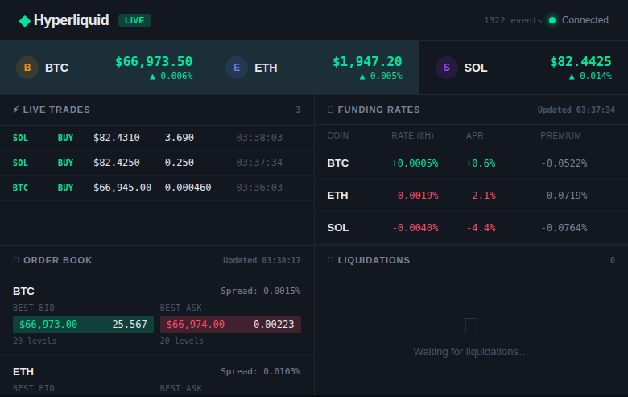

# Hyperliquid Dashboard

A real-time DeFi dashboard powered by Drasi continuous queries and the Hyperliquid market data source, delivered to the browser via Server-Sent Events (SSE).



## Architecture

```
Hyperliquid API ──▸ Drasi Source ──▸ Continuous Queries ──▸ SSE Reaction ──▸ Browser Dashboard
  (WebSocket)         (hl)          (5 live queries)      (port 8080)       (port 3000)
```

**Components:**
- **Source:** Hyperliquid mainnet (BTC, ETH, SOL) with all channels enabled
- **Queries:** Price ticker, trade feed, funding rates, order book, liquidations
- **Reaction:** SSE reaction streaming query results to the browser
- **Frontend:** Single-page HTML dashboard with live-updating panels

## Running

```bash
RUST_LOG=info cargo run
```

Then open **http://localhost:3000** in your browser.

## Dashboard Panels

| Panel | Query | Data |
|---|---|---|
| **Price Ticker** | `prices` | Live mid-prices for BTC, ETH, SOL with change indicators |
| **Live Trades** | `trades` | Scrolling feed of all trades, color-coded by buy/sell |
| **Funding Rates** | `funding` | Current 8-hour funding rates and annualized APR |
| **Order Book** | `books` | Top 5 bid/ask levels with depth bars and spread |
| **Liquidations** | `liquidations` | Real-time liquidation events with notional value |

## Ports

| Port | Service |
|---|---|
| 3000 | Dashboard UI (HTML) |
| 8080 | SSE event stream (`/events`) |

## How It Works

1. The **Hyperliquid source** connects to the Hyperliquid WebSocket API and streams market data as graph nodes (Coin, Trade, MidPrice, OrderBook, FundingRate, Liquidation) with relationships
2. **Five Drasi continuous queries** monitor the graph and emit result diffs whenever data changes
3. The **SSE reaction** receives query results and broadcasts them as Server-Sent Events
4. The **browser dashboard** connects to the SSE endpoint and renders live updates with no page reloads
