# ComputationGraph: technical design and implementation

**Status:** as-built design of the experimental, default-off `computation` feature,
including the current working-tree changes. Last reviewed: 2026-09-20.

**Scope:** `drasi_lib::computation::v1`, its DrasiLib hosting layer, and the ordinary
API adapters selected by `ExecutionMode::ComputationGraph`. This is not a redesign
of the legacy ComponentGraph execution mode. See the [library README](../README.md)
for usage examples.

## Contents

- [Architectural intent and compatibility boundary](#1-architectural-intent-and-compatibility-boundary)
- [Overall architecture](#2-overall-architecture)
- [State ownership and publication](#3-state-ownership-and-publication)
- [Graph schema](#4-graph-schema)
- [Component and resource types](#5-component-and-resource-types)
- [Admission, construction and readiness](#6-admission-construction-and-readiness)
- [Lifecycle state machines](#7-lifecycle-state-machines)
- [Data plane and control plane](#8-data-plane-and-control-plane)
- [Reconciliation, replacement and cleanup](#9-reconciliation-replacement-and-cleanup)
- [Ordinary startup and the bootstrap fence](#10-ordinary-startup-and-the-bootstrap-fence)
- [Scope-aware inspection and completeness](#11-scope-aware-inspection-and-completeness)
- [Compatibility inventory and isolation work](#12-compatibility-inventory-and-isolation-work)
- [Implementation map and behavioral coverage](#13-implementation-map-and-behavioral-coverage)

## 1. Architectural intent and compatibility boundary

ComputationGraph owns declarations, component instances, resource bindings, pipe
bindings, and lifecycle decisions for its scope. Inspection models describe that
authority; they must not become alternative admission or lifecycle authorities.

**The intended boundary is that ComponentGraph compatibility belongs outside the
generic ComputationGraph kernel.** Existing Source/Reaction plugin contracts can
be hosted through adapters without making the kernel execute legacy managers.
An adapter living under the `computation::v1` namespace is not, by itself, evidence
that the controller delegates execution to ComponentGraph.

**The generic graph no longer decodes the ordinary adapter's private kind
configuration, translates legacy provider contracts, or assembles legacy factory
catalogs.** Semantic labels are explicit descriptor metadata; resource observation
uses generic identity/binding operations; integration modules supply legacy
translation and catalogs. Section 12 records the retained compatibility surfaces.

Isolation is currently a module boundary with regression guards, not independent
kernel-crate compilation. Both execution modes, the current ComponentGraph default
and the existing plugin ABI remain supported. The ordinary facade deliberately
retains its legacy-shaped inspection/event adapter.

The following classifications are used throughout:

| Classification | Meaning |
|---|---|
| **Native** | Part of the generic execution, ownership, identity, or observation model; not temporary merely because an adapter uses it. |
| **Compatibility bridge** | Maintains an existing ordinary API, plugin interface, event stream, or ComponentGraph representation. Removable if that compatibility requirement is retired or replaced. |
| **Compatibility coupling** | Compatibility-specific knowledge currently inside native schema/kernel/inspection code. It is an isolation gap relative to the intended boundary. |
| **Integration adapter** | A reusable bridge to an existing plugin/provider contract. It can remain supported long-term, but belongs outside the generic controller. |

"Temporary" below means compatibility-dependent, not a scheduled removal date.
No compatibility removal or plugin ABI change is performed by this design document.

## 2. Overall architecture

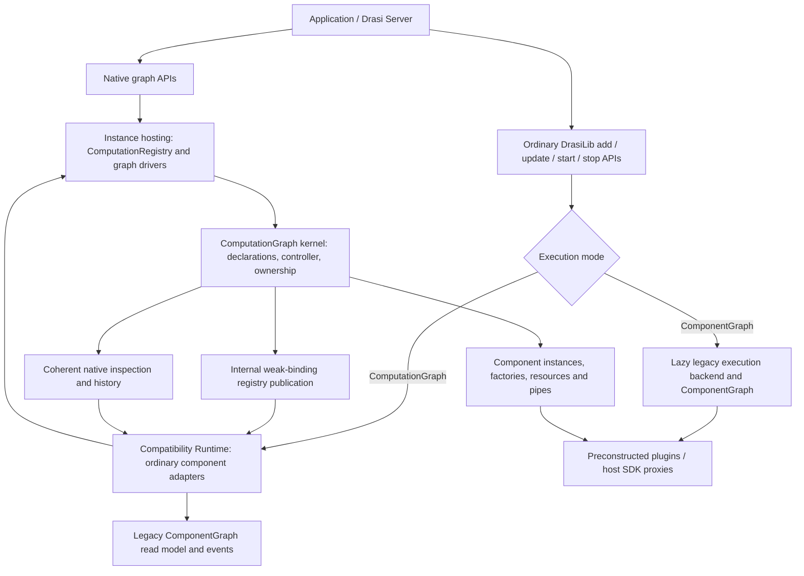

There is intentionally no arrow from the legacy projection back into native
admission or dependency decisions.

### 2.1 Execution and ownership

`ComputationGraph` owns stable runtime slots and the actual resource/pipe bindings.
Its caller-polled `GraphRun` owns scoped execution futures. `GraphControl` submits
commands to the controller; it does not mutate component objects directly.

The controller overlaps asynchronous operations using scoped futures. Mutable
operations on one component remain serialized through an `InstanceSlot` lease.
Processing must be parked or cancelled before stop/reconfiguration takes the
mutable instance. Initial bulk deployment currently visits factories in
topological order and awaits construction; incremental additions schedule
creation separately from admission. Reconciliation has its own coordination
phase. "Parallel" therefore does not mean every mutation or construction runs
simultaneously, or that each node receives a dedicated CPU thread.

Peer-control handlers use a separate future set from mutable data operations.
There are no detached per-node graph data/control workers. DrasiLib's hosting
layer does spawn and own graph-driver tasks, and plugins may have their own
workers. The graph can await the plugin's stop contract, not repair an arbitrary
plugin that leaves unmanaged workers running.

### 2.2 Ordinary API hosting

In ComputationGraph mode, ordinary sources, queries and reactions are represented
by native **Service** wrappers in `__drasi_lib_runtime__`. Their semantic kinds
remain Source, Query and Reaction. The wrappers have no native data ports.

An ordinary query owns a nested native graph containing the actual query
transformer, source-subscription adapters, results outlet, resource bindings and
native pipes. Legacy QueryManager does not evaluate that query.

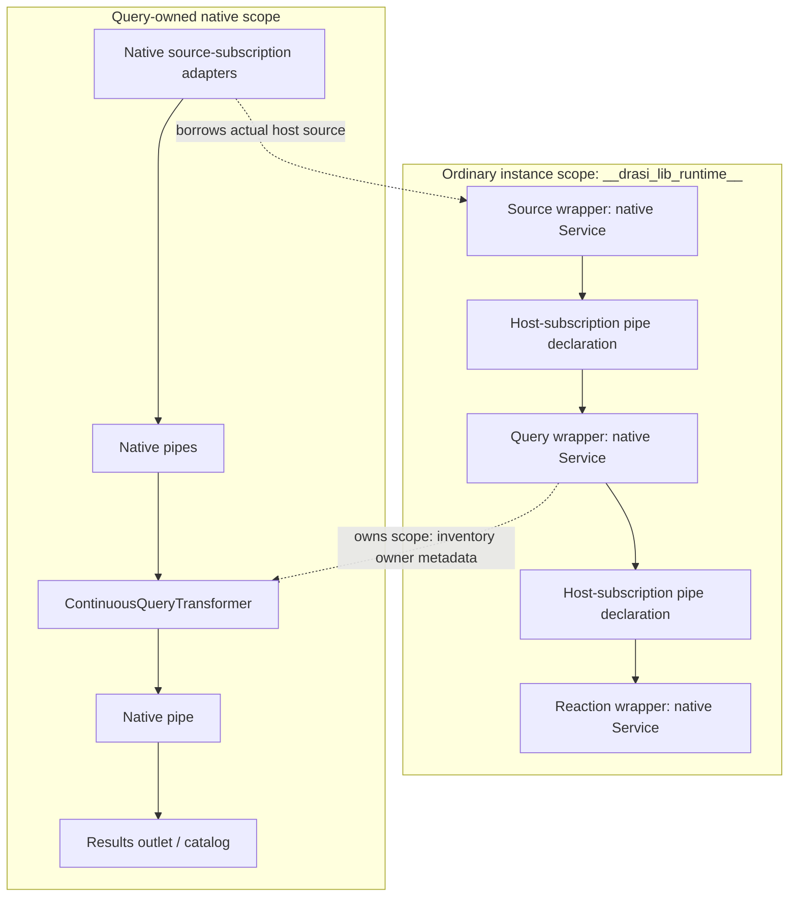

The parent subscription is a description of host-managed delivery, not an extra
queue inserted before the nested native pipe. The ownership arrow above is scope
metadata, not an additional native data edge.

**Compatibility bridge:** `__inspection_projection__` maintains the old
ComponentGraph-shaped read model. `__component_graph__` remains the ordinary
source for that legacy graph representation. `ComputationTopologySource` is the
separate native graph-as-data source.

## 3. State ownership and publication

| Object | Contents and responsibility |
|---|---|
| `GraphSnapshot` | Current declarations and host inventory facts: component descriptors/specifications, policies, streams, resources, configured/unbound relationships, subscriptions, control adjacency and reported provenance. |
| `InstanceSlot` | The actual native component and its mutable execution state. Stable runtime indices survive compacted snapshots and removals. |
| `ResourceHandle` / pipe-provider table | Actual supplied objects, optional cleanup owners, and configured pipe providers. These are not serialized construction recipes. |
| `ObservedGraph` | Component creation/execution/health/failure observations, relationship binding/availability, resource realization and operation reports. |
| `ComputationInspector` | Coherent desired/observed publications and bounded history of the latest 256 publications. Reading evicted history fails explicitly. |
| `GraphRegistrySnapshot` | Internal coherent publication with weak resource bindings for in-process host lookups. Expired bindings produce an error, not a fallback to another instance with the same ID. |
| `ComputationRegistry` | DrasiLib ownership of separately hosted graph scopes and their driver tasks. It is not a second component-membership authority. |
| `LegacyBackendHost` | Lazily owns legacy source/query/reaction managers and lifecycle orchestration. The selected legacy path, or explicit advanced legacy-manager access, initializes it once. Normal native operations do not initialize it. |
| `ComputationInventory` | Derived, scope-qualified view of the ordinary root, query execution scopes and separately registered graphs. Each scope is coherent; the combined view is not a cross-graph transaction. |

Public inspection has no runtime binding table. Local observations retain original
failure causes, so those error objects must not be treated as sanitized public
messages. The graph-as-data projection omits configuration values, resolved
secrets and failure messages.

Desired export is a different surface: it contains declarative configuration,
including literal values and unresolved references. Do not assume arbitrary
configuration literals are safe to publish. Declared secret fields require
unresolved references; resolved credentials are not exported as bindings.

### 3.1 Ordinary API authority

The compatibility Runtime resolves active records from the graph's current
specifications and their graph-owned `RuntimeInstance` resource. It verifies the
node, resource and construction token. The adapter's candidate-record map is for
pending/rejected/retired cleanup ownership, not active membership.

Ordinary list/get/status, query configuration/results/metrics, log subscription
and configuration-snapshot paths use those graph-owned records. The legacy
projection cannot veto admission or decide dependency removal. Bootstrap
reconstruction recipes are typed host metadata retained with the graph-owned
ordinary record; configuration snapshots do not recover them from the projection.
The projection is an output of those records and recipes.

The legacy graph/event receiver remains an outward compatibility view for ordinary
DrasiLib instances. Native event APIs read that history directly instead of
creating unused legacy execution managers. Explicit `query_manager()` access is
still an engine-specific escape hatch and can lazily instantiate its compatibility
manager; it is not part of native orchestration.

### 3.2 Identity and stale-work fencing

| Identity | Meaning |
|---|---|
| `ComponentId` | Stable declaration name within one graph. Removing and re-adding the name does not revive its old handles. |
| `GraphRevision` | Version of declarations/inventory facts used by preview and mutation checks. Provider/provenance reports can also advance it. |
| `ComponentGeneration` | Construction incarnation. Replacement and reconstruction invalidate old generation-bound handles/observers. |
| `OperationEpoch` | Identifies an operation on that incarnation. Stale operation completions and health observations are rejected. |
| Binding/resource generations | Distinguish replacements of pipes and resource bindings. |
| `run_epoch` | Distinguishes controller runs over a graph. |
| `ComputationScope` | Registered root graph plus component-owner path to a nested scope. Scope-qualified entity IDs avoid collisions between repeated local names. |

The compatibility `record_token` is an internal association with the graph-owned
ordinary instance, not a replacement for native generation fencing.
An inventory belongs to one DrasiLib instance; aggregation across instances must
also qualify identities with `ComputationInventory::instance_id`.

## 4. Graph schema

There are two related schemas: the executable declarations used by the kernel,
and the unified entity view used by inspection.

### 4.1 Executable declarations

A component declaration contains its immutable descriptor and ports, execution
role, output-stream bindings, lifecycle policy and input-merge policy. A
factory-backed `ComponentSpecification` additionally contains implementation
identity, configuration version, configuration values/references and named
resource dependencies. An external/preconstructed component instead requires an
external instance binding on import.

A native relationship identifies both endpoints as `(component, port)`, its pipe
description and its `RelationshipPolicy`. Bound edge observations additionally
carry negotiated capabilities, resource dependencies and a binding generation.
Resources have an ID, role, ownership and unresolved binding name.

Strict builds reject native data-edge cycles, duplicate component/edge/stream identities,
unconnected ports, missing output streams, and schema/capability mismatches.
Incremental admission can retain incomplete nodes, but eventual connections must
satisfy those contracts. One producer output cannot feed multiple input ports of
the same consumer: separate queues for one stream would undermine component-wide
FIFO ordering. Explicitly ranked query branches instead identify one shared
priority-inbox resource and negotiate `RankedEventOrder`. They do not claim FIFO.
Resources and components have separate identifier namespaces.

`GraphSnapshot` also carries:

- `unbound_relationships`: retained declarations without configured live edges.
- `subscriptions`: host-managed producer/consumer pairs, which may retain an
  absent producer. The consumer must exist.
- `control_connections`: control-only adjacency; both endpoints must exist.
- `readiness_required`: producers whose activation requires downstream readiness.
- `component_resources` and `component_plugins`: host-reported inventory facts.

No placeholder component or fabricated provider is created for an unresolved
reference. Required missing bindings block or fail the relevant operation,
depending on the validation/construction path.

### 4.2 Unified entities

| Entity | Identity | Important fields and meaning |
|---|---|---|
| Component | `GraphEntityId::Component(ComponentId)` | Descriptor, semantic kind, execution role, construction metadata, provenance and native observation. |
| Resource | `Resource(ResourceId)` | Actual resource declaration and binding/cleanup observation. A declaration can exist before a handle is bound. |
| Plugin version | `Plugin(PluginIdentity)` | Exact plugin ID/version pair and distinct dependent-component set. The existing `Plugin` API name represents a version-specific node. |
| Plugin family | `PluginFamily(plugin_id)` | Unversioned identity, represented version set and union of dependent components. |
| Native pipe | `Pipe(EdgeDefinition)` | Full port endpoints, desired pipe profile, capabilities, policy, resources and relationship observation. Can remain declared-only after unbinding. |
| Host-subscription pipe | `Subscription { from, to }` | Configured host delivery path, endpoint generations/startup observations and readiness policy. No native capabilities or binding success are invented. |

Plugin IDs and versions are authoritative host/descriptor identifiers, not
inferences from Rust type names or configuration versions. A version is an opaque
identifier; graph grouping does not normalize semantic versions. Families group
exact plugin IDs. Counts describe component references, including stopped or
failed declarations, not running instances or loaded binaries.

Entity keys are namespaced and encode identifier fields separately. Existing
version-node keys remain `v1:plugin:<encoded-id>:<encoded-version>`; family keys
are `v1:plugin-family:<encoded-id>`. Component/resource/pipe/subscription keys use
separate namespaces. Scope qualification is still required across graphs.

### 4.3 Relationships

| Typed relationship | Direction | Meaning |
|---|---|---|
| `UsesResource` | Component/pipe/resource -> resource | Declared dependency, configuration reference, captured service or reported binding. Includes known cross-scope resource references in inventory. |
| `UsesComponent` | Host adapter resource -> owning component | Exact host-known cross-scope reference, such as a query adapter borrowing its source. |
| `DependsOnPlugin` | Component -> plugin version | Authoritative implementation provenance. |
| `VersionOfPlugin` | Plugin version -> plugin family | Family membership, without activation or failure coupling. |
| `PipeInput` / `PipeOutput` | Producer -> pipe -> consumer | Native data path, including endpoint port IDs. |
| `SubscriptionInput` / `SubscriptionOutput` | Producer -> host-subscription pipe -> consumer | Host-managed data path without fabricated native ports. |
| `DependsOnData` | Consumer -> pipe -> producer | Normalized dependency direction for descriptive traversal. Not another delivery path. |
| `ControlConnection` | Component -> component | Host-declared control-only adjacency, not a data dependency. |

`dependencies()` / `dependents()` follow dependency-classified links. A family's
immediate dependents are version nodes; its component-count summary is the union
across those versions. `ComputationInventory::plugin_family_dependents(id)`
traverses those links across scopes and returns distinct scope-qualified
component dependents.

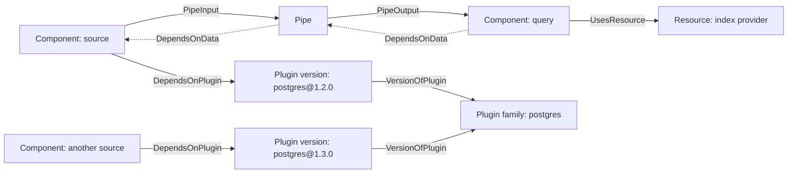

Descriptive dependency links are not a substitute for `RelationshipPolicy`.
Native creation, binding, activation, replacement and failure propagation use
their explicit policy fields. Cross-scope inventory links do not create an
implicit cross-graph lifecycle controller.

By default, creation coupling is disabled, binding is required, and activation is
Independent of upstream Running state. Actual pipe binding still requires
constructed endpoints;
failure propagation, producer fencing, orphaning and rebind-on-consumer-replace
are opt-in. Dynamic replacement is allowed by default. Pipeline adapters choose
stronger policies where their contracts require them. Component autostart defaults
to enabled, but host deferral can prevent immediate activation without changing
that declared policy.

### 4.4 Graph-as-data representation

`ComputationTopologySource` emits `ComputationGraph`, `ComputationComponent`,
`ComputationResource`, `ComputationPlugin`, `ComputationPluginFamily` and
`ComputationPipe` nodes. A graph root emits `HAS_COMPONENT`, `HAS_RESOURCE` and
`HAS_PIPE` ownership/declaration relationships.

The corresponding relationship labels include `USES_RESOURCE`, `USES_COMPONENT`,
`USES_PLUGIN`, `VERSION_OF`, `INPUT_TO_PIPE`, `OUTPUT_FROM_PIPE`,
`DEPENDS_ON_DATA` and `CONTROL_CONNECTION`.

**Compatibility bridge:** native `FLOWS_TO` edges and unbound
`ComputationRelationship` nodes are retained inspection summaries of the same
pipes, not extra transports. The latter use `HAS_RELATIONSHIP`,
`FROM_COMPONENT` and `TO_COMPONENT`. Consumers must not count a pipe and its
summary as two delivery paths.

This source converges to the latest publication. Use bounded inspection history
when individual controller publications are required; neither surface promises
an unlimited audit log.

## 5. Component and resource types

### 5.1 Execution roles

| Native role | Port contract | Processing method |
|---|---|---|
| Source | Outputs only; at least one | `EnvelopeSource::next()` |
| Transformer | At least one input and output | `Transformer::transform()` and optional scheduled wakeups |
| Query | Same port shape as Transformer | Native query transformer with evaluation, recovery and publication |
| Sink | Inputs only; at least one; explicit completion contract | `EnvelopeSink::handle()` |
| Service | No data ports | `ComputationService::run()` |

All use `ComputationComponent` start/stop hooks. Native contracts do not promise
that an arbitrary preconstructed instance can restart itself. Factories and
explicit reconstruction provide that capability where needed.

The semantic kinds are Source, Transformer, Query, Sink, Reaction and Service.
`ComponentDescriptor::with_semantic_kind` supplies an optional descriptive kind;
without it, inspection derives kind from the execution role. The ordinary adapter
explicitly annotates its Source/Query/Reaction Service wrappers. No implementation
name or configuration literal changes native semantic classification. The
annotation does not change port validation or execution behavior.

Sources, reactions and transformers supplied through the ordinary/native
convenience APIs are preconstructed. Their constructor failures can occur before
DrasiLib sees them. Ordinary `add_query(QueryConfig)` is different: query
construction occurs inside the library after declaration.

The ordinary Runtime factory calls the existing Source/Reaction
`initialize(context)` contracts during native creation. Their void initialization
methods report failures through status observations, which the adapter bridges
into creation errors. Query initialization constructs/deploys its nested graph.
There is no corresponding mandatory `initialize()` method on
`ComputationComponent`: a native instance is supplied already constructed or is
created by its factory.

### 5.2 Resource roles and operational ownership

`ResourceRole` currently includes Bootstrap, Middleware, Inspection, Identity,
IndexBackend, SecretStore, StateStore, Wal, Pipe, Checkpoint, Outbox, LiveResults,
FutureQueue, LegacySource, SourceSubscription, QueryCatalog, LegacyReaction and
Component.

The latter adapter-oriented roles do not introduce additional controller
execution roles. For example, the ordinary `RuntimeInstance` resource holds the
preconstructed plugin/configuration and cleanup owner used by its Service node.

| Resource family | What drives work, rather than a universal start/stop cycle |
|---|---|
| Bootstrap | Source/query bootstrap requests. Completing a request does not remove the provider. |
| Identity | Consumer credential requests; refresh/reconnection is provider or consumer policy. |
| Secret store | Configuration resolution or explicit secret requests, sometimes before component admission. |
| State store | Consumer read/write/sync/cleanup calls. |
| WAL | Source registration, append/replay, progress-driven pruning and explicit deletion. |
| Index provider and per-query stores | Query construction/activation, recovery, replacement and disposal. Shared providers can outlive individual query index sets. |
| Middleware | Factories instantiate middleware for query configuration; input changes invoke processing. The reported registry resource is not a separate running node for every middleware object. |
| Inspection/catalog/subscription adapters | Their owning graph/component's construction, subscription and disposal operations. |

Supplied builder providers are represented even when unused.
`ResourceHandle::with_shared_identity` supplies a typed, owner-retaining identity
for wrappers around the same actual instance; generic observation can deduplicate
concurrent reports without understanding a legacy provider type. Weak registry
publications do not keep these identity owners alive. Ordinary provider translation
and normalization of pre-existing legacy wrapper bindings happen in the integration
adapter. Configured index aliases use the
lexically first name as their canonical binding. Queries declare their selected
index provider, and replacement changes that dependency with the query.

Captured service availability and selected-provider reports share the
`UsesResource` relationship class today. That link is **not per-call usage
telemetry**: a captured default service or available secret store does not prove
it was actually used for an operation.

## 6. Admission, construction and readiness

Incremental `add_*` in ComputationGraph mode acknowledges **node admission**.
Identifier/namespace conflicts, ownership/binding collisions or a closed
controller can reject admission. Validation, initialization and activation after
admission are reported on the node. They do not retroactively make the node
unaccepted.

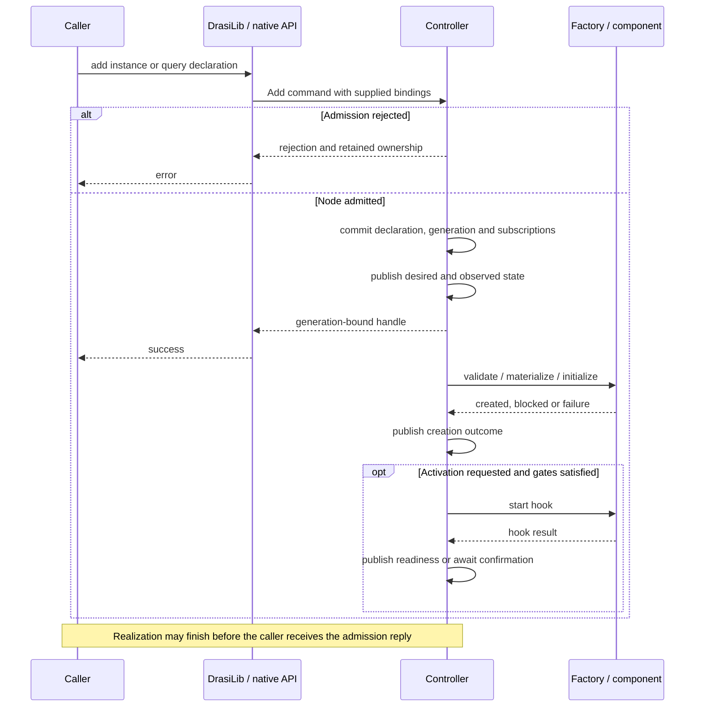

Cancelling the caller does not undo an already committed addition. Rejected
native additions retain supplied objects through `GraphError::AdditionRejected`
and its recovery/cleanup owner. Rejected borrowed or already-managed resources
are not shut down as newly owned resources.

This is distinct from strict `ComputationGraphBuilder::build()`, which validates
a complete graph before deployment, and from instance-builder setup, which can
fail for global configuration/admission/setup reasons. Incremental empty graphs
support incomplete declarations that can be wired later.

| API | Completion means |
|---|---|
| `add_*` / native `add_component` | Node admission, not initialization/readiness. |
| `ComponentHandle::wait_created()` | This generation reached `Created`, or a failure/stale/closed condition is reported. |
| `ComponentHandle::wait_started()` | Readiness was reached for the latest requested activation of this generation. |
| `ComponentHandle::start()` | Request activation and await readiness, including supported readiness-gated waiting. |
| Start reports and ordinary `start_source/query/reaction` | Hook/start-request outcome; may return before readiness confirmation finishes. |

`started` is latched for the most recently requested activation, including a
short-lived component that has already exhausted or stopped. A new start resets
it. Waiting for start is not a promise of continuing health. Use a caller deadline
where an indefinitely blocked readiness wait is unacceptable.

## 7. Lifecycle state machines

These diagrams label transitions with their drivers. Only names explicitly
identified as Rust enum values are stored states. Diagram start/end markers
denote membership or scope boundaries, not additional enum variants.
They show the principal paths; administrative replacement/removal is also subject
to dependency policy, cancellation and successful cleanup.

### 7.1 Controller scope: `GraphState`

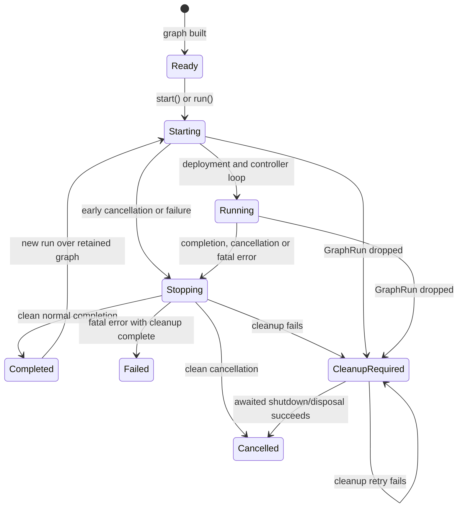

`Running` describes the controller scope, not "every component is running."
`run()` keeps an incremental controller available without automatically starting
all components. DrasiLib's root controller can already be driving its projection
while ordinary components remain unstarted.

Only `Ready` and `Completed` admit a new direct graph run. A live controller can
repair failed nodes through reconciliation; that is different from restarting a
terminated graph scope. DrasiLib's `is_running` bookkeeping also permits stopping
a partially successful instance startup; it is not an all-components-ready test.

Dropping `GraphRun` cancels scoped futures, marks cleanup required and marks
active nodes/relationships as stopping/draining. It cannot await asynchronous
hooks. Explicit awaited shutdown/disposal is required.
`ComputationGraph::shutdown` awaits component cleanup; `dispose` additionally
releases graph-owned resource bindings. DrasiLib's graph-handle shutdown performs
the complete driver and disposal sequence.

### 7.2 Component creation: `RealizationState`

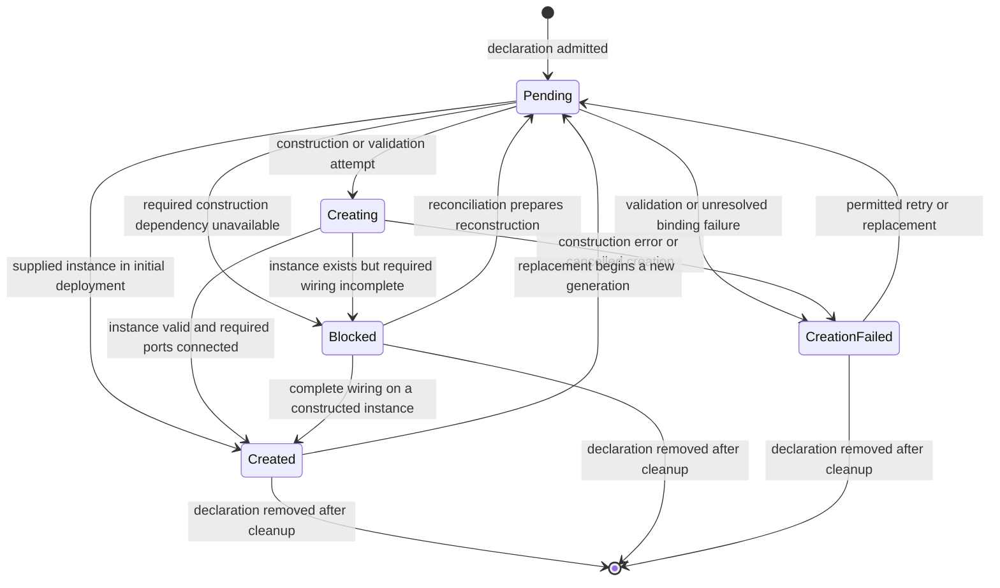

A retryable failure permits an explicit retry; it does not imply an automatic
retry loop. Terminal failures require a specification change or removal.
Creation retries that reconstruct a component and replacements establish a new
construction generation. An absent ordinary query source can produce
`CreationFailed`, while an unconnected native component can be `Blocked`; the
distinction is determined by the actual validation/construction path.

### 7.3 Execution: `ComponentLifecycle`

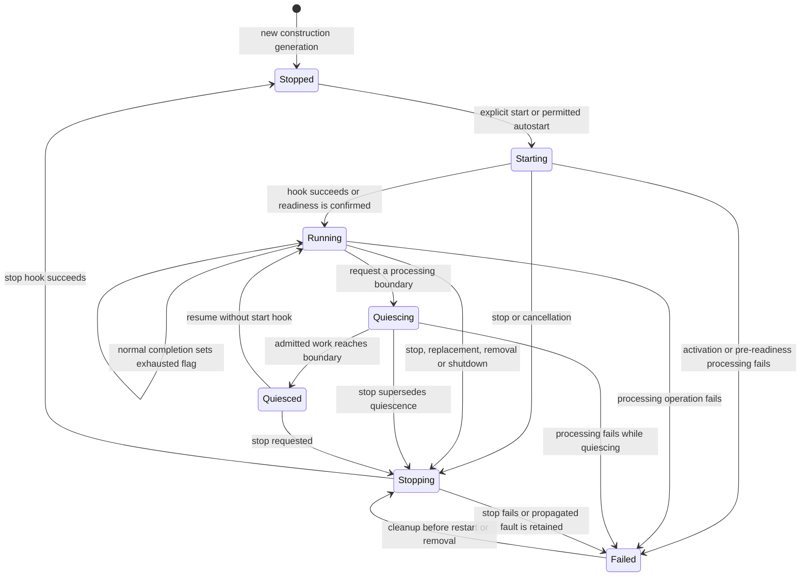

The diagram shows execution, not admission: a `Stopped` node can still be
`Pending`, `Created` or `CreationFailed` on the creation axis. Binding/start gates
can leave an otherwise created node stopped without launching its start hook.

Native components default to readiness at successful start-hook completion.
Components requiring late confirmation remain `Starting` until `control.ready()`.
Ordinary source/reaction wrappers wait for actual plugin Running observations;
ordinary queries inspect the inner native query's readiness.

Normal completion sets `exhausted` and closes outgoing pipe output. It does not
itself call the stop hook or necessarily immediately change the stored lifecycle
from `Running`. Quiescence preserves the instance and admitted work; stop invokes
the lifecycle hook. Restart is subject to the component's actual restart/recovery
capabilities.

Health is a separate axis: `Unknown`, `Healthy`, `Degraded`, `Unavailable`.
Failures carry phase (`Validation`, `Creation`, `Binding`, `Activation`,
`Processing`, `Stop`, `Removal`, `Control`), disposition, cause and timestamp.
For example, a failed control callback records a Control failure and Degraded
health without automatically terminating data processing. A successful stop
does not necessarily erase the previous failure cause.

### 7.4 Ordinary API status: `ComponentStatus` is a compatibility mapping

**Compatibility bridge:** this enum is not `ComponentLifecycle`. It contains
`Added`, `Starting`, `Running`, `Stopping`, `Stopped`, `Removed`,
`Reconfiguring`, `Error`.

The native ordinary-status adapter applies these rules in order:

| Condition in graph observation / graph-owned record | Ordinary status |
|---|---|
| Recorded failure, or native lifecycle `Failed` | `Error` |
| Native lifecycle `Starting` / `Stopping` | `Starting` / `Stopping` |
| No lifecycle request yet, or realization is not `Created` | Record's initial status: `Added` for new admission, normally `Stopped` for replacement |
| Exhausted, or native lifecycle `Stopped` after lifecycle activity | `Stopped` |
| Other created execution states | `Running` |

Consequently, native `Created + Stopped + lifecycle_requested=false` can appear
as ordinary `Added`. `Added` does not mean construction has succeeded, and is not
a missing native lifecycle enum value. Quiescing/Quiesced are also collapsed by
this compatibility view. Inspect native observations for the full state.

`Reconfiguring` and `Removed` remain relevant to the legacy/event representation;
they are not additional native execution states. After removal, a native lookup
fails membership/generation validation rather than finding a native "Removed"
component. This mapping reads native authority; it does not make ComponentGraph
the lifecycle authority.
The outward adapter can publish `Reconfiguring` for an update of a newly Added
component without requiring a legacy command transition or inventing a native
start operation. Legacy execution still uses its normal transition validation.

### 7.5 Resource binding and cleanup: `ResourceRealization`

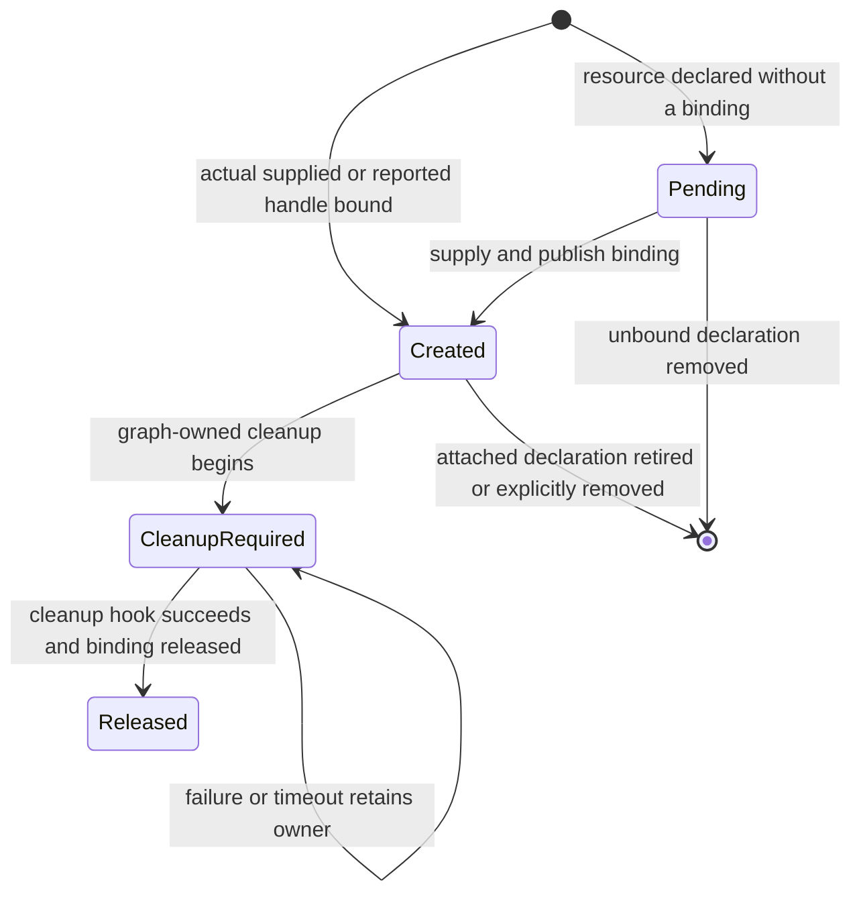

`Created` means a handle is bound, not that a database connection, credential or
individual operation is healthy. Most provider traits have no independent
initialize/start/stop contract. Operational failures generally surface through
the consuming component; resource cleanup failures are recorded on the resource.

Graph-owned resources run their supplied cleanup hook, if any, before releasing
the binding. Borrowed resources are skipped by graph disposal and may continue
to appear Created in a retained snapshot. Releasing a graph reference is not
equivalent to shutting down a shared object. A successfully Released resource
declaration can remain inspectable until its declaration or scope is removed.

### 7.6 Native pipe binding: `BindingState`

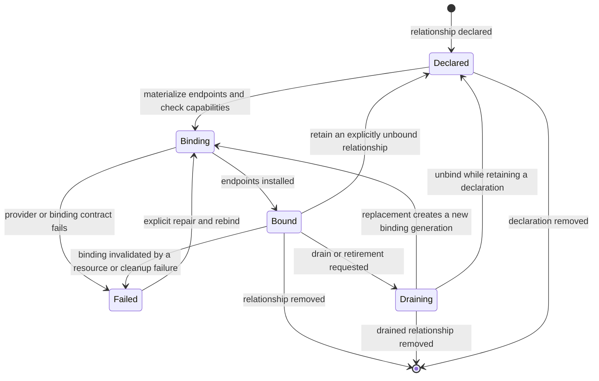

Data availability is independent: `Unknown`, `Idle`, `Available`, `Unavailable`,
`Exhausted`. A component stop can leave a bound pipe idle. Normal producer
exhaustion closes its output and marks availability Exhausted. Close/cancel are
transport actions, not additional BindingState variants. Always interpret pipe
observations with their graph run/binding generation.

A drain requires provider-backed proof (`PipeControl::is_idle`) and appropriate
handling guarantees; queue metrics or acceptance-only external effects do not
prove completion. Host-subscription nodes do **not** implement this native pipe
state machine: their actual subscriptions follow their owning ordinary
query/reaction and expose endpoint observations instead.

### 7.7 Plugin versions and families: derived reference lifecycles

The following states are conceptual presence states, **not Rust lifecycle enum
values**. `PluginEntity` and `PluginFamilyEntity` have no Running/Error state or
start/stop hooks.

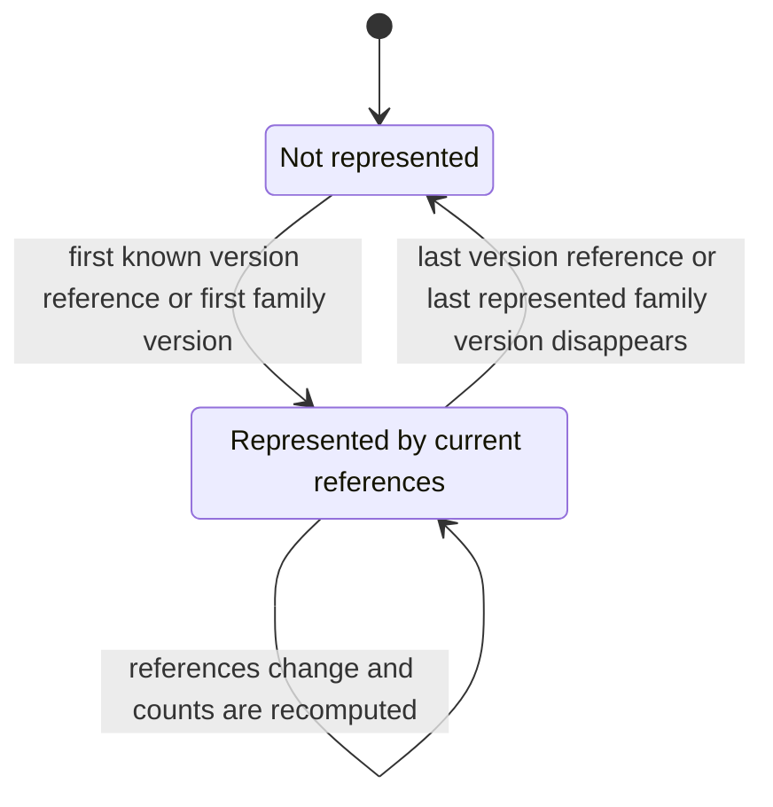

The version node is derived from current component provenance; the family is
derived from those version nodes. Stopping/failing a component does not remove
its declaration or provenance. Retained inspection can therefore still describe
these references after execution ends. They are not a plugin-loader inventory
and their disappearance does not unload a binary.

## 8. Data plane and control plane

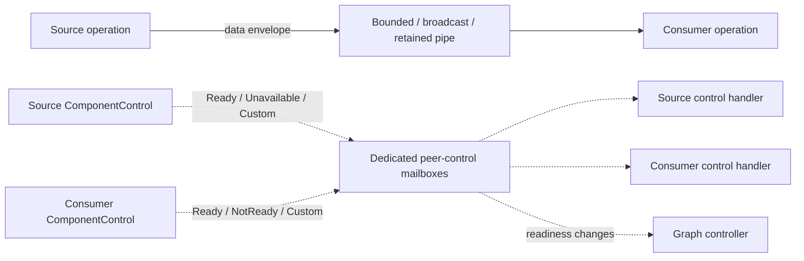

The data plane transports immutable change envelopes through capability-checked
ports and graph-owned endpoints. A source supplies a producer stream; emissions
must preserve its increasing sequence. Fanout and fanin preserve the documented
per-stream ordering for FIFO transports, not an automatic global order or subscriber isolation.
Acknowledged handling and durable/atomic publication require the corresponding
pipe/sink/index capabilities; they are not inferred from a successful enqueue.

#### Ranked continuous-query inputs

The ordinary query adapters and `ComputationPipelineBuilder` assign source ranks
from `QueryConfig.sources` declaration order. Legacy queries enqueue wrappers in
one `QueryEventQueue`; native source adapters send into branches of one
`RankedInputQueue`. Both compare the source-reported wrapper timestamp, then
query-local rank, then authoritative raw source sequence. The native envelope's
producer sequence remains separate. No rank is written onto a shared source, and
neither element `effective_from` nor receipt time substitutes for wrapper time.
Custom SourceEvent streams without a sequence fail visibly instead of acquiring
a fabricated downstream ordering identity.
Source declaration order now participates in the query configuration hash, so a
rank change cannot silently reuse checkpoints from the previous ordering.

The native inbox is one finite heap, not independently prefetched stream heads.
Only the branch owning the global minimum may dequeue it. This preserves
per-edge lifecycle/receipt ownership while allowing one query's rank to differ
from another query over the same sources. Cancellation removes only the retiring
branch generation's queued entries and wakes blocked senders. Channel branches
block at the common capacity; broadcast branches use explicit drop-newest
admission. Input can buffer during bootstrap without running query evaluation,
but only after all source resume/reset preparation has completed for the current
generation. The separate progress `admitting` flag is revoked on reset, stop and
failure; partially prepared generations cannot populate the inbox.

The guarantee stops at dequeue: it covers admitted events, not unseen events or
an event already in flight. No quiet-source wait or watermark is introduced.
The pinned main implementation at `216329f7` supplied the shared timestamp heap
and due-time `FuturesDue` handling; its comparator did not contain source-rank or
source-sequence ties. This change makes those requested ties explicit in both
engines rather than inferring them from incidental task or source-ID ordering.

`QueryScheduledSourceFactory` supplies due-time signals to the same native heap,
after real sources at equal timestamps. Its queue view is weak and revoked on
query stop, so it cannot keep index handles open. Selecting a scheduled signal
retains main's scheduled-batch boundary. `Transformer` continuations let that
batch emit bounded results before the next input without collecting an unbounded
output vector or prematurely acknowledging the triggering delivery.

Control notifications are separate from those queues and can progress while data
is awaiting backpressure. Current defaults are 64 queued messages per component,
a 16 KiB payload budget and maximum JSON depth 64. Sending does not wait for queue
capacity; fanout reserves all recipients' capacity before delivery or fails.

Component senders are generation/attachment-bound and can address only connected
upstream/downstream neighbors. Native edges, host subscriptions and explicit
control-only links provide adjacency. Connection tokens revoke obsolete queued
messages and callbacks on rewiring. Handlers are polled independently of mutable
processing; blocking an executor thread can still delay everything.

Readiness is tracked by the control plane and reset before a new activation.
`readiness_required` can gate producer startup on downstream readiness. Merely
being connected does not imply "producer must already be Running"; that is a
separate activation policy. Combining opposing readiness/activation requirements
can create an application startup deadlock even when the data graph is acyclic.

The controller emits availability/readiness notifications. Reconnection or
recovery in response to arbitrary messages is component policy, not a universal
automatic restart rule.

### 8.1 Persistent query output and reaction recovery

An atomic query commit includes index changes, source progress, the result
sequence, retained output and its eviction, and live result rows. Ordinary
`IndexBackendPlugin` providers opt into this contract through
`supports_atomic_query_output()`. The integration adapter gives their writers
the same transaction domain as the index session, and the ordinary query
pipeline selects atomic publication. Providers that do not opt in keep explicit
non-atomic publication and its pending-output failure marker; merely supplying
persistent writers is not proof of a shared transaction.

`stage_result_sequence` and `append_and_trim` run before the outer commit.
Scoped wrappers preserve these provider operations rather than falling back to
standalone sequence writes or count-based retention. Only committed results
become visible in the live query view. Recovery verifies the retained tail,
snapshot and committed sequence before accepting further input.

Reaction queue acceptance is not successful delivery. The adapter tracks accepted
positions in memory, while the reaction saves handled progress after its side
effect completes. Completed snapshot bootstrap can establish a saved starting
position. A new trigger reaction instead captures the query head while attaching
its receiver and skips only history preceding that subscription; results arriving
during startup remain eligible. A durable reaction requires both a persistent
state store and persistent output from every subscribed query.

Persistent output generations distinguish separate lifetimes of the same query
ID and configuration. Reset and deletion retain that identity metadata even when
rows, source checkpoints and retained output are cleared. Recreating the query
therefore cannot make an old reaction checkpoint describe unrelated new output.
This generation is separate from component-handle generations. Native resets can
retain the output sequence high-water mark while advancing the output generation;
stop/restart without a reset preserves both.

The ordinary profile also writes a reset-in-progress configuration marker before
destructive cleanup, including for checkpoint-only providers without an outbox.
The matching configuration hash is published only after clearing and checkpoint
writes succeed. A failed wipe therefore cannot make a later start resume a
partially cleared index. Optional legacy index-clear operations retain their
`NotSupported` handling; actual cleanup errors remain visible and retain ownership.

## 9. Reconciliation, replacement and cleanup

`preview(revision, mutations)` computes impact against an expected revision.
Execution rechecks that revision and relevant construction/operation epochs,
validates actual supplied bindings and performs necessary pause/stop/drain and
cleanup before committing the new desired revision.

The mutation vocabulary includes component put/replace/in-place update/removal,
bind/unbind, host subscription changes, resource put/rebind/removal, restart and
retry. In-place reconfiguration requires explicit factory capability and cannot
silently change interfaces or implementation. Otherwise a replacement creates a
new generation. Unchanged bindings retain their identities; affected bindings
are invalidated and reconstructed.

**This is not atomic deployment of an entirely initialized batch.** A cleanup
failure can leave the old desired topology retained but some components stopped
or bindings unavailable. Once new desired state commits, construction/activation
failure leaves that new declaration visible. Cancellation is not rollback of
state changes or external effects.

| Removal policy | Meaning |
|---|---|
| Reject | Refuse dependency-breaking removal. |
| Cascade | Include dependent components. |
| Orphan | Retain an explicitly permitted unresolved relationship; host subscriptions can retain an absent producer. |
| Drain | Wait for supported handled boundaries before retirement, rejecting unsupported guarantees. |

Ordinary subscriptions are committed with additions/replacements, not recovered
from the legacy projection. They participate in selection and removal, including
direct controller operations. Removing a consumer removes its input subscription
declarations. Export preserves unresolved producer references.

Stop is not deletion. Source/reaction persistent-data deprovisioning follows the
ordinary cleanup option; ordinary query removal also requests its data cleanup.
Provider limitations can make that cleanup fail and retain ownership. Full
DrasiLib shutdown awaits its drivers and graph-owned cleanup; dropping the
instance is not a substitute.

## 10. Ordinary startup and the bootstrap fence

**Compatibility bridge:** ordinary startup currently requests source starts,
then query starts, then directly added native components and additional
auto-start graphs. It releases the sources' `on_subscriptions_complete` fence
before starting ordinary reactions.

An ordinary query start hook can return when subscriptions are placed while its
bootstrap/readiness work continues in its nested scope. Waiting for all queries
to become Running before releasing that source fence could deadlock.
Consequently the adapter uses the internal hook-only `start_requested` path;
the public component handle separately supports waiting for actual readiness.

The request-versus-readiness distinction and deferred activation are native
mechanisms, not temporary legacy states. The particular source-fence protocol and
ordinary wrapper sequencing are compatibility concerns.

Ordinary reaction forwarding maintains one pending receive per query without
adding a prefetch queue. While idle it drives plugin status observations; once
an input is selected, that idle reader is dropped before enqueue/recovery drives
and drains the same observation channel. Two simultaneous owners of that receiver
would otherwise block forwarding after the first delivery. Per-query receive
futures are retained and re-armed after handling.

## 11. Scope-aware inspection and completeness

`inspect_computation_inventory()` includes the ordinary root, native additions,
query-owned execution graphs and separately registered/builder-supplied graphs.
An unrealized ordinary query has a parent declaration and failure information,
but no invented inner graph. Each nested scope records its owning component and
construction generation.

Known cross-scope references connect query adapters to the actual current source
instance, cloned instance services and selected index backend. A stale source
object is not associated with a replacement solely because its name matches.
These references are descriptive; they do not flatten lifecycle ownership.

The guarantee covers **host-visible supplied or reported instances**, not
reflection into arbitrary Rust objects or undisclosed internals of existing
dynamic plugins. Standard bases and host proxies report provider bindings visible
through existing context/setter paths without changing the C ABI. Custom
implementations must report additional bindings they want exposed.

Provider/provenance reports are asynchronous. Instance-level supplied providers
are known during setup; an attached provider may become known during initialization
or a later setter call. An addition acknowledgement is not an atomic barrier for
every internal dependency to have been discovered and published.

Native `GraphControl::observe_resources` and `observe_plugin` provide the
generation-fenced observation boundary. Resource reports describe borrowed
instances rather than silently transferring cleanup ownership. The legacy
`GraphResourceObserver` remains available through its original public re-export,
but its provider-specific implementation lives outside `graph/`.

There is not yet a universal provider-to-provider dependency manifest or automatic
plugin provenance for every provider/pipe. The graph shows declared dependencies
and the host-known references it can substantiate. Configuration-only bootstrap
or storage declarations do not create fictional provider instances. The middleware
registry resource similarly does not imply a separate managed lifecycle for every
private middleware instance created inside a query.

## 12. Compatibility inventory and isolation work

This section is the explicit record of what is compatibility-dependent and what
currently crosses the intended boundary. Module placement, runtime authority and
API compatibility are separate questions.

| Area and code | Current purpose | Classification / intended boundary |
|---|---|---|
| [`compatibility/`](../src/computation/compatibility/mod.rs) | Ordinary API declarations, graph-owned records, Source/Query/Reaction Service wrappers, metadata and lifecycle adaptation. | **Compatibility bridge, outside kernel.** Retire or replace when those ordinary interfaces no longer need translation. |
| [`compatibility/inspection.rs`](../src/computation/compatibility/inspection.rs) | Ordinary status/configuration shapes derived from native records. | **Temporary compatibility view.** `Added`, collapsed quiescence and legacy event vocabulary must not be promoted to native states. |
| Projection service and `__component_graph__` source | Preserve legacy topology/events and manager-facing runtime references. | **Temporary compatibility bridge.** Native admission, lookup and dependency decisions must remain independent of it. |
| [`compatibility/projection.rs`](../src/computation/compatibility/projection.rs) and typed bootstrap recipes in graph-owned ordinary records | Preserve legacy configuration reconstruction and old bootstrap/identity graph shape. Configuration snapshots derive recipes/edges from host records, not the live projection. | **Compatibility bridge, outside kernel.** Metadata still does not prove an actual provider binding. A projection conflict is logged without rejecting native membership or corrupting the stored recipe. |
| Ordinary wrappers as Service nodes; nested query execution graphs | Host pre-existing plugin contracts and subscription APIs without making legacy managers execute queries. | **Compatibility representation.** Native query evaluation, scoped ownership and generic Service support are not temporary. |
| [`ports.rs`](../src/computation/v1/ports.rs), [`entities.rs`](../src/computation/v1/entities.rs) | Explicit optional descriptor semantic kind, with execution-role fallback. | **Native metadata contract.** Ordinary-kind annotation belongs to the outer adapter; the former private-schema inference has been removed. |
| [`graph/resources.rs`](../src/computation/v1/graph/resources.rs), [`legacy_resources.rs`](../src/computation/v1/legacy_resources.rs) | The graph owns generic observations, generation checks and binding identity. The outer adapter translates `ComponentResource` and legacy provider wrappers. | **Isolation implemented.** The public observer import remains compatible while the kernel has no provider-specific translation. |
| [`graph/topology.rs`](../src/computation/v1/graph/topology.rs), [`factories.rs`](../src/computation/v1/factories.rs) | Generic factory registry in the graph; standard native/domain/legacy catalog assembly in the integration module. | **Isolation implemented.** `FactoryRegistry::standard` remains callable through its existing public API. |
| [`legacy_backend.rs`](../src/legacy_backend.rs) | Owns source/query/reaction managers and the legacy lifecycle orchestrator behind a shared lazy host. | **Legacy execution backend.** Instantiated for legacy operation or explicit advanced manager access, never as a prerequisite for normal native APIs. |
| [`channels/component_status.rs`](../src/channels/component_status.rs), [`queries/traits.rs`](../src/queries/traits.rs) | Shared plugin status signaling and application-facing query contract. | **Shared outer contracts.** No longer defined by legacy graph/manager implementations; existing import paths are preserved with re-exports. No C ABI layout changes. |
| `ResourceRole::LegacySource`, `LegacyReaction`, `SourceSubscription` and adapter bindings | Describe real objects supporting the old plugin interfaces. | **Compatibility vocabulary in the schema.** Not extra execution roles. Any extraction must preserve serialized/imported topology compatibility deliberately. |
| [`plugin_source.rs`](../src/computation/v1/plugin_source.rs), [`plugin_reaction.rs`](../src/computation/v1/plugin_reaction.rs), `legacy_*`, [`plugin_services.rs`](../src/computation/v1/plugin_services.rs), [`pipeline.rs`](../src/computation/v1/pipeline.rs), compatibility portions of [`query_catalog.rs`](../src/computation/v1/query_catalog.rs) | Reuse Source/Reaction/index/provider interfaces, legacy events/results/status shapes, query configuration and scoped services. | **Integration adapters.** Currently under the versioned public namespace, but not a reason for generic scheduling to know ComponentGraph. They can remain supported outside the kernel. Native catalog functionality is not itself temporary. |
| Host-subscription tuples and `SubscriptionPipeEntity` | Represent current ordinary delivery paths that do not use native ports in the parent scope. | **Compatibility-motivated host feature.** Not a fully pluggable native pipe. Could become unnecessary for ordinary components with native ports, but generic host-managed connections need not be deleted. |
| Instance-ID reservation installed by the ordinary Runtime | Preserve the legacy projection's root namespace without letting that projection reject admission. | **Compatibility admission constraint.** The reservation mechanism is host policy; that particular reserved identity serves the bridge. |
| `FLOWS_TO` / unbound `ComputationRelationship` summaries | Preserve earlier graph-as-data query shapes alongside pipe entities. | **Temporary inspection compatibility.** Keep until consumers migrate; do not treat as additional transports. |

The following mechanisms are **not temporary compatibility hacks**: graph-owned
instances, weak registry publication, independent creation/execution/health axes,
generation/epoch fencing, native query evaluation, generic resource ownership,
late readiness, deferred activation, scoped peer control, typed ports/capabilities,
plugin-family/version references and scope-qualified inventory.

A clean extraction must preserve node-first acknowledgement, original error and
cleanup ownership, generation safety, actual provider identity, and existing
plugin ABI behavior. Moving files alone does not establish the boundary.

Making ComputationGraph the default or removing legacy execution is a separate
cutover. The facade and plugin adapters can remain after that cutover. This
refactor does not migrate persisted index/checkpoint namespaces, remove the
configuration selector, or claim all engine-specific mutable escape hatches are
portable between backends.

## 13. Implementation map and behavioral coverage

| Responsibility | Main implementation |
|---|---|
| Graph ownership, validation, run/drop/disposal | [`v1/graph.rs`](../src/computation/v1/graph.rs) |
| Scoped operations, lifecycle transitions, observations, control scheduling | [`graph/controller.rs`](../src/computation/v1/graph/controller.rs) |
| Incremental admission, rejection ownership and readiness handles | [`graph/addition.rs`](../src/computation/v1/graph/addition.rs) |
| Revision-bound impact, cleanup, commit and realization | [`graph/reconcile.rs`](../src/computation/v1/graph/reconcile.rs) |
| Factories, resource handles and configuration references | [`graph/specification.rs`](../src/computation/v1/graph/specification.rs) |
| Desired export/import, bindings and selection | [`graph/topology.rs`](../src/computation/v1/graph/topology.rs) |
| State enums, observations and policies | [`v1/lifecycle.rs`](../src/computation/v1/lifecycle.rs) |
| Peer messaging and readiness | [`v1/control.rs`](../src/computation/v1/control.rs) |
| Unified schema and graph-as-data projection | [`v1/entities.rs`](../src/computation/v1/entities.rs), [`v1/inspection.rs`](../src/computation/v1/inspection.rs) |
| Scope-qualified inventory | [`v1/inventory.rs`](../src/computation/v1/inventory.rs) |
| Instance drivers and nested-scope ownership | [`instance.rs`](../src/computation/instance.rs), [`scoped_graph.rs`](../src/computation/scoped_graph.rs) |
| DrasiLib entry points and startup sequencing | [`instance_ops.rs`](../src/computation/instance_ops.rs), [`builder.rs`](../src/builder.rs) |
| Host-local provider reporting | [`context/resource_observer.rs`](../src/context/resource_observer.rs) |
| Legacy execution ownership | [`legacy_backend.rs`](../src/legacy_backend.rs) |
| Shared status/query contracts | [`channels/component_status.rs`](../src/channels/component_status.rs), [`queries/traits.rs`](../src/queries/traits.rs) |

Behavioral coverage relevant to this design includes:

- [`computation_architecture.rs`](../tests/computation_architecture.rs): guards
  against direct legacy contracts/private adapter schema in generic graph modules
  and checks compatibility re-exports.
- [`computation_resource_observation.rs`](../tests/computation_resource_observation.rs):
  generic resource identity, concurrent sharing, replacement, generation and
  borrowed-ownership reporting behavior.
- [`test_helpers/runtime_parity.rs`](../src/test_helpers/runtime_parity.rs):
  paired independently constructed backends compare ordered changes, duplicate
  values, row signatures, metadata, keyed snapshots and outbox replay. Only
  wall-clock/profiling clock values are normalized, not payloads or ordering.
- [`computation_addition_control.rs`](../tests/computation_addition_control.rs):
  admission versus readiness, failure retention, rejected ownership, provider
  sharing and scoped control behavior.
- [`computation_graph_entities.rs`](../tests/computation_graph_entities.rs):
  entity identities, provenance/families, counts, pipe representations,
  graph-as-data updates/removal and information boundaries.
- [`compatibility/tests.rs`](../src/computation/compatibility/tests.rs):
  graph authority despite missing/stale adapter records or projection entries,
  subscriptions, supplied providers, nested inventory and autostart policy.
- [`computation_controller.rs`](../tests/computation_controller.rs),
  [`computation_runtime_lifecycle.rs`](../tests/computation_runtime_lifecycle.rs)
  and [`computation_deployment.rs`](../tests/computation_deployment.rs):
  controller, construction, startup, stop and cleanup behavior.
- [`computation_reconciliation.rs`](../tests/computation_reconciliation.rs),
  [`computation_topology.rs`](../tests/computation_topology.rs) and
  [`computation_inspection.rs`](../tests/computation_inspection.rs):
  mutation impact, retained declarations, import/export and observations.

These are executable evidence for the current design, not a claim that all
possible plugin-internal failures, provider lifecycles or cross-graph transactions
are managed by the kernel.
