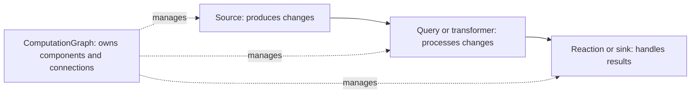
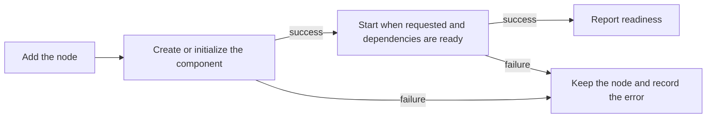

# ComputationGraph design

[Usage](computation-graph-usage.md) |
[Configuration](computation-graph-configuration.md) |
[Implementation reference](computation-graph-reference.md)

ComputationGraph manages components and moves changes between them inside a
DrasiLib instance. It owns the components, their connections, their resources
and the decisions about when to create, start, stop or replace them.

This describes the implementation in this branch. It is opt-in:
**ComponentGraph remains the default engine.**

## What changes when you select it

You can keep using the existing source, query and reaction APIs and plugins.
Selecting `ExecutionMode::ComputationGraph` changes the engine behind those APIs;
it does not merely add another graph while leaving queries on the old engine.
The old query manager does not evaluate ComputationGraph queries.

The graph can also run custom sources, transformers, sinks and services without
a continuous query. A service is a component with background work but no data
input or output ports.

The existing ComponentGraph-shaped inspection and event APIs remain available
for compatibility. They describe what is happening; they do not decide which
components exist or control ComputationGraph's execution.

## A node appears before initialization

An accepted `add_source`, `add_query` or `add_reaction` call records the node
before its initialization and startup complete.

This means a bad query or failed initialization is visible as a failed component,
not a component that silently vanished.

There are two important limits:

- An addition can still be rejected, for example because its ID already exists,
  ownership conflicts, or the instance is closed.
- Source and reaction objects passed to the standard APIs are constructed by the
  caller. If their constructor fails before the call, DrasiLib has no object to
  add. Query construction happens inside DrasiLib after its node is added.

Adding a node, finishing its creation and becoming ready are separate events.
Use the returned component handle when you need to wait for a particular one.
The [usage guide](computation-graph-usage.md#add-a-component-and-wait-for-readiness)
shows the difference.

## Components have more than one kind of status

Inspection answers separate questions:

| Question | Examples |
|---|---|
| Has the component been created? | Waiting, being created, missing a dependency, created, creation failed |
| What is its execution doing? | Stopped, starting, running, pausing, paused, stopping, failed |
| What is known about its health? | Unknown, healthy, degraded, unavailable |

A stopped component may still have an initialization error. A running graph
does not mean every component is running. The older status API has fewer states
and cannot show all these distinctions.

Pausing keeps the component and its state so processing can resume without
running its start hook again. Stopping calls its stop hook. Restarting also
depends on what the plugin supports; some plugins need a fresh object.
Exact API state names and transitions are in the
[state reference](computation-graph-reference.md#states-and-readiness).

## Queries run independently

A query added through DrasiLib owns a smaller graph containing its source
connections, evaluator, result delivery and storage bindings.

Each query graph has an owned Tokio task. Independent queries can therefore run
on different workers in a multi-thread runtime. A single-thread runtime also
works. ComputationGraph does not allocate one dedicated thread per component.

Pausing the containing query waits for its smaller graph to pause. Shutdown
waits for its task before releasing query resources. Cancelling the caller's
wait does not abandon that task.

## How events are ordered and buffered

Each continuous query has one bounded input queue shared by its sources.
Queued events are compared in this order:

1. The event timestamp reported by the source.
2. The source's position in that query's source list.
3. The sequence number maintained by that source.

The same source can have a different position in another query. Its sequence
number is assigned before the event is sent to subscribers; a query does not
invent a replacement sequence. Changing source order changes the query's
configuration identity, so old checkpoints cannot silently be reused under a
different ordering.

This orders **events already in the queue**. It does not wait for a quiet source
or promise an order over events that have not arrived. Scheduled query work uses
the same queue, with its due time and a rank after the configured sources.

A Channel source waits when the queue is full. A Broadcast source can lose
events when the queue is full; selecting it is an explicit loss/backpressure
choice. Other source, output and reaction queues have their own limits.

Custom graphs can use FIFO, broadcast or retained/replayable connections.
The selected connection and consumer must support the guarantees requested.
Putting a result in a queue is not the same as finishing its handling.

## Readiness messages are separate from data

Connected components can exchange readiness and availability messages through
small, separate queues. A full data queue therefore does not by itself prevent
a readiness notification.

A component can contact only its connected neighbours. Old connections and old
component handles cannot control replacement instances. Waiting for downstream
readiness is optional; an application can still create a startup deadlock if
each side waits for the other to start first.

## Storage and recovery

Queries keep current result rows, source progress, output sequence numbers and
recent output history. The recent history lets consumers recover missed results
without always rebuilding from a full snapshot.

With a storage provider that supports atomic query output, index changes,
source checkpoints, output sequence, retained outputs and current rows commit
together. Only committed results become visible.

Persistent indexes alone do not make query output durable. A reaction that saves
progress needs both persistent reaction state and persistent output from its
queries. The reaction records completed handling, not merely queue acceptance.

Recovery can fail rather than skip data, rebuild from a snapshot where supported,
or deliberately skip a gap for reactions configured to allow that. Fresh trigger
reactions start from their subscription point rather than replaying old outputs.
Reset and deletion preserve enough query identity to reject checkpoints from an
unrelated earlier use of the same query ID.

These are query/storage guarantees, **not one transaction covering an entire
pipeline or an external system's side effects**.

## Changes, removal and cleanup

The graph can preview the effects of a change before applying it. It checks that
the graph and affected component instances have not changed since that preview.
It then pauses, stops, reconnects or replaces the affected parts as needed.
Unchanged components can continue running.

Removal can refuse a dependency-breaking change, include dependents, retain an
explicitly allowed missing connection, or wait for supported pending work to
finish. A failed cleanup remains visible and retryable.

This is not all-or-nothing deployment of a fully initialized batch. A failure can
leave some components stopped or new declarations showing errors. That is
consistent with making additions visible immediately.

Always await shutdown. Dropping an instance cannot finish asynchronous cleanup.
Borrowed providers remain the responsibility of their owner.

## What inspection shows

Inspection includes the instance graph, each query's smaller graph and separately
registered graphs. It shows components, connections, known resources, plugin
versions and dependencies. Repeated component names in different graphs remain
distinguishable.

It reports actual supplied or reported objects, not guesses about private plugin
internals. Resource links do not prove that a provider was used for every event.
Plugin references describe components' implementations, not every installed
plugin binary.

Logs, metrics, recent state changes and per-change timing data support diagnosis.
Each graph's snapshot is consistent; combining several running graphs is not a
single atomic snapshot of the whole instance.

## Current limits

- Standard source/reaction additions still require preconstructed objects.
- Some providers' dependencies and plugin/version information are not reported.
- Graph export is not a complete recipe for rebuilding every plugin and provider.
- Server still owns solution-deployment and cloning work and does not expose
  every lower-level graph operation.
- There is no separate atomic batch-deployment API or automatic migration from
  ComponentGraph's stored state.
- Compatibility adapters still convert events and results between formats.
  Performance depends on the workload; parity with ComponentGraph is not claimed.

For exact types, connection guarantees, failure behaviour and code locations,
use the [implementation reference](computation-graph-reference.md).
