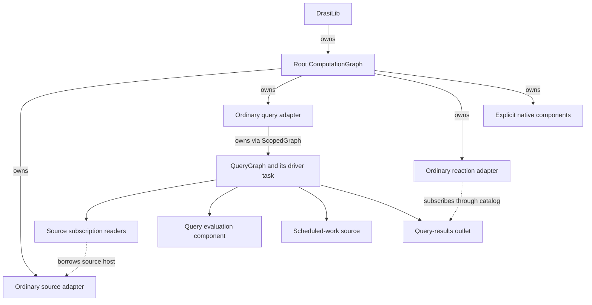
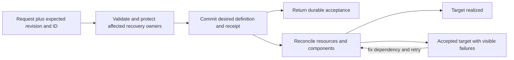

# Maintaining ComputationGraph

**Implementation baseline: 10 October 2026, `agentofreality-parallel-computation-graph`.**

This guide is for engineers changing Drasi itself: its runtime, query execution,
storage integration, component lifecycle or plugin hosting. For building a
solution *with* Drasi, use the [application developer guide](developer-guide/README.md).
For exact signatures and configuration fields, use the
[implementation reference](computation-graph-reference.md).

For current priorities and completion criteria, see the
[remaining-work inventory](computation-graph-remaining-work.md).

ComputationGraph makes the processing topology an executable, owned structure.
It decides which component instances exist, which connections they use, when
their work runs, and what must finish before they can be replaced. That common
foundation supports both ordinary source-query-reaction solutions and native
pipelines containing other transformers, sinks and services.

The main benefit is not another way to draw the same dependencies. It is a
common place to enforce execution, connection and ownership rules that would
otherwise have to be coordinated separately by each component category.
Durability builds on those rules, but remains explicitly configured.

Three different meanings of "graph" matter here. The **ComputationGraph** is the
runtime topology. An ordinary query owns a nested **QueryGraph**, which is
another runtime topology. Neither is the **data graph** of nodes and
relationships evaluated by Cypher/GQL. Changing runtime wiring does not require
reimplementing graph matching.

## Reading map

1. [What changed from ComponentGraph](#what-changed-from-componentgraph)
2. [Ownership and the two assembly paths](#ownership-and-the-two-assembly-paths)
3. [Following one change through the runtime](#following-one-change-through-the-runtime)
4. [Scheduling, readiness and lifecycle](#scheduling-readiness-and-lifecycle)
5. [Data contracts, identity and ordering](#data-contracts-identity-and-ordering)
6. [Query execution, bootstrap and scheduled work](#query-execution-bootstrap-and-scheduled-work)
7. [Stateful processing outside a query](#stateful-processing-outside-a-query)
8. [Recovery is a chain of completion boundaries](#recovery-is-a-chain-of-completion-boundaries)
9. [Resource ownership and cancellation-safe cleanup](#resource-ownership-and-cancellation-safe-cleanup)
10. [Live changes and persisted desired state](#live-changes-and-persisted-desired-state)
11. [Plugin hosting without a second executor](#plugin-hosting-without-a-second-executor)
12. [Inspection and diagnosing a running system](#inspection-and-diagnosing-a-running-system)
13. [Making and validating a change](#making-and-validating-a-change)

Code links point into this checkout; named symbols identify useful entry points
without relying on line numbers that move with edits. Historical links are
pinned to the inspected ComponentGraph-based revision.

## What changed from ComponentGraph

The old ComponentGraph was already a shared source of component metadata,
relationships, runtime-instance references and lifecycle history. Its managers
already used registry-first registration. Do not attribute those ideas, or
continuous queries and recovery in general, exclusively to ComputationGraph.

The structural change is **who coordinates the work**:

| Concern | ComponentGraph-based arrangement | ComputationGraph arrangement |
|---|---|---|
| Execution | Source, Query and Reaction managers coordinated their respective runtime paths around the shared graph | A graph controller owns component operations and connection lifecycles; ordinary APIs adapt to it |
| Composition | Runtime paths were specialized around sources, continuous queries and reactions | Typed ports and pipes compose sources, arbitrary transformers, queries, sinks and portless services |
| Status | Managers and components sent updates to an asynchronous graph-update task | The controller publishes execution state; compatibility status/events are derived at that publication boundary |
| Connection guarantees | Subscription and queue behavior was implemented within the specialized paths | Connections declare and negotiate schema, flow-control and completion requirements |
| Replacement | Manager-specific lifecycle orchestration | Revision-, generation- and operation-checked changes coordinated with affected components and resources |
| Recovery reasoning | Primarily source/query/reaction-specific recovery contracts | Those paths remain supported; native components can also expose processing, publication, replay and destination obligations |

This enables reusable processing without a query, transactional transformer
sequences, durable multicast, explicit source-time merging and capability-checked
recovery paths. It also gives maintainers one ownership model to extend instead
of adding a new manager/executor for each processing shape.

For the previous design, read the pinned
[ComponentGraph module](https://github.com/drasi-project/drasi-core/blob/261b8d40d35ce203a7f4aaae0028956d76a8def4/lib/src/component_graph/mod.rs),
[manager-owned query path](https://github.com/drasi-project/drasi-core/blob/261b8d40d35ce203a7f4aaae0028956d76a8def4/lib/src/queries/manager.rs)
and [status-update loop in `lib_core.rs`](https://github.com/drasi-project/drasi-core/blob/261b8d40d35ce203a7f4aaae0028956d76a8def4/lib/src/lib_core.rs).
The current [`component_graph/graph.rs`](../src/component_graph/graph.rs) is
deliberately different: its `ComponentGraph` holds a weak runtime reference and
provides read-only views. It is not a second mutable runtime.

## Ownership and the two assembly paths

### One instance owner, query-local execution

Each DrasiLib instance has one root ComputationGraph. Ordinary component
registrations and native component batches share that instance namespace.
Adding a batch does not create a competing runtime.

Ordinary Source, Query and Reaction objects appear as graph-owned service
adapters at the root. Their semantic kinds remain Source, Query and Reaction;
"service" describes their execution interface, not how users should see them.
An ordinary query service owns a QueryGraph containing subscription readers,
the evaluator node, scheduled-work input and result delivery.



Solid arrows here mean ownership, not event delivery. The source plugin can
serve multiple query subscriptions without each query becoming an owner of
that plugin's lifecycle. Query-local subscriptions and storage still have
their own cleanup obligations.

Read [`instance.rs`](../src/computation/instance.rs) for the root driver and
graph leases; [`runtime/component.rs`](../src/computation/runtime/component.rs)
for ordinary component realization; and
[`runtime/query.rs`](../src/computation/runtime/query.rs), especially
`QueryInstance::construct`, for the nested graph assembly.
[`scoped_graph.rs`](../src/computation/scoped_graph.rs) explains how that
query's driver remains owned when a caller stops waiting for an operation.

### Ordinary APIs are assembly and compatibility, not a fallback engine

The ordinary APIs preserve familiar configuration and plugin interfaces.
ComputationGraph is the only engine, including in `--no-default-features`
builds; the `computation` feature is an empty compatibility alias.
[`runtime/mod.rs`](../src/computation/runtime/mod.rs) translates those
registrations into graph declarations and retrieves current objects from
registry publications. The retained
[`sources/manager.rs`](../src/sources/manager.rs),
[`queries/manager.rs`](../src/queries/manager.rs) and
[`reactions/manager.rs`](../src/reactions/manager.rs) are facades.
Do not add authoritative component maps or new processing loops to them.

[`pipeline.rs`](../src/computation/v1/pipeline.rs),
`ComputationPipelineBuilder::build_with_subscriptions`, is the main wiring
point for the ordinary query path. It selects the actual index provider,
creates the ranked inbox and query resources, and connects subscription,
evaluation, timer and outlet components. A bug in how ordinary queries are
assembled usually belongs here or in their runtime adapter, not in the core
evaluator.

### Native assembly bypasses compatibility, not ownership

Native components implement the graph contracts directly. Their data paths
can connect source to transformer to sink without an ordinary Query object.
A native query uses the same evaluation machinery but need not create the
ordinary query-service wrapper or its nested task.

Factories describe reconstructible components and resolve declared resources;
supplied objects provide already-constructed instances. Both enter the same
graph ownership model. An opaque supplied object does not become reconstructible
merely because inspection can display it.

Start with [`component.rs`](../src/computation/v1/component.rs) for execution
boundaries and [`graph/specification.rs`](../src/computation/v1/graph/specification.rs)
for construction and resource contracts. The
[ordinary/native pipeline parity tests](../tests/computation_pipeline_parity.rs)
protect the shared behavior.

## Following one change through the runtime

Consider an ordinary source feeding a continuous query and reaction:

1. The source produces a `SourceEventWrapper`, including source-change time,
   sequence and any resumable source position. Its owned subscription supplies
   the event to a query-local reader.
2. The reader converts it to a native graph-change envelope. A ranked pipe
   admits it to that query's shared bounded inbox, applying the source's
   backpressure or drop policy.
3. The graph selects an available input and invokes the query transformer.
   The transformer interprets source/progress metadata and calls the shared
   evaluator through its actual storage owner.
4. With atomic publication, index mutations, input progress, result projection
   and output history are committed together. No downstream send is part of
   that transaction unless explicitly using shared output storage.
5. The graph forwards emitted envelopes through the selected output pipes.
   When every required branch has accepted a batch, it invokes the transformer's
   delivery-confirmation hook and drains any bounded continuations.
6. The query-results outlet/catalog exposes committed results to ordinary
   subscriptions. The reaction adapter applies its declared handling/recovery
   contract. Acceptance into a reaction's own queue is not proof that an
   external effect completed.

For a fully native pipeline, replace steps 1-2 and 6 with the source and sink's
direct envelope contracts. The controller still owns routing, validation,
confirmation and cleanup.

[`graph.rs`](../src/computation/v1/graph.rs), `run_node`, is the best single
place to understand this loop. It keeps at most one pending receive per input
edge, validates output batches before forwarding, and completes an input's
acknowledgement only after the relevant processing/forwarding/continuation
work succeeds. A buffering transformer can return no output; if that return
acknowledges recoverable input, the transformer must already have persisted it.

The compatibility boundaries are in
[`plugin_source.rs`](../src/computation/v1/plugin_source.rs),
[`graph_codec.rs`](../src/computation/v1/graph_codec.rs),
[`query_catalog.rs`](../src/computation/v1/query_catalog.rs) and
[`runtime/reaction.rs`](../src/computation/runtime/reaction.rs).
Follow those when data arrives correctly at one interface but disappears or
changes meaning at another.

**Fan-out is not a transaction.** Independent branches are sent sequentially;
a slow branch backpressures the producer, and earlier branches may have
accepted an emission when a later send fails. Forwarding errors retain that
partial-acceptance information. The exception is one append shared by several
subscribers of the same QoS channel, not arbitrary graph-wide atomic delivery.

## Scheduling, readiness and lifecycle

### Cooperative nodes, independently driven ordinary queries

The controller polls owned operation futures; it does not spawn one Tokio task
per native node. Mutable operations on an instance are serialized. An async
wait releases the controller to poll other work, but a long synchronous
calculation inside a component still occupies its executor thread.

Ordinary QueryGraphs have separate owned driver tasks. On a multithreaded Tokio
runtime, independent queries can therefore run on different workers. They
also run on a current-thread runtime. Adding more native nodes to one graph
does not, by itself, create CPU parallelism.

[`graph/controller.rs`](../src/computation/v1/graph/controller.rs) manages
active operations and their completions. `NodeWorkBudget` in
[`graph.rs`](../src/computation/v1/graph.rs) bounds continuously ready work
per poll and requeues the **node's** waker. Suspension resets the budget.
This prevents a ready producer or timer burst from monopolizing the controller
without imposing periodic extra yields on paths already waiting for I/O.
It cannot preempt a component that never yields.

The [query responsiveness tests](../tests/computation_query_responsiveness.rs)
and [graph dataflow tests](../tests/computation_graph_dataflow.rs) are useful
when changing fairness, continuation or fan-in behavior.

### Idleness is not exhaustion

A source with no current event must wait in `next`, not return `None`.
`None` means true exhaustion and allows downstream draining to finish. A
stopped or failed source is not automatically an exhausted source.

Transformers can request timer wakeups without receiving input, and pending
continuations run before another input is processed. This lets a merger drain
buffered events even after finite sources end. Keep those paths in `run_node`
when modifying its receive loop; "no input ready" does not always mean
"no work remains."

### Declaration, construction and readiness are different facts

An accepted declaration reserves an identity and can remain visible even when
construction fails. A constructed component may still be waiting for required
connections or readiness. A start hook can finish before an asynchronously
starting plugin is actually ready.

Consequently, the graph tracks creation state, execution state and health
separately. Do not treat "the graph is running" as "every component is healthy,"
or successful addition as successful startup. Caller-side failure to construct
a supplied object remains outside graph registration.

Strict construction rejects cycles, role/port/schema mismatches and unmet
connection capabilities before execution. Incremental assembly can retain
unresolved declarations until dependencies arrive. This distinction lets a
live system describe an incomplete intended topology without pretending that
it is already executable.

Readiness and neighbor notifications use separate bounded control channels.
They need not wait behind a full data pipe. Components can address connected
neighbors, not arbitrary graph members. Requiring readiness on both sides can
still create an application-level startup deadlock.

[`lifecycle.rs`](../src/computation/v1/lifecycle.rs) defines the state model;
[`control.rs`](../src/computation/v1/control.rs) owns control-message rules.
The controller's `begin_start`, `advance_start` and `complete` paths connect
them. Use [addition/control tests](../tests/computation_addition_control.rs)
when changing acceptance, readiness or reported failures.

### Stale work cannot act on a replacement

Several identities solve different races. A graph revision identifies the
declaration being changed; a component generation identifies the constructed
instance; an operation epoch identifies a particular operation on that instance.
Connections also have binding generations.

For example, a slow readiness callback from generation 7 must not mark a
replacement generation 8 ready. A completed stop from an earlier operation
must not finish a newer restart request. `Operations::complete` checks the
captured generation and epoch before publishing the completion.

Quiescence pauses processing without running a fresh start hook. Stop runs
cleanup needed for the component's supported restart behavior. Permanent
deprovisioning is a separate, explicit state-erasure operation. These are not
interchangeable implementations of "make it inactive."

Stopping the whole instance is a sweep, not a transaction. `DrasiLib::stop()`
stops consumers before producers and attempts every component even when one
fails, then reports all failures together. A record that a concurrent
configuration change replaced or removed is skipped, because that change now
owns the component's lifecycle. An incomplete stop is remembered, so calling
`stop()` again retries the remaining components instead of reporting "already
stopped." See `stop_all` in [`runtime/mod.rs`](../src/computation/runtime/mod.rs)
and [`lib_core.rs`](../src/lib_core.rs).

Ordinary processing failures are recorded on the affected component and
relationship policy determines the impact on dependents. Contract violations
and routing failures can terminate the graph run. Preserve failure phase and
cause rather than converting all outcomes to a single status string.

## Data contracts, identity and ordering

### Envelopes carry data; resource capabilities stay outside them

A native envelope contains an immutable change set, producer metadata,
annotations and lineage. A change set preserves operation order and distinguishes
full, partial and patch record images. Its schema includes exact identity,
version, encoding and definition bytes; executable validators check records.
A matching schema name or fingerprint is not sufficient compatibility proof.
Schema compatibility also does not convert arbitrary records into Cypher data:
the graph-change and query-result adapters provide that semantic mapping.

Immutable payloads are shared on in-process fan-out. Appending an annotation
creates branch-local history without mutating another branch. A transformer
derives a new envelope with its own stream/sequence and retains the input's
context and lineage. Lineage records ancestry; it is not a multi-input commit
protocol or a checkpoint authority.

This is not end-to-end zero-copy: compatibility conversion, decoding,
persistence and FFI still allocate or serialize. Keep transactions,
acknowledgements and storage handles out of annotations; those are local
capabilities with ownership rules, not ordinary immutable data.

Read [`data.rs`](../src/computation/v1/data.rs) for validation,
[`envelope.rs`](../src/computation/v1/envelope.rs) for sharing/derivation and
[`ports.rs`](../src/computation/v1/ports.rs) for connection compatibility.
[`codec.rs`](../src/computation/v1/codec.rs) is the persisted JSON envelope
format; [`binary_codec.rs`](../src/computation/v1/binary_codec.rs) is the
full-fidelity binary boundary. Changing one does not silently migrate the other.
Tests in [computation_codec.rs](../tests/computation_codec.rs) and
[computation_graph_codec.rs](../tests/computation_graph_codec.rs) protect
round trips and meaning, not just successful deserialization.

### Event time and progress sequence answer different questions

**Source-change time determines temporal order; progress identity determines
what has been processed.** Neither should be replaced by wall-clock receipt
time or an arbitrary property in the record.

Every output stream has one producer and increasing transport emission
sequences. A replay can emit the same logical output again with a new transport
sequence. Persistent queries additionally carry query identity/generation and
logical result positions. Stateful graph producers carry their own logical
progress.

This distinction becomes essential after transformation. Suppose source events
1 and 2 become merger outputs 2 and 1 because event 2 has an earlier source
time. A downstream query must checkpoint the **merger's** output sequence,
not inherited raw source sequence 2 and then incorrectly suppress event 1.

[`producer_progress.rs`](../src/computation/v1/producer_progress.rs),
`GraphInputProgress::from_envelope`, distinguishes immediate producer progress
from inherited provenance. [`query_identity.rs`](../src/computation/v1/query_identity.rs)
handles query recovery identity.
[`output_identity.rs`](../src/computation/v1/output_identity.rs) canonicalizes
retry comparisons for replay and delivery. Reuse these rules rather than
inventing an identity from just a timestamp, record key or transport envelope ID.
The [producer-provenance tests](../tests/computation_producer_provenance.rs)
cover the distinction through derived streams.

### Ordinary ordering preserves each producer's progress

The ordinary query inbox is a `RankedInputQueue` shared across its sources.
It compares the earliest admitted sequence from each producer by source time,
source-list rank and sequence. It does not move a later sequence ahead of an
earlier outstanding event from that producer, even if timestamps go backwards.
Otherwise a simple high-water checkpoint could skip unprocessed input.

The source's dispatch mode chooses blocking versus drop-on-full admission to
this inbox; the query's dispatch mode governs its output subscribers. Changing
source-list order changes query configuration identity. Inspect
[`ranked_pipe.rs`](../src/computation/v1/ranked_pipe.rs) and the shared
[`channels/priority_queue.rs`](../src/channels/priority_queue.rs) before changing
these rules.

Direct native fan-in defaults to arrival selection. Its
`EventTimeAcrossStreams` policy compares currently available stream heads.
Neither mechanism waits for unseen events or establishes a cross-source
watermark.

### Explicit source-time merging owns the reorder problem

`SourceTimeMergeTransformer` is the opt-in component for actual buffering and
within-source reordering. Every input must carry a source-change timestamp.
The source must supply it; the generic envelope type being able to represent
an absent timestamp does not authorize a fallback in this transformer.

The merger keeps a time-ordered buffer and a separate residence-deadline index.
An event becomes eligible when every active source has progressed far enough
beyond it, or when a residence deadline expires. Optional idleness removes a
quiet source from the early-release calculation. The component emits the
earliest eligible buffered event, one per continuation, under downstream
backpressure.

An expired residence deadline makes the ordered prefix through that event
eligible; maximum wait is not a downstream delivery deadline. Idleness is
not proof of completeness: when all sources are idle, residence deadlines
still govern release. Local monotonic time controls waiting, never event order.

For example, with outputs already advanced to source time 100, an arriving
event at 90 cannot enter the main output without breaking order. The default
policy retains it and fails. Explicit alternatives route it to a separate
late port or discard it with a warning/counter. Equal times are allowed;
configured source rank breaks ties among events buffered together.

Count and binary-input-byte limits include buffered, held and unconfirmed
events. Full capacity rejects a new input rather than silently evicting one.
Durable mode saves buffer, progress, frontier and pending output in an atomic
bounded snapshot. Reopen conservatively restarts residence waits. Snapshot
writes grow with buffer size; this is not a paged large-window reorder engine.

The design is in [`time_merge.rs`](../src/computation/v1/time_merge.rs) and
[`time_merge/recovery.rs`](../src/computation/v1/time_merge/recovery.rs);
[time-merge tests](../tests/computation_time_merge.rs) cover both time behavior
and graph integration. The [feature guide](computation-graph-time-merge.md)
defines exact policies and administrative held-event resolution. There is no
explicit source-watermark protocol, retroactive query correction, or standard
Server/factory recipe for this component.

## Query execution, bootstrap and scheduled work

### The runtime wraps the evaluator; it does not replace it

`ContinuousQueryTransformer` handles graph input/output, query configuration,
progress, recovery and result publication. The standard `ContinuousQueryFactory`
constructs it inside a `TransactionTransformer` query body, which enables the
appropriate delivery tracking. Direct construction and factory construction
must not be assumed to have identical output-handoff configuration.

The bridge to the engine is
[`core/src/computation/query_adapter.rs`](../../core/src/computation/query_adapter.rs).
`ComputationQuery::try_build` binds the evaluator to the supplied resource
bundle. Evaluation uses
[`QueryEvaluator`](../../core/src/query/evaluator.rs), reached through the
shared [query builder](../../core/src/query/query_builder.rs). Cypher and GQL
still feed shared evaluation logic; the runtime does not have a private
implementation of matching, aggregation or change detection.

This gives a practical debugging split: wrong matching/aggregation with a
correct input belongs in the evaluator and its indexes; missing/repeated input,
wrong progress or bad publication belongs in the computation adapter/runtime.
Do not compensate for an evaluator bug by adding query-language logic to
`run_node`.

In [`query.rs`](../src/computation/v1/query.rs), follow `process` from input
progress validation through the evaluator's pre-commit hook. That hook stages
result changes, materialized result rows and source checkpoints while the
index transaction is still open. The local ready result view is updated after
successful commit. The projection answers "what are the current rows?";
the outbox answers "what result changes can a consumer replay?" They are not
interchangeable storage.

The query output's logical position also differs from its retry transport
position. [`query_delivery.rs`](../src/computation/v1/query_delivery.rs)
restores unconfirmed output, assigns replay transport sequences and confirms
handoff. A crash after commit must replay output rather than reevaluate the
same input against already-updated state.

Use [query fault tests](../tests/computation_query_faults.rs) and
[query recovery tests](../tests/computation_query_recovery.rs) when changing
these boundaries, not only happy-path result tests.

### A source transaction is more than a vector of changes

An ordinary batch preserves its per-change evaluation behavior. An explicitly
complete source transaction carries framing, identity, a commit position and
admission limits. `SourceTransactionBuilder` cannot publish an unfinished or
failed assembly. The query must opt into this schema and atomic publication.

The engine evaluates the group under one transaction and consolidates its final
row changes. For example, moving value between two records need not expose an
intermediate total that exists only halfway through the source transaction.
This boundary stops at that query's publication; it does not atomically update
every downstream query or external consumer.

Read [`source_transaction.rs`](../src/computation/v1/source_transaction.rs) for
framing and limits, then `evaluate_source_transaction` in the core adapter and
[`query_results.rs`](../../core/src/computation/query_results.rs) for result
consolidation. [Source-transaction tests](../tests/computation_source_transactions.rs)
cover incomplete input and final-result semantics.

### Bootstrap establishes a cut between snapshot and live input

Bootstrap is not simply "insert some initial rows." The provider must establish
subscription readiness, load the snapshot, and identify the source positions
from which live/replayed input continues without a gap.

The query-scoped bootstrap contract separates preparation, snapshot streaming
and completion watermarks. Initial rows can be loaded incrementally; the
completed-bootstrap marker and final source boundaries are committed only
when the handover is complete. A partial load remains incomplete. No marker
for one source may invent a checkpoint for another source with no saved progress.

Some connectors need external initialization, such as creating a capture
resource. Borrowed `BootstrapState` stores bounded initialization intent in
the query's actual transaction domain before those effects begin. Final
handover state commits with the completion marker/watermarks. It survives
explicit query reset so unfinished connector work can be recognized, but
deprovisioning removes it.

[`query_bootstrap.rs`](../src/computation/v1/query_bootstrap.rs) defines this
boundary; [`query_recovery.rs`](../src/computation/v1/query_recovery.rs) applies
it during recovery. Dropping a snapshot stream requests cancellation, but
query cleanup must still await the provider's stop hook before releasing storage.
The rows are not one fictitious source transaction.

### Timer notifications do not own scheduled work

Temporal evaluation stores due work in the query's future queue.
`QueryScheduledSource` observes a read-only committed view and emits a hint
that work is due. It never removes the work itself.

The query transaction pops actual due work, evaluates it, and commits its
removal with resulting state/output. If the notification is lost, the work is
still stored; if duplicated, it cannot by itself repeat a committed removal.
If evaluation rolls back, the due work must remain recoverable.

Scheduled hints have their own kind and transport progress. They must not
advance live source checkpoints. Source time, timer due time and local time
used to wait are distinct. Timer sleeps periodically recheck the wall clock;
this is not a general deterministic clock-injection framework.

Start in [`query_scheduling.rs`](../src/computation/v1/query_scheduling.rs),
then the core adapter's `evaluate_due_future` and the query's `on_wakeup`.
[Temporal-retraction tests](../tests/computation_temporal_retractions.rs)
and the scheduling mutation cases in
[query fault tests](../tests/computation_query_faults.rs) protect this ownership.

## Stateful processing outside a query

### Standalone middleware retains the state needed to interpret changes

`MiddlewareTransformer` reuses the existing middleware registry and runner.
It is not a second implementation of unwind, mapping or relabeling. It can
retain previous elements so state-dependent transforms can produce the right
updates and deletions.

That state creates a recovery obligation. Running an input through middleware
again after a crash can produce a different answer if the previous-element
state already advanced. Durable mode therefore commits previous-element state,
input progress and transformed output together, then replays unconfirmed output
without executing middleware again.

Read [`middleware.rs`](../src/computation/v1/middleware.rs) alongside
[`middleware_recovery.rs`](../src/computation/v1/middleware_recovery.rs).
[Middleware recovery tests](../tests/computation_middleware_recovery.rs)
exercise storage faults as well as output shape.

### Linear transactions are one component, not a graph inside a transaction

A linear `TransactionTransformer` invokes opted-in transactional steps directly,
without intermediate pipes or independently scheduled child nodes. Each step
receives an isolated view of state through a borrowed `TransactionContext`.
Only the container commits. Filtering is an empty change set; expansion is
multiple operations in the one returned batch.

For example, a normalize step and a stateful expansion step can either both
commit their state/output or neither commit. Connecting two ordinary stateful
transformers with a durable pipe gives two recoverable commits, not that same
atomic boundary.

Participants cannot put mutable business state in fields on `self`, start
workers, perform external effects or independently commit. A step error can
roll back indexed state; it cannot roll back an already-sent HTTP request.
Ordinary transformers do not become safe participants through a configuration
flag alone.

[`transaction_transformer.rs`](../src/computation/v1/transaction_transformer.rs)
contains both the linear container and the distinct query-body arrangement;
[`transaction_state.rs`](../src/computation/v1/transaction_state.rs) scopes
step state. [Transaction-transformer tests](../tests/computation_transaction_transformer.rs)
cover rollback, output replay and interrupted replacement.

## Recovery is a chain of completion boundaries

### A storage provider must prove a usable transaction boundary

A `ComputationIndexes` bundle contains the evaluator indexes and optional
checkpoint, output-history and live-result writers. The provider explicitly
identifies which resources participate in its actual session transaction.
Putting unrelated writers behind similarly named resources does not make
their updates atomic.

[`core/src/computation/indexes.rs`](../../core/src/computation/indexes.rs)
validates participation and constructs the atomic-result capability.
[`operation.rs`](../../core/src/computation/operation.rs) owns serialized
transactions, rollback and fencing. Backend implementations remain responsible
for honoring their participation and storage-survival declarations.

An interrupted operation or failed commit acknowledgement may have changed
storage even though the caller did not receive success. **Fencing** means
rejecting further work on that owner until cleanup/reconstruction resolves
the uncertainty. It is safer than treating every error as confirmed rollback.
This is also why stateful components need cancellation guards, not just an
`if result.is_err()` branch after an awaited operation.

Default inline-memory queries avoid persistent machinery by using direct
memory indexes and a no-op session controller. Explicit non-atomic publication
cannot satisfy an atomic-output claim. Preserve this distinction when extending
[`pipeline.rs`](../src/computation/v1/pipeline.rs) or
[`legacy_index.rs`](../src/computation/v1/legacy_index.rs).

### Queue acceptance, processing and effects are separate

For one durable producer, the important crash cuts are:

| Interruption point | Owner that must retain enough information |
|---|---|
| Before processing commits | Upstream source/journal must replay unacknowledged input |
| After processing commits, before output acceptance | Producer's saved output must replay without recomputation |
| After one output branch accepts, before all are confirmed | Producer retains the batch; accepted branches need replay deduplication if duplicates are unacceptable |
| After an external effect, before consumer progress commits | Destination-side idempotency or a destination transaction must prevent repeating the effect |

`delivery_completed` is the graph's all-branches-accepted callback. It does not
mean all sinks finished their business work. A component that clears persistent
pending output there must require an appropriate durable acceptance boundary.

Likewise, a sink's completion declaration describes what its successful handler
actually proves. A retained pipe cannot upgrade an acceptance-only plugin to
completed handling. [Recovery-contract tests](../tests/computation_recovery_contracts.rs)
exercise those mismatches.

### Retained and multicast pipes make obligations explicit

A bounded FIFO releases queue capacity on receipt. A lossless retained journal
must keep data until handling is acknowledged. QoS multicast extends that idea
to one append with independent subscriber cursors: the slowest required
subscriber can keep old data retained.

Temporary disconnection is not subscriber retirement. Otherwise reconnecting a
slow consumer would silently lose its backlog. Lossy retention and gap skipping
are explicit policies; skip diagnostics must follow confirmed cursor advancement,
not a cancelled attempt to advance it.

Read [`retained_pipe.rs`](../src/computation/v1/retained_pipe.rs) and
[`retained_store.rs`](../src/computation/v1/retained_store.rs) for a single
consumer, and [`qos_pipe.rs`](../src/computation/v1/qos_pipe.rs) for multicast.
[`journal_budget.rs`](../src/computation/v1/journal_budget.rs) handles optional
full-envelope byte accounting. Persistent page limits bound the payload cache,
not total startup validation: the owner still checks all retained history.

With page limits, a journal's in-memory entries hold only the cached page.
Retention and capacity decisions must therefore come from the journal's
metadata (oldest retained position and retained count), never from the cached
entries; otherwise an append can trim records that a subscriber has not
acknowledged. `retain_from` in [`qos_pipe.rs`](../src/computation/v1/qos_pipe.rs)
is the single place that plans this, for both private and shared journals.

Byte quotas are not a universal RSS bound. Metadata, in-flight envelopes,
component state and backend buffers are additional costs. Some pipe budgets
permit a lone oversized event; the source-time merger does not. Check the
specific owner's admission rule rather than generalizing from another queue.
Capacity/backpressure is also not an events-per-second rate limiter.

### Admission receipts and output replay receipts solve different retries

Source admission records a client session, consecutive client sequence and
content with the journal append. A retry returns the same bounded receipt
instead of appending again. `SourceAdmission` delegates through the graph's
mailbox to the actual outgoing channel, not a source-private worker or queue.

Output replay tracking instead recognizes an existing persistent producer's
logical output. It must not assign a fresh source identity to a replayed query
result. Receipt windows are bounded; an expired or content-conflicting identity
fails explicitly rather than becoming new input.

The two services live in [`qos_pipe/admission.rs`](../src/computation/v1/qos_pipe/admission.rs),
[`qos_pipe/ingress.rs`](../src/computation/v1/qos_pipe/ingress.rs) and
[`qos_pipe/replay.rs`](../src/computation/v1/qos_pipe/replay.rs).
They are alternative channel modes. Use
[QoS integration tests](../../lib-integration-tests/tests/computation_qos.rs)
for persistent receipt and membership behavior.

Tracked producers also persist destination membership. While an output is
pending, silently changing a port, subscriber or journal would erase an
obligation. [`output_bindings.rs`](../src/computation/v1/output_bindings.rs)
pins those identities. Replacing consumer configuration under the same
destination identity does not create a new obligation or erase the old one.

### Shared storage removes one commit gap, not every gap

`SharedStorageGroup` places one processing owner and participating QoS journals
in one proven storage transaction. The producer reserves journal capacity
before entering the transaction, then commits state, input progress, saved
output and journal appends together.

Waiting for capacity must not hold the transaction gate: consumers may need
that gate to acknowledge and release capacity. Once processing begins, the
lock order is **group transaction gate, then channel state**, including paged
reads/refills. Reversing it introduces a deadlock that ordinary functional
tests may miss.

An uncertain shared transaction fences the group and wakes blocked users with
errors. Healthy producer quiescence is different: subscribers may still drain.
The group is not a transaction across arbitrary queries, providers or remote
systems; separately stored branches still have their separate handoff gap.

Read [`shared_storage.rs`](../src/computation/v1/shared_storage.rs),
[`qos_pipe/shared.rs`](../src/computation/v1/qos_pipe/shared.rs) and
[`core/src/computation/transaction_group.rs`](../../core/src/computation/transaction_group.rs).
[Journal-budget tests](../tests/computation_journal_budgets.rs) include
shared paging and recovery. The time merger currently requires a standalone
transaction owner rather than joining this group.

### Consumer completion closes a different boundary

`DeliveryRunner` remembers exact input identity/content and the completed
operation prefix. If a batch contains A, B and C and B fails, C must not run
and the upstream batch must not be acknowledged. On retry, previously
confirmed operations remain confirmed.

For external handlers, an effect can succeed before its progress commit;
the stable operation ID allows destination-side deduplication. Transactional
handlers instead commit local business state and one operation's completion
together through the borrowed transaction context. Neither mode implies
whole-batch remote atomicity.

The implementation is [`delivery.rs`](../src/computation/v1/delivery.rs),
with ownership protection in
[`delivery/retirement.rs`](../src/computation/v1/delivery/retirement.rs).
It shares output identity rules with journal replay. Do not put this ledger
on ordinary fast sinks that did not request it.

Finally, [`graph/recovery.rs`](../src/computation/v1/graph/recovery.rs),
`assess`, walks the contributing paths to a requested consumer and checks
actual contracts, transport policy, progress ownership and storage survival.
This validates a requested guarantee; it does not activate absent recovery
services. A durable index alone cannot repair an unreplayable upstream source.

## Resource ownership and cancellation-safe cleanup

Data edges describe event flow. Resource dependencies describe which owners
must remain alive for other owners to work. They are related but not the same
graph.

For a journal using a shared storage group, the storage must be created first
and remain alive until the journal and its users are cleaned up. Dependencies
must be declared so the controller can enforce that order. A host-side cache
holding a matching path is not a substitute.

[`graph/resources.rs`](../src/computation/v1/graph/resources.rs) calculates
construction and reverse cleanup order, validates ownership combinations and
includes transitive dependents in changes. Borrowed resources retain their
external owner; they cannot retain a graph-owned prerequisite whose lifetime
the external owner does not control.

Cancellation is the difficult case. Dropping a future requests no magic undo
of a socket bind, blocking write, nested task or external effect. Owners must
retain enough state to finish cleanup and prevent overlapping reuse.

In particular, do not remove a worker's join handle from its owner before an
await that can be cancelled. If the caller disappears at that await, there
must still be an owned handle to join on retry. Use
[`context/workers.rs`](../src/context/workers.rs): ownership is acquired
before spawn, and handles are removed after observed completion. An abort
request is not a completed join. Some I/O/draining workers must not be aborted
on timeout at all.

The same principle appears in graph instance leases, `ScopedGraph`, storage
I/O scopes and controller cleanup. A failed cleanup leaves an owned,
retryable obligation, not permission to open a replacement against the same
resources. `GraphRun` drop can mark cleanup required; only awaited async
cleanup can finish it. DrasiLib stop permits supported restart, whereas
shutdown is terminal.

Use [runtime lifecycle tests](../tests/computation_runtime_lifecycle.rs),
[resource dependency tests](../tests/computation_resource_dependencies.rs)
and [`core/src/computation/io_scope.rs`](../../core/src/computation/io_scope.rs)
when modifying ownership. Test cancellation *during* cleanup, not only before
cleanup starts.

## Live changes and persisted desired state

### Reconciliation changes an owned topology

A preview computes affected components, bindings and resources at a specific
revision and set of generations/epochs. Reconciliation rechecks that evidence,
quiesces or stops affected work, performs supported replacement/rebinding, and
retains unrelated instances.

The goal is controlled change, not an all-or-nothing deployment transaction.
If cleanup fails, already-stopped components can remain stopped. If a new
factory fails, its declaration/failure remains visible. An in-place update is
valid only when the factory supports it and the component contract permits it.

[`graph/reconcile.rs`](../src/computation/v1/graph/reconcile.rs) owns impact
calculation and reconciliation rules;
[`graph/controller.rs`](../src/computation/v1/graph/controller.rs) executes
the lifecycle work. [Reconciliation tests](../tests/computation_reconciliation.rs)
exercise stale previews, partial outcomes and unaffected components.

Committing the desired topology is the dividing line for errors. Before
commit, an error rejects the request. After commit, `execute` always returns
the `ReconciliationReport` with `committed` set; only cancellation returns an
error. Realization, recovery-validation, settle and startup failures are
recorded in `report.failures`, and producers paused for the change are always
resumed. If the graph has not settled, or another lifecycle operation owns the
controller, components marked for automatic start are queued in
`pending_auto_start` and the controller starts them once it is free. A caller
must therefore read the report, not just the `Result`, to learn whether the
change was applied in full.

### Durable acceptance precedes realization

Optional management persists *what the instance should contain*. Its
configuration store is separate from query indexes, event journals and
consumer completion state.



A listener port may be unavailable after the definition is accepted. That is
a realization failure, not evidence that acceptance was rolled back. The
client resolves the same request ID and the runtime retries the retained
target instead of pretending it has an empty configuration.

The management driver in [`management/runtime.rs`](../src/management/runtime.rs)
serializes these requests and owns configuration acceptance/reconciliation.
[`management/store.rs`](../src/management/store.rs) defines the external store
contract. Resource resolution uses supplied resolvers and recipes; the library
does not become a plugin loader or depend on a particular encrypted store.

Persistently managed members reject configuration writes outside that path.
Unmanaged objects and externally supplied resources are not silently absorbed
or removed. A configuration snapshot records reconstructible definitions,
not a snapshot of processing state. Restoring it cannot rewind a database,
restore pruned events or undo an external effect.

### Removing durable state needs more than a stopped status

Replacing a persistent resource can destroy the only remaining path to
unconfirmed work. Before accepting such a change, supported retirement paths
stop the actual users, verify pending obligations under the real storage
gates, and hold those owners against restart/rebinding through the decision.

The race to prevent is: inspect "empty," release the lock, accept new work,
then replace the resource based on the stale empty observation. Retirement
holds the proof stable instead.

If configuration commit is uncertain, those protections remain held until
authoritative resolution. Confirmed rejection can resume old owners; accepted
retirement requires the affected generations to be reconstructed/removed.
Dropping an unresolved lease does not automatically resume them.

Query deprovisioning starts a new output incarnation, not a reused one. It
records an in-progress reset before clearing anything, so an interrupted wipe
is refused at recovery rather than resumed from partial state. The restarted
sequence numbers are published under a strictly newer output generation, so a
consumer that deduplicates on identity, generation and sequence cannot mistake
new results for old ones. Recovery treats only a readable, absent or different
configuration hash as a configuration change: a storage error while reading it
fails recovery instead of authorizing an automatic reset. See
[`query_recovery.rs`](../src/computation/v1/query_recovery.rs) and `recover` in
[`query.rs`](../src/computation/v1/query.rs).

Explicit data-loss authorization is revision-bound and names a complete
recovery domain. It permits removal, not in-place reuse, data deletion or
fabricated handling acknowledgements. It cannot excuse incomplete cleanup.

Read [`management/transitions.rs`](../src/management/transitions.rs) with
[`graph/retirement.rs`](../src/computation/v1/graph/retirement.rs) and the
relevant storage/delivery retirement owner.
[Managed-resource integration tests](../../lib-integration-tests/tests/computation_managed_resources.rs)
and [management tests](../../lib-integration-tests/tests/computation_management.rs)
cover failures that a successful configuration round trip would miss.

## Plugin hosting without a second executor

Ordinary Source/Reaction/Bootstrap plugins and native ComputationGraph plugins
are different, independently versioned families. The former enter through
graph-owned adapters preserving their existing interfaces. The latter expose
native sources, transformers, sinks and services directly.

Native hosting transports operations as opaque handles with poll, wake,
cancel and release behavior. The host drives those operations under the same
graph lifecycle rules. The SDK supplies an owned I/O runtime for timer/socket
drivers; it does not run another graph executor or spawn processing futures.

An ordinary source change event the host cannot decode ends that change stream
with `UndecodableSourceEvent` (see
[`proxies/change_receiver.rs`](../../components/host-sdk/src/proxies/change_receiver.rs)).
Skipping it would let the source confirm later positions past the lost change,
so a restart could never replay it. The source fails instead and resumes from
its last confirmed position.

Rust futures, trait objects, `Arc`s, allocator ownership and runtime internals
do not cross the C ABI. Producer-owned buffers are released by their producer.
Native envelope decoding reconstructs validated owned objects; a temporary
borrow of wire bytes must not escape its buffer owner. Libraries remain pinned
for process lifetime. These are trusted in-process plugins, not sandboxed
workers or hot-unloadable code.

Optional transaction, source admission, bootstrap/progress and consumer services
are mediated by host-owned, revocable capabilities. For example, a transactional
plugin step sends storage requests through a mailbox serviced within the real
borrowed transaction. The host does not extend a borrowed Rust context to an
invented static lifetime. Late callbacks after cancellation must fail rather
than reach a replacement's storage.

For scheduling and lifetime changes, start with the
[native SDK design](../../components/computation-plugin-sdk/README.md), then
[`host-sdk/computation/proxy.rs`](../../components/host-sdk/src/computation/proxy.rs)
and [`factory.rs`](../../components/host-sdk/src/computation/factory.rs).
For capability changes, follow
[`transaction.rs`](../../components/host-sdk/src/computation/transaction.rs),
[`admission.rs`](../../components/host-sdk/src/computation/admission.rs),
[`bootstrap.rs`](../../components/host-sdk/src/computation/bootstrap.rs) or
[`consumer.rs`](../../components/host-sdk/src/computation/consumer.rs).
Keep the [native ABI](../../components/computation-plugin-abi/src/lib.rs) and
ordinary SDK wire contracts separate.

A trait implemented by an in-process Rust component does not automatically
exist across FFI. Test separately built libraries and actual capability
negotiation, not just Rust mocks in one binary.

## Inspection and diagnosing a running system

The controller publishes desired topology and observed state coherently.
[`graph/registry.rs`](../src/computation/v1/graph/registry.rs) adds weak
in-process bindings used by ordinary facades and native query read APIs.
Weak bindings prevent inspection from extending storage/component lifetime
or keeping a replaced generation alive.

[`inspection.rs`](../src/computation/v1/inspection.rs) provides read-only
snapshots, coalesced observations and bounded history. The compatibility
translator in [`runtime/events.rs`](../src/computation/runtime/events.rs)
derives old-style events synchronously from publication changes; it does not
maintain a second lifecycle state machine.

Query discovery is based on semantic role and captured read capabilities,
not a hard-coded factory name. Inspect
[`runtime/native_query.rs`](../src/computation/runtime/native_query.rs) and
[`query_api.rs`](../src/computation/v1/query_api.rs) when a native query is
missing from ordinary query APIs. Result reads do not create another evaluator;
live ordinary subscriptions require the actual outlet/catalog connection.

Public errors preserve internal causes through
[`error.rs`](../src/error.rs), rather than reducing them to formatted strings.
Use the public classification for broad error categories and the typed cause
for specific failures. Cleanup can fail in several owners: inspect the retained
aggregate or lifecycle report, not only its primary source chain. Otherwise a
second resource still requiring cleanup can disappear from the diagnosis.

Inspection of the root and several live QueryGraphs is not one global
transactional snapshot. A resource link shows a binding/ownership relationship,
not proof that every event used that resource. Private plugin resources are
visible only when reported. Topology-as-data excludes configuration values,
secrets and failure text; privileged configuration exports have different
exposure rules.

Use failure phase, generation and the relevant progress boundary together:

| Symptom | First useful investigation |
|---|---|
| Node exists but never starts | Creation failure, missing binding/resource, or unmet readiness in the controller; not just the instance's running flag |
| Query reads work but live subscription is empty | Outlet/catalog wiring and output generation, then subscriber progress |
| A replayed event is skipped or applied twice | Immediate producer/query identity, logical versus transport sequence, receipt retention and handoff confirmation |
| Temporal result disappears after restart | Committed future queue, bootstrap state and due-work transaction; not only the timer notification |
| A slow consumer causes apparent upstream inactivity | Pipe capacity, subscriber cursors and pending output; distinguish backpressure from a dead worker |
| Replacement cannot acquire storage or a port | Previous generation's cleanup/retirement owner and retained worker joins |

Logs and metrics complement these publications. The relevant paths are
[`managers/tracing_layer.rs`](../src/managers/tracing_layer.rs),
[`metrics/`](../src/metrics) and
[`pipe_metrics.rs`](../src/computation/v1/pipe_metrics.rs).
Profiling intervals can include queueing, waits and storage, so do not interpret
every elapsed interval as evaluator CPU time. Bounded history/watch channels
are diagnostic tools, not a lossless audit ledger.

## Making and validating a change

### Keep the change in its owning layer

A queue-ordering fix belongs in the queue/scheduling path, a matching fix in
the shared evaluator, a snapshot-to-live handover fix in bootstrap/recovery,
and a replacement race in the controller and actual cleanup owner. Follow
the data once across adapters before deciding the engine lost it.

When extending a native component, first decide which state it owns, what
successful processing proves, and whether a cancelled call can leave an
obligation. Then decide how that state is reconstructed. A new method or
capability flag is not the design by itself.

The essential review questions are:

- Can a component, binding or callback from an old generation act on the new one?
- If cancellation happens at each await, who still owns cleanup and pending work?
- Does every acknowledgement follow the boundary it claims?
- Do retries retain logical identity and reject conflicting or expired content?
- Are configuration intent, processing state and external effects kept distinct?
- Does the ordinary memory-only path acquire work or allocations for an unused feature?

### Measure the path actually changed

The fast path should not allocate durable receipt ledgers, shared journal
reservations or management machinery unless selected. Large opt-in async
branches can enlarge every future even when disabled; boxing just those
branches avoids charging all ordinary processing for them.

Use [`fast_path.rs`](../examples/fast_path.rs) for ordinary in-process work,
[`core_workload.rs`](../examples/core_workload.rs) for projection/aggregation/join
workloads, and the
[native Host benchmark](../../components/host-sdk/examples/native_fast_path.rs)
for the dynamic-plugin boundary. The
[interleaved measurement driver](../tests/measure-fast-path.py) helps separate
real regressions from run-to-run noise. Compare the same dependency features,
storage, queue bounds, payloads and runtime flavor; a debug test duration is
not a production throughput claim.

### Test the boundary, then the adjacent paths

Run focused tests for the subsystem first. Scheduling/lifecycle changes need
current-thread and multithreaded coverage. Recovery changes need reopen with
real storage and failures before mutation, after mutation, before commit,
after commit and during cleanup. Cancellation after commit but before its
acknowledgement is a different case from rollback before commit.

For example, from the repository root:

```bash
# Routing, lifecycle and control ownership.
cargo test --locked -p drasi-lib \
  --test computation_graph_dataflow --test computation_runtime_lifecycle \
  --test computation_controller

# The source-time merger, including real RocksDB reconstruction.
cargo test --locked -p drasi-lib --no-default-features \
  --features computation-rocksdb-tests --test computation_time_merge
```

These commands are examples of targeted selection, not the complete CI gate.
Tests involving source/reaction crates that depend on drasi-lib belong in
[`lib-integration-tests`](../../lib-integration-tests), avoiding dependency
cycles. Backend injection can be tested from `lib` with its existing backend
test features.

Before a cross-cutting change is considered qualified, consult
[`run-runtime-parity.sh`](../tests/run-runtime-parity.sh) and its
[contract inventory](../tests/runtime_parity/computation-contracts.tsv).
They cover default/no-default builds, additional capabilities, separately built
plugins and backend profiles. An ignored process-crash worker does not count
as coverage without its passing parent crash driver. Keep assertions about
ordering, exact output and retained obligations; "the graph did not panic" is
not a sufficient oracle.

Use [the qualification ledger](../tests/runtime_parity/requirements.tsv) and
[current limitations](componentgraph-vs-computationgraph.md#performance-and-qualification-boundaries)
when making release claims. Framework support, one backend test and
production-duration operational evidence are different levels of confidence.
