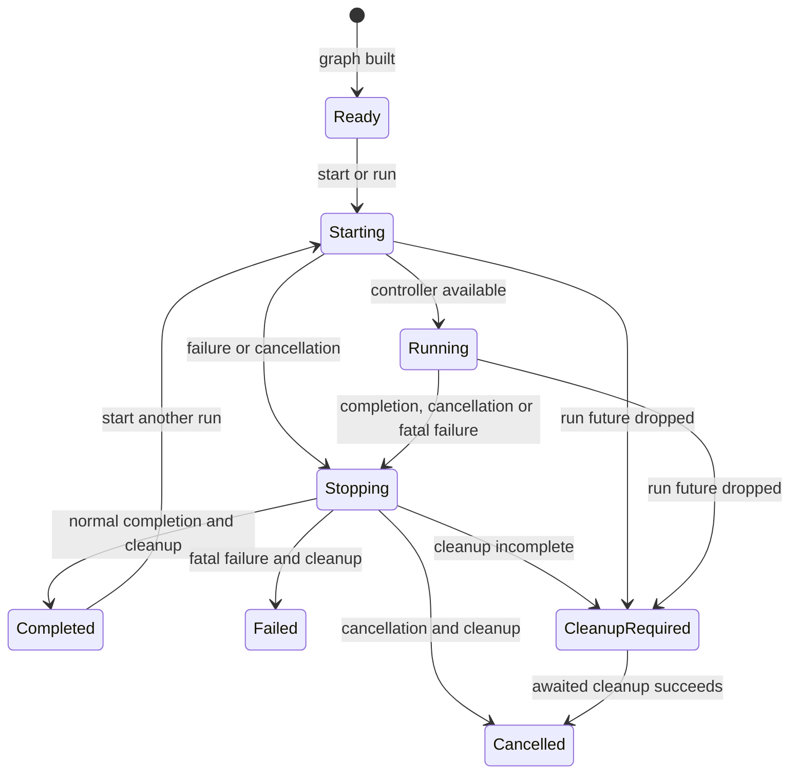
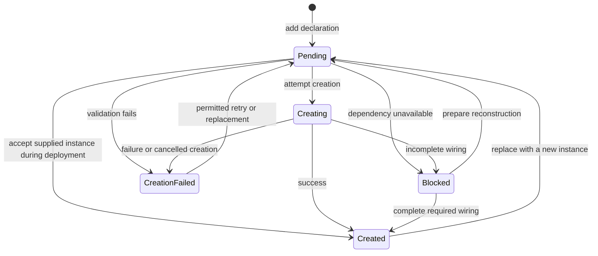
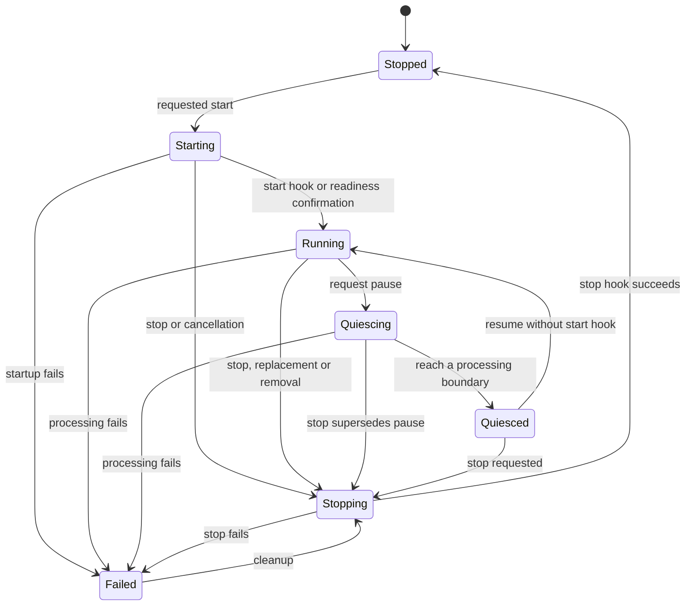

# ComputationGraph implementation reference

[Design](computation-graph-design.md) |
[Usage](computation-graph-usage.md) |
[Configuration](computation-graph-configuration.md)

Use this page when implementing a component, connection provider or management
tool. It contains the exact API names and rules that the shorter guides leave
out. The APIs are under `drasi_lib::computation::v1` and are available without a
feature opt-in.

## Main types and ownership

| Type | Responsibility |
|---|---|
| `ComputationGraph` | Owns component instances, connections, resources and the controller |
| `GraphRun` | Future that drives a standalone graph; its caller must keep polling it and await cleanup |
| `GraphControl` | Sends commands to the controller; does not mutate component objects directly |
| `GraphSnapshot` | Component/resource declarations, connection policies and reported inventory information |
| `ObservedGraph` | Current creation, execution, health and failure information |
| `ComputationInspector` | Consistent snapshots and the most recent 256 controller publications |
| `ResourceHandle` | An actual supplied object and, where applicable, its cleanup owner |
| `ComputationRegistry` | DrasiLib's registered graphs and their owned tasks |
| `ComputationInventory` | Combined view of registered graphs and their nested query graphs |

An instance's source/query/reaction records are owned by its graph. Compatibility
inspection responses are derived from those records, not used to recover
membership or decide removals. Ordinary component operations and any retained
manager-style accessors are graph-backed APIs, not a second execution engine.

`DrasiLib::get_graph().await` returns the compatibility snapshot directly.
`component_graph()` is now a weak, read-only asynchronous view: it is not an
`Arc<RwLock<ComponentGraph>>`, has no node/relationship mutation methods, and
cannot store runtime instances. Existing callers must remove graph-lock and
direct-mutation code rather than using that view as another lifecycle owner.

DrasiLib owns a task for each registered graph and each query's nested graph.
Inside a graph, the controller polls its component futures and serializes mutable
calls to each component. Independent query tasks can use different Tokio workers.
The in-process graph APIs support both single-thread and multi-thread Tokio
runtimes. A particular plugin or its foreign-function bridge can have additional
requirements; those are not an alternative graph engine.

## Identifying the right object

| Identity | What it distinguishes |
|---|---|
| `ComponentId` | A component name within one graph |
| `GraphRevision` | A version of the graph's declarations and reported inventory |
| `ComponentGeneration` | One constructed instance of a component |
| `OperationEpoch` | One operation on that instance |
| Binding generation | One particular connection/resource binding |
| `ComputationScope` | A registered graph plus the owner path to a nested graph |

Replacing a component does not make an old handle refer to the replacement.
Commands, observations and control messages check the appropriate identity.
Internal runtime lookups use weak references; an expired reference is an error,
not a reason to find another object with the same name.

Component IDs, resource IDs and plugin IDs have separate meanings. When combining
several graphs, retain their scope information rather than using local names as
globally unique keys. Inventory across different DrasiLib instances also needs the
instance ID.

## Component and connection declarations

| Execution role | Ports | Processing method |
|---|---|---|
| Source | Outputs only, at least one | `EnvelopeSource::next()` |
| Transformer | At least one input and output | `Transformer::transform()` |
| Query | Transformer-shaped | Query transformer with evaluation and recovery |
| Sink | Inputs only, at least one | `EnvelopeSink::handle()` |
| Service | No data ports | `ComputationService::run()` |

All implement `ComputationComponent` start/stop hooks. A factory can construct an
instance from a `ComponentSpecification`; alternatively, the caller supplies an
already-constructed object.

The existing Source/Query/Reaction interfaces are hosted by Service nodes in the
instance graph. Their displayed kinds remain Source, Query and Reaction. Query
data ports and storage live in the query's nested graph. A host-subscription
relationship describes existing delivery; it does not add another queue.

A descriptor defines the component ID and ports. Each port has a direction,
schema and connection requirements. A factory specification adds implementation
identity, configuration version, configuration fields and named dependencies.
Secret fields require unresolved references, not resolved credentials.

`MiddlewareTransformer` is a graph-change-to-graph-change component that reuses
the existing query middleware runner and registry. It has one input/output port,
supports multiple incoming connections and keeps previous emitted elements for
state-dependent middleware. Choose memory-only state with `new` or atomic
persistent state and saved output with `new_durable`. See the
[middleware guide](computation-graph-middleware.md) for configuration, batching
and recovery limits.

`TransactionTransformer` owns either a configured linear sequence whose
implementations also implement `TransactionalTransformer`, or a query body using
the shared core evaluator. It owns the processing transaction and saved output;
linear steps receive a borrowed `TransactionContext` with isolated state. It
does not create a nested graph or schedule child nodes. See the
[transaction guide](computation-graph-transactions.md) for participation,
configuration and recovery requirements.

`QosChannel` implements one producer journal with independently checkpointed
subscribers. `QosPipeConfig` selects a subscriber endpoint; graph fan-out performs
one append for endpoints sharing that channel. Memory backpressure, explicit
lossy retention and persistent replay are available. See
[pipe QoS](computation-graph-qos.md) for ownership, retirement and provider recipes.

A data connection names `(component, port)` at both ends, its provider and its
`RelationshipPolicy`. A resource declaration names its role, ownership and
binding; `provide_resource` supplies the actual object separately.

Strict graph builds reject cycles, duplicate identities, unconnected mandatory
ports, missing output streams and schema/capability mismatches. Incremental adds
can retain incomplete nodes, but eventual connections must satisfy these rules.
One producer output cannot feed several input ports on the same consumer:
separate queues would not preserve ordering for that stream.

`GraphSnapshot` also records unresolved relationships, host subscriptions,
control-only connections, readiness requirements and reported component resources
and plugins. An absent producer or provider is an unresolved reference, not a
fictional component.

## States and readiness

Creation, execution and health are separate. These are API enum names, not
interchangeable descriptions of a single status.

### Graph controller: `GraphState`



`Running` means the controller is active, not that every component is healthy or
running. `graph.run()` keeps a controller available without automatically
starting all components. `graph.start()` also requests automatic activation.
Only Ready and Completed permit a new direct graph run.

### Component creation: `RealizationState`

| Value | Meaning |
|---|---|
| `Pending` | Declaration accepted; creation has not completed |
| `Creating` | Validation/construction is in progress |
| `Created` | Instance exists and required creation/wiring conditions are met |
| `Blocked` | Required construction dependency or wiring is unavailable |
| `CreationFailed` | Validation, construction or initialization failed |



An explicit retry is allowed only for a retryable failure. Terminal failures need
a changed specification or removal. An absent source for a DrasiLib query may
cause CreationFailed; an unconnected custom component may be Blocked. They are
not promises that every missing dependency follows the same code path.

### Component execution: `ComponentLifecycle`



`Quiescing` means pausing; `Quiesced` means paused at a supported boundary.
Component work normally becomes ready when its start hook succeeds. Components
needing later confirmation call `control.ready()`. Plugin wrappers wait for the
plugin's Running observation; query wrappers check the inner query.

`ComputationService::quiesce()` runs after its `run()` future has been dropped for
a pause. A service with separately owned work must wait for that work to pause.
The default needs no extra action for work living entirely in `run()`.
Query wrappers propagate this pause to their nested graph and resume only the
appropriate paused component instances.

Normal source exhaustion sets `exhausted` and closes its output. It is not itself
a call to the stop hook and can briefly coexist with a Running lifecycle.
`started` records readiness for the latest requested activation, even if a
short-lived component subsequently finishes. It is not a continuing-health test.

Health values are `Unknown`, `Healthy`, `Degraded` and `Unavailable`. Failures
retain phase, disposition, original cause and time. Phases include Validation,
Creation, Binding, Activation, Processing, Stop, Removal and Control. A control
handler failure can degrade health without terminating data processing.

### Existing status API: `ComponentStatus`

The older API still reports Added, Starting, Running, Stopping, Stopped, Removed,
Reconfiguring and Error. Its view cannot express every graph state:

| Graph observation | Existing status |
|---|---|
| Recorded failure or Failed execution | Error |
| Starting / Stopping | Starting / Stopping |
| No lifecycle request yet, or creation is incomplete | Initial status, usually Added; normally Stopped for a replacement |
| Exhausted or stopped after lifecycle activity | Stopped |
| Other created execution states | Running |

In particular, Added does not prove successful creation, and the older status
view does not expose pause states. Removed is not a lingering graph component:
after removal, its graph lookup fails.

### Resources and connections

`ResourceRealization` is Pending, Created, CleanupRequired or Released.
Created means an object is bound, not that credentials or a database connection
are healthy. Providers generally have no independent start/stop lifecycle.
Their operational failures are usually reported by the consuming component.

`BindingState` is Declared, Binding, Bound, Draining or Failed. Unbinding can
return a retained connection declaration to Declared. Its data availability is
separate: Unknown, Idle, Available, Unavailable or Exhausted.

Hosted source/query/reaction subscriptions expose their endpoint observations,
not invented capabilities or binding states from a different transport.
Plugin/version reference nodes likewise have no Running/Error lifecycle.

## Data and delivery rules

`ChangeEnvelope` holds a shared immutable `ChangeEvent` and an append-only
annotation history. `append_annotation` changes only that branch's history;
`derive` creates a new event while preserving information about its input.
Fanout shares the event payload rather than copying it for each branch.

Records are schema-validated bytes. Adds, updates and deletes preserve operation
order; update semantics distinguish patch from replacement. Every output port
has a producer stream whose successful new emissions have increasing sequences.
This sequence is separate from a source plugin's raw sequence and a query's
result sequence.

| Connection type | Guarantees and limits |
|---|---|
| `BoundedPipeConfig` | Per-stream FIFO and backpressure |
| `BroadcastPipeConfig` | Bounded history with an explicit lag policy; no backpressure guarantee |
| `RetainedPipeConfig` + `MemoryEnvelopeStore` | Retained history inside the process |
| `RetainedPipeConfig` + `IndexedEnvelopeStore` | Durable acceptance/replay using a complete persistent index bundle |
| `RankedInputPipeConfig` | Branches of a shared query queue ordered by event time, source rank and source sequence; not producer FIFO |

`EnvelopeCodec` requires registered schema validators on decode and preserves
event metadata and annotations. Internal canonical identity bytes are not a
reversible event serialization format.

Acceptance means enqueueing succeeded. `SinkCompletion::Handled` promises a
different boundary from `Accepted`. The graph rejects acknowledgement-required
delivery to an acceptance-only sink. A retained delivery's saved position advances
only after successful handling and required output forwarding; dropping it is
not acknowledgement.

`send_batch` reports accepted entries and the failed/unattempted remainder.
For a durable commit error, `SendFailure::acceptance() == Unknown` means the write
may have succeeded; it is not proof that retry is safe.

Fanout is not atomic. A later branch can fail after earlier branches accepted
the event, and a slow branch can backpressure its producer. Cancellation can
discard queued/in-flight data and cannot undo an external effect.

For query-specific ordering, including scheduled work and source sequence
requirements, see [configuration](computation-graph-configuration.md#ordering-and-buffers).

## Control messages and startup

`ComponentControl` can send only to current connected upstream/downstream
neighbours. Data connections, host subscriptions and explicit control-only links
establish those neighbours. Rewiring invalidates old senders and queued messages.

Control mailboxes are separate from data queues. Current limits are 64 queued
messages per component, a 16 KiB payload budget and JSON depth 64. Sending does
not wait for capacity; fanout reserves capacity for all recipients or fails.
These are not durable messages.

Register a `ControlHandler` on a component or through its handle. Handlers can
progress separately from mutable data calls, but blocking an executor thread
still delays other work. Availability messages do not imply a universal automatic
restart policy.

`require_downstream_ready` optionally gates producer startup. Configure it before
startup. It is separate from a connection policy requiring an already-running
upstream component; opposing requirements can deadlock an application.

For the standard DrasiLib pipeline, startup requests sources and queries, then
releases the sources' `on_subscriptions_complete` notification before starting
reactions. Waiting for query bootstrap to finish before that notification could
deadlock. This is why a standard start method's return is not always a readiness
confirmation.

## Changing a running graph

Call `GraphControl::preview(revision, mutations)`, then
`reconcile(preview, bindings)` to apply that plan. The controller rechecks the
revision and affected instances before changing them.

Supported changes include add/replace/update/remove, connect/disconnect, resource
replacement, subscription changes, restart and retry. In-place reconfiguration
requires factory support and cannot silently change an interface or implementation.
Otherwise replacement constructs a new component instance.

| Removal policy | Behaviour |
|---|---|
| Reject | Refuse a change that breaks required dependencies |
| Cascade | Include dependent components |
| Orphan | Keep an explicitly allowed unresolved relationship |
| Drain | Wait for a supported completed-handling boundary |

A sink-only replacement can retain its unconsumed input queue without restarting
upstream components. Changed connections drain in dependency order. A provider
must prove it is idle through `PipeControl::is_idle`; queue metrics are not that
proof. Acceptance by an external reaction queue is not proof that effects finished.

Cleanup failure can leave old declarations with stopped components or unusable
bindings. Construction/start failure after a new declaration is committed leaves
the new declaration and its error visible. Cancellation does not roll back those
effects.

Rejected additions retain supplied objects through `GraphError::AdditionRejected`.
The error's owner can return them through `take().await`, or graph disposal can
clean up newly transferred owned resources. Do not discard the ownership-bearing
error by converting it only to a string. Borrowed/already-managed objects are not
shut down merely because an addition was rejected.

`graph.shutdown().await` finishes component cleanup.
`graph.dispose().await` also releases owned resource bindings.
DrasiLib's graph shutdown joins its owned task and performs disposal.
Failed or cancelled cleanup retains ownership for retry. Dropping a run or graph
cannot await asynchronous hooks or repair a plugin's unmanaged worker tasks.

## Storage and recovery implementation

An atomic query transaction covers indexes, source checkpoints, result sequence,
retained output and its eviction, and current result rows. Standard index
providers opt in with `supports_atomic_query_output()`. Their writers must share
the index session's transaction; merely returning persistent writers is not enough.

Non-atomic publication uses a pending-output marker to detect interrupted
publication. Recovery checks the committed sequence, retained history and
snapshot before accepting new input. A reset-in-progress configuration marker
prevents resuming partially cleared storage after failed cleanup.

Malformed saved outputs, rows or recovery annotations are reported as inconsistent
query state: Strict refuses startup; AutoReset can rebuild from a configured
bootstrap. Output decoding failures retain their original cause. Output-store
read outages are not reclassified as corruption or permission to clear state.

A bootstrap setting alone does not clear a healthy query on an in-process
restart. The source must actually supply a snapshot or its completion stream
before a volatile snapshot refresh is requested. A real refresh still rebuilds
query state and advances its output generation; reaction recovery policies are
not silently relaxed.

Query output generation identifies one lifetime of the query's output. Reset
and deletion preserve this identity information, even when rows/checkpoints are
cleared. Stop/restart without reset preserves it. It is separate from
`ComponentGeneration`.

`QuerySourceProgressResource` reports its owning component's committed input
progress, not adapter receipt. That can be an original source's position or a
preceding durable transformer's saved output position. Sources must bind it to
their immediate consumer; the graph rejects bindings that bypass an intervening
component. `WalReplaySourceFactory` can resume/tail a supplied log partition and
reports unavailable history rather than silently skipping it.

Durable middleware saves its element state, input position and transformed output
together. The driver calls `Transformer::delivery_completed` only after every
outgoing branch accepts the output; this also applies to wakeups and
continuations. Durable middleware requires durable, replayable output connections
and cannot discard unconfirmed output when its retention limit is reached.
Replaying saved output uses new delivery numbers but preserves the batch identity
and saved middleware position used by downstream queries.

`QueryReplayTransformer` joins a snapshot or retained suffix to a live stream.
It checks the query's identity as well as its sequence and output generation.
Rebuilding an in-memory query creates a new identity; reopening the same
persistent query retains its identity. Matching numbers alone are not enough
to reuse a consumer checkpoint.
Factory-created queries also include their owning instance's scope, so equal
local query names in different instances do not share an identity. For directly
constructed queries, give `ContinuousQueryDefinition.graph_id` a stable name
that distinguishes the logical graph whose progress is being saved.

Missing live results are recovered from retained history before later results
are delivered. If that history is no longer available, Strict fails, AutoReset
replaces the consumer's state from a snapshot, and AutoSkipGap deliberately skips
the missing results. A changed query identity follows the same explicit policy;
old results from a replaced query are not accepted as its replacement's results.

`CheckpointedSink` independently checks identity and sequence continuity and
advances progress only after successful handling or snapshot replacement.
Accepting an explicit skip requires `allow_skipped_resets`; it is not permission
to silently advance past an unexplained missing result.
The existing Reaction adapter records in-memory accepted positions;
the reaction itself is responsible for saving successfully handled progress.
Fresh trigger reactions capture the subscription-time query head.

Reaction snapshot streams retain a consistent view. They first validate encoded
rows one at a time, without keeping a converted copy of the whole snapshot, then
produce JSON rows as the consumer requests them. A capped consumer therefore
avoids a complete JSON conversion, although validation still scans the snapshot.
The non-streaming snapshot API can still allocate the complete requested snapshot.

### Recovery conformance

From the drasi-core repository root, run the recovery scenarios against the
single runtime:

```bash
cargo test --locked -p lib-integration-tests --test reaction_recovery_conformance
cargo test --locked -p drasi-reaction-http -p drasi-reaction-grpc --test recovery_e2e

cargo test --locked -p lib-integration-tests --features computation-middleware-tests \
  --test computation_middleware_durability
```

The subprocess fixtures verify distinct processes and actual graph-backed
execution; they cannot fall back to ComponentGraph. The middleware target
includes abrupt process exits before
delivery, during partial fanout, and before/after delivery confirmation.

Post-commit query timestamps are appended only to live output annotations.
`QueryChangeCodec::metadata` applies them without rewriting committed output
bytes and without borrowing another query's inherited completion stamps.
Disk replay can therefore lack completion times.

## Existing plugin interfaces

| Integration type | Role and limits |
|---|---|
| `SourcePluginHost` | Owns, recreates or borrows an existing Source; full subscriptions preserve filtering, bootstrap and source metadata |
| `ReactionPluginHost` | Supplies snapshot/history recovery to an existing Reaction; enqueue completion remains Accepted |
| `LegacySourceFactory` / `LegacyReactionFactory` | Lower-level adapters for supplied existing interfaces, not automatic injection of every service |
| `LegacyIndexProviderAdapter` | Uses existing index providers in graph-specific storage namespaces |
| `drasi-plugin-sdk/computation` factories | Descriptor-backed construction with retained unresolved configuration recipes |

A plugin has one lifecycle owner. Borrowing it does not permit another graph to
initialize, start, stop, deprovision or reconfigure it. Use a constructor when the
plugin needs reconstruction for restart. In `SourceSubscriptionOptions`,
`borrowed_recovery` and `allow_broadcast_loss` both default to false; enabling
either gives permission to use that behaviour, not a capability the source lacks.

Descriptor factories validate kind/configuration version and available schema.
The host must first safely load and version-check dynamic plugins. The existing
Source/Reaction ABI remains at 0.15; the earlier recovery update distinguished
an absent resume sequence from an explicit sequence zero. Native graph plugins
use a different ABI family. Task-scoped secret resolution
for in-process creation does not replace a dynamic plugin's injected resolver.

Export does not recover construction recipes by reading resolved secret-bearing
`properties()`. Retain original recipes and re-supply external bindings on import.
The dynamic SourceProxy forwards the loaded plugin's replay capability and
position-handle removal calls. Replay therefore depends on the actual plugin;
dynamic loading by itself neither supplies nor rules out replay support.

## Native dynamic plugins

The [native ABI](../../components/computation-plugin-abi/src/lib.rs) and
[native SDK](../../components/computation-plugin-sdk/README.md) are separate from
the existing Source/Reaction plugin interface. ABI 1.0 loads sources,
transformers, sinks and services directly into graph-native proxies; it does not
translate them back into the older component model.

Use `drasi_host_sdk::computation::load` when a native library is required.
`PluginLoader::load_all_families` shares candidate discovery with legacy loading
and selects the family from exported symbols and validated metadata. Missing
native symbols permit the legacy path; a partial or invalid native declaration
is an error, never an instruction to interpret its memory as another ABI.
Native metadata, wire version, table size, target, schemas and capabilities are
checked before instances are used. Artifact resolution compares native ABI
compatibility independently of the legacy SDK/core/lib Rust package versions.

Native factories retain implementation/plugin versions and configuration
schemas. `NativeFactory::specification` supplies the graph definition, and
`PluginRegistry::computation_factory_registry` combines native factories with
the standard graph factories. The graph owns scheduling and cancellation;
operations cross the boundary as poll/wake/cancel handles and owned serialized
buffers. Control notifications do not wait behind mutable data processing.
Libraries remain loaded for the process lifetime.

Native wire version 2 uses `BinaryEnvelopeCodec` and bulk MessagePack byte buffers.
The binary transport preserves the complete envelope and runs the same registered
record validators; it does not strip context, lineage or recovery metadata.
Producer-owned reply buffers remain alive during decoding and are released
exactly once by their producer. Borrowed asynchronous inputs still require an
owned copy. The stored JSON `EnvelopeCodec` format and legacy ABI 0.15 are unchanged.
The initial native wire-version-1 prototype is rejected; rebuild native libraries.

The SDK's optional `TransactionalComponent` interface adds a borrowed
`NativeTransactionContext`. It exposes step-local values/elements through the
host's active transaction, not the Rust transaction object itself. The host
rejects failed, cancelled or unfinished state requests before a step succeeds.
Participants cannot commit, retain a usable transaction after the call, or
schedule independent transaction work.

ABI 1.0 deliberately does not claim native query snapshot/outbox interfaces,
source recovery-progress handles, arbitrary provider injection, in-place
reconfiguration, or safe library unloading. Unsupported capabilities are
rejected. Existing query implementations and durable source adapters remain
available in mixed graphs; this does not confer durability on a volatile native
source.

The [native network plugin](../../components/computation-plugins/network/README.md)
provides HTTP and gRPC sources and query-result sinks for standard Server
performance workloads. It reuses the existing external wire contracts, not
Source/Reaction runtime adapters. Sources mark their nonpersistent streams with
`GraphProducerIdentity::volatile` and `GraphProducerProgress::annotate`;
persistent consumers still reject an unrecoverable upstream. Sinks use
`QueryChangeCodec::row_values_to_json` for the established outward JSON
projection without manufacturing legacy query results. Adaptive batching,
bootstrap and source replay are not supplied by these initial network factories.

## Configuration snapshots

`snapshot_configuration()` retains the ordinary source/query/reaction API.
For the complete user configuration, use:

```rust,ignore
let snapshot = drasi.snapshot_computation_configuration().await?;
let json = serde_json::to_string_pretty(&snapshot)?;
```

The versioned result contains `instance` (the ordinary configuration),
`native_components` (native additions to the root), and `graphs` (separately
registered graphs plus their startup policies). Generated query-internal graphs
are not duplicated as independent user configuration.

Each graph includes its desired topology and a configuration entry for every
component: submitted values before construction, captured values from the
component getter, or an explicit unavailability reason. Factory definitions
remain present when creation fails. Captures occur at construction and
reconfiguration boundaries, so snapshotting does not borrow a component from an
in-flight processing call. Collection detects concurrent graph/instance changes
and retries; sustained changes produce an explicit retry error.

`DesiredTopology::resource_configurations` retains host-supplied provider recipes.
It does not inspect arbitrary provider objects or transfer ownership. Recipes
for replaced/rebound resources are discarded rather than kept with a different
live object. Missing recipes and external component/pipe bindings must be
provided by the restoring host, or reported as incomplete configuration.

These exports may contain secret-bearing configuration. They are not the public
topology-as-data view and must be protected like configuration files. They do
not include query rows, queued events, checkpoint data or a storage migration.

## Inspection schema

| Entity | Meaning |
|---|---|
| Component | Declaration, displayed kind, execution role and observations |
| Resource | Declared or supplied provider/object and its cleanup state |
| Plugin version | Exact supplied plugin ID/version pair and its component references |
| Plugin family | One plugin ID, its represented versions and distinct component references |
| Pipe | Port endpoints, provider description, policy, capabilities and binding observation |
| Host subscription | Existing source/query/reaction delivery relationship and endpoint observations |

Dependencies use `UsesResource`, `UsesComponent`, `DependsOnPlugin`,
`VersionOfPlugin` and `DependsOnData`. Data direction uses
`PipeInput`/`PipeOutput` or `SubscriptionInput`/`SubscriptionOutput`.
`ControlConnection` represents notification adjacency, not a data dependency.
These descriptive links do not substitute for `RelationshipPolicy`.

`ComputationTopologySource` exposes these as queryable graph nodes and
relationships. Retained `FLOWS_TO`/`ComputationRelationship` summaries describe the
same connections, not additional delivery paths.

Each scope is consistent, but a combined inventory is not a transaction across
all running graphs. The topology source converges to the latest state rather
than preserving every intermediate event. Inspector history is bounded to 256
publications and fails explicitly when requested history has been evicted.

Supplied providers are represented even if unused. Reports can arrive during
initialization or later; an add acknowledgement is not proof that every internal
provider has already been reported. Shared instances can be deduplicated with
`ResourceHandle::with_shared_identity`. Index aliases for the same instance use
the lexically first name as their canonical binding.

A resource link can mean an available service, configured dependency or reported
binding; it is not per-event usage tracking. Private plugin objects need explicit
reports. Plugin versions are exact identifiers, not inferred from Rust type
names or configuration versions. Reference nodes are not a plugin-loader inventory.

Public graph-as-data output omits configuration values, resolved secrets and
failure messages. Detailed error objects and desired configuration exports are
different surfaces and must not be assumed safe for public disclosure.

## Code locations and checks

| Area | Main implementation |
|---|---|
| Ownership, execution and cleanup | [`graph.rs`](../src/computation/v1/graph.rs), [`controller.rs`](../src/computation/v1/graph/controller.rs) |
| Addition and safe changes | [`addition.rs`](../src/computation/v1/graph/addition.rs), [`reconcile.rs`](../src/computation/v1/graph/reconcile.rs) |
| Factories and export/import | [`specification.rs`](../src/computation/v1/graph/specification.rs), [`topology.rs`](../src/computation/v1/graph/topology.rs) |
| Query execution and ordering | [`query.rs`](../src/computation/v1/query.rs), [`ranked_pipe.rs`](../src/computation/v1/ranked_pipe.rs), [`query_scheduling.rs`](../src/computation/v1/query_scheduling.rs) |
| Standalone graph middleware | [`middleware.rs`](../src/computation/v1/middleware.rs) |
| Instance and query task ownership | [`instance.rs`](../src/computation/instance.rs), [`scoped_graph.rs`](../src/computation/scoped_graph.rs) |
| Ordinary APIs and plugin integration | [`runtime`](../src/computation/runtime), [`pipeline.rs`](../src/computation/v1/pipeline.rs), [`plugin_source.rs`](../src/computation/v1/plugin_source.rs), [`plugin_reaction.rs`](../src/computation/v1/plugin_reaction.rs) |
| Inspection and inventory | [`entities.rs`](../src/computation/v1/entities.rs), [`inventory.rs`](../src/computation/v1/inventory.rs) |

The general graph modules do not decode the plugin adapter's private configuration
or construct the old managers. Provider translation and plugin factory assembly
are outside those modules. This is an enforced code boundary, not a separate crate.

From the drasi-core repository root:

```bash
env -u RUST_LOG bash lib/tests/run-runtime-parity.sh
cargo test --locked -p drasi-lib --features computation-rocksdb-tests \
  --test computation_query_codec --test computation_query_faults \
  --test computation_query_recovery
cargo test --locked -p lib-integration-tests
```

The integration suite includes container-backed cases and needs Docker.
The runtime runner executes default, no-default-feature, extra-capability,
integration and SDK descriptor-factory profiles. These are build configurations
of one engine, not alternate execution modes. Leave `RUST_LOG` unset for suites
that assert logging behaviour.

### Main-branch contracts and graph-specific coverage

The comparison baseline is main commit
[`c2d80aa7`](https://github.com/drasi-project/drasi-core/commit/c2d80aa7e4de874302b301584a6c7134c3609ed7).
The library [inventory](../tests/runtime_parity/original-cases.tsv) includes all
970 test cases at that revision, plus nine older names retained by the previous
baseline. The [integration inventory](../tests/runtime_parity/integration-cases.tsv)
records all 88 main integration cases. Tests whose implementation moved have
explicit [case mappings](../tests/runtime_parity/case-mappings.tsv); a removed
mutable graph API is not a blanket exemption from its observable contract.

The runner checks both discovery and actual passing results. Adding `#[ignore]`,
dropping a test file, losing a mapped replacement, or filtering required tests
out of execution fails the run. The only
[permitted ignores](../tests/runtime_parity/allowed-ignored.tsv) are the existing
manual serialization benchmark and subprocess workers whose crash drivers must
pass. The [runner self-check](../tests/runtime_parity/check-runner.sh) exercises
these failure paths without compiling Rust.

The [graph contract inventory](../tests/runtime_parity/computation-contracts.tsv)
also requires named coverage for functionality with no ComponentGraph equivalent:

| Capability | Required behavior |
|---|---|
| Admission, readiness and control | Accepted nodes retain errors; pending creation and full data queues do not block unrelated control |
| Lifecycle and live changes | Revision/generation fencing, safe replacement, drain boundaries, cancellation and retryable cleanup |
| Typed events and transport | Ordered operations, schema validation, isolated fanout context, FIFO and explicit retention gaps |
| Resources and inspection | Shared identity, obsolete-report rejection, scoped inventory, topology import and bounded history |
| Query/plugin integration | Matching join/middleware results, source progress, producer identity and handled-only reaction checkpoints |
| Descriptor factories | Real source/reaction pipelines, configuration validation, isolated secrets and transactional provider commit/rollback/reopen |
| Transaction sequences | Isolated values/elements, relation identity, rollback before another step consumes invalid output, standalone participation |
| Durable reconstruction | Actual process exit before transaction commit and before/after partial fanout and delivery confirmation |

Preserved main tests run against ComputationGraph, not a second copy of the old
engine. The result trace additionally pins exact Add/Update/Delete values,
duplicate-row identities, metadata, snapshots and outbox replay; comparing two
runs of the same implementation is not its only oracle. Paired ordinary/direct
graph tests compare logical results under both Tokio runtime flavors.
Only wall-clock/profiling clock values are normalized.

The inherited query-output tests now require the expected bootstrap rows, live
results and retained sequences. They cannot pass merely because no result was
produced. Live delivery provides a processing barrier instead of sleeps; the
no-op case verifies that a later matching input receives sequence one.

Some expectations intentionally differ from main and are asserted explicitly:

| Change | Expected difference |
|---|---|
| Node-first addition | Later validation/startup errors remain on the accepted node and its readiness handle |
| Source ordering | Reordering declared sources changes input rank and therefore the query configuration hash |
| Reconfiguring an existing query | Old rows/output are removed and the generation advances, but its sequence high-water mark does not move backwards; old history requests report a gap |
| Plugin resume sequence | `Some(0)` remains distinct from `None` across the SDK interface |

Clean restart without an actual replacement snapshot is not a reset: rows,
sequence, generation and Strict reaction progress must remain unchanged. A real
volatile snapshot refresh does advance the generation and must fence a Strict
consumer's obsolete checkpoint.
