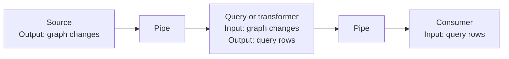

# Understanding schemas, ports, and pipes

[Design](computation-graph-design.md) |
[Configuration](computation-graph-configuration.md) |
[QoS and durable handoffs](computation-graph-qos.md) |
[Transactions](computation-graph-transactions.md)

This describes the current branch implementation, reviewed against `e46f6130`
on 2026-10-09. Suggested improvements below are **not implemented features**.

Read sections 1-2 for the overview, 3-4 for data and connection rules,
[5 for pipe choices](#5-the-five-pipe-families), and 6-8 for execution and limits.

## 1. The big picture

The three mechanisms answer different questions:

| Mechanism | Question it answers | What it does not do |
|---|---|---|
| **Schema** | What does this data mean, how is it represented, and is it valid? | Decide when or how reliably it is delivered. |
| **Port** | Where can this component send or receive data, and what does that connection require? | Store messages or perform the component's work. |
| **Pipe** | How does data travel between these ports: in what order, with what buffering and recovery? | Interpret business data or make the consumer's external actions transactional. |

The ComputationGraph joins these pieces and runs the components.



**The component changes the data; the pipe transports it.** Each connection must
have matching schemas at its two ends. A transformer can accept one schema and
produce another, but a pipe cannot perform that conversion for it.

A pipe carries a **change envelope**, not necessarily one record. An envelope
can contain several additions, updates, and deletions. Consequently, a capacity
of 100 means 100 envelopes, not 100 records or a fixed number of bytes.

## 2. What is built in, and what belongs to components?

| Responsibility | Who provides it? |
|---|---|
| Schema, record, envelope, port, and pipe interfaces | The ComputationGraph library. |
| Standard graph-change and query-row schemas | The library, with validators and conversion helpers. |
| A custom schema and its validation rules | The component author or a shared schema library. Multiple components can use the same schema. |
| A component's port names, directions, schemas, and required delivery guarantees | The component's fixed description, checked by the graph. |
| Which components connect, and which pipe/configuration each connection uses | The application or pipeline builder; the graph validates and establishes the connections. |
| Queuing, retained history, acknowledgements, and pipe closure | The chosen pipe implementation. The library supplies five families described below. |
| Durable storage | An explicitly supplied storage provider. Selecting a pipe does not silently install a database. |
| Business processing, saved component state, and external effects | The component, using any explicitly supported transaction/recovery facilities. |

These mechanisms are reusable, not hard-coded for each component. Custom pipes
implement `PipeProvider`; custom components use the same port/envelope contracts.
`DesiredPipe::External` describes a caller-supplied pipe, not a sixth built-in
delivery guarantee. Reconstructing it requires that external binding again.
The graph normally receives outputs from components and supplies their inputs;
components do not need to operate pipe senders/receivers themselves.
Ordinary source/query/reaction APIs use adapters and pipeline builders over this
runtime. Each DrasiLib has one root graph; ordinary queries have owned internal
QueryGraphs using these same mechanisms.

Pipes are in-process connections. Network protocols and network ingestion belong
to source/sink components; a durable pipe alone is not a durable network receiver.

## 3. Schemas: from a description to checked data

### The description and the checking code are separate

A `SchemaDescriptor` contains:

- An ID and a nonzero version.
- An encoding name: how to interpret the record's bytes.
- Nonempty definition bytes, written in a consistent form by the schema provider.
- A calculated fingerprint, which is a compact identifier, **not sufficient proof
  that two schemas match**.

Connections compare the **entire descriptor**, not just its name, version, or
fingerprint. Two definitions that mean the same thing to a person but have
different bytes do not match automatically.

A `Schema` combines that description with executable checking code,
`RecordValidator`. The validator checks record keys, encoding, image structure,
business constraints, and embedded identity where applicable. The graph does not
interpret arbitrary definition bytes as JSON Schema or infer a validator from them.

For example, a temperature schema could require a nonempty sensor ID and a numeric
reading with a stated unit. That rule belongs in its validator. The standard
graph-change schema understands Drasi graph changes; it does not automatically
enforce your application's required properties on every node.

**Trust boundary:** the library requires a validator and calls it, but cannot
prove its business rules are correct. Two providers claiming the same descriptor
must implement the same validation meaning.

### Records and changes

A record has a validated key, bytes that cannot be modified, and an image kind
(what those bytes represent):

| Image kind | Meaning |
|---|---|
| `Full` | A complete record. |
| `Patch` | Only the changes to apply; omitted fields are unchanged under that schema's rules. |
| `Partial` | Some known previous values, not a complete record or an instruction to update it. |

A `ChangeSet` is an ordered list of operations using **one schema**:

| Operation | Required content |
|---|---|
| Add | A full after-image. |
| Update by replacement | A full after-image; optional full or partial before-image. |
| Update by patch | A patch after-image; optional full or partial before-image. |
| Delete | A validated key; optional full or partial before-image. |

Construction rejects mismatched schemas or record identities and duplicate or
out-of-order operation numbers. It does not sort or repair invalid input. Operation
numbers need not be consecutive. An empty change set is allowed; it can accompany
an explicitly identified control event such as scheduled query work.

Validation happens when records/references and change sets are constructed.
Record fields are private and immutable afterward, so normal in-process routing
need not repeatedly decode every record. The graph still checks the envelope's
schema against the port at emission and delivery.

### The envelope around the data

`ChangeEnvelope` adds an event ID, producer stream, increasing sequence number,
optional timestamp, and optional source position. It also carries ancestry and
append-only annotations.

These identities have different purposes:

| Identity or position | Purpose |
|---|---|
| Record key | Which business record changed. |
| Change-set ID + operation number | Which particular change within a batch. |
| Envelope ID | Which logical event; the producer is responsible for uniqueness. |
| Stream + sequence | Ordering new emissions from one producer output. Gaps are allowed. |
| Retained journal position | Where a pipe stored an event and how far a consumer has handled it. |
| Source position | A connector or write-ahead-log position that the pipe preserves without interpreting; its presence alone proves no durability. |

Cloning an envelope shares the immutable event and existing annotations. Adding
an annotation to one branch does not change another branch. A transformer creates
a new event, usually with `derive`, rather than modifying its input. Recorded
ancestry follows a single input chain; it is not a complete history of every
input contributing to a multi-input computation.

### Storage and plugin boundaries

The standard data schemas are `drasi.graph-change` and `drasi.query-row`.
Their record encodings are separate from the envelope's storage/wire format.
A codec is the code that turns data into stored/transmitted bytes and back.

`EnvelopeCodec` explicitly writes a versioned JSON storage envelope. Decoding
requires registered executable schemas and rebuilds checked records/change sets.
Unknown or conflicting schemas fail. Its maximum encoded size is configurable.
Factories can supply custom schemas through `record_schemas()`; the factory
registry's codec includes the two standard schemas.
This is explicit registration, not automatic discovery through a global schema
service.

Native computation plugins use a separate binary envelope codec and versioned
plugin contract. Legacy plugins have their own adapters and wire format. There
is no universal automatic conversion between schema versions, and saving a
descriptor does not save its executable validator.

## 4. Ports and the checks required to connect them

A `PortDescriptor` has a name, an input/output direction, one schema descriptor,
and required pipe capabilities (delivery guarantees). It is a description, not a
queue, running task, or storage owner. Port names must be unique **within the component**,
including across its input and output ports.

Sources have outputs only; sinks have inputs only; transformers and queries have
both; services have no data ports. Port descriptions must remain fixed for a
running component instance. A change of interface requires an appropriate
replacement, not silently changing the description while processing.

Before establishing a connection, the graph checks:

1. Both component/port names exist, and the connection runs from output to input.
2. Their full schema descriptors match.
3. The pipe satisfies both ports' requirements and any graph-wide requirements.
4. The pipe has a finite nonzero capacity, compatible resources, and an ordering
   capability the graph supports.
5. A sink claiming only acceptance is not connected as though it confirms handling.
6. Stream ownership and graph structure are valid: no duplicate connection, data
   cycle, or conflicting producer-stream binding.

When a provider creates the actual pipe, the graph checks that its capabilities
match its earlier declaration. The provider supplies a sender, a single receiver,
and a separate `PipeControl` for closing, cancelling, and checking for pending
work. Retained and shared pipes also need their explicitly bound resources.
Declarations are checked promises; they do not
prove the implementation keeps those promises under every failure.

A complete graph requires connected declared ports and a stream binding for each
output. Incremental additions and explicitly incomplete topologies can retain
unconnected declarations; being declared does not mean ready to run.

**One port does not necessarily mean one connection.** An output can feed several
components, and an input can receive several producers. However, one producer
output cannot feed multiple input ports on the *same* component: separate queues
for that stream could undermine its ordering.

### What the capability names promise

| Capability | Meaning in the current implementation |
|---|---|
| `FifoPerStream` | Preserve each producer stream's send order; the producer/graph must submit it in sequence order. Not a global ordering of all producers. |
| `RankedEventOrder` | Select among the next available events from producers using event time and rank; a distinct alternative to the ordinary FIFO declaration. |
| `Backpressure` | Capacity pressure waits or fails explicitly rather than silently discarding. It is not a messages-per-second limit. |
| `RetainedHistory` | Keep a bounded history within the store's lifetime, which may be memory only. |
| `DurableAcceptance` | A successful send survives the storage provider's documented failure boundary. |
| `Replay` | Replay retained durable data. This capability currently requires `DurableAcceptance`; memory history can redeliver without advertising `Replay`. |
| `ExplicitAcknowledgement` | Delivery includes a separate, one-use means of confirming handling. |
| `Transactions`, `ExactlyOnce` | Names exist in the contract, but the current graph rejects pipes advertising them. No built-in pipe supplies these general transport guarantees. |

An input requiring durable acceptance cannot connect through a volatile bounded
pipe. The graph rejects the connection; it does not upgrade the pipe or relax
the requirement.

## 5. The five pipe families

**Volatile** below means lost when its in-memory owner/process is lost.
**Acknowledgement** means local handling confirmation, not proof of all downstream
or external effects. A **journal** is an ordered stored history; **QoS** stands
for quality of service.

| Family | Buffer arrangement | What happens when full? | Handling acknowledgement | Survives process restart? |
|---|---|---|---|---|
| Bounded | One queue per connection; count-only or opt-in byte-bounded | Producer waits | No | No |
| Broadcast | One queue per connection | Discard oldest queued envelope | No | No |
| Ranked input | One shared queue across producer connections | Wait, or discard incoming envelope, by configuration | No | No |
| Retained | One journal and one consumer-progress position | Wait for handling, or prune oldest history | Yes | Only with persistent store |
| QoS channel | One shared journal; separate progress for each subscriber | Wait for slowest required subscriber, or prune oldest history | Yes, per subscriber | Only in persistent mode |

### Bounded: the simplest waiting queue

`BoundedPipeConfig { capacity }` supplies FIFO (first-in, first-out) delivery and
backpressure using a bounded Tokio channel. It has no history, replay, or
acknowledgement.

Capacity becomes available when an envelope is **received**, not when processing
finishes. A successful send only confirms enqueueing. Use it when temporary
in-process buffering is enough and losing that queue on a crash is acceptable
or recoverable elsewhere.

`ByteBoundedPipeConfig { capacity, max_bytes }` adds an **opt-in serialized-byte
budget** to the same FIFO and lifecycle contract. It does not change existing
`BoundedPipeConfig` construction or its saved configuration shape. The desired
pipe configuration is:

```json
{"ByteBounded": {"capacity": 128, "max_bytes": 1048576}}
```

The charge is the exact complete `BinaryEnvelopeCodec` representation, including
record payloads, identifiers, schema, system metadata, annotations and lineage.
Sizing does not allocate an encoded payload copy, although frame construction
uses temporary metadata/operation collections. It needs no decoding registry.

Both count and byte capacity must be available before acceptance. An envelope
larger than the entire budget is allowed **only as an exclusive singleton**:
it reserves the full budget until received or discarded. A pending send cannot
hold up graceful draining, and cancelling a wait releases its reservations.
Received deliveries release capacity even if downstream handling has not finished.

`capacity` must be positive and fit Tokio's channel limit. `max_bytes` must be in
`1..=min(tokio::sync::Semaphore::MAX_PERMITS, u32::MAX)` (at most 4,294,967,295
bytes on a 64-bit host). Invalid limits fail explicitly. Topology-as-data exposes
the `ByteBounded` profile, envelope `capacity`, and `maxBytes`.

This is **not a heap or process-RAM limit**: allocation overhead, unaccepted sender
arguments, downstream work and component-local state are not charged as queued
data, and the oversized singleton can exceed the nominal budget. Admission
reservations may temporarily consume quota before acceptance. Independent fan-out
pipes each charge full wire size even when their payload allocations are shared.
Retained/non-shared QoS budgets are configured on their journal owners, as
described below. This FIFO option does not change ranked or broadcast admission.

### Broadcast: keep moving and accept loss

`BroadcastPipeConfig` adds a `lag_policy`. When full, it removes the oldest
queued envelope so the new one can be accepted.

`Report` returns a `Lagged` error to the receiver; the graph treats that as a pipe
failure, not a successful delivery. `SkipWithNotification` logs/counts skipped
envelopes and continues. Neither option can recover the removed data.

Despite the name, a `BroadcastPipe` has **one receiver**. Sending to several
components normally means several graph connections and queues. This differs
from the shared QoS journal below. Use it only where missing older events is an
explicitly acceptable tradeoff.

### Ranked input: combine several sources predictably

`RankedInputPipeConfig` binds to a shared `RankedInputQueue`. Its settings identify
the queue, shared capacity, source rank, optional source identity, and
`drop_when_full`. Each rank has one live binding.

The queue preserves producer progress while comparing the earliest admitted
event for each producer by timestamp, then rank, then sequence. A later sequence
with an earlier timestamp cannot jump ahead of that producer's earlier work.
It never waits for unseen events from an idle source.

Wrapped source events must contain their authoritative source identity/sequence
and timestamp. Native input uses its envelope sequence and must supply event time.
Missing required metadata fails rather than inventing an order.

Ordinary query pipelines use this shared inbox. Source rank comes from the
query's ordered source list; scheduled notifications have their own rank.
The **source's** dispatch mode selects waiting versus dropping on a full inbox;
the query's own dispatch mode controls its outgoing results.

Lossy ranked input discards the **new incoming** envelope, unlike broadcast's
oldest-envelope eviction. It counts the discard but returns a successful receipt:
acceptance into an explicitly lossy policy does not imply eventual delivery.

### Retained: one consumer can resume unfinished deliveries

`RetainedPipeConfig` names a store resource, capacity, durability, retention
policy, and gap policy. The supplied store must agree with the declaration.

`MemoryEnvelopeStore` keeps history and progress only while that object lives.
`IndexedEnvelopeStore` uses supplied persistent storage that can commit related
updates together, plus a registered envelope codec. The durable store requires
an owner that can finish pending storage work during awaited cleanup.

There is one consumer-progress position and one outstanding delivery. Dropping
its acknowledgement, or reporting failed handling, does not advance progress.
It becomes eligible for redelivery while still retained. A new binding invalidates
old binding handles; independent consumers must not share this single cursor.

`Backpressure` waits if making space would remove unhandled work.
`PruneOldest` permits that loss. A missing position then fails under `Strict`,
or is explicitly skipped and logged under `SkipWithNotification`.
Acknowledged history can remain until capacity pressure removes it.

By default, persistent retained storage loads its committed window once,
validates its records and progress, and caches serialized bytes. It can instead
use `IndexedJournalOptions::page_limits` to scan and cache bounded pages.
Reducing capacity or a byte quota on reopen preserves the older window until
its obligations can safely be removed.
Failed/cancelled loading cannot install a partial cache; uncertain writes require
cleanup and reconstruction, not reuse of cached state.

This is a lower-level single-consumer facility, not automatic duplicate
suppression for retried producer sends.

`MemoryEnvelopeStore::new_with_byte_budget`,
`IndexedEnvelopeStore::try_new_with_byte_budget`, and
`IndexedEnvelopeStore::try_new_with_options` configure optional journal-byte
limits without changing `RetainedPipeConfig`. They charge full binary-envelope
size even when persisted records use the JSON envelope codec. A budgeted append
plans all count/byte pruning before mutation; under backpressure, every removed
record must already be handled. An oversized record requires an otherwise empty
window. Explicitly lossy retention may prune pending records and report gaps.

### Journal byte budgets and bounded history pages

Non-shared QoS has the same optional byte policy through
`QosChannel::volatile_with_byte_budget` and
`QosChannel::persistent_with_options`/`QosJournalOptions::max_bytes`. Each record
is charged once for the journal, regardless of subscriber count. Client admission
charges the derived accepted envelope, including its added identity/progress,
not just the smaller client input. Disconnect never releases an obligation.
Shared transactional QoS still reserves count capacity before output size is
known; byte budgets are not supported for that profile.

`IndexedJournalOptions::page_limits` and `QosJournalOptions::page_limits` select
`OutboxPageLimits { max_records, max_bytes }`, with positive limits. Unlike the
binary admission quota, a page's byte limit counts its **stored payload bytes**.
One oversized stored record is returned alone to ensure progress. Memory and
both RocksDB outbox implementations support the bounded API; an unsupported
provider returns `NotSupported`, never a full-history read disguised as a page.
Scoped/group wrappers preserve operation ownership and journal namespaces.

Opt-in owners retain one bounded payload page, not a map of every payload behind
the paged API. Every retained record is still checked on startup, including late
corruption and receipt/progress consistency. Normal cache misses read additional
pages. Legacy QoS retries may scan the retained window with bounded reads;
admission/output-replay receipts remain independently bounded. Shared
transactional QoS currently retains its eager payload cache.

These are not constant-memory or process-RAM guarantees. Startup scans all history;
page replacement/validation has transient buffers; the provider has its own
iterator, decompression and block-cache costs; one record may exceed a limit.
Optional binary-byte accounting also keeps one size per retained record.
Page calls are not a multi-call snapshot: the journal owner must exclude foreign
writers while reconstructing or reading its history.

Limits are explicit resource-owner construction policy. Existing pipe definitions
and persisted envelope formats are unchanged; applications must reconstruct
these options themselves. The standard Host/Server resource recipes do not
automatically persist or restore these new owner policies.

**What "durable" survives:** the Rust storage interfaces now expose
`StorageDurability`, with separate declarations for process restart, power loss,
and permanent loss of local storage. Unknown declarations cannot satisfy a strong
requirement. Memory stores promise none; the current RocksDB query/retained
provider promises process restart but not power-loss survival. Redb state stores
commit with `Immediate` durability and promise process/power-loss survival when
the storage hardware honors sync. Neither promises recovery after losing the
local storage. Consumer-progress wrappers preserve their store's declaration.

These descriptions do not change retention policy or make independent writes
atomic. Optional `RecoveryRequirement` assertions now check a consumer's entire
input path against actual component and storage declarations. They distinguish
acceptance, replay, committed processing, publication and external effects.
`recovery_report` explains incompatible components/connections and identifies the
graph revision assessed. Forwarding these descriptions across plugin ABIs remains
unfinished; the old `durable` setting alone does not select or prove a failure model.

An assertion is a check, not an instruction to add storage or recovery machinery.
Unknown plugins and ordinary subscription transports cannot satisfy it. A source
retaining input until a real atomic consumer commits may cross a stateless,
identity-preserving intermediary using memory queues. It must use that consumer's
actual progress resource; matching names, hidden timers or a second converging
branch are insufficient. Other branches are checked separately, and committed
internal processing still does not promise once-only external effects.

### QoS: shared history with independent consumers

With optional `SharedStorageGroup`, a built-in query, durable middleware or linear
transaction can save its processing and outgoing journal appends together.
Each pipe names the graph-owned storage resource as well as its journal.
Space is reserved before processing, leaving consumers free to acknowledge
while the producer waits. Ordinary channels retain separate transactions.
See [shared commit setup and limits](computation-graph-qos.md#shared-produceroutput-commits).
This is not a transaction across arbitrary components or external effects.

A `QosChannelDefinition` specifies one producer stream, capacity, volatile or
persistent storage, retention policy, and named subscribers. Each graph edge
uses a `QosPipeConfig` identifying its subscriber and gap policy.

The graph validates that the grouped edges share one producer output and have
distinct subscribers. It publishes each event **once** to their shared journal.
Each subscriber has its own progress and at most one outstanding delivery.

With `Backpressure`, the slowest required subscriber determines when space can
be reclaimed. A disconnected/stopped subscriber still has an obligation.
Removing an edge does not silently waive it: explicit retirement or an appropriate
channel-definition change is required. A retired identity cannot be reused as
though it were a new subscriber.

With `PruneOldest`, a lagging subscriber either fails on a gap or explicitly
skips it. A persistent journal can therefore be deliberately lossy: durability
does not mean infinite retention.

On persistent reopen, existing subscriber progress is preserved. New subscribers
can start at the retained beginning (`Earliest`), current head (`Latest`), or after
a supported journal position (`After`). This is not a request to recover already
evicted history.

Persistent publishing commits the event and acceptance metadata together.
Acknowledgement persists subscriber progress in a separate short transaction.
An identical producer retry still present in history returns its previous
receipt; changed, expired, or regressed retry data is rejected. Volatile retry
checking requires the same shared immutable event and matching context, not
merely newly constructed data that looks equal.

An optional `enable_replay` setting extends persistent retry checks to a
component's saved logical output, even when restart gives it a new transport ID.
Its bounded receipts can survive removal of already handled payloads. A changed
output, expired receipt or different producer/query generation is rejected, not
accepted again. Graph and query outputs must carry their own persistent producer
identity; ordinary channels still use the existing transport-based checks.
Built-in durable producers also save the required replay-enabled destinations
before processing; that list cannot change while output is pending. It identifies
the actual journals, not just resource names. This is separate from client
admission below and does not make separate stores commit together. See
[output replay receipts](computation-graph-qos.md#opt-in-receipts-for-replayed-component-output).

Persistent QoS also keeps decoded retained envelopes in memory. Disk persistence
does not turn it into a disk-only buffer. `QosChannel::durability()` preserves the
constructed storage provider's failure-survival declaration; it does not infer
power-loss safety from the channel's `durable` flag. See the
[QoS guide](computation-graph-qos.md) for construction and resource recipes.

An optional Rust admission service now lets clients register a producer session
and submit increasing event numbers into this same journal. It saves the input
and retry receipt together, rejects conflicting/expired retries, and retains
bounded receipts after handled payloads are removed. It requires actual storage
support for the selected failure scope. A Rust source can expose `SourceAdmission`
so the graph validates input and commits it directly into its outgoing QoS
channel, without a second source queue or another send. All branches must use
that channel; its bounded mailbox also handles session and receipt operations.
Stop closes queued requests, while interrupted writes require reconstruction
before their outcome is resolved. Rebuilt native HTTP/gRPC plugins expose it
through separate versioned protocols and reject old-style submissions on a
durable source. Unbound native sources retain their existing fast behavior;
legacy source plugins have not adopted this service. See the
[admission contract](computation-graph-qos.md#opt-in-producer-admission-rust-service)
for limits, recovery and the remaining integration boundary.

## 6. Follow one envelope through the graph

1. The producer builds validated records/change sets and emits an envelope on a
   named output, using that output's stream and a new increasing sequence.
2. The graph checks the output port, schema, stream, and sequence. It checks all
   outputs in a returned batch before forwarding that batch.
3. The pipe accepts, waits, or fails according to its policy. A receipt confirms
   acceptance only; the lossy-policy exceptions above still apply.
4. The graph receives a `Delivery`, checks its input schema and whether its
   acknowledgement matches the negotiated contract, then calls the component.
5. A transformer may emit zero, one, or several outputs. The graph forwards them,
   calls its delivery-completion hook, and processes any declared continuations.
6. Only after that local work succeeds does the graph acknowledge the input, if
   the pipe supplied an acknowledgement.

For a sink, successful `handle` means either **accepted** or **handled**, as
declared by the sink. A legacy reaction adapter that merely enqueues work cannot
be treated as though the external reaction finished. The graph rejects that
acceptance-only sink behind an acknowledgement-requiring pipe.

For a transformer, forwarding success means downstream **acceptance**, not that
every downstream consumer has finished. This is why a stateful transformer needs
its own committed state/input progress/recoverable output, not just an upstream
acknowledgement.

### Branching and merging

Ordinary fan-out sends sequentially in connection declaration order. Payloads
are shared, but a slow branch can delay later branches and the producer.
If some branches accept before another fails, the error records the prior
acceptances. There is no automatic rollback or retry of that partial fan-out.
QoS avoids repeated journal appends for its subscriber group, not the need for
explicit subscriber handling.

With persistent producer output and opt-in logical receipts, retrying after a
partial handoff can reuse an earlier branch's acceptance rather than append
again. Durable middleware, linear transactions and tracked queries save a bounded
list of required replay-enabled destinations and requeue pending output on resume.
They retry the whole batch safely within the receipt window, rather than store
each branch's completion separately. Pending output follows a replacement's new
configuration under the same component ID, ports, journal and subscriber.
Removing/changing those destinations while output is pending rejects; damaged
membership records and automatic query reset cannot erase the obligation.
Plugin SDK adoption and same-domain publication participation remain unfinished.

For ordinary multi-input components, arrival order is the default.
`EventTimeAcrossStreams` can select among currently available heads without
reordering a producer's stream or waiting for a quiet source. Untimed heads
limit this selection; missing times are not invented. This host-level merge is
separate from the ranked pipe's shared queue.

### Failure and recovery are separate from transport

A crash after a side effect but before its handling checkpoint can cause that
effect to repeat. Durable pipes preserve work; they do not make arbitrary HTTP
calls or database writes happen exactly once.

An uncertain durable commit returns an explicit unknown-acceptance or
unknown-acknowledgement error. Interrupted storage owners can reject further work
until awaited cleanup and reconstruction. Treating an unknown result as definite
rejection and blindly retrying is unsafe.

Queries and `TransactionTransformer` can atomically save input progress, state,
and recoverable output using a suitable provider. A transaction transformer's
internal steps exchange data directly, **without pipes between the steps**.
Its transaction does not extend across an arbitrary graph or an external service.

## 7. Closure, reconfiguration, and observation

**Close** rejects new sends and allows accepted work to drain.
**Cancel** invalidates operations promptly and may discard volatile data.
Retained/QoS cancellation does not mark unhandled journal entries as handled;
their survival still depends on the store lifetime and retention policy.
Neither action reverses work already performed.

The graph separately tracks received work still being processed. Safe draining
therefore requires both the pipe's `is_idle()` check and completion of local
processing, not just an empty queue or a metric reading. A consumer that never
acknowledges can keep a lossless retained pipe from draining.

Rebinding creates fresh endpoints; retained resources can preserve progress.
Each binding has a version ("generation"); old handles cannot acknowledge a
replacement binding's work. Graph-owned resources are cleaned up by the graph;
borrowed resources remain their owner's responsibility. Shutdown must be awaited
to finish asynchronous cleanup.

Saving topology saves definitions and resource recipes, not queued envelopes or
processing progress. Persistent configuration and persistent data are separate.

Readiness and neighbour messages use a **separate control mechanism**, not data
envelopes sent through these pipes. A full data queue does not itself fill the
control queue, although a monopolized controller can still delay servicing it.

Bounded (including byte-bounded), broadcast, and ranked pipes expose accepted, delivered, discarded,
blocked-send, current-depth, and maximum-depth counters. These are diagnostic,
not atomic proof of processing or drain completion. Retained and QoS pipes do
not currently supply the same generic metrics; `QosChannel::progress()` instead
exposes journal head, earliest retained position, subscriber progress, retirement,
and producer/source position.

## 8. Known limits and worthwhile improvements

The [opt-in resilience and recovery plan](computation-graph-reliability-plan.md)
records the completed native-framework admission, delivery, handover and
restoration services. Those services remain opt-in and do not automatically
upgrade every connector. The following limits concern current runtime capacity
and declared guarantees, not missing foundation services.

| Current limit | Consequence and improvement opportunity |
|---|---|
| **No pipe rate limiter** | Capacity limits buffered envelopes, not throughput. Add optional asynchronous admission/delivery limits with explicit rate and burst size. `governor`, already used by the test framework, is a candidate. Preserve ordering, cancellation, acknowledgements, and shared QoS accounting. |
| **Native CPU parallelism is not automatic** | Per-node work budgets already bound immediately ready work and preserve controller progress. Native nodes in one graph still share a controller; measure CPU-heavy workloads before adding independently scheduled execution. Rate limiting is a separate policy. |
| **Byte quotas are not memory budgets** | Byte-bounded FIFO charges complete serialized envelopes and permits one exclusive oversized item. Other pipe profiles remain count-bounded; component state, allocation overhead and pending/downstream work remain outside these quotas. Retained/QoS budgeting must follow journal and acknowledgement lifetimes. |
| **Persistent history also occupies memory** | Retained and QoS owners can opt into bounded payload pages; defaults cache the full window. Shared QoS holds the group transaction across startup validation and each refill. Startup still scans every record. Byte accounting, progress, receipt metadata and backend buffers need separate memory allowances. |
| **Acknowledged delivery is serial per consumer** | Retained/QoS allow one outstanding item per consumer. This simplifies correct progress but can limit throughput. Any windowed/batched acknowledgement extension must prevent later completion from skipping unfinished earlier work. |
| **Schemas require exact agreement** | No automatic version compatibility, field conversion, or migration of stored envelopes. Use explicit conversion components now; define upgrade and recovery rules before adding automatic compatibility. |
| **No automatic end-to-end recovery promise** | Every producer, intermediate stateful component, pipe, and consumer must preserve its own boundary. A volatile ingress or acceptance-only reaction can break an otherwise durable path. Verify the actual complete pipeline. |
| **Observability differs by pipe** | Add consistent throughput, waiting-time, retained-depth, and subscriber-lag reporting. Distinguish accepted, dropped, delivered, handled, and durably handled rather than presenting one misleading success count. |
| **Extensibility still depends on trusted implementations** | A matching descriptor/capability declaration cannot prove validator correctness, storage durability, or truthful handling completion. Keep shared conformance scenarios for custom providers and both in-process and plugin paths. |

Foundation coverage is useful evidence, not whole-system qualification. In
particular, lossless versus lossy operation, cancellation, restart, storage errors,
and slow/missing consumers need distinct expectations. See the
[backlog's foundation evidence](computation-graph-backlog.md) for current coverage
and remaining qualification work.

## 9. Where the implementation lives

All paths below are within `drasi-lib`; the main public types are exported from
`drasi_lib::computation::v1`.

| Subject | Source |
|---|---|
| Schema/record/change validation; envelopes | [data.rs](../src/computation/v1/data.rs), [envelope.rs](../src/computation/v1/envelope.rs) |
| Ports, requirements, capability checks | [ports.rs](../src/computation/v1/ports.rs) |
| Send/receive, receipts, acknowledgement contracts | [pipe.rs](../src/computation/v1/pipe.rs) |
| Providers/control; bounded and broadcast | [bounded_pipe.rs](../src/computation/v1/bounded_pipe.rs), [broadcast_pipe.rs](../src/computation/v1/broadcast_pipe.rs) |
| Ranked inputs and ordinary pipeline assembly | [ranked_pipe.rs](../src/computation/v1/ranked_pipe.rs), [pipeline.rs](../src/computation/v1/pipeline.rs) |
| Single-consumer history and storage | [retained_pipe.rs](../src/computation/v1/retained_pipe.rs), [retained_store.rs](../src/computation/v1/retained_store.rs) |
| Shared subscriber history | [qos_pipe.rs](../src/computation/v1/qos_pipe.rs) |
| Storage/plugin encoding; standard data schemas | [codec.rs](../src/computation/v1/codec.rs), [binary_codec.rs](../src/computation/v1/binary_codec.rs), [graph_codec.rs](../src/computation/v1/graph_codec.rs), [query_codec.rs](../src/computation/v1/query_codec.rs) |
| Graph checks, routing, and binding lifecycle | [graph.rs](../src/computation/v1/graph.rs), [controller.rs](../src/computation/v1/graph/controller.rs), [topology.rs](../src/computation/v1/graph/topology.rs) |
