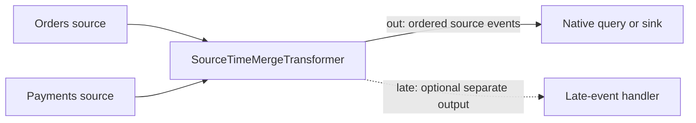

# Merge sources by source-change time

`SourceTimeMergeTransformer` is an opt-in native transformer under
`drasi_lib::computation::v1`. It combines declared source streams into one
nondecreasing source-time stream, including reordering events from the same
source. It is available without a feature flag.



This is a processing component, not a pipe option or a change to ordinary query
scheduling. `EventTimeAcrossStreams` still compares only available producer
heads and preserves their sequence order. To use the merger, explicitly place
it before the native query or sink that needs its ordered output.

## Source-time contract

Every input must have `SystemMetadata::timestamp()` set to the **time the data
changed at the source**, on a comparable time basis across sources. The source
adapter must supply that value. `GraphChangeCodec::encode_source_event` carries
`SourceEventWrapper.timestamp` into this field; callers of `encode_change` must
provide its timestamp argument.

Missing timestamps are errors. The merger never substitutes receipt time,
processing time, a record property or a source sequence. It cannot detect an
adapter falsely labeling receipt time as source time, or correct clock skew
between independently clocked sources.

Inputs must arrive in each producer's increasing logical sequence order;
timestamps within that sequence can move backwards. The merger orders retained
envelopes by timestamp, then the source's index in `sources`, then logical input
sequence. Timestamp precision is preserved. Equal-time events are not late;
the tie rule applies to events buffered together, not unseen events that arrive
after an equal-time output.

An envelope is indivisible: operation order within its change set is preserved.
The merger does not split a multi-operation source event into independently
timed records. Query result envelopes and scheduled query control notifications
are not supported inputs.

## Configuration and construction

All input and output ports use the supplied executable `Schema`. The usual
graph-change schema is `GraphChangeCodec::schema()`. Other source-event schemas
can be supplied directly.

```rust,ignore
use std::num::NonZeroUsize;
use drasi_lib::computation::v1::*;

let definition = SourceTimeMergeDefinition {
    graph_id: "orders-processing".into(),
    id: ComponentId::try_new("merge")?,
    sources: vec![
        StreamId::try_new("orders/out")?,
        StreamId::try_new("payments/out")?,
    ],
    output_stream: StreamId::try_new("merge/out")?,
    late_output_stream: None,
    reorder_window_ms: 2_000,
    max_wait_ms: 5_000,
    idle_timeout_ms: Some(10_000),
    max_buffered_events: NonZeroUsize::new(10_000).expect("positive limit"),
    max_buffered_bytes: NonZeroUsize::new(16 * 1024 * 1024).expect("positive limit"),
    late_policy: LateEventPolicy::FailAndRetain,
};
let merger = SourceTimeMergeTransformer::new(definition, GraphChangeCodec::schema())?;
let observations = merger.subscribe();
```

Supply the instance using the graph builder's `.transformer(Box::new(merger))`
or a native component batch. Connect each declared producer output to the
merger's `in` port. Bind `out` to `definition.output_stream` and connect it to the
next component's input. With routing enabled, bind and connect `late` too.
All declared ports must connect. This API supplies a constructed native
component; it does not install a standard factory or a Server/plugin
configuration recipe. `configuration()` exposes its immutable definition for
inspection, not automatic reconstruction.

| Setting | Meaning |
|---|---|
| `sources` | Fixed, unique input streams, 1 through 256; also equal-time tie rank |
| `reorder_window_ms` | Permitted backwards movement behind each active source's greatest observed timestamp; zero is allowed |
| `max_wait_ms` | Positive maximum event residence before it becomes eligible to emit |
| `idle_timeout_ms` | Optional positive inactivity interval; `None` keeps quiet sources in the early-release calculation |
| `max_buffered_events` | Positive retained-envelope count, including held input and unconfirmed output |
| `max_buffered_bytes` | Positive total complete binary input-envelope bytes, including context, lineage, held and pending input |
| `late_policy` | `FailAndRetain` by default; explicit `Route` or `Discard` alternatives |
| `late_output_stream` | Required exactly for `Route`; distinct from every other configured stream |

Graph/component/output identifiers are limited to 256 bytes. Each source's
normalized progress key plus serialized producer identity is limited to 4096
bytes. These bound persistent identity bookkeeping.

The byte quota is **not total process memory**: tree nodes, source receipts,
observers, output metadata, serialization buffers and backend caches are
additional costs. An individual oversize envelope is rejected rather than
allowed to exceed the quota. Capacity exhaustion returns
`SourceTimeMergeError::Capacity` without admitting or acknowledging that input.
There is no internal overflow queue, implicit eviction or automatic retry.
Its upstream owner must retain/replay rejected input if lossless recovery is
required. Size the window for the expected input rate and wait interval.

## Release and waiting

An event may be released early when its time is no later than **every active
source's highest observed time minus `reorder_window_ms`**. A source with no
observed event blocks that early release until it becomes idle, if configured.
Idle tracking starts at activation and refreshes only on new admissions, not
duplicate retries. A returning source becomes active again.

Alternatively, expiration of any buffered event's `max_wait_ms` makes that
event and all earlier buffered events eligible. Output remains time-ordered.
Local monotonic time controls these waits only; it never supplies event time.
If all sources are idle, the residence deadline still applies; idleness is not
a watermark claiming completeness.

The graph drives timer wakeups while sources are quiet and drains buffered work
after finite sources exhaust. The merger emits at most one envelope per
continuation and waits for output acceptance before continuing. Thus
`max_wait_ms` is an **eligibility bound, not a delivery deadline** under
downstream backpressure or a stopped graph.

There is no explicit source-watermark protocol and no per-source exhaustion
watermark. Reorder windows, idleness and maximum waiting make bounded-lateness
tradeoffs; they cannot guarantee knowledge of all future source events.

## Late events and monitoring

An input is late only when its timestamp is strictly less than the last
main-output timestamp.

| Policy | Result |
|---|---|
| `FailAndRetain` | Retain the admitted event, return typed `SourceTimeMergeError::Late`, and block further processing/start until explicitly resolved |
| `Route` | Send the event on `late`, annotated with `drasi.time-merge.late-after`; never insert it into `out` |
| `Discard` | Explicitly acknowledge/drop it, increment counters and emit a warning |

Routing and discarding do not move the main-output time frontier backwards.
The late outlet is in late-arrival order, not a second sorted stream.

`subscribe()` returns a coalescing watch receiver of
`SourceTimeMergeSnapshot`: running/persistence state, buffer count/bytes,
main-output frontier/count, late/discard/retry counters and the held envelope.
The main-output count includes a prepared, unconfirmed emission. Retry counts
are local to the constructed instance. Observations are not a durable event
history or a downstream completion acknowledgement. Processing errors also
surface through the normal graph component failure/inspection path; direct
callers can downcast the returned `anyhow::Error`.

To explicitly abandon a held event, stop the owner, inspect/export the held
envelope, then call `discard_held_event().await`. It removes only that event and
keeps its admission receipt, other buffered input and the output frontier.
Restart then resumes the remaining stream. With a graph-owned instance, await
graph cleanup and release that graph before constructing an administrative
owner against the same storage. Do not open a competing storage owner.
There is no automatic correction of a query's already-published state.

## Durability and recovery boundaries

`new` retains state across clean stops of the same object but not reconstruction
or process loss. `new_durable(definition, schema, provider).await` requires its
own persistent Core transaction owner with persistent checkpoints and async
cleanup. It rejects volatile providers and shared transaction groups.

Admissions, source receipts, buffered input, output time frontier, held input,
producer identities and unconfirmed output are saved atomically. Successful
buffer-only processing commits before the graph acknowledges input. Stop
quiesces storage; interrupted mutations and uncertain commits fence the owner
until cleanup and reconstruction. Reopen validates the exact configuration,
schema, receipt identities, counts, bounds and pending-output relationships.
It does not silently reset damaged or incompatible state.

An unconfirmed output replays with the same producer incarnation and logical
sequence but a new transport identity/sequence. Main and late outputs have
independent logical sequences. The original payload stays shared in memory;
source identities, source times and context remain in the output and lineage.
Downstream queries checkpoint the merger's immediate producer progress, not
the now-reordered original source sequences.

Every durable output branch must negotiate durable acceptance, replay, FIFO,
backpressure and explicit acknowledgement. The merger releases an output only
after **all branches accept it**, not after downstream business effects finish.
For deduplication across a crash between acceptance and confirmation, use
separate-store `QosChannel` journals with `QosRecoveryOptions::Replay`.
Their actual tracked destination membership stays pinned while any buffered,
held or unconfirmed work remains. Durable pipes without replay receipts may
redeliver duplicates; this transformer does not claim exactly-once external
effects. Input loss before admission still requires upstream retention.

Each source retains the exact latest admitted retry receipt. The same logical
input/content is a no-op; conflicting content or changed producer identity is
an error. Older receipts fail explicitly rather than being silently skipped.
Explicit persistent producers must start at logical sequence one and advance
consecutively. Explicit volatile producer ancestry cannot be used to claim
durable recovery.

Reconstructing starts a fresh full residence wait for buffered events and a
fresh inactivity interval; downtime does not manufacture source-time progress.
Clean stop/start of the same object keeps existing residence deadlines.
Durable mode writes a **whole bounded snapshot** on each state transition,
including output confirmation. This favors straightforward atomic recovery,
not large-window disk throughput: serialization and write cost grow with the
retained buffer. Choose practical bounds and measure with the actual backend.

## Focused verification

From the Core repository root:

```bash
cargo test --locked -p drasi-lib --test computation_time_merge
cargo test --locked -p drasi-lib --no-default-features \
  --features computation-rocksdb-tests --test computation_time_merge
```

These cover source-time ordering, equal-time ties, exact wait/idle boundaries,
buffer quotas, late policies, query provenance, both Tokio flavors, quiet and
finite producers, backpressure cancellation, RocksDB reconstruction, uncertain
commit/cancellation fencing, output replay and damaged snapshots.
