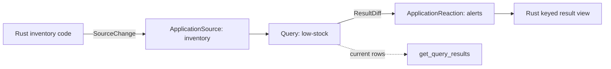
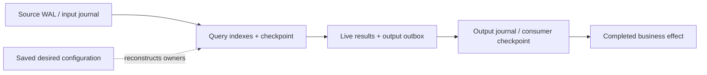

# Developing Rust applications with drasi-lib

**Implementation snapshot: 9 October 2026**

For engineers changing Drasi itself, the separate
[ComputationGraph maintainer's guide](../computation-graph-maintainers-guide.md)
explains runtime design and implementation ownership.

## Drasi in your application

Drasi maintains the answers to queries as data changes. A query can join data
from several systems, detect a condition, maintain a total, or notice that a
condition has remained true for a specified time. Your application receives
the changes to the answer rather than repeatedly fetching and comparing whole
datasets.

**drasi-lib embeds that capability in a Rust process.** You supply sources,
queries and consumers, choose storage, and control their lifecycle. Drasi Server,
Kubernetes and a separate Drasi service are not prerequisites. Database
connectors and output integrations live in separate component crates; the
library supplies the runtime and the contracts that connect them.

The runtime in this branch is **ComputationGraph**. It can run the familiar
source-query-reaction arrangement, or an explicitly connected graph containing
queries and other processing components. These are two ways to assemble the
same runtime, not competing query engines.

This guide explains those choices through **Stockroom**, a complete application
that maintains a low-stock inventory view. Its runnable companions include
ordinary components, an explicit graph, saved query state, and recovery of an
unfinished alert. Smaller alternatives illustrate capabilities the inventory
application does not need. Read the guide in order for the concepts, or use the
contents to return to a particular decision.

The examples target `agentofreality-parallel-computation-graph`, where
`drasi-lib` is version `0.9.2`. Use matching checkouts of the component crates;
do not assume these development APIs exist in an arbitrary published release.
The guide assumes familiarity with Rust, async code and Cargo, but not Drasi's
Rust interfaces.

## Terminology

| Term | Meaning in this guide |
|---|---|
| Element | A node or relationship, identified within a source, with labels and properties |
| Source | A component that supplies changes to elements or other records |
| Continuous query | A query whose current results are maintained as inputs change |
| Result difference | An addition, update, deletion or aggregation change to those results |
| Reaction | An ordinary Drasi plugin that consumes query result changes |
| Bootstrap | Loading the starting data before continuing with changes |
| ComputationGraph | The runtime owner of components, their connections, resources and lifecycle |
| Native component | A component using the graph's envelope/port contracts directly, rather than an ordinary source/reaction adapter |
| Transformer / sink / service | A component that changes data / handles data / runs an activity without data ports |
| Port / edge / pipe | A named input or output / a connection between ports / the transport implementing that connection |
| Envelope / stream | One identified group of changes and its metadata / an ordered sequence produced by one output |
| Checkpoint | A saved processing or handling position; its owner determines what completion it proves |
| Outbox / journal | Saved query output awaiting replay / retained transport entries and their progress |
| Admission / handling | Accepting responsibility for input / completing the work promised by a consumer |
| Recovery domain | The actual storage owners and components whose saved state must remain consistent |
| Desired / observed state | What the application requests / what the runtime has actually constructed and started |
| Factory / resource | A reconstructible component constructor / a supplied service such as storage or credentials |
| Quiesce / deprovision | Park processing at safe boundaries / permanently remove component-owned state |

An **instance** is a `DrasiLib` owner. A **generation** identifies one incarnation
of a component within it. A **row signature** identifies a query result row;
it is not the JSON value of that row. These distinctions become important when
components are replaced or work is replayed.

## Contents

- [A Rust project and a complete example](#a-rust-project-and-a-complete-example)
- [The application model](#the-application-model)
- [Modeling input](#modeling-input)
- [Writing continuous queries](#writing-continuous-queries)
- [Normalizing incoming data](#normalizing-incoming-data)
- [Consuming results correctly](#consuming-results-correctly)
- [Assembling an explicit graph](#assembling-an-explicit-graph)
- [Choosing queues, ordering and backpressure](#choosing-queues-ordering-and-backpressure)
- [Making state survive a restart](#making-state-survive-a-restart)
- [Coordinating bootstrap and replay](#coordinating-bootstrap-and-replay)
- [Recovering native input and unfinished output](#recovering-native-input-and-unfinished-output)
- [Completing effects and maintaining consumer state](#completing-effects-and-maintaining-consumer-state)
- [Preserving source transactions](#preserving-source-transactions)
- [Operating and changing a running application](#operating-and-changing-a-running-application)
- [Factories, resources and saved applications](#factories-resources-and-saved-applications)
- [Writing ordinary sources and reactions](#writing-ordinary-sources-and-reactions)
- [Extending native processing](#extending-native-processing)
- [Credentials, secrets and provider integration](#credentials-secrets-and-provider-integration)
- [Observing the application](#observing-the-application)
- [Errors, cancellation and cleanup](#errors-cancellation-and-cleanup)
- [Choosing a production boundary](#choosing-a-production-boundary)

## A Rust project and a complete example

The checkout's `rust-toolchain.toml` selects Rust **1.95.0**, rustfmt and Clippy.
Install Rust through rustup and a C/C++ toolchain: Xcode Command Line Tools on
macOS, build-essential on Debian/Ubuntu, or Visual Studio C++ Build Tools on
Windows. RocksDB builds can additionally require CMake and libclang. The
in-memory example needs no database, Docker or jq.

Use an existing matching checkout, or obtain this branch:

```sh
git clone --branch agentofreality-parallel-computation-graph \
  https://github.com/drasi-project/drasi-core.git
cd drasi-core
rustup show
cargo run --locked -p drasi-lib --example stockroom -- basic
cargo run --locked -p drasi-lib --example stockroom -- graph
```

Both modes insert a product with quantity 3, update it to 2, delete it, and check
the resulting view. The complete implementation is
[`stockroom.rs`](../../examples/stockroom.rs), including imports, component
implementations, startup waits, result handling and cleanup. The excerpts below
come from that application or explicitly identified alternatives; they are not
instructions to assemble an application from disconnected fragments.

For an independent binary beside `drasi-core`, the matching manifest is:

```toml
[package]
name = "stockroom"
version = "0.1.0"
edition = "2021"

[dependencies]
anyhow = "1"
async-trait = "0.1"
serde_json = "1"
tokio = { version = "1", features = ["rt", "macros", "sync", "time"] }
drasi-lib = { path = "../drasi-core/lib" }
drasi-core = { path = "../drasi-core/core", features = ["computation"] }
drasi-source-application = { path = "../drasi-core/components/sources/application" }
drasi-reaction-application = { path = "../drasi-core/components/reactions/application" }
```

Copy `lib/examples/stockroom.rs` into that binary's `src/main.rs` and the
checkout's toolchain file into its root. Keep its generated `Cargo.lock`.
Path dependencies must all resolve to the same Drasi revision.

Later snippets use `anyhow::Context`, `std::{sync::Arc, time::Duration}` and
positive-size types from `std::num`, with native contracts imported from
`drasi_lib::computation::v1`. Ordinary result types come from
`drasi_lib::channels`; the root `Query` is the builder, whereas
`drasi_lib::queries::Query` is a trait. Statement excerpts use the instance or
component just constructed in their surrounding example.

Add dependencies as the chosen alternatives require them. These entries,
added to the manifest's dependency section, support the native codec,
observability and persistence examples:

```toml
bytes = "1"
futures = "0.3"
tracing = "0.1"
tracing-subscriber = { version = "0.3", features = ["fmt", "registry"] }
drasi-index-rocksdb = { path = "../drasi-core/components/indexes/rocksdb" }
drasi-wal-redb = { path = "../drasi-core/components/wals/redb" }
drasi-state-store-redb = { path = "../drasi-core/components/state_stores/redb", features = ["configuration"] }
```

Stockroom runs on `#[tokio::main(flavor = "current_thread")]`. For a
multi-threaded executor, enable Tokio's `rt-multi-thread` and use
`#[tokio::main]`. There is no separate Drasi worker-count setting. Components
must work on either executor; a blocking database call is not made safe merely
by placing it inside an `async fn`.

The library's default Cargo features are empty, but the full graph runtime is
still present. `computation` is a compatibility feature name, not an engine
switch. Enable middleware features when needed, as explained below.
`computation-rocksdb-tests` enables additional integration-test wiring; choosing
RocksDB for an application is done by supplying a provider. There is no
`management` Cargo feature. Avoid `--all-features` as a setup shortcut: it pulls
in unrelated implementations and native build requirements.

## The application model

Stockroom's ordinary form has three application components:



The condition belongs in the query, not in the source:

```rust
const LOW_STOCK: &str = "
MATCH (p:Product)
WHERE p.quantity < p.minimum
RETURN p.sku AS sku, p.quantity AS quantity";
```

The central construction is:

```rust
let (source, input) = ApplicationSource::new(
    "inventory",
    ApplicationSourceConfig {
        properties: Default::default(),
        durability: None,
    },
)?;
let (reaction, output) =
    ApplicationReaction::new("alerts", vec!["low-stock".into()]);
let mut receiver = output
    .take_receiver()
    .await
    .context("alerts receiver was already taken")?;

let core = DrasiLib::builder()
    .with_id("stockroom")
    .with_source(source)
    .with_query(
        Query::cypher("low-stock")
            .query(LOW_STOCK)
            .from_source("inventory")
            .enable_bootstrap(false)
            .build(),
    )
    .with_reaction(reaction)
    .build()
    .await?;
```

The runtime owns `source` and `reaction`; the application keeps `input` and the
result receiver. Bootstrap is disabled because this program supplies all data
after startup. `build()` constructs and validates the instance. `start()` is a
separate lifecycle operation.

```rust
core.start().await?;
tokio::time::timeout(
    Duration::from_secs(5),
    core.computation_component("alerts")?.wait_started(),
).await??;

let properties = PropertyMapBuilder::new()
    .with_string("sku", "bolts")
    .with_integer("quantity", 3)
    .with_integer("minimum", 5)
    .build();
input.send_node_insert("bolts", vec!["Product"], properties).await?;
```

Successful submission means the source accepted the change, not that every
query or consumer has finished. Stockroom awaits a result before reading and
checking the current rows. An application that sends an email after receiving
that result has introduced another completion boundary; the application
reaction does not know whether the email succeeded.

Use a stable, distinct instance ID when saving state. The builder defaults to
`"drasi-lib"`; `DrasiLibConfig::default()` instead generates a UUID. Source and
query IDs, stream identities and storage names also participate in recovery.
Treat renaming them as a design change, not a cosmetic edit.

The builder is the usual construction interface. `DrasiLibConfig` serializes
instance ID, global input/output capacities, storage declarations and queries;
it is not an executable manifest for arbitrary source/reaction Rust objects.
`RuntimeConfig` holds the constructed providers and defaults. Prefer the
builder to hand-assembling that internal-facing configuration.

## Modeling input

A node's identity is `ElementReference { source_id, element_id }`.
`inventory/bolts` and `catalog/bolts` are distinct even if their properties are
identical. Labels describe types; they do not replace identity. Updates and
deletes must preserve the original reference.

ApplicationSource offers `send_node_insert`, `send_node_update`, `send_delete`
and relationship helpers. Its `send(SourceChange)` exposes the full model when
you need exact timestamps, richer values or source-qualified relationship
endpoints:

```rust
use drasi_core::models::{
    Element, ElementMetadata, ElementPropertyMap, ElementReference, SourceChange,
};

fn product_change(quantity: i64, effective_from: u64) -> SourceChange {
    SourceChange::Update {
        element: Element::Node {
            metadata: ElementMetadata {
                reference: ElementReference::new("inventory", "bolts"),
                labels: vec!["Product".into()].into(),
                effective_from,
            },
            properties: ElementPropertyMap::from(
                serde_json::json!({"quantity": quantity}),
            ),
        },
    }
}
```

`effective_from` is the element's effective time in milliseconds, not its
delivery sequence. Ordinary node updates patch supplied properties; explicitly
set a property to null to clear it. A native record can instead declare replacement
semantics, as discussed under explicit graphs.

An `Element::Relation` has the same metadata/properties plus `in_node` and
`out_node` references. For example, a `STORED_IN` relationship can connect
`inventory/bolts` to `catalog/west-warehouse`. Supply both source-qualified
references; a coincidentally equal string ID in another source is not the same
endpoint.

Properties support strings, integers/floats, booleans, null, lists, objects and
supported temporal values. `PropertyMapBuilder` is convenient for common
scalars; `drasi_core::models::ElementValue` and `ElementPropertyMap` provide
full control. A string containing a timestamp remains a string unless you
parse or construct the temporal value.

`send_batch(changes)` is convenient submission of several changes. It does
**not** assert that the originating database committed them together or that a
query will publish them as one transaction. Use the source-transaction contract
when those intermediate states must not be visible.

## Writing continuous queries

### Query shape, sources and joins

`Query::cypher(id)` and `Query::gql(id)` choose the parser. GQL is the graph query
language, not GraphQL. Both feed the same continuous evaluation machinery.
Match patterns, filters, projections, optional matches and aggregation let the
query describe the maintained answer. Continuous results do not support
`ORDER BY`, `LIMIT` or `SKIP`; sort and page the application's current view.
Do not assume every function from another graph database is available: the
[Cypher function registrations](../../../functions-cypher/src/lib.rs) and
[query examples/tests](../../../shared-tests/src) show the implemented language.

An alternative to individual alerts is a total by warehouse:

```rust
let totals = Query::cypher("stock-by-warehouse")
    .query("MATCH (p:Product) RETURN p.warehouse AS warehouse, sum(p.quantity) AS total")
    .from_source("inventory")
    .from_source("returns")
    .build();
```

These sources contribute elements to one query graph. This is not a union of
two precomputed result streams. An aggregate row may represent many elements;
its changes must be handled as result changes, not as source updates.

For explicit source label selection, modify the built `QueryConfig`:
`query.sources[0].nodes = vec!["Product".into()]` and
`query.sources[0].relations = vec!["STORED_IN".into()]`. Empty lists leave the
normal query/source label-selection behavior in place.

When two systems have matching keys but no relationship records, declare a
synthetic join:

```rust
use drasi_lib::config::{QueryJoinConfig, QueryJoinKeyConfig};

let query = Query::cypher("warehouse-alerts")
    .query(
        "MATCH (p:Product)-[:STORED_IN]->(w:Warehouse)
         WHERE p.quantity < p.minimum
         RETURN p.sku AS sku, w.name AS warehouse"
    )
    .from_source("inventory")
    .from_source("catalog")
    .with_joins(vec![QueryJoinConfig {
        id: "STORED_IN".into(),
        keys: vec![
            QueryJoinKeyConfig { label: "Product".into(), property: "warehouse_code".into() },
            QueryJoinKeyConfig { label: "Warehouse".into(), property: "code".into() },
        ],
    }])
    .build();
```

Drasi maintains this relationship as either side changes. Use actual
relationship elements instead when the relationship itself has identity or
properties.

### Time and history

To report products that have stayed below their minimum for five seconds:

```cypher
MATCH (p:Product)
WHERE drasi.trueFor(p.quantity < p.minimum, duration({ seconds: 5 }))
RETURN p.sku AS sku
```

The query's future queue schedules reevaluation even if no source update
arrives. `drasi.trueLater` schedules a condition for a future time;
`drasi.trueNowOrLater` can match immediately when appropriate;
`drasi.trueUntil` supports expiry. Their time arguments and examples are shown
in the [heartbeat queries](../../../shared-tests/src/use_cases/sensor_heartbeat/queries.rs).
These are different policies, not aliases for a periodic application timer.

`drasi.previousValue` and `drasi.previousDistinctValue` support comparisons
with preceding values; `drasi.slidingWindow` supports rolling calculations.
For element versions at a particular time or throughout an interval, use
`drasi.getVersionByTimestamp` and `drasi.getVersionsByTimeRange`.
There is no `drasi.past` function.

Historical version access requires an archive-enabled backend:

```rust
use drasi_lib::{StorageBackendRef, StorageBackendSpec};

let history = Query::cypher("history")
    .query(
        "MATCH (p:Product)
         WITH p, drasi.getVersionByTimestamp(p, p.observed_at - 1) AS previous
         RETURN p.sku AS sku, previous.quantity AS previous_quantity"
    )
    .from_source("inventory")
    .with_storage_backend(StorageBackendRef::Inline(
        StorageBackendSpec::Memory { enable_archive: true },
    ))
    .build();
```

Here `observed_at` is an integer millisecond property supplied by the
application. An archive records versions Drasi actually received; it does not
import a database's past history. This memory archive also disappears on
restart. Saved historical versions and saved scheduled notifications are
separate capabilities.

### Initial loading and query configuration

Database queries generally need both existing records and later changes.
`enable_bootstrap(true)` requests that initial load; it is the Rust query
builder's default. The source must actually have a bootstrap provider.
`with_bootstrap_for_source` attaches a constructed provider to a named source.
A provider configuration alone does not load its implementation.

`with_bootstrap_timeout_secs(60)` changes the default 300-second deadline for
snapshot/history fetches waiting on bootstrap. It is not a deadline for every
network operation. `with_bootstrap_buffer_size` retains the default 10,000
configuration field for compatibility; live graph input is bounded by
`with_priority_queue_capacity`, not by a second bootstrap queue.

The Rust builder requests `auto_start(true)` unless changed. Use
`auto_start(false)` when an operator must start the query explicitly.
`with_recovery_policy` overrides the instance's default recovery policy;
otherwise Strict applies. `with_storage_backend` chooses a named provider or
an inline memory specification. `with_outbox_capacity` bounds saved result
emissions, with default 1,000 and effective minimum one. Input/output queue
choices are explained with transport below.

`QueryConfig` is serializable, but its Rust fields—not builder method names—are
the serialized keys. For example, the fields include `query_language`,
`bootstrap_buffer_size` and `storage_backend`. Serialize the actual struct
rather than copying Drasi Server YAML into an embedded application.

## Normalizing incoming data

Middleware changes source elements before evaluation. A named definition is
not automatically active: the source subscription's ordered `pipeline` selects
which definitions to apply.

For a product containing `payload: "{\"quantity\":3}"`, enable
`middleware-parse-json` on `drasi-lib` and configure:

```rust
let payloads = Query::cypher("payloads")
    .query("MATCH (p:Product) RETURN p.parsed.quantity AS quantity")
    .with_middleware(serde_json::from_value(serde_json::json!({
        "kind": "parse_json",
        "name": "read-payload",
        "config": {
            "target_property": "payload",
            "output_property": "parsed",
            "on_error": "fail",
            "max_json_size": 65536,
            "max_nesting_depth": 8
        }
    }))?)
    .from_source_with_pipeline("inventory", vec!["read-payload".into()])
    .build();
```

Without `output_property`, parsing replaces the input property. The defaults
allow 1 MiB and nesting depth 20. Choose `on_error: "skip"` only when deliberately
skipping the failing transformation is preferable to stopping; it is not input
validation. Keep malformed-data handling visible in your application's logs.

The following are alternative named definitions in the same
`{kind, name, config}` shape. They illustrate different jobs, not one pipeline
that must be enabled in full.

**Decode before parsing.** With `middleware-decoder`, decode a base64 property
into a string, then select the parse step after it:

```json
{"kind":"decoder","name":"decode-payload","config":{
  "encoding_type":"base64","target_property":"encoded",
  "output_property":"payload","strip_quotes":false,
  "on_error":"fail","max_size_bytes":65536
}}
```

Other encodings are `base64url`, `hex`, `url` and `json_escape`.
`strip_quotes` defaults false; the default size bound is 1 MiB.
Omitting the output property replaces the input. Decoding bytes is not the same
operation as interpreting the decoded text as JSON.

**Promote and relabel.** With `middleware-promote`, extract nested properties
without rewriting the entire element:

```json
{"kind":"promote","name":"quantity-at-root","config":{
  "mappings":[{"path":"$.parsed.quantity","target_name":"quantity"}],
  "on_conflict":"fail","on_error":"fail"
}}
```

Conflict handling is `overwrite` by default, or `skip`/`fail`; error handling is
`fail` by default or `skip`. With `middleware-relabel`, normalize a connector's
type names:

```json
{"kind":"relabel","name":"product-label","config":{
  "labelMappings":{"inventory_product":"Product"}
}}
```

**Map elements.** With `middleware-map`, per-label operation arrays select and
reshape data using JSONPath. For example:

```json
{"kind":"map","name":"product-shape","config":{
  "RawProduct":{
    "insert":[{"selector":"$","label":"Product",
               "properties":{"sku":"$.sku","quantity":"$.available"}}],
    "update":[{"selector":"$","label":"Product",
               "properties":{"sku":"$.sku","quantity":"$.available"}}],
    "delete":[{"selector":"$","label":"Product"}]
  }
}}
```

The example preserves the input element's identity, including identity-only
deletes. Each mapping can instead specify an `id` expression, `condition`,
an explicit `op` (`Insert`, `Update`,
`Delete`) and `elementType`. The latter is `Node` or a `Relation` with
`inNodeId` and `outNodeId`. Multiple outputs let one incoming record produce
several elements. Preserve stable IDs on updates and deletions; an expression
that produces a new ID each time creates new elements rather than changing old
ones. Check the source's delete image contains the fields your mapping needs.

**Use jq when expression-based reshaping is clearer.**

```json
{"kind":"jq","name":"product-jq","config":{
  "RawProduct":{
    "insert":[{"label":"\"Product\"",
               "query":"{sku: .sku, quantity: .available}","haltOnError":true}],
    "update":[{"label":"\"Product\"",
               "query":"{sku: .sku, quantity: .available}","haltOnError":true}],
    "delete":[{"label":"\"Product\"","query":".","haltOnError":true}]
  }
}}
```

jq label and optional ID fields are jq expressions, hence the quoted string
expression for Product. This example preserves input identity and uses an
explicit pass-through expression for deletion. Mappings also support operation
and element-type overrides. `query` defaults
to an empty expression and `haltOnError` defaults false; set error behavior
deliberately. `middleware-jq` uses system libjq;
`middleware-bundled-jq` builds jq and requires its native toolchain. Select the
appropriate build path rather than enabling both by habit.

**Expand an array into maintained children.** With `middleware-unwind`:

```json
{"kind":"unwind","name":"warehouse-bins","config":{
  "Warehouse":[{"selector":"$.bins[*]","label":"Bin",
                "key":"$.code","relation":"HAS_BIN"}]
}}
```

`condition` can restrict expansion; `key` gives each child stable identity and
`relation` requests parent-child relationships. Unwind remembers prior children
so an update can delete those removed from the array. An omitted array is an
empty selection, not “leave old children unchanged.” This is a stateful
transformation.

Enable `middleware-promote`, `middleware-relabel`, `middleware-map` and
`middleware-unwind` only as required. `middleware-all` enables all implementations
but is seldom the right starting dependency. `default_middleware_registry`
contains only compiled-in kinds. A custom `SourceMiddlewareFactory` can be
registered in `MiddlewareTypeRegistry`; an instance exposes its registry through
`middleware_registry`.

The same middleware can run without a query in `MiddlewareTransformer`.
Its definition has an ID, output stream, named middleware and an ordered
pipeline. `DurableMiddlewareOptions` adds a graph ID and positive outbox bound
when a real atomic persistent provider is supplied. A transaction step is
another way to use middleware; neither a stateful unwind nor arbitrary plugin
code becomes transactional just because it appears between two durable pipes.
The [middleware examples](../../../middleware) contain operation-specific
cases for more elaborate selectors.

## Consuming results correctly

### Changes and current rows

`QueryResult` includes query ID, a monotonically increasing query sequence,
timestamp, result differences, metadata and optional profiling information.
`ResultDiff::Add` and `Delete` carry `data`; `Update` carries before and after
values (and optional grouping keys); `Aggregation` has an optional before
value and an after value; `Noop` changes no row.

Maintain a view by **row signature**, not by JSON equality. Two distinct rows
can contain equal JSON. Stockroom uses:

```rust
#[derive(Default)]
struct ResultView(std::collections::BTreeMap<u64, serde_json::Value>);

impl ResultView {
    fn apply(&mut self, result: &QueryResult) {
        for diff in &result.results {
            match diff {
                ResultDiff::Add { row_signature, data } => {
                    self.0.insert(*row_signature, data.clone());
                }
                ResultDiff::Update { row_signature, after, .. }
                | ResultDiff::Aggregation { row_signature, after, .. } => {
                    self.0.insert(*row_signature, after.clone());
                }
                ResultDiff::Delete { row_signature, .. } => {
                    self.0.remove(row_signature);
                }
                ResultDiff::Noop => {}
            }
        }
    }
}
```

Raising quantity from 3 to 8 removes the row from the low-stock result without
deleting the product. An aggregation can change even when no individual source
row corresponds to the result's identity.

`core.get_query_results("low-stock").await?` returns current rows without
rerunning the query. It is suitable for an inspection endpoint. It does not
establish a recoverable live subscription.

### Snapshots, replay and a race-free handover

A consumer joining after startup needs a defined starting point. A
`SnapshotResponse` provides rows and `as_of_sequence`; recovery metadata also
identifies configuration and output generation where supported. The ordinary
query/reaction fetch interfaces expose snapshots and outbox history.

Use `SnapshotResponse.stream_keyed`, then `SnapshotStream::next_keyed` or
`collect_keyed_vec`, when building a local view. These retain
`(row_signature, row)`. Ordinary `Stream` iteration yields values only and
discards those signatures. `collect_keyed_vec_capped` is useful for a preview,
but truncation is not a complete restorable view.

The important sequence is:

```mermaid
sequenceDiagram
    participant C as Consumer
    participant Q as Query output owner
    C->>Q: Subscribe and capture current head together
    Q-->>C: Live receiver and head
    C->>Q: Fetch keyed snapshot / retained output
    Q-->>C: Rows through sequence S, identity and generation
    C->>C: Replace local rows; save completed position S
    Q-->>C: Buffered/live results, possibly overlapping S
    C->>C: Ignore covered sequences; apply later results in order
```

Do not separately read the current rows and only then subscribe: changes can
fall between those operations. Do not apply both a snapshot and its overlapping
live results twice. `OutboxStream` yields complete `QueryResult` emissions,
not individual JSON rows. A query sequence counts emissions, not source
events, and differs from the transport sequence used during native replay.

Fetch failures are meaningful: `NotRunning` means no available running output
owner, `TimedOut` means the configured readiness deadline elapsed, and
`OutboxGap` means the requested history has been pruned. Increasing the receive
timeout cannot recreate missing history. Use the built-in reaction bootstrap
or `QueryReplayTransformer` rather than inventing an uncoordinated handover.

## Assembling an explicit graph

### What changes, and what does not

Stockroom's `graph` mode inserts an audit transformer:


The ordinary `Query` path and the direct query both use the same parsers,
indexes and `ComputationQuery` evaluator. An ordinary query owns an internal
query graph driven by a `ScopedGraph` Tokio task. A direct node is polled
cooperatively by its containing graph driver. Adding direct nodes does not
automatically create one CPU task per node. Independent ordinary queries can
execute independently; parallel throughput still depends on executor threads,
the graph shape, storage and consumer behavior.

Use direct composition when data should pass through custom transformations,
queries should participate in a wider graph, or transport/recovery boundaries
must be explicit. Keep the ordinary API when source-query-reaction composition
already expresses the application clearly.

### Records and envelopes

`ComputationComponent` supplies a descriptor and lifecycle. Execution comes
from `EnvelopeSource`, `Transformer`, `EnvelopeSink` or `ComputationService`.
The first produces `OutputEnvelope`; a transformer consumes an `InputEnvelope`
and produces zero or more outputs; a sink handles an input.

An envelope contains immutable shared changes, system metadata and branch-local
context annotations. `ChangeSetId` identifies a change group; each operation
has an ordinal. `RecordId` identifies a record within a namespace.
`ChangeOperation` is Added, Updated or Deleted. Deletion can contain only a
`RecordReference`, so validation must work without a payload.

`RecordImage::Full`, `Patch` and `Partial` describe the supplied image.
`UpdateSemantics::Patch` preserves omitted values; Replace means a replacement.
The schema/consumer must support the selected form rather than silently
interpreting a patch as a full record.

`GraphChangeCodec` converts Drasi `SourceChange` values into graph envelopes.
Stockroom's source uses:

```rust
let envelope = GraphChangeCodec::encode_change(
    change,
    StreamId::try_new("inventory/out")?,
    sequence,
    None,
)?;
```

`sequence` must advance within that producer's stream. `SystemMetadata` carries
stream/sequence and optional timing/position information. It is not business
data. Use `append_context` for attribution that should follow a branch and
`derive` when producing a new identified change group while retaining context.
Do not mutate an input shared with another branch.

### Query construction and graph wiring

The direct query makes its graph and output identity explicit:

```rust
let query = ContinuousQueryTransformer::new(
    ContinuousQueryDefinition {
        graph_id: "__drasi_lib_runtime__".into(),
        id: ComponentId::try_new("low-stock")?,
        query: LOW_STOCK.into(),
        language: ComputationQueryLanguage::Cypher,
        output_stream: StreamId::try_new("low-stock/out")?,
        outbox_capacity: NonZeroUsize::new(128).unwrap(),
    },
    Arc::new(InMemoryComputationProvider),
).await?;
```

`ComponentBatch` uses `__drasi_lib_runtime__`, not the instance's `with_id`
value, as its graph ID. A standalone `ComputationGraph::builder` uses the graph
ID you choose. Names must match their actual owner.

`new_with_options` additionally accepts `QueryOptions`; Strict recovery and
Atomic publication are defaults. NonAtomic is an explicitly weaker
compatibility mode: state may commit before output publication, and incomplete
publication requires recovery rather than being treated as success.
`new_configured` also takes `QueryExecutionSettings` and a middleware registry.
Those settings carry joins, named middleware, ordered source/pipeline
configuration and optional source-transaction limits.

Get `query.results()` before transferring the query when a direct reader is
needed. `QueryResults::wait_ready`, `snapshot`, `replay(after)` and
`recovery_view` read maintained output; **they are not a live subscription**.
For live results, connect an output or use `QueryResultsCatalog` with a
`QueryResultsOutlet`. A component's `query_api` can expose read-only query
capabilities without introducing another evaluator.

The companion constructs Inventory, Audit and Alerts, then passes them to
`ComponentBatch::builder().source(...).transformer(...).query(...).sink(...)`.
Each connection names actual ports:

```rust
let edge = EdgeDefinition::new(
    Endpoint::new(ComponentId::try_new("audit")?, PortId::try_new("out")?),
    Endpoint::new(ComponentId::try_new("low-stock")?, PortId::try_new("in")?),
);
let pipe = BoundedPipeConfig { capacity: 8 };
```

Supply that pair to `connect`, bind each output's unique stream with
`bind_stream`, build the batch, and supply it through `with_components`.
Port schemas, directions and pipe capabilities are validated. One stream has
one producer; a data graph must be acyclic. There can be several consumers,
but fan-out forwards in declared edge order, so a slow branch can backpressure
its siblings.

Alerts in the basic direct example queues output to Rust application code.
It correctly reports `SinkCompletion::Accepted`, not Handled. A sink should
report Handled only when its `handle` return really means the promised work
finished. This distinction is used by recovery and drain checks.

A standalone graph is useful for finite pipelines or an independently owned
computation. Its `run()` must remain awaited; cancellation and restart rules
are covered under cleanup. A batch inside `DrasiLib` adds components to the
existing owner rather than creating a second runtime.

## Choosing queues, ordering and backpressure

### Three different capacities

For an ordinary query:

```rust
let bounded = Query::cypher("low-stock")
    .query(LOW_STOCK)
    .from_source("inventory")
    .with_priority_queue_capacity(256)
    .with_dispatch_buffer_capacity(64)
    .with_dispatch_mode(drasi_lib::DispatchMode::Channel)
    .with_outbox_capacity(512)
    .build();
```

The input queue holds work awaiting evaluation, the dispatch buffer holds
outgoing delivery, and the outbox retains completed emissions for replay.
Their defaults are respectively 10,000, 1,000 and 1,000. Instance-level input
and dispatch defaults are set on `DrasiLibBuilder`; per-query settings override
them. Larger buffers absorb bursts, not a permanently slow consumer.

The **source's** dispatch mode determines query input behavior: Channel waits
when full; Broadcast permits loss of incoming events. The **query's** mode
controls outgoing result dispatch. Changing the latter does not fix source
input loss.

Ordinary inputs merge available source heads by event time and declared source
rank, while preserving each source's logical order. Ties favor earlier
`from_source` declarations. There is no promise to wait for a quiet source's
unseen event or move a late event before work already processed.

### Transport choices for explicit connections

A bounded pipe is a volatile FIFO with backpressure. A broadcast pipe has a
capacity and a lag policy: Report fails visibly on lag, while
SkipWithNotification deliberately continues after reporting skipped data.
Broadcast is suitable for disposable observations, not a way to guarantee
every reorder action.

`RankedInputPipeConfig` uses a shared queue resource and supplies capacity,
source rank, optional source ID and `drop_when_full`. It is how ordered source
admission is represented; the queue resource must be the actual shared object.
Direct graph input merge is Arrival by default; `EventTimeAcrossStreams`
orders available stream heads without breaking their individual sequence.

For an explicitly buffered cross-source time merge, use the native
[`SourceTimeMergeTransformer`](../computation-graph-time-merge.md). It requires
source-supplied change timestamps, can reorder within each source, and has
count/byte limits, maximum waiting, optional idle-source handling and explicit
late-event policies. The default late policy fails and retains the event;
separate routing and deliberate discard are opt-ins. Its durable constructor
persists the buffer/frontier and unconfirmed output and requires durable output
pipes. This is explicit native topology, not an ordinary queue setting.

A retained pipe connects to a declared retained-store resource. Its capacity,
durable declaration, retention policy and replay-gap policy must match actual
capabilities. Backpressure preserves unhandled history; PruneOldest trades it
away. Strict rejects a missing replay position;
SkipWithNotification explicitly reports and skips the gap.

A `QosChannel` is different from separate per-consumer queues: one append
creates an entry shared by named subscribers, each with its own cursor.
Its definition sets stream, capacity, durability, retention and a nonempty
subscriber map. A new subscriber starts at Earliest, Latest, or After a
position. Reconnecting an existing subscriber preserves its cursor.
Disconnecting is **not** retirement; explicit retirement or a member-definition
change releases its obligation. A lossless full channel backpressures while
required subscribers still owe work.

Reducing lossless capacity cannot discard those obligations. QoS
`SkipWithNotification` logs the exact half-open skipped range only after its
cursor advancement succeeds; a cancelled or failed advance does not claim a
successful skip. The notification is a diagnostic log, not a durable audit
record.

`definition.pipe(resource_id, subscriber)` creates a `QosPipeConfig` with a
Strict gap policy. The graph must receive both the resource declaration and
the actual channel handle. Its optional `shared_storage` names a real shared
transaction group, not an optimization hint.

Graph-level `requirements` add transport assertions to per-port
`PipeRequirements`. `require_recovery` asks the runtime to verify a selected
consumer's path against a failure scope and guarantees. These checks reject
unknown or insufficient evidence; they do not install persistence or retries.

### Byte budgets and bounded history caches

Count-only capacities remain the default. For variable-sized envelopes, replace
the explicit graph's `BoundedPipeConfig` with:

```rust
let pipe = ByteBoundedPipeConfig {
    capacity: 8,
    max_bytes: 1024 * 1024,
};
```

Both limits must be positive. The byte charge is the complete binary envelope:
payload, identities, metadata, annotations and lineage, not just application
JSON. Each independent fan-out pipe charges its own full envelope. FIFO capacity
is released when the receiver takes the envelope, **not when handling finishes**.
One oversized envelope may occupy an otherwise empty pipe exclusively, so this
is a queue budget, not a hard maximum message size or process-memory cap.

Retained stores and non-shared QoS journals also support optional byte quotas.
Use the retained store's `new_with_byte_budget`/`try_new_with_byte_budget`,
`QosChannel::volatile_with_byte_budget`, or
`QosChannel::persistent_with_options` with `QosJournalOptions::max_bytes`.
Their charge is once per journal, not once per subscriber. Under Backpressure,
only history handled by all required consumers can be reclaimed; a rejected
append cannot partially prune it. An oversized singleton requires safe removal
of the prior window. Reopening with a smaller byte quota preserves existing
work and blocks new admission until safe pruning.

Persistent retained stores accept `IndexedJournalOptions` through
`IndexedEnvelopeStore::try_new_with_options`; persistent QoS uses
`QosJournalOptions`. Their optional `page_limits` accepts
`drasi_core::interface::OutboxPageLimits { max_records, max_bytes }`, with positive
`NonZeroUsize` fields. **Page bytes count stored records**, whereas admission
quotas count binary envelopes; these are different limits. An oversized stored
record is returned alone. Startup still scans and validates all history, but
the payload cache stays bounded instead of holding every decoded envelope.
Optional byte accounting retains one size per record, and storage buffers,
metadata and downstream work remain separate costs. Unsupported providers fail
explicitly; the in-memory and both RocksDB outbox implementations support pages.

Shared transactional QoS supports a bounded cache through
`SharedStorageGroup::channel_with_page_limits` or
`QosChannel::shared_with_page_limits`, but its admission reservations remain
count-only. Reads stay under the actual group transaction gate. Cancellation
of an active shared refill can fence the group until cleanup and reconstruction.
Do not bypass journal ownership with independent storage reads or writes.

Byte/page settings belong to the resource owner. Reconstruct them explicitly in
application code or a custom resource resolver; standard Host/Server recipes do
not expose these options. Ranked and broadcast pipes remain count-bounded.
There is no built-in pipe rate/burst limiter, and acknowledged subscribers still
have one outstanding delivery each. Neither byte quotas nor larger queues
change those contracts. See the
[queue resource limits](../computation-graph-qos.md#optional-journal-resource-limits)
for the provider and recovery boundaries.

## Making state survive a restart

### Choose what must survive

There are several independent kinds of saved state:



Saving the configuration does not save query rows. Saving query indexes does
not prove an HTTP recipient acted. A memory state store wrapped in a class with
“persistent” in its name is still memory.

`StorageDurability` is a struct with `process_restart`, `power_loss` and
`storage_loss` fields. Each field is a `FailureSurvival`: Unknown,
NotGuaranteed or Guaranteed. Constants such as `UNKNOWN`, `VOLATILE`,
`LOCAL_PROCESS_RESTART` and `LOCAL_POWER_LOSS` express common combinations.
A local disk guarantee does not imply survival of losing that disk.
`RecoveryScope::MemoryLifetime` and `RecoveryScope::Failure(FailureMode::...)`
make the requested boundary explicit.

### The persistent Stockroom variant

[`stockroom_persistent.rs`](../../examples/stockroom_persistent.rs) uses a redb
source WAL and a RocksDB query backend:

```sh
cargo run --locked -p drasi-lib --example stockroom_persistent -- ./stockroom-db write
cargo run --locked -p drasi-lib --example stockroom_persistent -- ./stockroom-db read
```

Use a fresh directory for `write`. `read` reconstructs the providers and
instance, submits no inventory, and verifies the saved low-stock row.
It demonstrates input/query recovery, **not durable application-reaction
completion**.

The essential decisions are a named RocksDB provider selected by the query,
`with_wal_provider`, source `DurabilityConfig { enabled: true, max_events:
10_000, capacity_policy: RejectIncoming }`, and Strict query recovery.
Merely providing a WAL does not opt every source into using it.

By default, sources have durability disabled, with a 10,000-event configured
limit and RejectIncoming capacity policy. OverwriteOldest deliberately sacrifices
retained input. `WriteAheadLogConfig` requires at least 16 events. A full WAL
and a slow downstream consumer are operational conditions that need explicit
handling, not reasons to acknowledge dropped input as accepted.

`with_default_index_provider` changes the instance default;
`with_index_provider(name, provider)` registers a named choice.
`StorageBackendRef::Named` selects it. An inline
`StorageBackendSpec::Memory { enable_archive }` is supported; plugin backends
must be injected rather than dynamically constructed from an inline name.
`add_storage_backend` records a named `StorageBackendConfig { id, spec }`;
`StorageBackendSpec::Plugin { kind }` still needs the corresponding provider.

### Atomic query state and recovery policies

An atomic query commit includes the participating indexes, source checkpoint,
live results and outbox. A provider must actually put those writers in the same
transaction. `IndexBackendPlugin` can be adapted using
`LegacyIndexProviderAdapter`; a native `ComputationIndexProvider` returns
`ComputationIndexes` directly. Matching filenames or transaction labels do not
establish shared ownership.

Strict recovery refuses incompatible query configuration, incomplete bootstrap,
missing history or damaged state rather than silently starting over.
AutoReset explicitly permits rebuilding where the relevant recovery contract
allows it. Do not enable it just to make a startup error disappear: the
source must be able to reconstruct the required data, and pending tracked
output obligations cannot be discarded by a reset.

Query text, source order, middleware and other processing semantics can affect
the saved configuration identity. Stop/start is not a schema migration. Memory
providers, archive providers and persistent backends must be chosen for the
capabilities the actual query needs.

## Coordinating bootstrap and replay

### Ordinary source bootstrap

An ordinary `BootstrapProvider` receives a `BootstrapRequest` selecting query,
node/relation labels and request ID, and a source bootstrap context containing
server/instance scope, source ID and the shared sequence counter. It streams
`BootstrapEvent` values and returns `BootstrapResult { event_count,
source_position }`.

`BootstrapProviderConfig` can describe Postgres, Application, ScriptFile,
Platform or Noop. Postgres and Application carriers have no extra settings;
ScriptFile supplies ordered `file_paths`; Platform supplies optional
`query_api_url` and a timeout defaulting to 300 seconds. The built-in factory
only constructs Noop. Other implementations come from their connector crates.

A snapshot read independently from the live subscription can miss changes.
A source must coordinate the boundary, or clearly document its weaker
semantics. A saved “bootstrap completed” marker is not a per-source checkpoint:
one source lacking a checkpoint can still need initialization.

### Coordinated native bootstrap

`ComputationBootstrapProvider` makes the lifecycle explicit. Before consuming
any snapshot rows, `prepare` establishes subscription readiness.
`prepare_with_state` additionally receives the query owner's borrowed
`BootstrapState` service.

Preparation returns Ready when existing state can be used, RefreshVolatile when
volatile input needs refreshing, or ResetRequired when reuse would be invalid.
`has_pending_snapshot` distinguishes a real snapshot for this start from
checkpoint-based replay. Then `snapshot` or `snapshot_with_state` supplies a
stream of changes and source watermarks. `complete_snapshot` supplies boundaries
that are known only after the stream closes.

A snapshot result has this shape:

```rust
fn empty_initial_snapshot() -> anyhow::Result<ComputationBootstrapSnapshot> {
    Ok(ComputationBootstrapSnapshot {
        changes: Box::pin(futures::stream::empty()),
        watermarks: vec![BootstrapWatermark {
            stream: StreamId::try_new("inventory/out")?,
            source_id: Some("inventory".into()),
            sequence: 0,
            position: None,
        }],
    })
}
```

This is valid only for a source whose coordinated initial state really is
empty at that boundary; it is not a fallback for a failed database snapshot.
Watermarks identify the live work already covered by initial rows. Framework
sequence, source ID and opaque source position must describe the same boundary.

For initialization that creates an external subscription, persist intent
through `BootstrapState::write` **before** creating that subscription.
On restart, `read` lets the provider recover the same subscription rather than
create another. Return final handover bytes from `completion_state`; the query
commits those bytes with all watermarks and its completed-bootstrap marker.
For example, the bytes can encode a replication-slot name and the snapshot
boundary. Validate that recovered slot against the configured database before
using it.

This state is bounded initialization metadata, not arbitrary application
storage: it must contain 1–65,536 bytes. It survives an explicit query reset so
the provider can cleanly reuse or release external initialization; deprovision
removes it. The borrowed state service cannot be retained after its callback.
Snapshot rows are not automatically one upstream transaction.

Providers scoped to one query should implement `validate_query_scope`.
If a provider uses committed source progress, its `recovery_reader` must be
bound to the actual processing owner; matching graph/query strings is not
enough.

Dropping the snapshot stream must cancel its work. `stop` must await owned
worker cleanup, retaining unfinished workers after timeout or cancellation.
`freeze_for_retirement` is a stronger, held stopped lifecycle that prevents
reuse until accepted retirement or confirmed rejection. A successful `stop`
alone is not that proof.

## Recovering native input and unfinished output

### A complete retained pipeline

The third companion,
[`stockroom_native_persistent.rs`](../../examples/stockroom_native_persistent.rs),
connects persistent producer admission, the query and transactional alert
handling:


```sh
cargo run --locked -p drasi-lib --example stockroom_native_persistent -- ./native-stockroom-db stage
cargo run --locked -p drasi-lib --example stockroom_native_persistent -- ./native-stockroom-db resume
```

`stage` requires a new directory. It submits one product, retries the identical
submission, verifies the same admission receipt, and stops **before handling**
the retained alert. `resume` reconstructs the pipeline, sends no new inventory
and handles that alert. This is an intentional restart demonstration, not a
claim to simulate every disk or machine failure.

Unlike the simple graph example, its query is wrapped with
`TransactionTransformer::from_query(query)`. Standard `ContinuousQueryFactory`
construction also uses a transaction query body. A raw immediate
`ContinuousQueryTransformer` alone is not sufficient wiring for tracked durable
output handoff.

### Configure services and bind their real resources

The input channel opts into Admission; the output channel opts into Replay.
Both use persistent indexes, bounded registered codecs, durable declarations
and Backpressure retention. For example, the output channel is opened with:

```rust
let outgoing = QosChannel::persistent_with_recovery(
    channel_definition("low-stock/out", "alerts")?,
    provider.create_indexes(GRAPH, "output-journal").await?,
    codec()?,
    "low-stock",
    QosRecoveryOptions::Replay(ReplayOptions {
        failure_scope: FailureMode::ProcessRestart,
        receipt_capacity: NonZeroUsize::new(32).unwrap(),
    }),
).await?;
```

Here `channel_definition`, `provider`, `GRAPH` and `codec` are the concrete
helpers and owners in the companion. The codec registers GraphChangeCodec and
QueryChangeCodec and limits an encoded envelope to 1 MiB.

The graph declaration must then include the channel's resource handle and use
its pipe on the real edge:

```rust
let id = ResourceId::try_new("output-journal")?;
let handle = outgoing.resource();
let declaration = ResourceSpecification {
    id: id.clone(),
    role: handle.role(),
    ownership: ResourceOwnership::Graph,
    binding: "output-journal".into(),
};
let pipe = outgoing.definition().pipe(id, "alerts");
```

The companion passes these through `declare_resource`, `provide_resource`
and `connect`. A channel constructor without that binding does not make an
unrelated bounded edge durable.

`QosRecoveryOptions::Disabled` is the default. Admission and Replay cannot
coexist on one channel, and reopening must request the same recovery service
rather than silently interpreting saved metadata under another mode.
Admission bounds are at most 1,024 producers, 1,024 receipts per producer and
16,384 receipts overall. Replay retains at most 1,024 receipts.

### Submission uncertainty and stable identities

`SourceAdmission::new(channel, port)` binds admission to an actual source output.
The source returns that service from `admission`; the graph drives its bounded
mailbox rather than calling `next` to publish the same input again.

Register a `ComponentId` to obtain a `ProducerSession`, then submit consecutive
client sequences beginning with the next expected sequence:

```rust
let session = admission
    .register_producer(ComponentId::try_new("stockroom-app")?).await?;
let receipt = admission.admit(&session, 1, &input).await?;
let retry = admission.admit(&session, 1, &input).await?;
anyhow::ensure!(receipt == retry);
```

Persist the session/sequence on the client as needed. After a lost response,
use `producer_status` and `admission_receipt` to resolve uncertainty. Retry with
the **same content**, not merely the same ID. Conflicting or expired retries
must not become new input. `retire_producer` explicitly ends the session after
its obligations permit retirement; disconnecting a network client does not
reset its epoch.

The receipt proves acceptance at the configured storage boundary, not that
the query or an external system finished. The query's logical output sequence
also differs from the sequence used to transport a replay. Deduplicate by the
appropriate logical identity, not by a fresh transport ID.

Tracked output records its destination membership with the producer's state.
While output remains unconfirmed, do not change its port, consumer/subscriber
identity or journal UUID. A destination's implementation can be replaced under
the same component identity when allowed; that does not authorize dropping its
outstanding work. Destination membership is bounded to 256.

### Query replay without a retained pipe

A consumer can instead recover from the query's snapshot/outbox using
`QueryReplayTransformer` and `CheckpointedSink`. A concrete destination is a
saved keyed view. Unlike a memory map with a persistent checkpoint, this keeps
the rows as well as progress across reconstruction:

```rust
struct SavedQueryView {
    descriptor: ComponentDescriptor,
    store: Arc<dyn drasi_lib::StateStoreProvider>,
}

impl SavedQueryView {
    const PARTITION: &'static str = "stockroom/alert-view";

    fn new(store: Arc<dyn drasi_lib::StateStoreProvider>) -> anyhow::Result<Self> {
        Ok(Self {
            descriptor: ComponentDescriptor::try_new(
                ComponentId::try_new("alerts")?,
                vec![PortDescriptor::new(
                    PortId::try_new("in")?, PortDirection::Input,
                    QueryChangeCodec::schema().descriptor().clone(),
                    PipeRequirements::default(),
                )],
            )?,
            store,
        })
    }
    fn key(id: &RecordId) -> String {
        let bytes = id.value().iter().map(|byte| format!("{byte:02x}"))
            .collect::<String>();
        format!("{}/{bytes}", id.namespace())
    }
}

#[async_trait::async_trait]
impl ComputationComponent for SavedQueryView {
    fn descriptor(&self) -> &ComponentDescriptor { &self.descriptor }
    async fn start(&mut self) -> anyhow::Result<()> { Ok(()) }
    async fn stop(&mut self) -> anyhow::Result<()> { Ok(()) }
}

#[async_trait::async_trait]
impl EnvelopeSink for SavedQueryView {
    fn completion(&self) -> SinkCompletion { SinkCompletion::Handled }
    fn supports_snapshot(&self) -> bool { true }
    async fn handle(&mut self, input: InputEnvelope) -> anyhow::Result<()> {
        for operation in input.envelope.changes().operations() {
            match operation {
                ChangeOperation::Added { after, .. }
                | ChangeOperation::Updated { after, .. } => {
                    let row = QueryChangeCodec::decode_row(after)?;
                    self.store.set(Self::PARTITION, &Self::key(after.identity()),
                                   serde_json::to_vec(&row.values)?).await?;
                }
                ChangeOperation::Deleted { identity, .. } => {
                    self.store.delete(Self::PARTITION,
                                      &Self::key(identity.identity())).await?;
                }
            }
        }
        Ok(())
    }
    async fn replace_snapshot(&mut self, input: InputEnvelope) -> anyhow::Result<()> {
        self.store.clear_store(Self::PARTITION).await?;
        self.handle(input).await
    }
}
```

Its writes and deletions are idempotent; a repeated operation has the same final
view. Snapshot replacement can be interrupted, so the recovery owner must
retry the replacement before advancing progress. The dedicated view partition
must not contain checkpoint records or another instance's rows.

Wrap that sink and give replay and checkpointing the same progress store:

```rust
fn recoverable_consumer(
    results: QueryResults,
    store: Arc<dyn drasi_lib::state_store::StateStoreProvider>,
) -> anyhow::Result<(QueryReplayTransformer, CheckpointedSink)> {
    let inner = Box::new(SavedQueryView::new(store.clone())?);
    let progress: Arc<dyn ConsumerProgressStore> = Arc::new(
        StateStoreConsumerProgress::new("stockroom", "alerts", store)?,
    );
    let replay = QueryReplayTransformer::new(
        ComponentId::try_new("alert-replay")?,
        "low-stock".into(),
        StreamId::try_new("alert-replay/out")?,
        results,
        progress.clone(),
        ConsumerRecoveryPolicy::Strict,
    );
    let sink = CheckpointedSink::new(inner, progress)?;
    Ok((replay, sink))
}
```

Connect query output to replay and replay output to the sink, binding
`alert-replay/out` as the replay output stream. Supply the store through the
host and keep its lifetime through both components' shutdown.
`MemoryConsumerProgress` is volatile;
StateStoreConsumerProgress inherits its actual store's durability.

Strict rejects a gap or incompatible identity. AutoReset replaces the
consumer's view from a snapshot; AutoSkipGap explicitly skips unavailable
history. A sink must opt into skipped resets with `allow_skipped_resets`.
Progress carries sequence, generation and query identity so an unrelated
replacement cannot masquerade as the continuation of the old output.

## Completing effects and maintaining consumer state

### External actions

`DeliveryRunner` provides bounded per-operation progress for a native sink.
It records exact input identity/content before destination work and advances
only the completed prefix. If the second operation fails, retry does not
pretend the third already completed.

Use `DeliveryRunner::new` for external handling. A `DeliveryHandler` must return
only after the promised effect completed. This alternative writes an identified
operation to an application-owned acknowledgement service:

```rust
#[async_trait::async_trait]
trait ConfirmedOrders: Send + Sync {
    async fn complete(
        &self,
        operation_id: &str,
        operation: &ChangeOperation,
    ) -> anyhow::Result<()>;
}

struct ReorderHandler(Arc<dyn ConfirmedOrders>);

#[async_trait::async_trait]
impl DeliveryHandler for ReorderHandler {
    async fn handle(&mut self, item: DeliveryItem<'_>) -> anyhow::Result<()> {
        self.0.complete(&item.id.to_string(), item.operation).await
    }
}
```

`ConfirmedOrders` is an application contract: its implementation must perform
or verify the actual action, using the operation ID for deduplication. Returning
after placing an order on an untracked local queue violates that contract.
An HTTP 202 “queued” response is not completed handling.

Select `DeliveryOptions` with the failure scope, stream bound, receipt bound
and explicit retry policy. The default is one attempt and zero delay. A
handler's `retryable` classification controls which errors may be retried;
do not classify validation errors or arbitrary unknown failures as transient.
Limits are 256 streams, 1,024 receipts per stream, 4,096 receipts overall,
32 attempts and a 60-second maximum retry delay.

The runner owns its `ComputationIndexes` and codec. Keep the upstream envelope
until the full batch completes and await `shutdown` before releasing storage.
A local completion ledger cannot atomically commit a remote effect. If the
remote action succeeds but its acknowledgement is lost, the remote system
needs a deduplication/confirmation protocol.

For whole-envelope network transport, `DeliveryBatch` and
`DeliveryBatchIdentity` avoid sending the full envelope once per operation;
`DeliveryItem::batch_identity()` associates each item with that batch.
The receiving service must derive an identity from **actual decoded content
and its configured consumer scope**, compare it with the request, and only then
perform effects. A digest supplied by the caller is not proof of its content.
The transport owner still needs bounded endpoint admission and orderly shutdown.

### Transactional consumer state

For state wholly inside Drasi's transaction owner, use
`DeliveryRunner::new_transactional` and `deliver_transactional`.
The handler receives a borrowed `TransactionContext`; its state updates and
one operation's completion commit together.

Stockroom's persistent native handler decodes an added/updated query row, saves
the quantity under the record's stable identity, or removes that identity on
delete. It also maintains a count:

```rust
async fn count_handled(state: &TransactionContext<'_>) -> anyhow::Result<()> {
    use drasi_core::models::ElementValue;
    let count = match state.get("handled").await? {
        None => 0,
        Some(ElementValue::Integer(value)) => value,
        value => anyhow::bail!("invalid handled count: {value:?}"),
    };
    state.put("handled", ElementValue::Integer(count + 1)).await?;
    Ok(())
}
```

Call that inside `TransactionalDeliveryHandler::handle`, as the complete
`SaveAlert` implementation does. A failed operation rolls back both its count
and its completion. Do not keep commit-sensitive counters in mutable handler
fields, make external calls expecting atomicity, start a nested transaction or
write through an independent store.

Besides key/value `get`, `put` and `remove`, the context supports
`get_element`, `put_element` and `remove_element` for graph elements, and
`derive` for output carrying the proper context. It cannot outlive the
callback. This is per-operation atomicity, not a promise that every consumer
sees a whole upstream transaction simultaneously.

### Sharing a producer's commit with its output journal

`SharedStorageGroup` is an opt-in alternative for one built-in producer and its
QoS journals using a proven Core transaction group. Declare its IndexBackend
resource independently of the producer and name it in each participating
pipe's `shared_storage`.

Capacity is reserved before processing; producer state and journal append then
commit under the actual shared storage gate. Subscriber acknowledgements remain
available when a quiesced producer stops. An interrupted active transaction can
fence the whole group. This is not established by giving independent providers
the same database path, and it is not needed by ordinary volatile pipes.

## Preserving source transactions

Suppose one warehouse transfer decrements one bin and increments another in the
same database commit. Publishing each row independently could briefly make the
total wrong. A `SourceTransactionBuilder` assembles the complete group before
making it publishable.

The known-upstream-commit path is:

```rust
fn committed_group(
    changes: Vec<drasi_core::models::SourceChange>,
    transaction_id: bytes::Bytes,
    position: bytes::Bytes,
) -> anyhow::Result<SourceTransaction> {
    let limits = SourceTransactionLimits {
        max_changes: NonZeroUsize::new(100).unwrap(),
        max_bytes: NonZeroUsize::new(1024 * 1024).unwrap(),
        max_duration_ms: NonZeroU64::new(5000).unwrap(),
    };
    let mut group = SourceTransactionBuilder::new("inventory", limits)?;
    for change in changes {
        group.push(change)?;
    }
    Ok(group.commit(transaction_id, position)?)
}
```

Only call this after the upstream commit is known. Convert the returned
transaction with `into_envelope` for initial delivery or `into_replay_envelope`
for replay. The complete group is one typed record, not a sequence of unrelated
row envelopes.

When the source owns the database transaction, use `prepare` instead of
`commit`. It returns an inert `PreparedSourceTransaction`. Store its `encode()`
bytes in the **same source database transaction** as the changes, commit that
database transaction, and only then call `confirm_committed()`. There is
deliberately no envelope API on the prepared value. After restart,
`SourceTransactionCodec::decode_committed` validates a stored committed frame.
Preparing or encoding bytes is not evidence that the database committed.

Enforce the assembly deadline while waiting for rows, for example with a
Tokio deadline around the receive operation; calling `push` eventually is not
enough if the upstream stream stalls. A rejected change poisons the assembly:
do not publish its accepted prefix. Transaction IDs contain 1–256 bytes;
source positions contain 1–65,536 bytes. `max_bytes` bounds the complete encoded
frame, including identity and position, not just the sum of row payloads.

Configure a direct query's `QueryExecutionSettings.source_transactions` with
matching limits. Its input schema then becomes SourceTransactionCodec rather
than GraphChangeCodec. The configured limit can be raised to resume rejected
input without redefining the underlying grouped semantics.

For several processing steps that must share one commit, use a
`TransactionTransformerDefinition`: graph ID, component ID, output stream,
ordered `TransactionStepDefinition` values and an outbox capacity. Each step
has a stable ID, implementation identity, configuration version and
configuration. A `TransactionalTransformerFactory` constructs steps whose
`transform_in_transaction` uses the borrowed context described above.

The [complete transaction example](../computation-graph-transactions.md)
shows real step registration, middleware and query bodies. Each step receives
isolated state within the owning transaction. This is a **linear** container;
it does not make arbitrary branches or external services one graph-wide
transaction.

## Operating and changing a running application

### Readiness, lifecycle and health are different

Adding a component accepts a definition. `wait_created` waits for construction;
`wait_started` waits for its running boundary. Give waits an application deadline:

```rust
let handle = core.add_query_with_handle(query_config).await?;
tokio::time::timeout(Duration::from_secs(10), handle.wait_started()).await??;
```

A failed addition remains visible and retryable when its failure permits retry.
Inspect returned lifecycle/deployment reports: a graph handle can exist while
one component is CreationFailed, another is Running, and an edge is unbound.
`OperationSummary::CompletedWithFailures` is not a successful start of every
member.

Observed state separates realization, lifecycle, health, binding and data
availability. A running source can be Idle because nothing changed, Degraded
because one remote service is slow, or Unavailable because its connection
failed. An Exhausted finite source is different from a temporarily idle one.

The ordinary `add/start/stop/update/remove` source, query and reaction methods
delegate to graph ownership. Updates supply replacement objects or query
definitions; metadata forms preserve an explicit connector kind and
configuration properties for inspection. The lower-level manager accessors are
facades, not independent registries; prefer `DrasiLib` methods for ordinary
application code.

### Preview and reconcile graph changes

For unmanaged native components, preview a revision-bound change:

```rust
let control = core.computation_control()?;
let preview = control.preview(
    control.desired_snapshot().revision,
    vec![DesiredMutation::Restart(GraphSelection::Exact(vec![
        ComponentId::try_new("alerts")?,
    ]))],
).await?;
let report = control.reconcile(preview, TopologyBindings::default()).await?;
anyhow::ensure!(
    report.summary == OperationSummary::Completed,
    "graph change failed: {:?}",
    report.failures,
);
```

The plan identifies creation, replacement, updates, restart, pause/resume and
binding work. Another accepted change invalidates its revision. Real new
components, factories, providers, resource constructors and custom pipes belong
in `TopologyBindings`; serializable names do not substitute for those objects.
Its readiness/deferred-activation/subscription settings describe actual assembly,
not a way to suppress validation. Internal validation-error carriers are not
application bypass switches.

`GraphSelection::Exact`, Dependencies, Dependents and All select the intended
members. A desired mutation can set a whole topology, put or replace a
component, update a reconfigurable component, remove selected components,
bind/unbind edges, change subscriptions, put/rebind/remove resources, restart
or retry. Replace reconstructs even when descriptions match; Update requires
explicit factory support. Retry is for retained failed work, not permission to
open a second owner of unfinished resources.

For incremental Rust construction, `ComponentAddition` accepts an instance or
factory specification, resources, stream bindings, auto-start and readiness
requirements. `defer_activation` lets a host finish wiring before activation.
Returned `ComponentHandle` values are generation-bound; an old handle cannot
silently control a replacement. Batches default to auto-start, and
`ComponentBatch::auto_start(false)` changes that start intent.

### Dependency policies and removal

Relationships should express why one component depends on another:

```rust
let policy = RelationshipPolicy {
    required_for_creation: true,
    activation: ActivationCoupling::RequiresRunning,
    propagate_failure: true,
    ..RelationshipPolicy::default()
};
```

For example, a source requiring a prepared downstream service can use explicit
readiness instead of assuming add order. `require_downstream_ready` holds
upstream activation until the consumer confirms readiness.

By default an edge is not required for creation, is required for binding, is
dynamically replaceable, and has independent activation. Consumer replacement
does not automatically rebind it (`rebind_on_consumer_replace` is false).
Failure does not propagate by default, and the producer is not automatically
fenced on consumer failure. Enable `fence_producer_on_failure` when continued
production would violate the intended boundary. `orphan_permitted` is false:
survival without the relationship must be intentional.

Removal Reject refuses broken required relationships; Cascade includes
dependents; Orphan leaves only survivors whose policies allow it; Drain requires
the supported in-flight/retained work to finish before ownership is released.
No policy overrides an unresolved persistent recovery obligation.

**Quiescing is not a universal drain.** It parks selected processing at safe
boundaries. Incoming work from selected producers drains first; other input
queues remain owned and retained. It does not prove every queued item or
external effect completed. `start_components`, `start_requested`,
`quiesce_components`, `stop_components` and `set_lifecycle_policy` make those
actions explicit.

`core.stop()` permits later `start()`. `shutdown()` is terminal owner cleanup.
Graph `dispose()` releases owned graph resources. Deprovision permanently
removes component-owned state and is a separate decision.
`remove_source`/`remove_reaction` have a cleanup argument; query removal
deprovisions its own state. Do not use removal as a pause button.

### Configuration snapshots

`get_config` returns original configuration; `get_current_config` projects
current ordinary definitions. `snapshot_configuration` and
`snapshot_computation_configuration` capture the corresponding reconstruction
information, with native component configuration marked declared, available or
unavailable rather than invented for opaque objects.

`GraphSnapshot::select` exports all or a subset into `DesiredTopology`.
The latter records descriptors, roles, completion boundaries, streams,
lifecycle/merge policies and construction recipes, plus relationships, resources
and dependencies. Subset boundaries stay explicit; they do not become invented
external components. Recovery requirements, control connections, subscriptions,
readiness, resource usage and plugin provenance travel with the description.
`allow_incomplete` preserves incomplete declarations for later reconciliation,
not permission to process invalid data.

These exports are **privileged**: source/reaction properties and native
configuration can contain credentials. Public topology inspection is not
permission to publish the richer export. A configuration snapshot is not a
backup of query indexes, pending messages or external systems.

## Factories, resources and saved applications

### From a Rust constructor to a recipe

A factory separates pure description/validation from acquiring resources and
constructing an instance. This lets a saved definition recreate the component.
It does not require a dynamic library.

The following alternative is a small managed heartbeat service. It is
intentionally separate from Stockroom's data pipeline: it demonstrates a real
nonempty application that can be saved and reconstructed. Its interval is a
typed resource; its message is ordinary configuration.

```rust
struct Heartbeat {
    descriptor: ComponentDescriptor,
    period: Duration,
    message: String,
}

#[async_trait::async_trait]
impl ComputationComponent for Heartbeat {
    fn descriptor(&self) -> &ComponentDescriptor { &self.descriptor }
    fn configuration(&self) -> anyhow::Result<serde_json::Value> {
        Ok(serde_json::json!({"message": self.message}))
    }
    async fn start(&mut self) -> anyhow::Result<()> { Ok(()) }
    async fn stop(&mut self) -> anyhow::Result<()> { Ok(()) }
}

#[async_trait::async_trait]
impl ComputationService for Heartbeat {
    async fn run(&mut self) -> anyhow::Result<()> {
        let mut timer = tokio::time::interval(self.period);
        loop {
            timer.tick().await;
            tracing::info!(message = %self.message, "application heartbeat");
        }
    }
}
```

The controller polls `run`; no worker is detached. Quiescence drops that future,
and the default `quiesce` needs no extra action because no independently owned
work remains. A service owning other workers must pause them in `quiesce` and
resume them on the next `run`. This heartbeat has no durable timer contract
and must not claim stateless recovery.

Here is its complete factory:

```rust
struct HeartbeatFactory(FactoryDescriptor);

impl HeartbeatFactory {
    fn new() -> anyhow::Result<Self> {
        Ok(Self(FactoryDescriptor {
            implementation: ImplementationIdentity::try_new("example/heartbeat", "1")?,
            role: ComponentRole::Service,
            configuration_version: 1,
            configuration: ConfigurationSchema {
                fields: [("message".into(), ConfigurationField {
                    value_type: ConfigurationType::String,
                    required: true,
                    secret: false,
                })].into(),
                allow_additional: false,
            },
            dependencies: [("period".into(),
                ResourceRequirement::exactly_one::<Duration>(ResourceRole::Component)
            )].into(),
        }))
    }
}

#[async_trait::async_trait]
impl ComponentFactory for HeartbeatFactory {
    fn descriptor(&self) -> &FactoryDescriptor { &self.0 }
    fn validate(&self, spec: &ComponentSpecification) -> anyhow::Result<()> {
        anyhow::ensure!(spec.descriptor.ports().is_empty(), "heartbeat has no data ports");
        Ok(())
    }
    async fn create(
        &self,
        context: ConstructionContext,
    ) -> std::result::Result<ConstructedComponent, ComponentCreationError> {
        let create = || -> anyhow::Result<ConstructedComponent> {
            let period = context.resources::<Duration>("period")?
                .into_iter().next().context("missing period")?;
            anyhow::ensure!(!period.is_zero(), "period must be positive");
            let message = context.configuration().get("message")
                .and_then(serde_json::Value::as_str).context("missing message")?;
            Ok(ConstructedComponent::service(Box::new(Heartbeat {
                descriptor: context.specification.descriptor.clone(),
                period: *period,
                message: message.into(),
            })))
        };
        create().map_err(ComponentCreationError::terminal)
    }
}
```

Generic validation checks the configuration and dependency schema before
`validate`. `validate_resources` and `validate_scope` allow additional pure
checks against declarations/handles and graph identity. `record_schemas`
reports executable schemas for this factory's records; metadata discovery must
not connect to services or perform I/O.

Construction must not start processing. Acquisition errors can be classified
retryable; invalid definitions are terminal. `supports_reconfiguration` defaults
false. To support true in-place changes, opt in and implement the component's
`reconfigure` without changing its descriptor or mutating configuration during
ordinary processing.

Within one live graph, reuse the registered factory `Arc` when supplying
replacement bindings. An implementation identity cannot be rebound to a
different factory object merely because its name and version match.

### Bind real resources

An identity resource declaration does not itself contain credentials; an
IndexBackend declaration does not open storage. A `ResourceSpecification`
identifies role, ownership and binding; `ResourceHandle` holds the actual typed
object. For this service, the resource is simply a checked `Duration`.
A management resolver recreates it from a saved recipe:

```rust
struct HeartbeatResources;

#[async_trait::async_trait]
impl drasi_lib::management::ManagementResourceResolver for HeartbeatResources {
    async fn resolve(
        &self,
        _instance: &str,
        _graph: &str,
        spec: &ResourceSpecification,
        config: &serde_json::Value,
    ) -> anyhow::Result<ResourceHandle> {
        anyhow::ensure!(
            spec.role == ResourceRole::Component && spec.binding.as_ref() == "heartbeat-period",
            "unknown heartbeat resource"
        );
        let ms = config.get("milliseconds").and_then(serde_json::Value::as_u64)
            .context("missing milliseconds")?;
        anyhow::ensure!((1..=86_400_000).contains(&ms), "period is out of range");
        Ok(ResourceHandle::new(ResourceRole::Component, Arc::new(Duration::from_millis(ms))))
    }
}
```

Graph ownership means the graph awaits the handle's `ResourceCleanup::shutdown`.
Borrowed ownership means another application/instance owns that lifetime.
`with_shared_identity` identifies the same actual resource across wrappers;
matching strings do not. Requirements constrain role, minimum/maximum count
and optionally concrete Rust type. `exactly_one::<T>` is the common typed case.

Resource roles distinguish bootstrap, middleware, inspection, identity,
indexes, secrets, state, WAL, pipes, checkpoints, outboxes, live results, future
queues, source/reaction hosts and subscriptions, query catalogs, and generic
component services. They do not make those services automatically available.

For dependent resources, declare `resource_dependency` and its required role.
`ResourceConstructor::construct_with_dependencies` and
`ManagementResourceResolver::resolve_with_dependencies` receive only the actual
declared prerequisite handles. Construction follows dependency order; cleanup
runs in reverse. A borrowed resource cannot retain a graph-owned prerequisite
that may disappear underneath it. Constructors/resolvers have a 30-second
deadline; default graph cleanup is five seconds and can be configured through
`cleanup_timeout`. Partial acquisitions must remain cancellation-safe.

For example, cancellation after binding a socket must release that partial
acquisition; a timeout is not permission to leak it or open a second owner.
If cleanup fails, the graph retains the owner and its prerequisite resources
for retry. External port contention leaves an accepted managed target available
for reconciliation after the port becomes free.

### Build a nonempty desired application

The factory specification preserves all choices needed for reconstruction:

```rust
fn heartbeat_desired() -> anyhow::Result<drasi_lib::management::DesiredInstance> {
    let factory = HeartbeatFactory::new()?;
    let period = ResourceId::try_new("heartbeat-period")?;
    let descriptor = ComponentDescriptor::try_new(
        ComponentId::try_new("heartbeat")?, vec![],
    )?;
    let spec = ComponentSpecification {
        descriptor: descriptor.clone(),
        role: ComponentRole::Service,
        completion: None,
        implementation: factory.descriptor().implementation.clone(),
        configuration_version: 1,
        configuration: [("message".into(),
            ConfigurationValue::Literal(serde_json::json!("Stockroom is running"))
        )].into(),
        dependencies: [("period".into(), vec![period.clone()])].into(),
    };
    let mut desired = drasi_lib::management::DesiredInstance::default();
    desired.topology.components.push(DesiredComponent {
        descriptor,
        role: ComponentRole::Service,
        completion: None,
        streams: Default::default(),
        lifecycle: LifecyclePolicy { auto_start: true },
        input_merge: InputMergePolicy::Arrival,
        construction: ComponentConstruction::Factory(spec),
    });
    desired.topology.resources.push(ResourceSpecification {
        id: period.clone(),
        role: ResourceRole::Component,
        ownership: ResourceOwnership::Graph,
        binding: "heartbeat-period".into(),
    });
    desired.topology.resource_configurations.insert(
        period, serde_json::json!({"milliseconds": 1000}),
    );
    desired.normalized()
}
```

Register the actual factory in `FactoryRegistry::standard`, provide the
resolver, and provide a `ConfigurationStore`. This function applies the
definition only on first use, then also works when the same store is reopened:

```rust
async fn open_heartbeat(
    store: Arc<dyn drasi_lib::management::ConfigurationStore>,
) -> anyhow::Result<DrasiLib> {
    let mut factories = FactoryRegistry::standard();
    factories.register(Arc::new(HeartbeatFactory::new()?))?;
    let core = DrasiLib::builder()
        .with_id("stockroom-managed")
        .with_component_factories(factories)
        .with_management_resources(Arc::new(HeartbeatResources))
        .with_configuration_store(store)
        .build().await?;
    let setup = async {
        let current = core.desired_configuration()?;
        if current.revision == 0 {
            core.apply_desired_state(0, "install-heartbeat", heartbeat_desired()?).await?;
        }
        let status = core.reconcile_desired_state().await?;
        anyhow::ensure!(status.converged(), "heartbeat definition did not converge");
        core.start().await?;
        tokio::time::timeout(
            Duration::from_secs(10),
            core.computation_component("heartbeat")?.wait_started(),
        ).await??;
        Ok::<_, anyhow::Error>(())
    }.await;
    if let Err(error) = setup {
        if let Err(cleanup) = core.shutdown().await {
            tracing::error!(error = %cleanup, "heartbeat cleanup also failed");
        }
        return Err(error);
    }
    Ok(core)
}
```

For a concrete disk store, the separate `drasi-state-store-redb` crate supplies
`RedbConfigurationStore::new(database_path, key)` with an externally supplied
32-byte encryption key. A host can call `open_heartbeat(Arc::new(store))`,
await shutdown, reconstruct the store with the same key, and call it again.
No caller resubmits the definition on the second open. The
[Host SDK managed example](../../../components/host-sdk/examples/managed_instance.rs)
shows concrete store opening and key-file handling, as well as dynamic
factory loading. Configuration encryption does not encrypt processing stores.

Omit the store and use `ManagementOptions` when desired configuration should
exist only in memory. That object groups factories, resource resolver and
optional store; the builder's individual methods set the same services.

### Acceptance is not runtime success

The configuration store commits desired state and its acceptance receipt
**before** construction or lifecycle effects. A missing factory or unavailable
database can therefore leave a durable accepted definition that has not
converged. Inspect `management_status`, `reconcile_desired_state` and
`status.converged()`, not just the receipt.

`expected_revision` prevents overwriting a concurrent change. After uncertain
acceptance, query `configuration_receipt` or retry the same request ID with
identical content. Reusing that ID for changed content is an error.
`receipt.durable`, `configuration_is_persistent` and
`has_managed_configuration` describe configuration management—not processing
durability.

Unavailable secrets/providers or mismatched factory/configuration versions do
not replace the accepted definition with an empty graph. Restore the dependency
and reconcile. Damaged encrypted records and unsupported persisted configuration
versions fail explicitly; do not overwrite them with defaults to make startup
appear successful.

Managed configuration mutations must use `apply_desired_state`; imperative
changes to those members are rejected. A later `register_component_factory`
can resolve an accepted missing implementation. Persistent mode needs factories
and reconstructible provider recipes, not opaque `with_source(object)` values.
Memory-only managed and unmanaged members can coexist; reconciliation preserves
unmanaged members and instance-provided services.

Named snapshots use `snapshot_desired_configuration(name)`,
`load_configuration_snapshot(name)` and
`restore_configuration_snapshot(name, expected_revision, request_id)`.
Restoring submits a new definition; it does not roll processing data back.
An operational stop/start also does not rewrite persisted auto-start policy.

### Bound configuration history and rotate keys

The heartbeat example uses the default configuration-store policy: arbitrary
request IDs and their receipts remain valid indefinitely. For a long-lived
deployment, redb can instead use
`RedbConfigurationStore::new_with_options(path, key, ConfigurationStoreOptions {
receipt_batch_capacity: Some(capacity) })`, where `capacity` is a caller-chosen
`NonZeroUsize`. This bounds accepted receipts per instance, not database bytes,
snapshots or the number of instance namespaces.

With expiry enabled, replace the example's literal `"install-heartbeat"` ID
with one from `core.new_configuration_request_id().await?`. Save it with the
operation and reuse it for identical retries. This helper also works with the
default indefinite policy. Do not generate a new ID to resolve an uncertain
acceptance.

Expiry is by **batch**, not elapsed time or a sliding window. After a batch has
accepted its configured number of requests, generating the next ID expires that
whole batch, including unused IDs generated in it. Accepted no-op changes count.
`RequestBatchFull` rejects an unused ID submitted to a full batch;
`RequestExpired` rejects old or foreign batch IDs, and
`GeneratedRequestIdRequired` rejects arbitrary IDs. Expiry means the outcome
is no longer retained, not that the operation failed. Inspect current desired
state before deciding whether a genuinely new operation is appropriate.

Enabling expiry on an existing database immediately expires its legacy receipts,
preserves definitions/snapshots and changes the format so older software cannot
reopen it with indefinite-retry semantics. Reopening requires the same explicit
capacity; silently disabling or resizing the policy is rejected. Plan this
choice before handing out long-lived retry IDs.

For named snapshots, `core.list_configuration_snapshots(after, limit).await?`
returns a bounded page of names and saved revisions. Pass the last name as the
next exclusive cursor. `core.delete_configuration_snapshot(name,
expected_revision).await?` deletes only that saved revision, returns false when
absent, and rejects a revision mismatch. Memory management and redb implement
both operations. There is no automatic age policy; deleting a snapshot changes
neither current configuration nor processing state or request receipts.

Redb also provides `store.rotate_key(replacement_key).await?`. First provision
the replacement key externally, retain both keys, and close **every**
configuration session, normally by awaiting each instance's shutdown.
Rotation atomically rewrites live configuration, snapshots, receipts and policy
metadata. A cancelled caller does not release ownership of ongoing storage work.
If commit is uncertain, the provider fences writes; reopen with the externally
retained keys to establish which key is active before proceeding.

Rotation may require substantial temporary disk space. It does not re-encrypt
old free pages, backups or filesystem snapshots, and is not secure erasure.
Standard Host/Server recipes do not expose the receipt-expiry owner option;
automatic key-provider integration and snapshot-age policies are not supplied.
See [managed configuration housekeeping](../managed-configuration.md#bounded-request-history)
for the full lifecycle and recovery contract.

### Configuration references and secrets

A value can be literal or a reference:

```rust
let token = ConfigurationValue::Reference {
    resource: ResourceId::try_new("warehouse-secrets")?,
    key: "api-token".into(),
    secret: true,
};
```

`ConfigurationSchema` fields declare Boolean, Integer, String, Object, Array
or general Json, whether required, and whether secret. Additional fields are
rejected by default. A secret field requires a secret reference and a resource
declared with role SecretStore, not a plaintext literal.

Reference resolution also needs a **typed**
`ConfigurationResolverResource`. A plausible resource name is insufficient:

```rust
struct SecretReferences(Arc<dyn drasi_lib::SecretStoreProvider>);

#[async_trait::async_trait]
impl ConfigurationResolver for SecretReferences {
    fn validate_reference(&self, key: &str) -> anyhow::Result<()> {
        anyhow::ensure!(!key.is_empty(), "empty secret key");
        Ok(())
    }
    async fn resolve(&self, key: &str) -> anyhow::Result<serde_json::Value> {
        Ok(serde_json::Value::String(self.0.get_secret(key).await?))
    }
}

fn secret_resource(store: Arc<dyn drasi_lib::SecretStoreProvider>) -> ResourceHandle {
    ResourceHandle::new(
        ResourceRole::SecretStore,
        Arc::new(ConfigurationResolverResource(Arc::new(SecretReferences(store)))),
    )
}
```

Declare/provide that handle under `warehouse-secrets`; managed reconstruction
needs a resolver that recreates it. `validate_reference` is pure; `resolve`
performs the lookup during construction. Resolved values are runtime-only and
are available through `ConstructionContext::configuration`.

### Retiring storage and packaging implementations

Normal recovery-domain retirement requires actual owners to prove drain,
completed cleanup and held exclusion against reuse. Source admission, pending
output, subscriber cursors, scheduled work and consumer completion all matter.
No absent live handle or matching file path proves a store is empty.

For deliberate loss, `RecoveryRetirementAuthorization` carries the source
revision, `allow_data_loss`, and exact resource/component sets. It requires
persistent configuration and removal of complete domains, including actual
live users. It authorizes abandoning those obligations; it does **not** reset,
acknowledge or delete stored data. It cannot excuse unfinished cleanup, missing
owners or unhealthy transaction gates. Do not manufacture it automatically
after a startup failure. Uncertain acceptance keeps retirement ownership held;
only confirmed rejection permits reuse of the old owners.

Static Rust factories are sufficient for all of the example above. Dynamic
packaging uses the separate plugin and Host SDKs: the host verifies and loads
trusted libraries, retains them while instances/resources exist, and supplies
factories/resolvers to drasi-lib. A saved plugin path never authorizes downloading
or executing code.

Native dynamic source, transformer, sink/service and participating transaction
steps are supported. Arbitrary dynamic query-role hosting, unrestricted resource
injection, in-place dynamic reconfiguration and hot unloading are not general
capabilities. Keep allocator choices compatible with the System allocator
used across these boundaries. Configuration housekeeping is an explicit
application policy, not an automatic side effect of loading plugins.

## Writing ordinary sources and reactions

### A source with honest replay behavior

Ordinary plugins are useful when integrating with existing Drasi connectors or
exposing `SourceChange` rather than native records. Their graph adapters own
lifecycle; the plugins must cooperate through the supplied runtime context.

This minimal push source has no database, workers or replay history. It
delegates dispatch/subscription bookkeeping to `SourceBase`:

```rust
use drasi_lib::{
    channels::{ComponentStatus, SubscriptionResponse},
    config::SourceSubscriptionSettings,
    context::SourceRuntimeContext,
    sources::{SourceBase, SourceBaseParams},
    Source,
};

struct ManualInventory { base: SourceBase }

impl ManualInventory {
    fn new() -> anyhow::Result<(Self, SourceBase)> {
        let base = SourceBase::new(
            SourceBaseParams::new("inventory").with_dispatch_buffer_capacity(64),
        )?;
        let input = base.clone_shared();
        Ok((Self { base }, input))
    }
}

#[async_trait::async_trait]
impl Source for ManualInventory {
    fn id(&self) -> &str { &self.base.id }
    fn type_name(&self) -> &str { "manual-inventory" }
    fn properties(&self) -> std::collections::HashMap<String, serde_json::Value> {
        Default::default()
    }
    fn supports_replay(&self) -> bool { false }
    async fn initialize(&self, context: SourceRuntimeContext) {
        self.base.initialize(context).await;
    }
    async fn start(&self) -> anyhow::Result<()> {
        self.base.set_status(ComponentStatus::Running, None).await;
        Ok(())
    }
    async fn stop(&self) -> anyhow::Result<()> { self.base.stop_common().await }
    async fn status(&self) -> ComponentStatus { self.base.get_status().await }
    async fn subscribe(&self, settings: SourceSubscriptionSettings)
        -> anyhow::Result<SubscriptionResponse>
    {
        self.base.subscribe_with_bootstrap(&settings, self.type_name()).await
    }
    fn as_any(&self) -> &dyn std::any::Any { self }
    async fn remove_position_handle(&self, query_id: &str) {
        self.base.remove_position_handle(query_id).await;
    }
    async fn set_bootstrap_provider(
        &self, provider: Box<dyn drasi_lib::bootstrap::BootstrapProvider>,
    ) {
        self.base.set_bootstrap_provider(provider).await;
    }
    async fn set_identity_provider(
        &self, provider: Arc<dyn drasi_lib::identity::IdentityProvider>,
    ) {
        self.base.set_identity_provider(provider).await;
    }
}
```

Pass the source to `with_source`, disable query bootstrap, start/wait for its
consumer, then submit a full Product insert through `input.dispatch_source_change`.
Later `input.dispatch_source_change(product_change(2, 2)).await?` patches its
quantity using the helper from the input-modeling section.
The input is a shared base handle, not another lifecycle owner. Coordinate the
application's publishing tasks so they stop submitting before shutdown. A
production network connector normally owns its listener/worker and makes that
submission boundary explicit.

The important override is `supports_replay() -> false`: the trait's default is
**true**. Leaving the default on a volatile custom source would promise a
capability it does not have. `properties` must preserve reconstruction
configuration, including sensitive fields when present; protect exports rather
than silently removing required settings.

SourceBase defaults to Channel, a 1,000-item dispatch buffer and auto-start.
Its parameters can supply a different mode/capacity, an explicit state store,
bootstrap provider and start policy. An explicit source state store takes
precedence over the runtime context fallback. Expose changed mode/start settings
through the corresponding `Source` methods rather than relying on their defaults.
Use `deprovision_common` only for permanent owned-state cleanup.

### Sequences, positions and upstream acknowledgements

Framework sequence is source-local and monotonic, starting at one for live
events. Source position is an opaque offset in the upstream system; they are
not interchangeable. `dispatch_source_change` serializes sequence allocation
with dispatch. If constructing wrappers yourself, serialize allocation and
publication together; two producer tasks must not dispatch sequence 12 before
11.

On restart, restore the sequence floor using durable source progress/WAL head
and `set_next_sequence(last_sequence)`; the next allocation is at least
`last_sequence + 1`. `subscribe_with_bootstrap` and
`subscribe_with_replay` perform the base-level resume bookkeeping;
`subscribe_with_wal` chooses replay based on the subscription settings.
`resume_from`, `resume_sequence` and `request_position_handle` describe an actual
subscription, alongside query/source identity, labels and bootstrap selection.
Filter labels the source does not own.

`create_position_handle(query_id)` starts at `u64::MAX`, meaning **unconfirmed**.
The handle returned in `SubscriptionResponse.position_handle` is advanced by
the query after commit. `compute_confirmed_position` finds the minimum
confirmed position, ignoring `u64::MAX` handles; it returns None when none is
confirmed. This is why connectors needing all initial subscribers must retain
the startup feedback fence rather than treating an unconfirmed reader as
“everything is complete.”

For a database connector, map framework sequences to upstream positions using
SourceBase's position tracking. `compute_confirmed_source_position` gives the
safe upstream boundary. Acknowledge that boundary upstream first, and prune
the position map/history **only after acknowledgement succeeds**. Otherwise a
failed acknowledgement can destroy the information needed to retry it.
`remove_position_handle` releases a stopped query's obligation.
`on_subscriptions_complete` is the startup fence for connectors that must wait
until initial subscribers are known before advancing upstream feedback.

If implementing `PositionComparator`, `position_reached(event, resume)` means
**strictly after** the resume position, despite its name. Equal positions are
already covered. Byte-lexicographic comparison is suitable only for a position
encoding whose ordering actually has that meaning, such as fixed-width
big-endian offsets. Positions are bounded to 64 KiB.

### An ordinary reaction and its processing loop

The host subscribes to queries on a reaction's behalf and forwards results
through `enqueue_query_result`. Do not subscribe again inside `start`.
This small alternative reacts immediately by logging sequence information:

```rust
use drasi_lib::{
    context::ReactionRuntimeContext,
    reactions::{ReactionBase, ReactionBaseParams},
    Reaction,
};

struct SequenceLog { base: ReactionBase }

impl SequenceLog {
    fn new() -> Self {
        Self { base: ReactionBase::new(
            ReactionBaseParams::new("sequence-log", vec!["low-stock".into()]),
        ) }
    }
}

#[async_trait::async_trait]
impl Reaction for SequenceLog {
    fn id(&self) -> &str { self.base.get_id() }
    fn type_name(&self) -> &str { "sequence-log" }
    fn properties(&self) -> std::collections::HashMap<String, serde_json::Value> {
        Default::default()
    }
    fn query_ids(&self) -> Vec<String> { self.base.get_queries().to_vec() }
    async fn initialize(&self, context: ReactionRuntimeContext) {
        self.base.initialize(context).await;
    }
    async fn start(&self) -> anyhow::Result<()> {
        self.base.set_status(ComponentStatus::Running, None).await;
        Ok(())
    }
    async fn stop(&self) -> anyhow::Result<()> { self.base.stop_common().await }
    async fn status(&self) -> ComponentStatus { self.base.get_status().await }
    async fn enqueue_query_result(&self, result: QueryResult) -> anyhow::Result<()> {
        tracing::info!(query = %result.query_id, sequence = result.sequence, "result observed");
        Ok(())
    }
    async fn set_identity_provider(
        &self, provider: Arc<dyn drasi_lib::identity::IdentityProvider>,
    ) {
        self.base.set_identity_provider(provider).await;
    }
}
```

Use `with_reaction(SequenceLog::new())` in place of or beside ApplicationReaction.
It is not a durable business consumer. Ordinary reaction adapters remain
acceptance-oriented; implementing a callback does not automatically enable the
native DeliveryRunner contract.

For queued processing, delegate enqueue to `base.enqueue_query_result`.
`ReactionBaseParams` configures query IDs, queue capacity (10,000 default),
auto-start (true) and optional recovery override. Create the shutdown channel
before spawning the processor, then register the processor in its owned slot.
`run_standard_loop(shutdown_receiver, initial_checkpoints, policy, handler)`
dequeues one result, awaits the handler and advances completed progress.
The handler receives `Arc<QueryResult>` and must return only after its work
finishes. The [log reaction implementation](../../../components/reactions/log/src/log.rs)
shows the complete base-backed lifecycle.

`is_durable` defaults false. Set it true when a persistent state store is
required; startup validates that requirement. `needs_snapshot_on_fresh_start`
defaults false; set it true for a maintained destination view that needs current
rows before changes. `default_recovery_policy` defaults Strict, and
ReactionBaseParams can override it per instance.

### Reaction bootstrap and checkpoint discipline

`Reaction::bootstrap` receives a **reaction** `BootstrapContext` containing
query ID, `is_reset`, snapshot/outbox access and checkpoint helpers. It is not
`drasi_lib::bootstrap::BootstrapContext`, which belongs to source initial loading.
The reaction context is valid **only during the bootstrap call**; never store
it for later, including when a Rust type does not express that lifetime. FFI
backends can contain callbacks that become invalid when the call returns.

For an idempotently replaceable destination, a bootstrap helper can persist a
complete keyed view before its checkpoint:

```rust
async fn replace_saved_view(
    context: &drasi_lib::reactions::BootstrapContext,
    store: &dyn drasi_lib::StateStoreProvider,
    partition: &str,
) -> anyhow::Result<()> {
    let snapshot = context.fetch_snapshot().await?;
    let checkpoint = drasi_lib::reactions::ReactionCheckpoint {
        sequence: snapshot.as_of_sequence,
        config_hash: snapshot.config_hash,
    };
    let rows = snapshot.collect_keyed_vec().await;
    store.set(partition, "rows", serde_json::to_vec(&rows)?).await?;
    context.write_checkpoint(&checkpoint).await?;
    Ok(())
}
```

If interrupted between those writes, repeat the replacement; do not assume the
two stores committed atomically. Subsequent live processing must load/update
the same view by signature and only then advance the checkpoint. For
non-idempotent external actions, use the stronger completion protocol discussed
earlier rather than copying this two-write pattern.

For batching, `CheckpointState` and `batch_checkpoint_candidates` separate
candidate positions from completed work. `advance_completed_after_ack` advances
only acknowledged work and writes per query, **not** one atomic multi-query
transaction. Lazy checkpoint seeding preserves the host-supplied `config_hash`;
do not replace it with zero or your own unrelated hash.

`persist_with_recovery_policy` makes failure handling explicit: Strict returns
an immediate error, AutoReset uses four bounded attempts, and AutoSkipGap logs
and continues. `FailureAction::Stop` and SkipAndContinue express the chosen
outcome. AutoSkipGap intentionally permits loss; it is not reliability at a
lower logging level.

Reactions awaiting submitted effects should use
`stop_common_gracefully`. A timeout retains the processor without aborting its
submitted work. It does not persist an in-memory queue or make acceptance-only
delivery durable. Serialize start/stop/restart and retain a cleanup-required
guard until teardown really completes.

### Formatting, batching and sharing existing plugins

Reusable reaction helpers do not change every reaction automatically.
`TemplateSpec` holds a template and optionally a flattened typed extension.
Per-operation templates can be configured as:

```rust
use drasi_lib::reactions::common::{QueryConfig as Templates, TemplateSpec};
let templates: Templates = Templates {
    added: Some(TemplateSpec::new("Reorder {{after.sku}}")),
    updated: Some(TemplateSpec::new("Stock changed: {{after.quantity}}")),
    deleted: Some(TemplateSpec::new("No longer low: {{before.sku}}")),
};
```

The selected reaction renders them. `TemplateRouting` chooses per-query routes
or a default using OperationType Add, Update or Delete.
`TemplateSpec::with_extension` carries reaction-specific fields alongside the
template. An empty template is the default, not an automatically generated
message.

`AdaptiveBatchConfig` gives an implementing reaction a minimum size (1),
maximum (100), window (10 units of 100 ms, range 1–255) and timeout (1,000 ms).
For example, a database writer can prefer 50-row batches while ensuring low
traffic flushes within the timeout. Batching does not change when the effect
is considered completed.

To share a source owned by another instance, use `borrow_computation_source`;
`SourcePluginHost::{owned, borrowed, recreatable}` describe lifecycle and
reconstruction ownership. `LegacySourceSubscription` and SourcePluginAdapter
bridge its changes. `SourceSubscriptionOptions` defaults to bootstrap false,
empty label lists, borrowed recovery false, broadcast-loss permission false and
a 300-second bootstrap timeout. Enable borrowed recovery only when the plugin
supports an isolated additional subscription. Allowing broadcast loss does not
disable replay consistency checks.

`ReactionPluginHost::{owned, borrowed, recreatable}` and ReactionPluginAdapter
provide the equivalent reaction path, with QueryResultsCatalog supplying
outputs. `ReactionPluginOptions` defaults to no recovery override and a
300-second bootstrap timeout. Borrowed adapters do not stop or deprovision the
owner. [`computation_instance.rs`](../../examples/computation_instance.rs)
shows two instances sharing ownership correctly.

`core.computation_pipeline()` assembles these subscriptions, queries, middleware
registry, per-query providers and result services into a batch; its catalog
and services connect ordinary consumers. Query source lists must name real
subscriptions. For arbitrary native incoming edges, use direct query
construction instead of an empty-source ordinary query recipe.

## Extending native processing

### Schemas validate records, not just names

A `SchemaDescriptor` has ID, version, encoding and descriptor bytes.
Its `RecordValidator` checks actual identities and payloads. An illustrative
one-byte quantity encoding can validate identity-only deletes independently:

```rust
struct QuantityValidator;

fn quantity_descriptor() -> anyhow::Result<SchemaDescriptor> {
    Ok(SchemaDescriptor::try_new(
        SchemaId::try_new("example.quantity")?,
        SchemaVersion::try_new(1)?,
        "quantity-u8",
        bytes::Bytes::from_static(b"sku:utf8;quantity:u8;full-only"),
    )?)
}

impl RecordValidator for QuantityValidator {
    fn validate_identity(
        &self, schema: &SchemaDescriptor, id: &RecordId,
    ) -> std::result::Result<(), RecordValidationError> {
        let expected = quantity_descriptor()
            .map_err(|error| RecordValidationError::new("schema", error.to_string()))?;
        if schema != &expected || id.namespace() != "sku"
            || id.value().is_empty() || std::str::from_utf8(id.value()).is_err()
        {
            return Err(RecordValidationError::new("identity", "expected a UTF-8 sku"));
        }
        Ok(())
    }
    fn validate(
        &self, schema: &SchemaDescriptor, id: &RecordId,
        image: RecordImage, payload: &[u8],
    ) -> std::result::Result<(), RecordValidationError> {
        self.validate_identity(schema, id)?;
        if image != RecordImage::Full || payload.len() != 1 {
            return Err(RecordValidationError::new("image", "expected one full quantity byte"));
        }
        Ok(())
    }
}
```

Construct a `Schema` from that descriptor and validator, then use
`Record::try_new`/`RecordReference::try_new` so malformed records are rejected.
The [finite computation example](../../examples/computation_graph.rs) shows a
complete custom binary source, arithmetic transformers and collecting sink.

`EnvelopeCodec` is a concrete bounded JSON codec, not a trait;
`BinaryEnvelopeCodec` is its binary alternative. Register every permitted
schema explicitly and choose a maximum encoded size. An envelope-count capacity
does not bound memory if individual payloads are unlimited. Unknown schemas
must not be accepted merely because their bytes deserialize as JSON.

### Decode query output without losing its meaning

`QueryChangeCodec::decode_row(record)` returns query ID, row signature, typed
values and row kind. The values are `VariableValue`, not arbitrary
`ElementValue` or untyped JSON; inspect them with the appropriate accessors:

```rust
fn quantities(envelope: &ChangeEnvelope) -> anyhow::Result<Vec<(u64, i64)>> {
    let mut rows = Vec::new();
    for operation in envelope.changes().operations() {
        if let ChangeOperation::Added { after, .. }
            | ChangeOperation::Updated { after, .. } = operation
        {
            let row = QueryChangeCodec::decode_row(after)?;
            let quantity = row.values.get("quantity")
                .and_then(|value| value.as_i64()).context("expected quantity")?;
            rows.push((row.signature, quantity));
        }
    }
    Ok(rows)
}
```

A real view must also process deletions using their identity. Use
`QueryChangeCodec::metadata`, `query_sequence`, `query_generation`,
`is_snapshot` and `is_progress_only` to distinguish output identity, replacement
snapshots and progress-only envelopes. A progress marker advances recovery
without adding a business row. A snapshot replaces a view; it is not a batch
of unrelated live insertions. The envelope's system sequence can change during
replay while the logical query sequence remains the same.

### Bounded continuations and time-driven work

A transformer returning a huge output vector can monopolize a graph poll.
Retain pending emissions and emit bounded chunks instead:

```rust
fn next_chunk(
    pending: &mut std::collections::VecDeque<OutputEnvelope>,
) -> Vec<OutputEnvelope> {
    let count = pending.len().min(64);
    pending.drain(..count).collect()
}
```

In `transform`, populate the owned queue and return its first chunk.
`has_pending_emissions` reports whether it remains nonempty;
`continue_transform` returns the next chunk. The graph finishes all
continuations before accepting another input or acknowledging the original.
Each derived output still needs a valid producer sequence. Bounded chunk size
does not justify unbounded pending storage; cap admission/expansion as well.

For scheduled work, return an `Arc<dyn WakeupSource>` from `wakeup_source`:

```rust
struct OneDeadline {
    due: tokio::time::Instant,
    pending: std::sync::atomic::AtomicBool,
}

#[async_trait::async_trait]
impl WakeupSource for OneDeadline {
    async fn wait(&self) -> anyhow::Result<()> {
        tokio::time::sleep_until(self.due).await;
        Ok(())
    }
    async fn has_pending(&self) -> anyhow::Result<bool> {
        Ok(self.pending.load(std::sync::atomic::Ordering::Acquire))
    }
}
```

The transformer's `on_wakeup` performs the due work and clears or reschedules
the pending flag. `wait` must wait rather than busy-loop while a deadline is
future; `has_pending` tells a finite graph whether scheduled work remains.
This example is volatile. A recoverable timer must persist the schedule and
its completion under the appropriate owner.

Built-in query scheduling uses `QuerySchedulingResource` and
`QueryScheduledSource` to merge future work with ordered inputs. Do not invent
source updates to drive time functions or reserve a business source name for
timers. The source observes due work without removing it; the query transaction
removes and evaluates actual due work together with its resulting output.
Duplicate hints do not themselves complete a timer or advance live-source
checkpoints. Future-deadline sleeps are capped at five seconds before wall-clock
rechecking, and hints preserve the scheduled timestamp. This is not a real-time
deadline guarantee; deterministic scheduling-source clock tests do not establish
all whole-query clock changes combined with persistent recovery.

The controller bounds continuously ready work per node, allowing live inputs,
timers and lifecycle controls to progress. Custom component code must still
yield and bound its own work; this is not independent task scheduling per native
node or permission to block a runtime thread.

`WalSourceResource`/`WalReplaySource` similarly adapt a real WAL partition
and source-progress owner, with `resume_after` selecting the replay boundary.

### Control notifications

`bind_control` receives a generation-bound `ComponentControl`. A component
requiring explicit readiness sets `requires_readiness_confirmation` and calls
`control.ready()` only when usable. Ready/NotReady change the sender's readiness;
Available/Unavailable describe availability instead.

For receipt, return a handler from `control_handler`:

```rust
struct CatalogNotifications(tokio::sync::watch::Sender<u64>);

#[async_trait::async_trait]
impl ControlHandler for CatalogNotifications {
    async fn on_message(
        &self, message: PeerMessage, _control: ComponentControl,
    ) -> anyhow::Result<()> {
        if let ControlNotification::Custom { kind, payload } = message.notification {
            anyhow::ensure!(kind == "catalog-refreshed", "unsupported notification");
            let version = payload.get("version").and_then(serde_json::Value::as_u64)
                .context("missing catalog version")?;
            self.0.send_replace(version);
        }
        Ok(())
    }
}
```

The neighboring sender uses `notify_downstream`, `notify_upstream` or
`notify_neighbor` with `Custom { kind, payload }`. Notifications go only to
authorized immediate control neighbors, not arbitrary components. Replacement
invalidates stale generations/connections. A bounded fan-out accepts every
target or rejects the operation. Payloads are limited to 16 KiB and JSON child
depth 64; use data edges for bulk data. A handler may be cancelled when its
connection is invalidated, which cannot undo effects already performed.

### Recovery declarations describe implementation, not intent

The default `ComponentRecovery` is unknown. `stateless()` is valid only for a
deterministic transformation preserving replay identity with no hidden state,
timers, workers or external effects. `transactional(&indexes)` identifies the
actual state/progress/output transaction; `transactional_consumer(&indexes)`
identifies atomic consumer state and completion.

`admitted(durability)` declares an acceptance boundary.
`replay_until(consumer)` retains input until that actual consumer commits;
`replay_to_durable_delivery` retains until durable outgoing acceptance.
Committed source progress must be published by the real processing owner and
bound through its resource. `recovery_reader` can expose the appropriate read
capability; `recovery_progress` binds an immediate consumer's owner and does not
permit arbitrary fan-out to another boundary.

Durable producers implement `bind_output_destinations` and
`delivery_completed`. The latter follows acceptance by every outgoing branch,
not downstream handling. Retain unfinished output after cancellation/failure.
The graph captures contracts outside the per-envelope path and verifies recovery
requirements against actual participants. A stronger assertion never upgrades
an unknown implementation.

### Custom transport without invented guarantees

A custom `PipeProvider` creates a fresh `ProvidedPipe`: the pipe owns its sender
and single receiver, while its separate control handle owns lifecycle.
Capabilities must be side-effect-free and honest. This wrapper imposes an
application limit while retaining the built-in transport's real semantics:

```rust
struct SmallPipe(BoundedPipeConfig);

impl PipeProvider for SmallPipe {
    fn specification(&self) -> Option<DesiredPipe> { self.0.specification() }
    fn capabilities(&self) -> std::result::Result<PipeCapabilities, PipeError> {
        if self.0.capacity > 128 { return Err(PipeError::InvalidCapacity); }
        self.0.capabilities()
    }
    fn create(&self) -> std::result::Result<ProvidedPipe, PipeError> {
        self.capabilities()?;
        self.0.create()
    }
}
```

It delegates sender, receiver, metrics and control through the created bounded
pipe; it does not claim persistence. For a genuinely new transport, implement
`EnvelopeSender::send`, `EnvelopeReceiver` and `PipeControl`, including waking
blocked waiters on closure. `resource_dependencies`, `exclusive_resources`,
`validate_resources` and `create_with_resources` bind actual provider state.
Multicast providers must identify their shared channel and independent
subscriber instead of appending once per edge.

An `EnqueueReceipt` means acceptance only; its optional journal position differs
from producer sequence. On failure, `SendFailure::acceptance()` distinguishes
NotAccepted from Unknown. Cancellation before receiving a response is also
ambiguous. `BatchSendFailure` retains already accepted receipts, the failed
envelope and not-attempted envelopes; `send_batch` is not atomic.

A received `Delivery` separates its envelope from an optional
`Acknowledgement`. Complete that handle with `HandlingOutcome::Handled` or
Failed after the declared work. Dropping it is not acknowledgement, and neither
a successful transform nor a queue receipt implicitly completes it.

`PipeControl::close` ends new admission while permitting supported draining;
`cancel` cancels the transport. `is_idle` must prove absence of buffered,
replayable and provider-in-flight work after the producer is parked. If it
cannot, return an error rather than claiming drain from an empty local queue.
The graph separately tracks work already received by a consumer.

## Credentials, secrets and provider integration

### Credentials are contextual; secrets are named values

For a fixed username/password, `PasswordIdentityProvider::new(username,
password)` supplies an identity provider. For application-owned credential
acquisition, use `ApplicationIdentityProvider`:

```rust
use drasi_lib::identity::{
    ApplicationIdentityProvider, CredentialContext, Credentials, IdentityProvider,
};

fn environment_identity() -> Arc<dyn IdentityProvider> {
    Arc::new(ApplicationIdentityProvider::new_sync(|context| {
        anyhow::ensure!(context.get("hostname") == Some("warehouse.internal"),
                        "unexpected credential destination");
        Ok(Credentials::UsernamePassword {
            username: std::env::var("WAREHOUSE_USER")?,
            password: std::env::var("WAREHOUSE_PASSWORD")?,
        })
    }))
}
```

For asynchronous secret acquisition, copy the needed context before returning
the future:

```rust
fn secret_backed_identity(
    secrets: Arc<dyn drasi_lib::SecretStoreProvider>,
) -> Arc<dyn IdentityProvider> {
    Arc::new(ApplicationIdentityProvider::new(move |context| {
        let host = context.get("hostname").map(str::to_owned);
        let secrets = secrets.clone();
        async move {
            anyhow::ensure!(host.as_deref() == Some("warehouse.internal"),
                            "unexpected credential destination");
            Ok(Credentials::Token {
                username: "stockroom".into(),
                token: secrets.get_secret("warehouse-api-token").await?,
            })
        }
    }))
}
```

Set an instance default with `with_identity_provider`. A source/reaction's
explicit `set_identity_provider` override wins over the context-injected
default. Custom plugins must delegate that setter to their base or implement
equivalent precedence; the trait's optional default hook does not acquire
credentials for you.

`CredentialContext::new().with_property("hostname", "warehouse.internal")`
can also include provider-defined strings such as port and database. Obtain
credentials with `get_credentials(&context).await?`; use
`try_into_auth_pair` for password/token credentials or `try_into_certificate`
for PEM certificate/key credentials with optional username. These fallible
conversions prevent treating a certificate as a password.

`SecretStoreProvider` retrieves a named value. In a test, a
MemorySecretStoreProvider can be initialized with `with_secret`, changed with
`set_secret`, and have a value removed with `remove_secret`. Production values
belong in an appropriate external provider, not source files or logs. Mutating
a secret does not force already connected components to refresh credentials;
their reconnect/refresh policy remains explicit.

These services do not authenticate your application's administration endpoint.
The host must protect that endpoint and its configuration/inspection outputs.

### State stores and WAL providers

`StateStoreProvider` stores bytes under a store/partition ID and key. Use
`get`/`set`/`delete`, existence/key-list operations, partition clearing and
explicit synchronization according to the provider's contract. The default
memory store is disposable.

```rust
async fn save_preferences(
    store: &dyn drasi_lib::StateStoreProvider,
    instance_partition: &str,
    minimum: i64,
) -> anyhow::Result<()> {
    store.set(
        instance_partition, "minimum",
        serde_json::to_vec(&serde_json::json!({"minimum": minimum}))?,
    ).await?;
    Ok(())
}
```

Choose partition IDs that cannot collide across your components/instances.
`get_many`, `set_many` and batch deletion are convenience operations, not a
general multi-key transaction guarantee. A failure can follow some successful
writes; design idempotent retry or use an actual transaction owner when
all-or-nothing state is required. `sync()` success does not override the
provider's declared durability.

**`WalProvider` is one partition-keyed trait; there is no `WriteAheadLog`
trait.** Register the partition with WriteAheadLogConfig before appending.
Repeated registration with the same configuration is idempotent. Append returns
a framework sequence; `read_from` is inclusive, as is `prune_up_to`.
`head_sequence` is the highest allocated number and can exceed the highest
persisted event after a failed write. Do not infer successful persistence just
from the head. `oldest_sequence` and `event_count` describe retained history;
`delete_wal` permanently removes the partition. Future/timer events cannot be
appended as source changes.

A WAL provider must preserve capacity, replay and partial-failure semantics,
not just write a JSON list to a file. An index provider must supply the actual
index set, transaction/session control and supported checkpoint/live-result/
outbox writers. Report Unknown for unproven durability instead of inferring
survival from the backend's name.

`ConsumerProgressStore` supplies monotonic handled checkpoints and conditional
recovery commits. `ConfigurationStore`/`ConfigurationSession` have a different
job: exclusive instance ownership, revision checks, atomic desired-definition
and receipt acceptance, named snapshots and awaited close. Implementing one of
these does not automatically implement the others.

### Owned workers and status propagation

Both plugin contexts contain instance/component identity, state store, update
sender, identity provider and resource observer. Source context additionally
provides WAL; reaction context provides snapshot fetching. QueryRuntimeContext
contains instance/query identity and its update sender. Always retain and use
the supplied context; constructing a private replacement disconnects observation
and resource ownership.

Use the owned-worker helpers when a connector needs a background task:

```rust
async fn start_owned(
    slot: &tokio::sync::RwLock<Option<tokio::task::JoinHandle<()>>>,
    stop: tokio::sync::oneshot::Receiver<()>,
) -> anyhow::Result<()> {
    drasi_lib::context::workers::spawn_owned_worker(slot, async move {
        if stop.await.is_err() {
            tracing::warn!("worker stop owner was dropped");
        }
    }).await?;
    Ok(())
}
```

The slot is acquired **before** Tokio spawn. `spawn_owned_blocking_worker`
applies the same ownership rule to blocking work. Do not spawn first and only
later try to register the handle.

`join_owned_worker` requests abort on timeout but retains the handle until
actual exit. `join_owned_worker_gracefully` retains it without aborting; this
is appropriate for submitted effects or child connections that must drain.
`cancel_owned_worker` and the plural helper also retain ownership until exit.
Never take/drain/replace unfinished handles before awaiting, or detach a
stop-time blocking task holding the only OS-thread join handle.

Lifecycle methods must serialize restart with cleanup, including after a
cancelled or timed-out stop. The component's `ComponentStatusHandle` updates
local status through the supplied observer. Its `ComponentUpdateSender` graph
mailbox coalesces updates while preserving readiness, the first unobserved
failure and latest status. It is not event history. Converting an ordinary MPSC
sender retains ordinary queue semantics.

## Observing the application

### Operational views

Use `list_sources/queries/reactions`, their info/status methods and
`get_query_results` for application-oriented inspection. Query configuration
and source schemas have dedicated reads. `get_graph`, `get_dependencies`,
`get_dependents` and `can_remove_component` expose the compatibility dependency
view.

Native inspection adds `inspect_computation_inventory`, `computation_info`,
`inspect_computation_graph`, and `inspect_query_computation` for an ordinary
query's internal graph. `ComputationInspector` provides coherent snapshots,
topology, changes and bounded history; the control handle's observed snapshot
and subscription provide runtime state. Generation and revision matter when
comparing observations across replacement.

`ComputationTopologySource` can publish native topology as queryable graph data,
using a real ComputationInspectionResource. This differs from the built-in
`__component_graph__` source's compatibility view. Neither is a second mutable
registry.

### Schema discovery and resource provenance

`Source::describe_schema` reports metadata for humans and tools. For Stockroom:

```rust
fn inventory_schema() -> drasi_lib::schema::SourceSchema {
    use drasi_lib::schema::{NodeSchema, PropertySchema, PropertyType, SourceSchema};
    let mut product = NodeSchema::new("Product");
    product.properties = vec![
        PropertySchema {
            name: "sku".into(), data_type: Some(PropertyType::String),
            description: Some("Stable warehouse product code".into()),
        },
        PropertySchema {
            name: "quantity".into(), data_type: Some(PropertyType::Integer),
            description: None,
        },
    ];
    SourceSchema { nodes: vec![product], relations: vec![] }
}
```

Return `Some(inventory_schema())` from the source hook.
`RelationSchema` adds optional from/to labels and properties.
Property hints include String, Integer, Float, Boolean, Timestamp and Json;
unknown information can remain absent. `get_source_schema` and
`get_graph_schema` expose the source and merged views, including sources without
schema. This metadata does **not** replace native RecordValidator checks.

`ComponentResourceObserver` receives the complete set of **actual provider
handles** selected by one component generation. A report replaces the previous
inventory, including an empty report. SourceBase/ReactionBase report their
selected bootstrap/identity/state/WAL/secret providers where applicable.
Custom selection paths should report the real handles, not configuration names.
Report failures explicitly and signal component error status.

`PluginOrigin { id, version }` records explicit host-known provenance;
`ComponentDescriptor::with_plugin_identity` records native plugin identity.
`with_semantic_kind` describes the meaning of a wrapper independently of its
execution role. Neither changes its behavior. Dynamic plugin-private providers
are not inferred by the host, and a component's configuration version is not a
plugin version.

### Tracing, component logs and events

When Drasi owns tracing initialization, call
`drasi_lib::managers::get_or_init_global_registry()`.
It initializes the global registry and worker and attempts subscriber
installation once. A builder also uses this shared registry. Install tracing
once per process, not per query.

An existing host subscriber cannot be retrofitted by that helper. Include
`ComponentLogLayer` in the host's setup. This concrete setup reserves a reloadable
slot, initializes Drasi's worker after the host subscriber exists, then fills
the slot:

```rust
fn init_host_tracing() -> anyhow::Result<()> {
    use drasi_lib::managers::{
        get_or_init_global_registry, ComponentLogLayer,
    };
    use tracing_subscriber::prelude::*;

    let (layer, reload) =
        tracing_subscriber::reload::Layer::new(None::<ComponentLogLayer>);
    tracing_subscriber::registry()
        .with(layer)
        .with(tracing_subscriber::fmt::layer())
        .try_init()?;
    reload.reload(Some(ComponentLogLayer::new(get_or_init_global_registry())))?;
    Ok(())
}
```

This belongs before constructing components; it requires `tracing` and
`tracing-subscriber` dependencies in the host. If a static global subscriber is
already installed without a compatible slot/layer, change that initialization
instead of attempting a second subscriber.

Component logs are routed from spans with `component_id`, `component_type`
and `instance_id`. Preserve those fields in plugin-owned workers, for example
by instrumenting the worker future with the parent component span. A component
ID logged only as an arbitrary message field does not establish span identity.

Use `subscribe_source_logs`, query/reaction equivalents or
`subscribe_computation_logs` for recent history plus a live receiver.
Handle broadcast lag explicitly rather than treating it as normal stream end.
The global log worker uses a bounded channel and can drop entries when full;
component logs are diagnostics, not a durable audit ledger.

Component event subscriptions (`subscribe_all_component_events` or per-kind
subscriptions) provide status events with identity, type, time and optional
message. History getters and `get_all_events` expose retained events.
Use observed state for the current truth, not the assumption that your live
receiver saw every past transition.

### Metrics, profiling and health

`get_query_output_metrics`, `get_reaction_metrics` and `get_lifecycle_metrics`
report their respective boundaries. Native pipe metrics describe pressure and
delivery where implemented. None starts a Prometheus server, exports data or
enforces rate limits automatically.

Profiling timestamps measure elapsed time, including queues and storage, not
CPU time. Source-to-query, query processing, output dispatch and reaction
completion are separate intervals. Missing replay timing is not zero cost.
Use ProfilingMetadata's elapsed helpers/summary for the intervals actually
recorded.

`ProfilingConfig` defaults disabled, with sampling rate 1.0, bootstrap included
and no profiler reactions. `enabled().with_sampling_rate(0.1)` configures a
decision; the rate is clamped to 0–1 and `should_profile` chooses a sample.
The source/transformer/reaction must actually attach and update metadata.
A configuration object alone installs no instrumentation or file writer.

Profiler reaction configuration selects query, HumanReadable/Csv/Json format,
optional output interval in seconds/events and destination Stdout, File or Both.
This profiling `OutputDestination` is different from the native durable-output
destination type. Choose one instrumentation owner rather than assuming both
will automatically coordinate.

Sources ingesting telemetry should reject records marked
`SOURCE_ORIGIN_ATTRIBUTE = "drasi.source.origin"` with
`SOURCE_ORIGIN_DERIVED = "derived"`. Otherwise Drasi-generated telemetry can
re-enter its own query and create a feedback loop.

External health reporting through `report_health` is guarded by desired
revision, component generation and operation ownership. Report health for the
actual observed incarnation; a delayed result from a replaced probe must not
mark the replacement healthy.

## Errors, cancellation and cleanup

### Preserve the whole failure

Ordinary public APIs return `DrasiError`; internal/plugin contracts commonly
use `anyhow::Result`. `DrasiError::with_cause` preserves the public classification
while carrying typed context, potentially inside an outer Internal variant.
Match `error.classification()`, not just the outer enum variant, and use
`downcast_ref` for a typed cause.

```rust
fn report_failure(error: &drasi_lib::DrasiError) {
    tracing::error!(
        category = ?error.classification(), error = %error,
        "Drasi operation failed"
    );
    if let Some(group) = error.downcast_ref::<drasi_lib::error::OperationFailures>() {
        for cause in group.failures() {
            tracing::error!(error = ?cause, "retained operation or cleanup failure");
        }
    }
}
```

`OperationFailures` retains every failure, while the ordinary error source
chain follows only the primary one. The same caution applies to
`LifecycleReportError` and GraphError cleanup aggregates. Do not lose a failed
shutdown behind an earlier processing failure or replace typed causes with
their formatted strings.

Graph failures identify phase (validation, creation, binding, activation,
processing, stop, removal or control) and disposition (retryable or terminal).
An unavailable network may be retryable; a rejected schema is not repaired by
retry. Neither a timeout nor dropping a future proves a storage write or remote
request did not complete.

### Ownership survives unsuccessful operations

A `ComputationCleanupError` can retain a failed construction/registration owner.
Keep the error alive and retry its `cleanup().await`; returning only its string
would discard the owner needed to finish cleanup. `RejectedAddition::take().await`
can recover rejected supplied instances/resources. If not taken, the graph's
disposal path retains responsibility rather than silently detaching them.

Always attempt cleanup even when the work fails. The Stockroom companions keep
the work result, await `shutdown`, report cleanup failure separately, and only
then return the primary failure. A service that cannot finish cleanup should
retain the owner and surface that condition rather than immediately reopen the
same resource.

Configuration-store leases follow the same rule. Cancelling a builder
restoration or storage-call waiter does not release ownership while actual
reconciliation, I/O or cleanup continues. Await completed cleanup before opening
a replacement instance; a timeout or failed shutdown is not proof the lease or
listener has been released.

For a standalone graph, keep its run future alive, call `GraphControl::cancel`
and **continue awaiting the run**. Dropping `run` early marks CleanupRequired;
later await `graph.shutdown`/`dispose` to release its owners.
Shutdown does not make a cancelled or failed standalone graph restartable.
Only natural successful completion permits restarting a retained standalone
graph. These rules differ from a supported `DrasiLib` stop/start cycle.

Rust `Drop` cannot await storage flush, a blocked worker or remote-effect
completion. An abort request is not a joined worker. Code that “solves” a
shutdown timeout by overwriting the handle has hidden the ownership problem,
not completed the shutdown.

## Choosing a production boundary

For a disposable dashboard, ordinary components and bounded memory queues can
be enough. Maintain rows by signature, observe lag and rebuild the view when
necessary. For restartable queries, add source replay, suitable query storage
and coordinated bootstrap. For reliable native delivery, also preserve producer
sessions, output identity, retained transport and completed consumer progress.
For remote business effects, make the destination's confirmation/deduplication
contract explicit.

Saved applications additionally need reconstructible factories, resource
recipes and a protected configuration store. Live replacement requires the old
owner's cleanup and recovery obligations to be resolved, not merely a new
configuration file.

The library does not supply a general graph-wide transaction, automatic
exactly-once HTTP effects, unlimited replay retention, automatic schema/state
migration, a distributed active-active runtime, or unrestricted plugin hot
replacement. Choose requirements against the actual source, processing,
transport and destination boundaries—not simply whether every component
reported Running.

### Qualification evidence and application-specific checks

The [current capability snapshot](../componentgraph-vs-computationgraph.md) and
[qualification ledger](../../tests/runtime_parity/requirements.tsv) distinguish
implemented behavior from its demonstrated operating range. The core evidence
includes:

| Area | Checked behavior |
|---|---|
| Managed recovery | Real socket acquisition timeouts, port contention, listener-replacement process crashes, missing dependencies/versions, damaged configuration records, cancelled restoration, snapshot/commit ordering and stale-owner isolation. |
| Retained delivery | 131,072 seeded ledger-checked QoS actions; 16 subscribers with 2,048 exact deliveries and 2,048 cancelled admissions per runtime; membership reconstruction and rejected capacity shrink preserve obligations. |
| Query recovery | Failures after real schedule push/remove/pop mutations roll back across native/legacy RocksDB and direct/transaction-body query entrypoints. Live transaction replacement distinguishes rolled-back retries from committed-output replay. Mixed-source joined aggregates survive repeated reconstruction. |
| Responsiveness | Eight ready producers and a 4,096-entry timer burst both make progress on each runtime. Every producer appears in actual query output; measured debug stop times are about 2.1-22.0 ms against a two-second regression guard, not a production SLO. |
| Resource retention | Replacement soaks on both runtimes exercise 16 services and 64 replacements per graph over 1,024 measured graphs plus 64 warmups. Each runtime closes all 87,040 real file/socket owner pairs with flat descriptors, Tokio tasks and live Rust bytes. This does not bound process RSS or native allocations. |
| Compatibility and performance | The local 28-profile gate records 7,393 successful test executions, including separately built plugins and container-backed database checks. Release workload oracles verify another 1,830,000 results; fast-path throughput is within 1.3% of the preserved control and allocation counts are effectively unchanged. |

The 7,393 executions include repeated tests across feature profiles. Another
29 entries are explicitly permitted ignored workers, diagnostics or quarantines;
crash workers require their real driver to pass. Containers ran through the
existing Podman engine's Docker-compatible API with the Docker CLI.
The broader ledger remains **20 covered, 23 partial and five unqualified**.
A passing matrix does not establish complete replacement qualification,
many-day production behavior, every provider/failure combination or every plugin.

From the repository root, the checked-in runners reproduce the core and broader
compatibility checks:

```sh
bash lib/tests/run-computation-foundations.sh
make build-native-network-plugin build-test-plugins
bash lib/tests/run-runtime-parity.sh
```

These are repository-maintenance commands, not prerequisites for running
Stockroom. The broader checks require the documented native build tools and a
working Docker-compatible container service; tests invoking `docker` also need
the CLI. The foundation runner includes default/no-default builds, persistent
query/journal and managed-resource cases, redb configuration tests and both
resource-soak modes. Consult the
[measurement and qualification notes](../computation-graph-backlog.md#current-compatibility-gate)
for exact evidence and remaining scope.

For your application, exercise loss of the actual source, storage and
destination with pending work; retry the same logical identities after uncertain
completion; verify results and unfinished obligations, not just process
readiness. Measure representative payloads, fan-out, disconnection duration,
disk headroom and shutdown latency on both intended runtime and storage
configurations. Capacity limits and passing fixtures do not replace a workload
budget or an operational recovery procedure.
