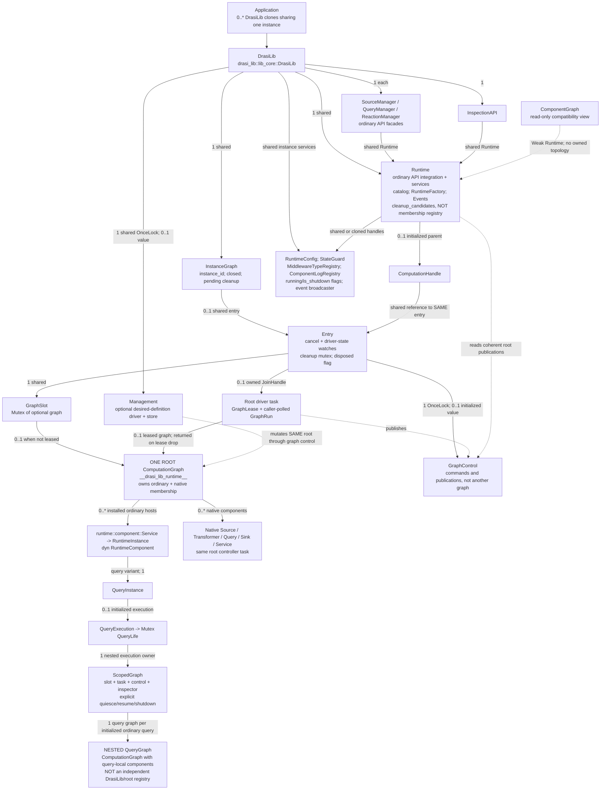
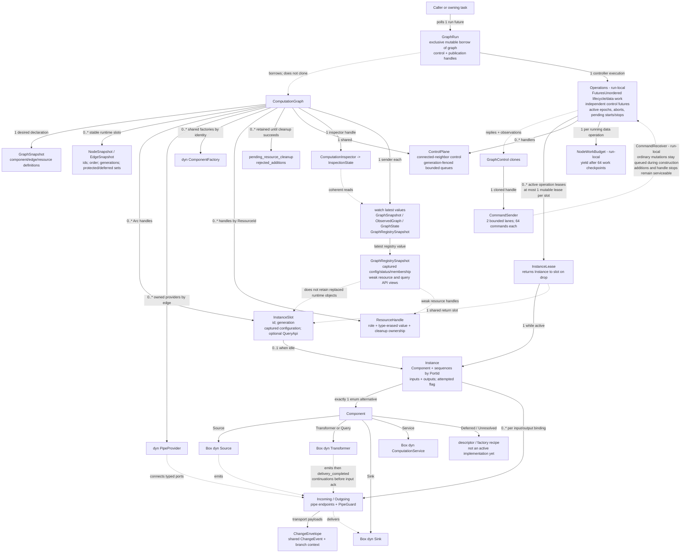
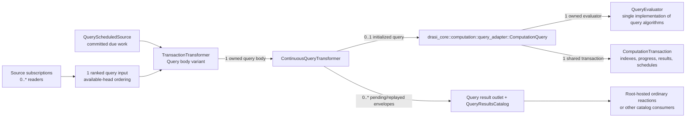

# ComputationGraph runtime architecture review

This is a reviewable description of **what the source currently implements**, not a
proposal or a live heap dump. The diagrams describe the ownership model at
`5f48406bfce641d83d7f881877a4a8cac663eeac`. The generated inventory, matrix, and
namespace counts below are tied to a source fingerprint and can be refreshed.
Regenerating the data does **not** automatically verify or update these diagrams.
The controller command lanes and per-node work budget were updated on 2026-10-04
for the first resilience-boundary fixes.

**Primary invariant: one application/root ComputationGraph per DrasiLib instance.**
An ordinary query can own a nested query execution graph; that is not another
application runtime. A component batch is a set of additions to the root, not a
second runtime. Cloning DrasiLib or a control handle does not create a graph.

- [Interactive inventory, dependency matrix and LOC heatmap](runtime-architecture.html)
  (download/open locally; GitHub's file viewer does not execute HTML).
- [Complete cardinality matrix, CSV](runtime-dependencies.csv).
- [Machine-readable type/field/relationship baseline](runtime-architecture.json).
- [Existing design](computation-graph-design.md),
  [reference](computation-graph-reference.md), and
  [managed configuration](managed-configuration.md).

## 1. DrasiLib instance runtime

Arrows name **stored handles or verified runtime ownership paths**, not merely
method calls. Solid arrows are ownership/strong handles; dotted arrows are
weak views, publications, control access, or execution relationships. A number
counts connections **per owning object**, not globally unique allocations.
`0..1` includes construction, shutdown, or lease-transfer states; the root is
exactly one after successful initialization and before disposal.



**Read the two slot/lease edges as an exclusive transfer, not two copies.**
`GraphSlot` temporarily contains `None` while its driver's `GraphLease` owns the
graph. The analogous pattern exists for component instances in the next diagram.
Stopping processing is not equivalent to disposing graph ownership.

Source anchors:
[DrasiLib](../src/lib_core.rs),
[instance owner and leases](../src/computation/instance.rs),
[Runtime initialization](../src/computation/runtime/mod.rs),
[ordinary hosts](../src/computation/runtime/component.rs),
[query ownership](../src/computation/runtime/query.rs),
[ScopedGraph](../src/computation/scoped_graph.rs),
[compatibility view](../src/component_graph/graph.rs).

## 2. ComputationGraph internals

This diagram expands one graph, whether root or nested. Boxes marked **run-local**
live in the async execution state, not in a field of `ComputationGraph`. The field
matrix alone cannot reveal these erased future captures, so they are shown
explicitly here. A graph has one controller loop, not one thread per node.



During execution the controller retains cancellation-safe leases in its futures.
Commands can remain responsive while data/lifecycle work is pending. Each data
operation yields cooperatively, including synchronously ready sends and repeated
continuations; the controller polls commands fairly rather than always giving
data completions priority. Node budgets do not consume the controller task's
entire Tokio budget. Ordinary commands are not drained into an unbounded side
queue during slow construction. Control
work is separate from serialized mutable component work. Shared-channel
subscribers have independent cursors; a disconnected subscriber can still have
delivery obligations. An accepted emission is not proof of handling or a durable
external effect.

Cleanup is an awaited ownership operation. Failed cleanup keeps its owner for
retry. Dropping a `GraphRun` cancels and marks cleanup required; it cannot
magically await cleanup. Root `Entry` and nested `ScopedGraph` are task owners,
not additional scheduling algorithms.

Source anchors:
[graph fields and GraphRun](../src/computation/v1/graph.rs),
[controller slots, leases and Operations](../src/computation/v1/graph/controller.rs),
[resource contracts](../src/computation/v1/graph/specification.rs),
[registry](../src/computation/v1/graph/registry.rs),
[inspection](../src/computation/v1/inspection.rs),
[QoS transports](../src/computation/v1/qos_pipe.rs).

### Ordinary query execution detail

The root's ordinary query host and the actual query evaluator are **not the same
object**. The initialized nested graph owns source subscription readers, a ranked
input queue, the query body, scheduled-work input, a result outlet/catalog and
supporting resources. Empty/uninitialized/failed states need not contain all of
these objects.



Ordering is over available inputs, not a global watermark over unseen events.
The transaction owns persisted processing state; delivery confirmation is a
separate step. Committed replay preserves logical identity without reevaluation.
Standalone `ContinuousQuery` shares the evaluator implementation; it is not
another evaluator algorithm hidden inside ComputationGraph.

## 3. Matrix scope and interpretation

The **full matrix** is available in the offline HTML and CSV above. The HTML pages
both dimensions independently to avoid constructing a million-cell browser DOM.
Search row names for owners and column names for dependencies. Every scoped type
has a row, including zero-field structs, traits and aliases. Columns include
scoped types **and referenced boundary types**; boundary definitions are not
inventoried or recursively expanded. The JSON retains every field, source line,
enum variant, condition and ownership qualifier behind each populated cell.

**Scope:** named production structs, enums, unions, traits, trait aliases and type
aliases in all `lib/src` and `core/src` production modules, including private and
block-local declarations. Core coverage includes computation, query, evaluation,
path solving, models, interfaces, indexes, middleware and hashing: supporting
query-engine types are not hidden at the query-adapter boundary. It follows Rust module
declarations and `#[path]`, not just filesystem directory names. Definition-site
names can therefore differ from filenames and public re-exports. Associated
types, generic parameters, enum variants, closures, compiler-generated future
types, and monomorphizations are not independent nominal types in the inventory.
Other workspace crates (including AST/parsers, function registration crates,
plugins and host SDKs), dependencies, examples and test-only modules are outside
the inventory; encountered dependency types remain visible as boundary columns.

This is **stored-runtime-dependency analysis**, not an import/call graph:

| Representation | Cell cardinality and meaning |
|---|---|
| `T`, `Box<T>`, locks/cells around `T` | `1` slot to `T`; wrapper mode recorded separately |
| `Arc<T>`, `Rc<T>` | `1` strong handle, **not** one globally unique allocation |
| `Option<T>`, `OnceLock<T>`, `Weak<T>` | `0..1`; weak counts a potentially live target |
| Collections / maps / slices | `0..*`; keys and values each contribute if typed |
| Fixed `[T; N]` | `N`; unresolved symbolic extents are explicitly diagnosed |
| Enum/union payload | variant-labelled potential range; alternatives are mutually exclusive |
| Watch / queued / oneshot channel payload | latest `1` / `0..*` / `0..1` reachable payloads; not ownership of a consumer |
| Future/task/callback | handle boundary, **not** an edge to eventual output or guessed captured objects |
| Trait object | edge to the trait contract, concrete implementation not statically inferred |
| Type alias | expand at field use; alias row itself has no separate object storage |

`+` separates contributions within the same representation; `OR` separates named
enum/union variants. Do not add mutually exclusive
variant alternatives or equate handle counts with unique object counts. Empty
cells mean **no inferred direct stored relationship**, not “cannot depend on.”
Primitives and transparent standard-library wrappers are omitted as target
columns. Function arguments, return values, trait bounds, `impl` relationships and
temporary method-local values do not by themselves create stored-runtime edges.
A custom generic wrapper is a direct target; its generic instantiations and
transitive members are not flattened into invented direct ownership.

The extractor uses `syn`, not compiler type checking or heap instrumentation.
It reports a **conditional union** across feature/platform branches, removes
provably test-only items, and records remaining `cfg` conditions. It expands the
identifier-declaration macros from their actual source templates; unsupported
item macros or duplicate conditional definitions stop generation. Derive and
attribute procedural macros are not expanded; their hidden implementation
details are outside this source-declaration inventory. The known numeric
conversion/comparison macros add implementations, not types; the extractor checks
that their templates still contain no type declarations. `lazy_static` declares
static values; its synthetic marker types are excluded like other macro-generated
implementation details. Static values themselves are not additional type definitions.

## 4. Namespace LOC heatmap

Open the **Namespace LOC heatmap** tab in the companion. Dark blue means smaller
namespaces and orange/red means larger namespaces; color uses a logarithmic scale
so small namespaces remain distinguishable. Tiles have equal area and display
exact counts. The alphabetical counts are also appended below.

“Code lines” are unique physical lines containing Rust tokens after removing
blank/comment-only/doc-comment and test-only item lines. Attributes, braces and
multiline literal spans count. Inline module lines belong to the innermost
namespace, so summing exclusive namespace counts does not double-count children.
Macros count where written, not once per expansion. This is a source-size signal,
not complexity, test coverage, allocated memory or CPU time.

## 5. Recurring review and divergence alarms

Review the human diagrams and machine diff together. A type-level cardinality
range cannot establish the invariant “exactly one root exists in this running
instance”; the construction/lease paths and runtime assertions must establish it.

| Expectation | What should trigger review | Existing evidence / proposed stronger check |
|---|---|---|
| One root per DrasiLib | another root-owning field, collection of application graphs, new root construction path | `InstanceGraph::initialize` rejects repeat initialization; [instance tests](../tests/computation_instance.rs). Add a runtime instance-identity assertion spanning ordinary + native additions. |
| Query-local graphs have explicit ownership | nested graph without a `QueryInstance`/`ScopedGraph` owner or unjoined task | [ScopedGraph](../src/computation/scoped_graph.rs) and [runtime lifecycle tests](../src/computation/runtime/lifecycle_tests.rs). Maintain a root-vs-query scope count in runtime inventory tests. |
| No shadow registry | manager/view gains owned membership/topology or mutation state | [ComponentGraph](../src/component_graph/graph.rs), [generic architecture tests](../tests/computation_architecture.rs). Inspect new incoming/outgoing edges to Runtime and graph snapshots. |
| One query algorithm | graph implements matching/projection/aggregation separately | [QueryEvaluator](../../core/src/query/evaluator.rs); [query adapter](../../core/src/computation/query_adapter.rs). Require adapter changes to preserve evaluator reuse. |
| Cleanup retains ownership | erased task/resource owner or removal of awaited cleanup | Instance/graph leases, rejected additions, resource cleanup maps. Add failure/cancellation-path evidence alongside each new owner. |
| Observation does not pin retired owners | weak registry/view edge becomes strong | [registry](../src/computation/v1/graph/registry.rs) and [inspection](../src/computation/v1/inspection.rs). Diff relationship modes, not only endpoint names. |
| Public names are not extra implementations | re-export counted as a second type or obsolete façade becomes runtime owner | Definition-site inventory and existing compatibility-path tests. |
| Configuration is not reconstructibility | new opaque provider/component passed off as persistable recipe | [managed configuration](managed-configuration.md). Review factory/resource recipes separately from runtime fields. |

Recommended recurring artifacts, **not claims of implemented enforcement**:
an owner/task/resource lifetime ledger; explicit architectural decision records
for exceptions; a root/nested scope census collected during integration tests;
and a per-change baseline diff of added types, strong/weak edges and namespace
size. Keep qualification evidence separate: see the
[runtime contract ledger](../tests/runtime_parity/computation-contracts.tsv).
A heatmap becoming red is a review prompt, not automatically an architectural bug.

### Regenerate and check

From the `drasi-core` repository root:

```sh
cargo run -p xtask --bin runtime-architecture
cargo run -p xtask --bin runtime-architecture -- --check
cargo test -p xtask --bin runtime-architecture
```

The first command preserves this hand-written preamble and replaces only the
generated section below, plus the HTML/JSON/CSV companions. The second fails if
any generated output differs. Review source diagnostics rather than treating a
successful refresh as proof of complete runtime knowledge. Update the two
ownership diagrams manually when construction, transfer, disposal or scheduling
changes. The fingerprint is a deterministic change detector, not a security hash;
there is no timestamp or absolute workstation path in the generated artifacts.
The fingerprint covers parsed Rust sources and the two crate manifests.

<!-- GENERATED INVENTORY: cargo run -p xtask --bin runtime-architecture -->

## Alphabetical type inventory

Generated from **316 source files**; **1104 named types**. Source fingerprint: `fnv1a64:152a44675a231440`.

Names below are definition-site paths, not duplicate public re-export paths. Block-local declarations use an explicit `<local@line>` lexical identifier because Rust provides no importable path for them. Traits and aliases are included, but are not extra runtime objects.

- `drasi_core::computation::ComputationFutureResult` — struct; [source](../../core/src/computation/mod.rs#L62); conditional: `cfg (feature = "computation")`.
- `drasi_core::computation::ComputationQueryError` — enum; [source](../../core/src/computation/mod.rs#L68); conditional: `cfg (feature = "computation")`.
- `drasi_core::computation::Result` — type alias; [source](../../core/src/computation/mod.rs#L92); conditional: `cfg (feature = "computation")`.
- `drasi_core::computation::group_outbox::GroupOutbox` — struct; [source](../../core/src/computation/group_outbox.rs#L10); conditional: `cfg (feature = "computation")`.
- `drasi_core::computation::indexes::ComputationIndexProvider` — trait; [source](../../core/src/computation/indexes.rs#L216); conditional: `cfg (feature = "computation")`.
- `drasi_core::computation::indexes::ComputationIndexes` — struct; [source](../../core/src/computation/indexes.rs#L57); conditional: `cfg (feature = "computation")`.
- `drasi_core::computation::indexes::ComputationResource` — struct; [source](../../core/src/computation/indexes.rs#L25); conditional: `cfg (feature = "computation")`.
- `drasi_core::computation::indexes::ComputationResourceCleanup` — trait; [source](../../core/src/computation/indexes.rs#L245); conditional: `cfg (feature = "computation")`.
- `drasi_core::computation::indexes::InMemoryComputationProvider` — struct; [source](../../core/src/computation/indexes.rs#L258); conditional: `cfg (feature = "computation")`.
- `drasi_core::computation::io_scope::BlockingFailures` — struct; [source](../../core/src/computation/io_scope.rs#L202); conditional: `cfg (feature = "computation")`.
- `drasi_core::computation::io_scope::BlockingScope` — struct; [source](../../core/src/computation/io_scope.rs#L69); conditional: `cfg (feature = "computation")`.
- `drasi_core::computation::io_scope::CleanupPass` — struct; [source](../../core/src/computation/io_scope.rs#L181); conditional: `cfg (feature = "computation")`.
- `drasi_core::computation::io_scope::Job` — type alias; [source](../../core/src/computation/io_scope.rs#L28); conditional: `cfg (feature = "computation")`.
- `drasi_core::computation::io_scope::ScopeError` — enum; [source](../../core/src/computation/io_scope.rs#L30); conditional: `cfg (feature = "computation")`.
- `drasi_core::computation::io_scope::Work` — struct; [source](../../core/src/computation/io_scope.rs#L38); conditional: `cfg (feature = "computation")`.
- `drasi_core::computation::operation::ComputationTransaction` — struct; [source](../../core/src/computation/operation.rs#L104); conditional: `cfg (feature = "computation")`.
- `drasi_core::computation::operation::PendingOperation` — struct; [source](../../core/src/computation/operation.rs#L22); conditional: `cfg (feature = "computation")`.
- `drasi_core::computation::query_adapter::ComputationQuery` — struct; [source](../../core/src/computation/query_adapter.rs#L32); conditional: `cfg (feature = "computation")`.
- `drasi_core::computation::query_adapter::ScheduledQueue` — struct; [source](../../core/src/computation/query_adapter.rs#L43); conditional: `cfg (feature = "computation")`.
- `drasi_core::computation::query_results::Delta` — enum; [source](../../core/src/computation/query_results.rs#L32); conditional: `cfg (feature = "computation")`.
- `drasi_core::computation::query_results::TransactionResultError` — enum; [source](../../core/src/computation/query_results.rs#L21); conditional: `cfg (feature = "computation")`.
- `drasi_core::computation::scoped_index::ScopedIndex` — struct; [source](../../core/src/computation/scoped_index.rs#L39); conditional: `cfg (feature = "computation")`.
- `drasi_core::computation::transaction::AtomicResultTransaction` — struct; [source](../../core/src/computation/transaction.rs#L59); conditional: `cfg (feature = "computation")`.
- `drasi_core::computation::transaction::TransactionDomain` — struct; [source](../../core/src/computation/transaction.rs#L19); conditional: `cfg (feature = "computation")`.
- `drasi_core::computation::transaction_group::ActiveOperation` — struct; [source](../../core/src/computation/transaction_group.rs#L384); conditional: `cfg (feature = "computation")`.
- `drasi_core::computation::transaction_group::ComputationTransactionGroup` — struct; [source](../../core/src/computation/transaction_group.rs#L98); conditional: `cfg (feature = "computation")`.
- `drasi_core::computation::transaction_group::Group` — struct; [source](../../core/src/computation/transaction_group.rs#L55); conditional: `cfg (feature = "computation")`.
- `drasi_core::computation::transaction_group::GroupSession` — struct; [source](../../core/src/computation/transaction_group.rs#L377); conditional: `cfg (feature = "computation")`.
- `drasi_core::computation::transaction_group::Members` — struct; [source](../../core/src/computation/transaction_group.rs#L47); conditional: `cfg (feature = "computation")`.
- `drasi_core::computation::transaction_group::RetirementGate` — type alias; [source](../../core/src/computation/transaction_group.rs#L53); conditional: `cfg (feature = "computation")`.
- `drasi_core::computation::transaction_group::TransactionGroupContext` — struct; [source](../../core/src/computation/transaction_group.rs#L206); conditional: `cfg (feature = "computation")`.
- `drasi_core::computation::transaction_group::TransactionGroupError` — enum; [source](../../core/src/computation/transaction_group.rs#L21); conditional: `cfg (feature = "computation")`.
- `drasi_core::computation::transaction_group::TransactionGroupMutation` — trait; [source](../../core/src/computation/transaction_group.rs#L190); conditional: `cfg (feature = "computation")`.
- `drasi_core::computation::transaction_group::TransactionGroupRetirement` — struct; [source](../../core/src/computation/transaction_group.rs#L112); conditional: `cfg (feature = "computation")`.
- `drasi_core::evaluation::EvaluationError` — enum; [source](../../core/src/evaluation/mod.rs#L36).
- `drasi_core::evaluation::FunctionError` — struct; [source](../../core/src/evaluation/mod.rs#L55).
- `drasi_core::evaluation::FunctionEvaluationError` — enum; [source](../../core/src/evaluation/mod.rs#L67).
- `drasi_core::evaluation::OutOfRangeType` — enum; [source](../../core/src/evaluation/mod.rs#L138).
- `drasi_core::evaluation::context::ChangeContext` — struct; [source](../../core/src/evaluation/context.rs#L269).
- `drasi_core::evaluation::context::ExpressionEvaluationContext` — struct; [source](../../core/src/evaluation/context.rs#L134).
- `drasi_core::evaluation::context::QueryPartEvaluationContext` — enum; [source](../../core/src/evaluation/context.rs#L46).
- `drasi_core::evaluation::context::QueryVariables` — type alias; [source](../../core/src/evaluation/context.rs#L26).
- `drasi_core::evaluation::context::SideEffects` — enum; [source](../../core/src/evaluation/context.rs#L38).
- `drasi_core::evaluation::expressions::ExpressionEvaluator` — struct; [source](../../core/src/evaluation/expressions/mod.rs#L45).
- `drasi_core::evaluation::expressions::LogicalOperator` — enum; [source](../../core/src/evaluation/expressions/mod.rs#L50).
- `drasi_core::evaluation::functions::AggregatingFunction` — trait; [source](../../core/src/evaluation/functions/mod.rs#L77).
- `drasi_core::evaluation::functions::ContextMutatorFunction` — trait; [source](../../core/src/evaluation/functions/mod.rs#L107).
- `drasi_core::evaluation::functions::Function` — enum; [source](../../core/src/evaluation/functions/mod.rs#L50).
- `drasi_core::evaluation::functions::FunctionRegistry` — struct; [source](../../core/src/evaluation/functions/mod.rs#L116).
- `drasi_core::evaluation::functions::LazyScalarFunction` — trait; [source](../../core/src/evaluation/functions/mod.rs#L67).
- `drasi_core::evaluation::functions::ScalarFunction` — trait; [source](../../core/src/evaluation/functions/mod.rs#L57).
- `drasi_core::evaluation::functions::aggregation::Accumulator` — enum; [source](../../core/src/evaluation/functions/aggregation/mod.rs#L92).
- `drasi_core::evaluation::functions::aggregation::RegisterAggregationFunctions` — trait; [source](../../core/src/evaluation/functions/aggregation/mod.rs#L42).
- `drasi_core::evaluation::functions::aggregation::ValueAccumulator` — enum; [source](../../core/src/evaluation/functions/aggregation/mod.rs#L65).
- `drasi_core::evaluation::functions::aggregation::avg::Avg` — struct; [source](../../core/src/evaluation/functions/aggregation/avg.rs#L35).
- `drasi_core::evaluation::functions::aggregation::collect::Collect` — struct; [source](../../core/src/evaluation/functions/aggregation/collect.rs#L31).
- `drasi_core::evaluation::functions::aggregation::count::Count` — struct; [source](../../core/src/evaluation/functions/aggregation/count.rs#L32).
- `drasi_core::evaluation::functions::aggregation::last::AggregatingLast` — struct; [source](../../core/src/evaluation/functions/aggregation/last.rs#L31).
- `drasi_core::evaluation::functions::aggregation::lazy_sorted_set::LazySortedSet` — struct; [source](../../core/src/evaluation/functions/aggregation/lazy_sorted_set.rs#L35).
- `drasi_core::evaluation::functions::aggregation::lazy_sorted_set::SortedSetChangeLog` — type alias; [source](../../core/src/evaluation/functions/aggregation/lazy_sorted_set.rs#L33).
- `drasi_core::evaluation::functions::aggregation::lazy_sorted_set::SortedSetEntryCount` — struct; [source](../../core/src/evaluation/functions/aggregation/lazy_sorted_set.rs#L27).
- `drasi_core::evaluation::functions::aggregation::linear_gradient::LinearGradient` — struct; [source](../../core/src/evaluation/functions/aggregation/linear_gradient.rs#L34).
- `drasi_core::evaluation::functions::aggregation::max::Max` — struct; [source](../../core/src/evaluation/functions/aggregation/max.rs#L40).
- `drasi_core::evaluation::functions::aggregation::min::Min` — struct; [source](../../core/src/evaluation/functions/aggregation/min.rs#L38).
- `drasi_core::evaluation::functions::aggregation::sum::Sum` — struct; [source](../../core/src/evaluation/functions/aggregation/sum.rs#L34).
- `drasi_core::evaluation::functions::context_mutators::RetainHistory` — struct; [source](../../core/src/evaluation/functions/context_mutators.rs#L22).
- `drasi_core::evaluation::functions::cypher_scalar::char_length::CharLength` — struct; [source](../../core/src/evaluation/functions/cypher_scalar/char_length.rs#L22).
- `drasi_core::evaluation::functions::cypher_scalar::coalesce::Coalesce` — struct; [source](../../core/src/evaluation/functions/cypher_scalar/coalesce.rs#L22).
- `drasi_core::evaluation::functions::cypher_scalar::head::Head` — struct; [source](../../core/src/evaluation/functions/cypher_scalar/head.rs#L22).
- `drasi_core::evaluation::functions::cypher_scalar::is_empty::IsEmpty` — struct; [source](../../core/src/evaluation/functions/cypher_scalar/is_empty.rs#L22).
- `drasi_core::evaluation::functions::cypher_scalar::last::CypherLast` — struct; [source](../../core/src/evaluation/functions/cypher_scalar/last.rs#L22).
- `drasi_core::evaluation::functions::cypher_scalar::null_if::NullIf` — struct; [source](../../core/src/evaluation/functions/cypher_scalar/null_if.rs#L22).
- `drasi_core::evaluation::functions::cypher_scalar::size::Size` — struct; [source](../../core/src/evaluation/functions/cypher_scalar/size.rs#L22).
- `drasi_core::evaluation::functions::cypher_scalar::timestamp::Timestamp` — struct; [source](../../core/src/evaluation/functions/cypher_scalar/timestamp.rs#L22).
- `drasi_core::evaluation::functions::cypher_scalar::to_boolean::ToBoolean` — struct; [source](../../core/src/evaluation/functions/cypher_scalar/to_boolean.rs#L22).
- `drasi_core::evaluation::functions::cypher_scalar::to_boolean::ToBooleanOrNull` — struct; [source](../../core/src/evaluation/functions/cypher_scalar/to_boolean.rs#L67).
- `drasi_core::evaluation::functions::cypher_scalar::to_float::ToFloat` — struct; [source](../../core/src/evaluation/functions/cypher_scalar/to_float.rs#L22).
- `drasi_core::evaluation::functions::cypher_scalar::to_float::ToFloatOrNull` — struct; [source](../../core/src/evaluation/functions/cypher_scalar/to_float.rs#L71).
- `drasi_core::evaluation::functions::cypher_scalar::to_integer::ToInteger` — struct; [source](../../core/src/evaluation/functions/cypher_scalar/to_integer.rs#L22).
- `drasi_core::evaluation::functions::cypher_scalar::to_integer::ToIntegerOrNull` — struct; [source](../../core/src/evaluation/functions/cypher_scalar/to_integer.rs#L78).
- `drasi_core::evaluation::functions::drasi::max::DrasiMax` — struct; [source](../../core/src/evaluation/functions/drasi/max.rs#L22).
- `drasi_core::evaluation::functions::drasi::min::DrasiMin` — struct; [source](../../core/src/evaluation/functions/drasi/min.rs#L22).
- `drasi_core::evaluation::functions::drasi::stdevp::DrasiStdevP` — struct; [source](../../core/src/evaluation/functions/drasi/stdevp.rs#L23).
- `drasi_core::evaluation::functions::future::RegisterFutureFunctions` — trait; [source](../../core/src/evaluation/functions/future/mod.rs#L39).
- `drasi_core::evaluation::functions::future::awaiting::Awaiting` — struct; [source](../../core/src/evaluation/functions/future/awaiting.rs#L23).
- `drasi_core::evaluation::functions::future::future_element::FutureElement` — struct; [source](../../core/src/evaluation/functions/future/future_element.rs#L27).
- `drasi_core::evaluation::functions::future::previous_distinct_value::PreviousDistinctValue` — struct; [source](../../core/src/evaluation/functions/future/previous_distinct_value.rs#L32).
- `drasi_core::evaluation::functions::future::previous_value::PreviousValue` — struct; [source](../../core/src/evaluation/functions/future/previous_value.rs#L32).
- `drasi_core::evaluation::functions::future::sliding_window::SlidingWindow` — struct; [source](../../core/src/evaluation/functions/future/sliding_window.rs#L33).
- `drasi_core::evaluation::functions::future::true_for::TrueFor` — struct; [source](../../core/src/evaluation/functions/future/true_for.rs#L32).
- `drasi_core::evaluation::functions::future::true_later::TrueLater` — struct; [source](../../core/src/evaluation/functions/future/true_later.rs#L27).
- `drasi_core::evaluation::functions::future::true_now_or_later::TrueNowOrLater` — struct; [source](../../core/src/evaluation/functions/future/true_now_or_later.rs#L27).
- `drasi_core::evaluation::functions::future::true_until::TrueUntil` — struct; [source](../../core/src/evaluation/functions/future/true_until.rs#L27).
- `drasi_core::evaluation::functions::list::distinct::Distinct` — struct; [source](../../core/src/evaluation/functions/list/distinct.rs#L23).
- `drasi_core::evaluation::functions::list::index_of::IndexOf` — struct; [source](../../core/src/evaluation/functions/list/index_of.rs#L22).
- `drasi_core::evaluation::functions::list::insert::Insert` — struct; [source](../../core/src/evaluation/functions/list/insert.rs#L22).
- `drasi_core::evaluation::functions::list::range::Range` — struct; [source](../../core/src/evaluation/functions/list/range.rs#L22).
- `drasi_core::evaluation::functions::list::reduce::Reduce` — struct; [source](../../core/src/evaluation/functions/list/reduce.rs#L29).
- `drasi_core::evaluation::functions::list::tail::Tail` — struct; [source](../../core/src/evaluation/functions/list/tail.rs#L22).
- `drasi_core::evaluation::functions::metadata::ChangeDateTime` — struct; [source](../../core/src/evaluation/functions/metadata.rs#L53).
- `drasi_core::evaluation::functions::metadata::ElementId` — struct; [source](../../core/src/evaluation/functions/metadata.rs#L24).
- `drasi_core::evaluation::functions::numeric::abs::Abs` — struct; [source](../../core/src/evaluation/functions/numeric/abs.rs#L23).
- `drasi_core::evaluation::functions::numeric::ceil::Ceil` — struct; [source](../../core/src/evaluation/functions/numeric/ceil.rs#L23).
- `drasi_core::evaluation::functions::numeric::floor::Floor` — struct; [source](../../core/src/evaluation/functions/numeric/floor.rs#L23).
- `drasi_core::evaluation::functions::numeric::numeric_round::Round` — struct; [source](../../core/src/evaluation/functions/numeric/numeric_round.rs#L27).
- `drasi_core::evaluation::functions::numeric::random::Rand` — struct; [source](../../core/src/evaluation/functions/numeric/random.rs#L24).
- `drasi_core::evaluation::functions::numeric::sign::Sign` — struct; [source](../../core/src/evaluation/functions/numeric/sign.rs#L22).
- `drasi_core::evaluation::functions::past::GetVersionByTimestamp` — struct; [source](../../core/src/evaluation/functions/past/mod.rs#L53).
- `drasi_core::evaluation::functions::past::GetVersionsByTimeRange` — struct; [source](../../core/src/evaluation/functions/past/mod.rs#L126).
- `drasi_core::evaluation::functions::past::RegisterPastFunctions` — trait; [source](../../core/src/evaluation/functions/past/mod.rs#L31).
- `drasi_core::evaluation::functions::temporal_duration::temporal_duration::Between` — struct; [source](../../core/src/evaluation/functions/temporal_duration/temporal_duration.rs#L224).
- `drasi_core::evaluation::functions::temporal_duration::temporal_duration::DurationFunc` — struct; [source](../../core/src/evaluation/functions/temporal_duration/temporal_duration.rs#L30).
- `drasi_core::evaluation::functions::temporal_duration::temporal_duration::InDays` — struct; [source](../../core/src/evaluation/functions/temporal_duration/temporal_duration.rs#L860).
- `drasi_core::evaluation::functions::temporal_duration::temporal_duration::InMonths` — struct; [source](../../core/src/evaluation/functions/temporal_duration/temporal_duration.rs#L707).
- `drasi_core::evaluation::functions::temporal_duration::temporal_duration::InSeconds` — struct; [source](../../core/src/evaluation/functions/temporal_duration/temporal_duration.rs#L908).
- `drasi_core::evaluation::functions::temporal_instant::temporal_instant::Clock` — enum; [source](../../core/src/evaluation/functions/temporal_instant/temporal_instant.rs#L1316).
- `drasi_core::evaluation::functions::temporal_instant::temporal_instant::ClockFunction` — struct; [source](../../core/src/evaluation/functions/temporal_instant/temporal_instant.rs#L1330).
- `drasi_core::evaluation::functions::temporal_instant::temporal_instant::ClockResult` — enum; [source](../../core/src/evaluation/functions/temporal_instant/temporal_instant.rs#L1322).
- `drasi_core::evaluation::functions::temporal_instant::temporal_instant::Date` — struct; [source](../../core/src/evaluation/functions/temporal_instant/temporal_instant.rs#L35).
- `drasi_core::evaluation::functions::temporal_instant::temporal_instant::DateTime` — struct; [source](../../core/src/evaluation/functions/temporal_instant/temporal_instant.rs#L523).
- `drasi_core::evaluation::functions::temporal_instant::temporal_instant::LocalDateTime` — struct; [source](../../core/src/evaluation/functions/temporal_instant/temporal_instant.rs#L191).
- `drasi_core::evaluation::functions::temporal_instant::temporal_instant::LocalTime` — struct; [source](../../core/src/evaluation/functions/temporal_instant/temporal_instant.rs#L114).
- `drasi_core::evaluation::functions::temporal_instant::temporal_instant::Time` — struct; [source](../../core/src/evaluation/functions/temporal_instant/temporal_instant.rs#L354).
- `drasi_core::evaluation::functions::temporal_instant::temporal_instant::Truncate` — struct; [source](../../core/src/evaluation/functions/temporal_instant/temporal_instant.rs#L978).
- `drasi_core::evaluation::functions::text::text::LTrim` — struct; [source](../../core/src/evaluation/functions/text/text.rs#L106).
- `drasi_core::evaluation::functions::text::text::Left` — struct; [source](../../core/src/evaluation/functions/text/text.rs#L195).
- `drasi_core::evaluation::functions::text::text::RTrim` — struct; [source](../../core/src/evaluation/functions/text/text.rs#L134).
- `drasi_core::evaluation::functions::text::text::RandomUUID` — struct; [source](../../core/src/evaluation/functions/text/text.rs#L658).
- `drasi_core::evaluation::functions::text::text::Replace` — struct; [source](../../core/src/evaluation/functions/text/text.rs#L312).
- `drasi_core::evaluation::functions::text::text::Reverse` — struct; [source](../../core/src/evaluation/functions/text/text.rs#L162).
- `drasi_core::evaluation::functions::text::text::Right` — struct; [source](../../core/src/evaluation/functions/text/text.rs#L253).
- `drasi_core::evaluation::functions::text::text::Split` — struct; [source](../../core/src/evaluation/functions/text/text.rs#L361).
- `drasi_core::evaluation::functions::text::text::Substring` — struct; [source](../../core/src/evaluation/functions/text/text.rs#L434).
- `drasi_core::evaluation::functions::text::text::ToLower` — struct; [source](../../core/src/evaluation/functions/text/text.rs#L50).
- `drasi_core::evaluation::functions::text::text::ToString` — struct; [source](../../core/src/evaluation/functions/text/text.rs#L569).
- `drasi_core::evaluation::functions::text::text::ToStringOrNull` — struct; [source](../../core/src/evaluation/functions/text/text.rs#L612).
- `drasi_core::evaluation::functions::text::text::ToUpper` — struct; [source](../../core/src/evaluation/functions/text/text.rs#L22).
- `drasi_core::evaluation::functions::text::text::Trim` — struct; [source](../../core/src/evaluation/functions/text/text.rs#L78).
- `drasi_core::evaluation::functions::trigonometric::cos::Cos` — struct; [source](../../core/src/evaluation/functions/trigonometric/cos.rs#L23).
- `drasi_core::evaluation::functions::trigonometric::degrees::Degrees` — struct; [source](../../core/src/evaluation/functions/trigonometric/degrees.rs#L23).
- `drasi_core::evaluation::functions::trigonometric::pi::Pi` — struct; [source](../../core/src/evaluation/functions/trigonometric/pi.rs#L23).
- `drasi_core::evaluation::functions::trigonometric::radians::Radians` — struct; [source](../../core/src/evaluation/functions/trigonometric/radians.rs#L23).
- `drasi_core::evaluation::functions::trigonometric::sin::Sin` — struct; [source](../../core/src/evaluation/functions/trigonometric/sin.rs#L23).
- `drasi_core::evaluation::functions::trigonometric::tan::Tan` — struct; [source](../../core/src/evaluation/functions/trigonometric/tan.rs#L23).
- `drasi_core::evaluation::instant_query_clock::InstantQueryClock` — struct; [source](../../core/src/evaluation/instant_query_clock.rs#L17).
- `drasi_core::evaluation::parts::QueryPartEvaluator` — struct; [source](../../core/src/evaluation/parts/mod.rs#L57).
- `drasi_core::evaluation::variable_value::ListRange` — struct; [source](../../core/src/evaluation/variable_value/mod.rs#L87).
- `drasi_core::evaluation::variable_value::RangeBound` — enum; [source](../../core/src/evaluation/variable_value/mod.rs#L99).
- `drasi_core::evaluation::variable_value::VariableValue` — enum; [source](../../core/src/evaluation/variable_value/mod.rs#L33).
- `drasi_core::evaluation::variable_value::duration::Duration` — struct; [source](../../core/src/evaluation/variable_value/duration.rs#L20).
- `drasi_core::evaluation::variable_value::float::<local@149>::NumberVisitor` — struct; [source](../../core/src/evaluation/variable_value/float.rs#L149).
- `drasi_core::evaluation::variable_value::float::Float` — struct; [source](../../core/src/evaluation/variable_value/float.rs#L21).
- `drasi_core::evaluation::variable_value::index::Index` — trait; [source](../../core/src/evaluation/variable_value/index.rs#L22).
- `drasi_core::evaluation::variable_value::index::Type` — struct; [source](../../core/src/evaluation/variable_value/index.rs#L126).
- `drasi_core::evaluation::variable_value::index::private::Sealed` — trait; [source](../../core/src/evaluation/variable_value/index.rs#L119).
- `drasi_core::evaluation::variable_value::integer::<local@216>::NumberVisitor` — struct; [source](../../core/src/evaluation/variable_value/integer.rs#L216).
- `drasi_core::evaluation::variable_value::integer::Integer` — struct; [source](../../core/src/evaluation/variable_value/integer.rs#L21).
- `drasi_core::evaluation::variable_value::integer::N` — enum; [source](../../core/src/evaluation/variable_value/integer.rs#L26).
- `drasi_core::evaluation::variable_value::zoned_datetime::ZonedDateTime` — struct; [source](../../core/src/evaluation/variable_value/zoned_datetime.rs#L25).
- `drasi_core::evaluation::variable_value::zoned_time::ZonedTime` — struct; [source](../../core/src/evaluation/variable_value/zoned_time.rs#L19).
- `drasi_core::hashing::spooky::SpookyHasher` — struct; [source](../../core/src/hashing/spooky.rs#L385).
- `drasi_core::in_memory_index::in_memory_checkpoint_store::CheckpointEntry` — struct; [source](../../core/src/in_memory_index/in_memory_checkpoint_store.rs#L30).
- `drasi_core::in_memory_index::in_memory_checkpoint_store::InMemoryCheckpointStore` — struct; [source](../../core/src/in_memory_index/in_memory_checkpoint_store.rs#L37).
- `drasi_core::in_memory_index::in_memory_element_index::ElementArchive` — struct; [source](../../core/src/in_memory_index/in_memory_element_index.rs#L680).
- `drasi_core::in_memory_index::in_memory_element_index::InMemoryElementIndex` — struct; [source](../../core/src/in_memory_index/in_memory_element_index.rs#L37).
- `drasi_core::in_memory_index::in_memory_future_queue::FutureQueueState` — struct; [source](../../core/src/in_memory_index/in_memory_future_queue.rs#L26).
- `drasi_core::in_memory_index::in_memory_future_queue::InMemoryFutureQueue` — struct; [source](../../core/src/in_memory_index/in_memory_future_queue.rs#L34).
- `drasi_core::in_memory_index::in_memory_live_results_writer::InMemoryLiveResultsWriter` — struct; [source](../../core/src/in_memory_index/in_memory_live_results_writer.rs#L27).
- `drasi_core::in_memory_index::in_memory_outbox_writer::InMemoryOutboxWriter` — struct; [source](../../core/src/in_memory_index/in_memory_outbox_writer.rs#L27).
- `drasi_core::in_memory_index::in_memory_result_index::InMemoryResultIndex` — struct; [source](../../core/src/in_memory_index/in_memory_result_index.rs#L35).
- `drasi_core::index_cache::cached_element_index::CachedElementIndex` — struct; [source](../../core/src/index_cache/cached_element_index.rs#L29).
- `drasi_core::index_cache::cached_result_index::CachedResultIndex` — struct; [source](../../core/src/index_cache/cached_result_index.rs#L34).
- `drasi_core::index_cache::shadowed_future_queue::HeadItemShadow` — enum; [source](../../core/src/index_cache/shadowed_future_queue.rs#L25).
- `drasi_core::index_cache::shadowed_future_queue::ShadowedFutureQueue` — struct; [source](../../core/src/index_cache/shadowed_future_queue.rs#L30).
- `drasi_core::interface::IndexError` — enum; [source](../../core/src/interface/mod.rs#L67).
- `drasi_core::interface::QueryBuilderError` — enum; [source](../../core/src/interface/mod.rs#L132).
- `drasi_core::interface::checkpoint_store::CheckpointStore` — trait; [source](../../core/src/interface/checkpoint_store.rs#L59).
- `drasi_core::interface::checkpoint_store::SourceCheckpoint` — struct; [source](../../core/src/interface/checkpoint_store.rs#L37).
- `drasi_core::interface::durability::DurabilityRequirementError` — struct; [source](../../core/src/interface/durability.rs#L114).
- `drasi_core::interface::durability::FailureMode` — enum; [source](../../core/src/interface/durability.rs#L15).
- `drasi_core::interface::durability::FailureSurvival` — enum; [source](../../core/src/interface/durability.rs#L26).
- `drasi_core::interface::durability::StorageDurability` — struct; [source](../../core/src/interface/durability.rs#L46).
- `drasi_core::interface::element_index::ElementArchiveIndex` — trait; [source](../../core/src/interface/element_index.rs#L67).
- `drasi_core::interface::element_index::ElementIndex` — trait; [source](../../core/src/interface/element_index.rs#L30).
- `drasi_core::interface::element_index::ElementResult` — type alias; [source](../../core/src/interface/element_index.rs#L27).
- `drasi_core::interface::element_index::ElementStream` — type alias; [source](../../core/src/interface/element_index.rs#L28).
- `drasi_core::interface::future_queue::FutureElementRef` — struct; [source](../../core/src/interface/future_queue.rs#L29).
- `drasi_core::interface::future_queue::FutureQueue` — trait; [source](../../core/src/interface/future_queue.rs#L37).
- `drasi_core::interface::future_queue::FutureQueueConsumer` — trait; [source](../../core/src/interface/future_queue.rs#L62).
- `drasi_core::interface::future_queue::PushType` — enum; [source](../../core/src/interface/future_queue.rs#L22).
- `drasi_core::interface::index_backend::CreatedIndexes` — struct; [source](../../core/src/interface/index_backend.rs#L69).
- `drasi_core::interface::index_backend::IndexBackendPlugin` — trait; [source](../../core/src/interface/index_backend.rs#L113).
- `drasi_core::interface::index_backend::IndexSet` — struct; [source](../../core/src/interface/index_backend.rs#L38).
- `drasi_core::interface::live_results_writer::LiveResultsWriter` — trait; [source](../../core/src/interface/live_results_writer.rs#L42).
- `drasi_core::interface::live_results_writer::RowMutation` — struct; [source](../../core/src/interface/live_results_writer.rs#L33).
- `drasi_core::interface::outbox_writer::OutboxWriter` — trait; [source](../../core/src/interface/outbox_writer.rs#L38).
- `drasi_core::interface::query_clock::QueryClock` — trait; [source](../../core/src/interface/query_clock.rs#L17).
- `drasi_core::interface::result_index::AccumulatorIndex` — trait; [source](../../core/src/interface/result_index.rs#L30).
- `drasi_core::interface::result_index::LazySortedSetStore` — trait; [source](../../core/src/interface/result_index.rs#L46).
- `drasi_core::interface::result_index::ResultIndex` — trait; [source](../../core/src/interface/result_index.rs#L28).
- `drasi_core::interface::result_index::ResultKey` — enum; [source](../../core/src/interface/result_index.rs#L103).
- `drasi_core::interface::result_index::ResultOwner` — enum; [source](../../core/src/interface/result_index.rs#L94).
- `drasi_core::interface::result_index::ResultSequence` — struct; [source](../../core/src/interface/result_index.rs#L66).
- `drasi_core::interface::result_index::ResultSequenceCounter` — trait; [source](../../core/src/interface/result_index.rs#L81).
- `drasi_core::interface::session_control::NoOpSessionControl` — struct; [source](../../core/src/interface/session_control.rs#L41).
- `drasi_core::interface::session_control::SessionControl` — trait; [source](../../core/src/interface/session_control.rs#L21).
- `drasi_core::interface::session_control::SessionGuard` — struct; [source](../../core/src/interface/session_control.rs#L62).
- `drasi_core::interface::source_middleware::MiddlewareError` — enum; [source](../../core/src/interface/source_middleware.rs#L24).
- `drasi_core::interface::source_middleware::MiddlewareSetupError` — enum; [source](../../core/src/interface/source_middleware.rs#L42).
- `drasi_core::interface::source_middleware::SourceMiddleware` — trait; [source](../../core/src/interface/source_middleware.rs#L50).
- `drasi_core::interface::source_middleware::SourceMiddlewareFactory` — trait; [source](../../core/src/interface/source_middleware.rs#L59).
- `drasi_core::middleware::MiddlewareContainer` — struct; [source](../../core/src/middleware/mod.rs#L51).
- `drasi_core::middleware::MiddlewareTypeRegistry` — struct; [source](../../core/src/middleware/mod.rs#L25).
- `drasi_core::middleware::SourceMiddlewarePipeline` — struct; [source](../../core/src/middleware/mod.rs#L81).
- `drasi_core::middleware::SourceMiddlewarePipelineCollection` — struct; [source](../../core/src/middleware/mod.rs#L135).
- `drasi_core::models::ConversionError` — struct; [source](../../core/src/models/mod.rs#L36).
- `drasi_core::models::QueryConfig` — struct; [source](../../core/src/models/mod.rs#L126).
- `drasi_core::models::QueryJoin` — struct; [source](../../core/src/models/mod.rs#L64).
- `drasi_core::models::QueryJoinKey` — struct; [source](../../core/src/models/mod.rs#L58).
- `drasi_core::models::QuerySourceElement` — struct; [source](../../core/src/models/mod.rs#L45).
- `drasi_core::models::QuerySources` — struct; [source](../../core/src/models/mod.rs#L134).
- `drasi_core::models::QuerySubscription` — struct; [source](../../core/src/models/mod.rs#L50).
- `drasi_core::models::SourceMiddlewareConfig` — struct; [source](../../core/src/models/mod.rs#L141).
- `drasi_core::models::element::Element` — enum; [source](../../core/src/models/element.rs#L118).
- `drasi_core::models::element::ElementMetadata` — struct; [source](../../core/src/models/element.rs#L97).
- `drasi_core::models::element::ElementReference` — struct; [source](../../core/src/models/element.rs#L26).
- `drasi_core::models::element::ElementTimestamp` — type alias; [source](../../core/src/models/element.rs#L47).
- `drasi_core::models::element_value::ElementPropertyMap` — struct; [source](../../core/src/models/element_value.rs#L230).
- `drasi_core::models::element_value::ElementValue` — enum; [source](../../core/src/models/element_value.rs#L34).
- `drasi_core::models::source_change::SourceChange` — enum; [source](../../core/src/models/source_change.rs#L21).
- `drasi_core::models::timestamp_range::TimestampBound` — enum; [source](../../core/src/models/timestamp_range.rs#L23).
- `drasi_core::models::timestamp_range::TimestampRange` — struct; [source](../../core/src/models/timestamp_range.rs#L17).
- `drasi_core::path_solver::MatchPathSolver` — struct; [source](../../core/src/path_solver/mod.rs#L61).
- `drasi_core::path_solver::MatchSolveContext` — struct; [source](../../core/src/path_solver/mod.rs#L44).
- `drasi_core::path_solver::SolutionStreamCommand` — enum; [source](../../core/src/path_solver/mod.rs#L133).
- `drasi_core::path_solver::SolveDirection` — enum; [source](../../core/src/path_solver/mod.rs#L56).
- `drasi_core::path_solver::match_path::MatchPath` — struct; [source](../../core/src/path_solver/match_path.rs#L28).
- `drasi_core::path_solver::match_path::MatchPathSlot` — struct; [source](../../core/src/path_solver/match_path.rs#L136).
- `drasi_core::path_solver::match_path::SlotElementSpec` — struct; [source](../../core/src/path_solver/match_path.rs#L145).
- `drasi_core::path_solver::solution::MatchPathSolution` — struct; [source](../../core/src/path_solver/solution.rs#L34).
- `drasi_core::path_solver::solution::SolutionSignature` — type alias; [source](../../core/src/path_solver/solution.rs#L32).
- `drasi_core::query::auto_future_queue_consumer::AutoFutureQueueConsumer` — struct; [source](../../core/src/query/auto_future_queue_consumer.rs#L27).
- `drasi_core::query::continuous_query::ContinuousQuery` — struct; [source](../../core/src/query/continuous_query.rs#L41).
- `drasi_core::query::continuous_query::DueFutureResult` — struct; [source](../../core/src/query/continuous_query.rs#L36).
- `drasi_core::query::evaluator::CollapsedAggregationResults` — struct; [source](../../core/src/query/evaluator.rs#L742).
- `drasi_core::query::evaluator::QueryEvaluator` — struct; [source](../../core/src/query/evaluator.rs#L44).
- `drasi_core::query::evaluator::SolutionChangesResult` — struct; [source](../../core/src/query/evaluator.rs#L722).
- `drasi_core::query::query_builder::QueryBuilder` — struct; [source](../../core/src/query/query_builder.rs#L45).
- `drasi_lib::bootstrap::ApplicationBootstrapConfig` — struct; [source](../../lib/src/bootstrap/mod.rs#L216).
- `drasi_lib::bootstrap::BootstrapContext` — struct; [source](../../lib/src/bootstrap/mod.rs#L51).
- `drasi_lib::bootstrap::BootstrapProvider` — trait; [source](../../lib/src/bootstrap/mod.rs#L157).
- `drasi_lib::bootstrap::BootstrapProviderConfig` — enum; [source](../../lib/src/bootstrap/mod.rs#L293).
- `drasi_lib::bootstrap::BootstrapProviderFactory` — struct; [source](../../lib/src/bootstrap/mod.rs#L310).
- `drasi_lib::bootstrap::BootstrapRequest` — struct; [source](../../lib/src/bootstrap/mod.rs#L38).
- `drasi_lib::bootstrap::BootstrapResult` — struct; [source](../../lib/src/bootstrap/mod.rs#L135).
- `drasi_lib::bootstrap::PlatformBootstrapConfig` — struct; [source](../../lib/src/bootstrap/mod.rs#L255).
- `drasi_lib::bootstrap::PostgresBootstrapConfig` — struct; [source](../../lib/src/bootstrap/mod.rs#L198).
- `drasi_lib::bootstrap::ScriptFileBootstrapConfig` — struct; [source](../../lib/src/bootstrap/mod.rs#L234).
- `drasi_lib::bootstrap::component_graph::ComponentGraphBootstrapProvider` — struct; [source](../../lib/src/bootstrap/component_graph.rs#L35).
- `drasi_lib::builder::DrasiLibBuilder` — struct; [source](../../lib/src/builder.rs#L86).
- `drasi_lib::builder::Query` — struct; [source](../../lib/src/builder.rs#L664).
- `drasi_lib::channels::component_status::ComponentStatusHandle` — struct; [source](../../lib/src/channels/component_status.rs#L221).
- `drasi_lib::channels::component_status::ComponentUpdate` — enum; [source](../../lib/src/channels/component_status.rs#L25).
- `drasi_lib::channels::component_status::ComponentUpdateObserver` — struct; [source](../../lib/src/channels/component_status.rs#L85).
- `drasi_lib::channels::component_status::ComponentUpdateReceiver` — type alias; [source](../../lib/src/channels/component_status.rs#L219).
- `drasi_lib::channels::component_status::ComponentUpdateSender` — struct; [source](../../lib/src/channels/component_status.rs#L35).
- `drasi_lib::channels::component_status::ComponentUpdateTransport` — enum; [source](../../lib/src/channels/component_status.rs#L45).
- `drasi_lib::channels::component_status::PendingComponentUpdates` — struct; [source](../../lib/src/channels/component_status.rs#L54).
- `drasi_lib::channels::dispatcher::BroadcastChangeDispatcher` — struct; [source](../../lib/src/channels/dispatcher.rs#L215).
- `drasi_lib::channels::dispatcher::BroadcastChangeReceiver` — struct; [source](../../lib/src/channels/dispatcher.rs#L259).
- `drasi_lib::channels::dispatcher::ChangeDispatcher` — trait; [source](../../lib/src/channels/dispatcher.rs#L181).
- `drasi_lib::channels::dispatcher::ChangeReceiver` — trait; [source](../../lib/src/channels/dispatcher.rs#L205).
- `drasi_lib::channels::dispatcher::ChannelChangeDispatcher` — struct; [source](../../lib/src/channels/dispatcher.rs#L288).
- `drasi_lib::channels::dispatcher::ChannelChangeReceiver` — struct; [source](../../lib/src/channels/dispatcher.rs#L348).
- `drasi_lib::channels::dispatcher::DispatchMode` — enum; [source](../../lib/src/channels/dispatcher.rs#L22).
- `drasi_lib::channels::dispatcher::ReplayThenLiveReceiver` — struct; [source](../../lib/src/channels/dispatcher.rs#L379).
- `drasi_lib::channels::events::ArcQueryResult` — type alias; [source](../../lib/src/channels/events.rs#L561).
- `drasi_lib::channels::events::ArcSourceEvent` — type alias; [source](../../lib/src/channels/events.rs#L399).
- `drasi_lib::channels::events::BootstrapEvent` — struct; [source](../../lib/src/channels/events.rs#L402).
- `drasi_lib::channels::events::BootstrapEventReceiver` — type alias; [source](../../lib/src/channels/events.rs#L605).
- `drasi_lib::channels::events::BootstrapEventSender` — type alias; [source](../../lib/src/channels/events.rs#L604).
- `drasi_lib::channels::events::ComponentEvent` — struct; [source](../../lib/src/channels/events.rs#L564).
- `drasi_lib::channels::events::ComponentEventBroadcastReceiver` — type alias; [source](../../lib/src/channels/events.rs#L587).
- `drasi_lib::channels::events::ComponentEventBroadcastSender` — type alias; [source](../../lib/src/channels/events.rs#L586).
- `drasi_lib::channels::events::ComponentEventReceiver` — type alias; [source](../../lib/src/channels/events.rs#L591).
- `drasi_lib::channels::events::ComponentEventSender` — type alias; [source](../../lib/src/channels/events.rs#L588).
- `drasi_lib::channels::events::ComponentStatus` — enum; [source](../../lib/src/channels/events.rs#L53).
- `drasi_lib::channels::events::ComponentType` — enum; [source](../../lib/src/channels/events.rs#L41).
- `drasi_lib::channels::events::ControlMessage` — enum; [source](../../lib/src/channels/events.rs#L577).
- `drasi_lib::channels::events::ControlMessageReceiver` — type alias; [source](../../lib/src/channels/events.rs#L592).
- `drasi_lib::channels::events::ControlMessageSender` — type alias; [source](../../lib/src/channels/events.rs#L593).
- `drasi_lib::channels::events::ControlOperation` — enum; [source](../../lib/src/channels/events.rs#L216).
- `drasi_lib::channels::events::ControlSignal` — enum; [source](../../lib/src/channels/events.rs#L607).
- `drasi_lib::channels::events::ControlSignalReceiver` — type alias; [source](../../lib/src/channels/events.rs#L644).
- `drasi_lib::channels::events::ControlSignalSender` — type alias; [source](../../lib/src/channels/events.rs#L645).
- `drasi_lib::channels::events::ControlSignalWrapper` — struct; [source](../../lib/src/channels/events.rs#L618).
- `drasi_lib::channels::events::EventChannels` — struct; [source](../../lib/src/channels/events.rs#L647).
- `drasi_lib::channels::events::EventReceivers` — struct; [source](../../lib/src/channels/events.rs#L652).
- `drasi_lib::channels::events::QueryResult` — struct; [source](../../lib/src/channels/events.rs#L492).
- `drasi_lib::channels::events::QueryResultBroadcastReceiver` — type alias; [source](../../lib/src/channels/events.rs#L601).
- `drasi_lib::channels::events::QueryResultBroadcastSender` — type alias; [source](../../lib/src/channels/events.rs#L600).
- `drasi_lib::channels::events::QuerySubscriptionResponse` — struct; [source](../../lib/src/channels/events.rs#L440).
- `drasi_lib::channels::events::ResultDiff` — enum; [source](../../lib/src/channels/events.rs#L450).
- `drasi_lib::channels::events::SourceBroadcastReceiver` — type alias; [source](../../lib/src/channels/events.rs#L597).
- `drasi_lib::channels::events::SourceBroadcastSender` — type alias; [source](../../lib/src/channels/events.rs#L596).
- `drasi_lib::channels::events::SourceChangeEvent` — struct; [source](../../lib/src/channels/events.rs#L191).
- `drasi_lib::channels::events::SourceControl` — enum; [source](../../lib/src/channels/events.rs#L201).
- `drasi_lib::channels::events::SourceEvent` — enum; [source](../../lib/src/channels/events.rs#L224).
- `drasi_lib::channels::events::SourceEventParts` — struct; [source](../../lib/src/channels/events.rs#L322).
- `drasi_lib::channels::events::SourceEventWrapper` — struct; [source](../../lib/src/channels/events.rs#L233).
- `drasi_lib::channels::events::SubscriptionRequest` — struct; [source](../../lib/src/channels/events.rs#L411).
- `drasi_lib::channels::events::SubscriptionResponse` — struct; [source](../../lib/src/channels/events.rs#L421).
- `drasi_lib::channels::events::Timestamped` — trait; [source](../../lib/src/channels/events.rs#L24).
- `drasi_lib::channels::priority_queue::Head` — type alias; [source](../../lib/src/channels/priority_queue.rs#L99).
- `drasi_lib::channels::priority_queue::MetricsSnapshot` — struct; [source](../../lib/src/channels/priority_queue.rs#L227).
- `drasi_lib::channels::priority_queue::OrderedHeap` — struct; [source](../../lib/src/channels/priority_queue.rs#L106).
- `drasi_lib::channels::priority_queue::PriorityQueue` — struct; [source](../../lib/src/channels/priority_queue.rs#L252).
- `drasi_lib::channels::priority_queue::PriorityQueueEvent` — struct; [source](../../lib/src/channels/priority_queue.rs#L24).
- `drasi_lib::channels::priority_queue::PriorityQueueMetrics` — struct; [source](../../lib/src/channels/priority_queue.rs#L201).
- `drasi_lib::channels::priority_queue::StreamKey` — enum; [source](../../lib/src/channels/priority_queue.rs#L92).
- `drasi_lib::component_graph::graph::ComponentGraph` — struct; [source](../../lib/src/component_graph/graph.rs#L24).
- `drasi_lib::component_graph::node::ComponentKind` — enum; [source](../../lib/src/component_graph/node.rs#L29).
- `drasi_lib::component_graph::node::ComponentNode` — struct; [source](../../lib/src/component_graph/node.rs#L124).
- `drasi_lib::component_graph::node::GraphEdge` — struct; [source](../../lib/src/component_graph/node.rs#L160).
- `drasi_lib::component_graph::node::GraphSnapshot` — struct; [source](../../lib/src/component_graph/node.rs#L146).
- `drasi_lib::component_graph::node::RelationshipKind` — enum; [source](../../lib/src/component_graph/node.rs#L76).
- `drasi_lib::computation::components::ComponentBatch` — struct; [source](../../lib/src/computation/components.rs#L10).
- `drasi_lib::computation::components::ComponentBatchBuilder` — struct; [source](../../lib/src/computation/components.rs#L31).
- `drasi_lib::computation::instance::ComputationCleanupError` — struct; [source](../../lib/src/computation/instance.rs#L40).
- `drasi_lib::computation::instance::ComputationHandle` — struct; [source](../../lib/src/computation/instance.rs#L389).
- `drasi_lib::computation::instance::ComputationInfo` — struct; [source](../../lib/src/computation/instance.rs#L32).
- `drasi_lib::computation::instance::DriverFailure` — struct; [source](../../lib/src/computation/instance.rs#L162).
- `drasi_lib::computation::instance::DriverState` — enum; [source](../../lib/src/computation/instance.rs#L155).
- `drasi_lib::computation::instance::Entry` — struct; [source](../../lib/src/computation/instance.rs#L230).
- `drasi_lib::computation::instance::GraphLease` — struct; [source](../../lib/src/computation/instance.rs#L178).
- `drasi_lib::computation::instance::GraphSlot` — struct; [source](../../lib/src/computation/instance.rs#L177).
- `drasi_lib::computation::instance::InstanceGraph` — struct; [source](../../lib/src/computation/instance.rs#L479).
- `drasi_lib::computation::instance::PendingComponents` — struct; [source](../../lib/src/computation/instance.rs#L673).
- `drasi_lib::computation::instance::RejectedComputations` — struct; [source](../../lib/src/computation/instance.rs#L102).
- `drasi_lib::computation::instance::TaskLease` — struct; [source](../../lib/src/computation/instance.rs#L217).
- `drasi_lib::computation::instance_ops::InstanceConfigurationSnapshot` — struct; [source](../../lib/src/computation/instance_ops.rs#L18).
- `drasi_lib::computation::internal::change::ProcessingContext` — struct; [source](../../lib/src/computation/internal/change/mod.rs#L28).
- `drasi_lib::computation::internal::change::ProcessingContextNode` — struct; [source](../../lib/src/computation/internal/change/mod.rs#L22).
- `drasi_lib::computation::internal::change::StableIdBuilder` — struct; [source](../../lib/src/computation/internal/change/mod.rs#L75).
- `drasi_lib::computation::internal::query_state::QueryHistoryError` — enum; [source](../../lib/src/computation/internal/query_state.rs#L44).
- `drasi_lib::computation::internal::query_state::QueryOutputState` — struct; [source](../../lib/src/computation/internal/query_state.rs#L60).
- `drasi_lib::computation::internal::query_state::QueryRecoveryView` — struct; [source](../../lib/src/computation/internal/query_state.rs#L34).
- `drasi_lib::computation::internal::query_state::QueryResults` — struct; [source](../../lib/src/computation/internal/query_state.rs#L148).
- `drasi_lib::computation::internal::query_state::QuerySnapshot` — struct; [source](../../lib/src/computation/internal/query_state.rs#L27).
- `drasi_lib::computation::internal::typed_change::AddedRecord` — struct; [source](../../lib/src/computation/internal/typed_change/mod.rs#L227).
- `drasi_lib::computation::internal::typed_change::ChangeContractError` — enum; [source](../../lib/src/computation/internal/typed_change/mod.rs#L344).
- `drasi_lib::computation::internal::typed_change::ChangeEnvelope` — struct; [source](../../lib/src/computation/internal/typed_change/mod.rs#L819).
- `drasi_lib::computation::internal::typed_change::ChangeSchema` — struct; [source](../../lib/src/computation/internal/typed_change/mod.rs#L98).
- `drasi_lib::computation::internal::typed_change::ChangeSchemaKind` — enum; [source](../../lib/src/computation/internal/typed_change/mod.rs#L70).
- `drasi_lib::computation::internal::typed_change::ChangeSet` — struct; [source](../../lib/src/computation/internal/typed_change/mod.rs#L361).
- `drasi_lib::computation::internal::typed_change::ChangeSetId` — struct; [source](../../lib/src/computation/internal/typed_change/mod.rs#L175).
- `drasi_lib::computation::internal::typed_change::ChangeSetRef` — type alias; [source](../../lib/src/computation/internal/typed_change/mod.rs#L48).
- `drasi_lib::computation::internal::typed_change::ContextContribution` — struct; [source](../../lib/src/computation/internal/typed_change/mod.rs#L715).
- `drasi_lib::computation::internal::typed_change::ContextContributor` — struct; [source](../../lib/src/computation/internal/typed_change/mod.rs#L683).
- `drasi_lib::computation::internal::typed_change::ContextContributorKind` — enum; [source](../../lib/src/computation/internal/typed_change/mod.rs#L675).
- `drasi_lib::computation::internal::typed_change::ContextRootId` — struct; [source](../../lib/src/computation/internal/typed_change/mod.rs#L177).
- `drasi_lib::computation::internal::typed_change::ContextValue` — enum; [source](../../lib/src/computation/internal/typed_change/mod.rs#L706).
- `drasi_lib::computation::internal::typed_change::DeletedRecord` — struct; [source](../../lib/src/computation/internal/typed_change/mod.rs#L311).
- `drasi_lib::computation::internal::typed_change::EnvelopeId` — struct; [source](../../lib/src/computation/internal/typed_change/mod.rs#L176).
- `drasi_lib::computation::internal::typed_change::GraphRecord` — enum; [source](../../lib/src/computation/internal/typed_change/mod.rs#L185).
- `drasi_lib::computation::internal::typed_change::ProcessingContext` — struct; [source](../../lib/src/computation/internal/typed_change/mod.rs#L775).
- `drasi_lib::computation::internal::typed_change::ProcessingContextNode` — struct; [source](../../lib/src/computation/internal/typed_change/mod.rs#L759).
- `drasi_lib::computation::internal::typed_change::ProcessingContextRoot` — struct; [source](../../lib/src/computation/internal/typed_change/mod.rs#L748).
- `drasi_lib::computation::internal::typed_change::RecordData` — enum; [source](../../lib/src/computation/internal/typed_change/mod.rs#L202).
- `drasi_lib::computation::internal::typed_change::RecordIdentity` — enum; [source](../../lib/src/computation/internal/typed_change/mod.rs#L179).
- `drasi_lib::computation::internal::typed_change::SchemaFingerprint` — struct; [source](../../lib/src/computation/internal/typed_change/mod.rs#L89).
- `drasi_lib::computation::internal::typed_change::SchemaRef` — type alias; [source](../../lib/src/computation/internal/typed_change/mod.rs#L49).
- `drasi_lib::computation::internal::typed_change::SchemaVersion` — struct; [source](../../lib/src/computation/internal/typed_change/mod.rs#L76).
- `drasi_lib::computation::internal::typed_change::StableIdBuilder` — struct; [source](../../lib/src/computation/internal/typed_change/mod.rs#L886).
- `drasi_lib::computation::internal::typed_change::SystemMetadata` — struct; [source](../../lib/src/computation/internal/typed_change/mod.rs#L597).
- `drasi_lib::computation::internal::typed_change::SystemMetadataExtensions` — struct; [source](../../lib/src/computation/internal/typed_change/mod.rs#L565).
- `drasi_lib::computation::internal::typed_change::TraceMetadata` — struct; [source](../../lib/src/computation/internal/typed_change/mod.rs#L542).
- `drasi_lib::computation::internal::typed_change::UpdateMetadata` — enum; [source](../../lib/src/computation/internal/typed_change/mod.rs#L214).
- `drasi_lib::computation::internal::typed_change::UpdateSemantics` — enum; [source](../../lib/src/computation/internal/typed_change/mod.rs#L208).
- `drasi_lib::computation::internal::typed_change::UpdatedRecord` — struct; [source](../../lib/src/computation/internal/typed_change/mod.rs#L256).
- `drasi_lib::computation::internal::typed_change::adapters::ChangeAdapterError` — enum; [source](../../lib/src/computation/internal/typed_change/adapters.rs#L40).
- `drasi_lib::computation::internal::typed_change::adapters::QueryEnvelopeMetadata` — struct; [source](../../lib/src/computation/internal/typed_change/adapters.rs#L64).
- `drasi_lib::computation::internal::typed_change::canonical::CanonicalEncoder` — struct; [source](../../lib/src/computation/internal/typed_change/canonical.rs#L68).
- `drasi_lib::computation::internal::typed_change::canonical::CanonicalEncodingError` — enum; [source](../../lib/src/computation/internal/typed_change/canonical.rs#L40).
- `drasi_lib::computation::internal::typed_change::canonical::FloatBitsCapture` — struct; [source](../../lib/src/computation/internal/typed_change/canonical.rs#L643).
- `drasi_lib::computation::internal::typed_change::value_codec::Expr` — enum; [source](../../lib/src/computation/internal/typed_change/value_codec.rs#L201).
- `drasi_lib::computation::internal::typed_change::value_codec::LiteralValue` — enum; [source](../../lib/src/computation/internal/typed_change/value_codec.rs#L225).
- `drasi_lib::computation::internal::typed_change::value_codec::UnaryValue` — enum; [source](../../lib/src/computation/internal/typed_change/value_codec.rs#L212).
- `drasi_lib::computation::internal::typed_change::value_codec::Value` — enum; [source](../../lib/src/computation/internal/typed_change/value_codec.rs#L33).
- `drasi_lib::computation::runtime::BootstrapRegistration` — type alias; [source](../../lib/src/computation/runtime/mod.rs#L52).
- `drasi_lib::computation::runtime::ReactionRegistration` — type alias; [source](../../lib/src/computation/runtime/mod.rs#L51).
- `drasi_lib::computation::runtime::Record` — struct; [source](../../lib/src/computation/runtime/mod.rs#L168).
- `drasi_lib::computation::runtime::RecordData` — struct; [source](../../lib/src/computation/runtime/mod.rs#L181).
- `drasi_lib::computation::runtime::Runtime` — struct; [source](../../lib/src/computation/runtime/mod.rs#L241).
- `drasi_lib::computation::runtime::SourceRegistration` — type alias; [source](../../lib/src/computation/runtime/mod.rs#L50).
- `drasi_lib::computation::runtime::Value` — enum; [source](../../lib/src/computation/runtime/mod.rs#L122).
- `drasi_lib::computation::runtime::component::RuntimeComponent` — trait; [source](../../lib/src/computation/runtime/component.rs#L26).
- `drasi_lib::computation::runtime::component::RuntimeFactory` — struct; [source](../../lib/src/computation/runtime/component.rs#L198).
- `drasi_lib::computation::runtime::component::RuntimeInstance` — struct; [source](../../lib/src/computation/runtime/component.rs#L49).
- `drasi_lib::computation::runtime::component::Service` — struct; [source](../../lib/src/computation/runtime/component.rs#L126).
- `drasi_lib::computation::runtime::events::Events` — struct; [source](../../lib/src/computation/runtime/events.rs#L22).
- `drasi_lib::computation::runtime::native_query::NativeQuery` — struct; [source](../../lib/src/computation/runtime/native_query.rs#L660).
- `drasi_lib::computation::runtime::native_query::NativeQueryUpdate` — struct; [source](../../lib/src/computation/runtime/native_query.rs#L180).
- `drasi_lib::computation::runtime::native_query::NativeReceiver` — struct; [source](../../lib/src/computation/runtime/native_query.rs#L734).
- `drasi_lib::computation::runtime::query::LegacyReceiver` — struct; [source](../../lib/src/computation/runtime/query.rs#L757).
- `drasi_lib::computation::runtime::query::ParentBinding` — struct; [source](../../lib/src/computation/runtime/query.rs#L85).
- `drasi_lib::computation::runtime::query::QueryExecution` — struct; [source](../../lib/src/computation/runtime/query.rs#L126).
- `drasi_lib::computation::runtime::query::QueryInstance` — struct; [source](../../lib/src/computation/runtime/query.rs#L135).
- `drasi_lib::computation::runtime::query::QueryLife` — struct; [source](../../lib/src/computation/runtime/query.rs#L35).
- `drasi_lib::computation::runtime::query::QueryStatusObserver` — struct; [source](../../lib/src/computation/runtime/query.rs#L93).
- `drasi_lib::computation::runtime::reaction::ReactionInstance` — struct; [source](../../lib/src/computation/runtime/reaction.rs#L28).
- `drasi_lib::computation::runtime::snapshot::ProviderProjection` — struct; [source](../../lib/src/computation/runtime/snapshot.rs#L18).
- `drasi_lib::computation::runtime::source::Life` — struct; [source](../../lib/src/computation/runtime/source.rs#L28).
- `drasi_lib::computation::runtime::source::SourceInstance` — struct; [source](../../lib/src/computation/runtime/source.rs#L36).
- `drasi_lib::computation::scoped_graph::ScopedGraph` — struct; [source](../../lib/src/computation/scoped_graph.rs#L30).
- `drasi_lib::computation::v1::binary_codec::Annotation` — struct; [source](../../lib/src/computation/v1/binary_codec.rs#L552).
- `drasi_lib::computation::v1::binary_codec::BinaryEnvelopeCodec` — struct; [source](../../lib/src/computation/v1/binary_codec.rs#L39).
- `drasi_lib::computation::v1::binary_codec::BinaryEnvelopeCodecError` — enum; [source](../../lib/src/computation/v1/binary_codec.rs#L19).
- `drasi_lib::computation::v1::binary_codec::Buffer` — struct; [source](../../lib/src/computation/v1/binary_codec.rs#L293).
- `drasi_lib::computation::v1::binary_codec::Descriptor` — struct; [source](../../lib/src/computation/v1/binary_codec.rs#L346).
- `drasi_lib::computation::v1::binary_codec::Frame` — struct; [source](../../lib/src/computation/v1/binary_codec.rs#L595).
- `drasi_lib::computation::v1::binary_codec::Identity` — struct; [source](../../lib/src/computation/v1/binary_codec.rs#L310).
- `drasi_lib::computation::v1::binary_codec::Image` — struct; [source](../../lib/src/computation/v1/binary_codec.rs#L407).
- `drasi_lib::computation::v1::binary_codec::LimitedBuffer` — struct; [source](../../lib/src/computation/v1/binary_codec.rs#L147).
- `drasi_lib::computation::v1::binary_codec::Metadata` — struct; [source](../../lib/src/computation/v1/binary_codec.rs#L369).
- `drasi_lib::computation::v1::binary_codec::Operation` — enum; [source](../../lib/src/computation/v1/binary_codec.rs#L452).
- `drasi_lib::computation::v1::binary_codec::Result` — type alias; [source](../../lib/src/computation/v1/binary_codec.rs#L37).
- `drasi_lib::computation::v1::binary_codec::Value` — enum; [source](../../lib/src/computation/v1/binary_codec.rs#L543).
- `drasi_lib::computation::v1::bounded_pipe::BoundedPipe` — struct; [source](../../lib/src/computation/v1/bounded_pipe.rs#L253).
- `drasi_lib::computation::v1::bounded_pipe::BoundedPipeConfig` — struct; [source](../../lib/src/computation/v1/bounded_pipe.rs#L96).
- `drasi_lib::computation::v1::bounded_pipe::Closure` — enum; [source](../../lib/src/computation/v1/bounded_pipe.rs#L127).
- `drasi_lib::computation::v1::bounded_pipe::Control` — struct; [source](../../lib/src/computation/v1/bounded_pipe.rs#L134).
- `drasi_lib::computation::v1::bounded_pipe::PipeControl` — trait; [source](../../lib/src/computation/v1/bounded_pipe.rs#L29).
- `drasi_lib::computation::v1::bounded_pipe::PipeProvider` — trait; [source](../../lib/src/computation/v1/bounded_pipe.rs#L55).
- `drasi_lib::computation::v1::bounded_pipe::ProvidedPipe` — struct; [source](../../lib/src/computation/v1/bounded_pipe.rs#L49).
- `drasi_lib::computation::v1::bounded_pipe::Receiver` — struct; [source](../../lib/src/computation/v1/bounded_pipe.rs#L202).
- `drasi_lib::computation::v1::bounded_pipe::Sender` — struct; [source](../../lib/src/computation/v1/bounded_pipe.rs#L163).
- `drasi_lib::computation::v1::broadcast_pipe::BroadcastLagPolicy` — enum; [source](../../lib/src/computation/v1/broadcast_pipe.rs#L30).
- `drasi_lib::computation::v1::broadcast_pipe::BroadcastPipe` — struct; [source](../../lib/src/computation/v1/broadcast_pipe.rs#L202).
- `drasi_lib::computation::v1::broadcast_pipe::BroadcastPipeConfig` — struct; [source](../../lib/src/computation/v1/broadcast_pipe.rs#L37).
- `drasi_lib::computation::v1::broadcast_pipe::Queue` — struct; [source](../../lib/src/computation/v1/broadcast_pipe.rs#L67).
- `drasi_lib::computation::v1::broadcast_pipe::Receiver` — struct; [source](../../lib/src/computation/v1/broadcast_pipe.rs#L162).
- `drasi_lib::computation::v1::broadcast_pipe::Sender` — struct; [source](../../lib/src/computation/v1/broadcast_pipe.rs#L127).
- `drasi_lib::computation::v1::broadcast_pipe::Shared` — struct; [source](../../lib/src/computation/v1/broadcast_pipe.rs#L74).
- `drasi_lib::computation::v1::codec::Annotation` — struct; [source](../../lib/src/computation/v1/codec.rs#L452).
- `drasi_lib::computation::v1::codec::Descriptor` — struct; [source](../../lib/src/computation/v1/codec.rs#L249).
- `drasi_lib::computation::v1::codec::EnvelopeCodec` — struct; [source](../../lib/src/computation/v1/codec.rs#L45).
- `drasi_lib::computation::v1::codec::EnvelopeCodecError` — enum; [source](../../lib/src/computation/v1/codec.rs#L31).
- `drasi_lib::computation::v1::codec::Frame` — struct; [source](../../lib/src/computation/v1/codec.rs#L492).
- `drasi_lib::computation::v1::codec::Identity` — struct; [source](../../lib/src/computation/v1/codec.rs#L221).
- `drasi_lib::computation::v1::codec::Image` — struct; [source](../../lib/src/computation/v1/codec.rs#L320).
- `drasi_lib::computation::v1::codec::ImageKind` — enum; [source](../../lib/src/computation/v1/codec.rs#L313).
- `drasi_lib::computation::v1::codec::LimitedBuffer` — struct; [source](../../lib/src/computation/v1/codec.rs#L198).
- `drasi_lib::computation::v1::codec::Metadata` — struct; [source](../../lib/src/computation/v1/codec.rs#L280).
- `drasi_lib::computation::v1::codec::Operation` — enum; [source](../../lib/src/computation/v1/codec.rs#L357).
- `drasi_lib::computation::v1::codec::Value` — enum; [source](../../lib/src/computation/v1/codec.rs#L443).
- `drasi_lib::computation::v1::component::ComputationComponent` — trait; [source](../../lib/src/computation/v1/component.rs#L52).
- `drasi_lib::computation::v1::component::ComputationService` — trait; [source](../../lib/src/computation/v1/component.rs#L117).
- `drasi_lib::computation::v1::component::EnvelopeSink` — trait; [source](../../lib/src/computation/v1/component.rs#L211).
- `drasi_lib::computation::v1::component::EnvelopeSource` — trait; [source](../../lib/src/computation/v1/component.rs#L131).
- `drasi_lib::computation::v1::component::InputEnvelope` — struct; [source](../../lib/src/computation/v1/component.rs#L37).
- `drasi_lib::computation::v1::component::OutputEnvelope` — struct; [source](../../lib/src/computation/v1/component.rs#L44).
- `drasi_lib::computation::v1::component::SinkCompletion` — enum; [source](../../lib/src/computation/v1/component.rs#L25).
- `drasi_lib::computation::v1::component::Transformer` — trait; [source](../../lib/src/computation/v1/component.rs#L157).
- `drasi_lib::computation::v1::component::WakeupSource` — trait; [source](../../lib/src/computation/v1/component.rs#L19).
- `drasi_lib::computation::v1::consumer_recovery::<local@210>::Locks` — type alias; [source](../../lib/src/computation/v1/consumer_recovery.rs#L210).
- `drasi_lib::computation::v1::consumer_recovery::CheckpointRecord` — struct; [source](../../lib/src/computation/v1/consumer_recovery.rs#L199).
- `drasi_lib::computation::v1::consumer_recovery::CheckpointedSink` — struct; [source](../../lib/src/computation/v1/consumer_recovery.rs#L861).
- `drasi_lib::computation::v1::consumer_recovery::ConsumerCheckpoint` — struct; [source](../../lib/src/computation/v1/consumer_recovery.rs#L58).
- `drasi_lib::computation::v1::consumer_recovery::ConsumerProgressResource` — struct; [source](../../lib/src/computation/v1/consumer_recovery.rs#L357).
- `drasi_lib::computation::v1::consumer_recovery::ConsumerProgressStore` — trait; [source](../../lib/src/computation/v1/consumer_recovery.rs#L33).
- `drasi_lib::computation::v1::consumer_recovery::ConsumerRecoveryAction` — enum; [source](../../lib/src/computation/v1/consumer_recovery.rs#L367).
- `drasi_lib::computation::v1::consumer_recovery::ConsumerRecoveryDecision` — struct; [source](../../lib/src/computation/v1/consumer_recovery.rs#L374).
- `drasi_lib::computation::v1::consumer_recovery::ConsumerRecoveryError` — enum; [source](../../lib/src/computation/v1/consumer_recovery.rs#L67).
- `drasi_lib::computation::v1::consumer_recovery::ConsumerRecoveryPolicy` — enum; [source](../../lib/src/computation/v1/consumer_recovery.rs#L360).
- `drasi_lib::computation::v1::consumer_recovery::MemoryConsumerProgress` — struct; [source](../../lib/src/computation/v1/consumer_recovery.rs#L137).
- `drasi_lib::computation::v1::consumer_recovery::QueryReplayFactory` — struct; [source](../../lib/src/computation/v1/consumer_recovery.rs#L1004).
- `drasi_lib::computation::v1::consumer_recovery::QueryReplayTransformer` — struct; [source](../../lib/src/computation/v1/consumer_recovery.rs#L475).
- `drasi_lib::computation::v1::consumer_recovery::QueryResultsResource` — struct; [source](../../lib/src/computation/v1/consumer_recovery.rs#L358).
- `drasi_lib::computation::v1::consumer_recovery::ReplayWakeup` — struct; [source](../../lib/src/computation/v1/consumer_recovery.rs#L440).
- `drasi_lib::computation::v1::consumer_recovery::StateStoreConsumerProgress` — struct; [source](../../lib/src/computation/v1/consumer_recovery.rs#L189).
- `drasi_lib::computation::v1::control::ComponentControl` — struct; [source](../../lib/src/computation/v1/control.rs#L123).
- `drasi_lib::computation::v1::control::ControlDirection` — enum; [source](../../lib/src/computation/v1/control.rs#L52).
- `drasi_lib::computation::v1::control::ControlError` — enum; [source](../../lib/src/computation/v1/control.rs#L93).
- `drasi_lib::computation::v1::control::ControlHandler` — trait; [source](../../lib/src/computation/v1/control.rs#L257).
- `drasi_lib::computation::v1::control::ControlNotification` — enum; [source](../../lib/src/computation/v1/control.rs#L59).
- `drasi_lib::computation::v1::control::ControlPlane` — struct; [source](../../lib/src/computation/v1/control.rs#L347).
- `drasi_lib::computation::v1::control::Endpoint` — struct; [source](../../lib/src/computation/v1/control.rs#L270).
- `drasi_lib::computation::v1::control::PayloadBudget` — struct; [source](../../lib/src/computation/v1/control.rs#L708).
- `drasi_lib::computation::v1::control::PeerMessage` — struct; [source](../../lib/src/computation/v1/control.rs#L73).
- `drasi_lib::computation::v1::control::State` — struct; [source](../../lib/src/computation/v1/control.rs#L277).
- `drasi_lib::computation::v1::control::Target` — enum; [source](../../lib/src/computation/v1/control.rs#L284).
- `drasi_lib::computation::v1::data::ChangeOperation` — enum; [source](../../lib/src/computation/v1/data.rs#L438).
- `drasi_lib::computation::v1::data::ChangeSet` — struct; [source](../../lib/src/computation/v1/data.rs#L479).
- `drasi_lib::computation::v1::data::ChangeSetId` — struct; [source](../../lib/src/computation/v1/data.rs#L127).
- `drasi_lib::computation::v1::data::ChangeSetRef` — type alias; [source](../../lib/src/computation/v1/data.rs#L476).
- `drasi_lib::computation::v1::data::ComponentId` — struct; [source](../../lib/src/computation/v1/data.rs#L81).
- `drasi_lib::computation::v1::data::EnvelopeId` — struct; [source](../../lib/src/computation/v1/data.rs#L131).
- `drasi_lib::computation::v1::data::PortId` — struct; [source](../../lib/src/computation/v1/data.rs#L82).
- `drasi_lib::computation::v1::data::Record` — struct; [source](../../lib/src/computation/v1/data.rs#L373).
- `drasi_lib::computation::v1::data::RecordId` — struct; [source](../../lib/src/computation/v1/data.rs#L123).
- `drasi_lib::computation::v1::data::RecordImage` — enum; [source](../../lib/src/computation/v1/data.rs#L264).
- `drasi_lib::computation::v1::data::RecordReference` — struct; [source](../../lib/src/computation/v1/data.rs#L322).
- `drasi_lib::computation::v1::data::RecordValidationError` — struct; [source](../../lib/src/computation/v1/data.rs#L275).
- `drasi_lib::computation::v1::data::RecordValidator` — trait; [source](../../lib/src/computation/v1/data.rs#L300).
- `drasi_lib::computation::v1::data::ResourceId` — struct; [source](../../lib/src/computation/v1/data.rs#L83).
- `drasi_lib::computation::v1::data::Schema` — struct; [source](../../lib/src/computation/v1/data.rs#L353).
- `drasi_lib::computation::v1::data::SchemaDescriptor` — struct; [source](../../lib/src/computation/v1/data.rs#L164).
- `drasi_lib::computation::v1::data::SchemaFingerprint` — struct; [source](../../lib/src/computation/v1/data.rs#L153).
- `drasi_lib::computation::v1::data::SchemaId` — struct; [source](../../lib/src/computation/v1/data.rs#L77).
- `drasi_lib::computation::v1::data::SchemaSpecification` — struct; [source](../../lib/src/computation/v1/data.rs#L224).
- `drasi_lib::computation::v1::data::SchemaVersion` — struct; [source](../../lib/src/computation/v1/data.rs#L136).
- `drasi_lib::computation::v1::data::StreamId` — struct; [source](../../lib/src/computation/v1/data.rs#L84).
- `drasi_lib::computation::v1::data::UpdateSemantics` — enum; [source](../../lib/src/computation/v1/data.rs#L431).
- `drasi_lib::computation::v1::delivery::DeliveryAttempt` — enum; [source](../../lib/src/computation/v1/delivery.rs#L291).
- `drasi_lib::computation::v1::delivery::DeliveryBatchIdentity` — struct; [source](../../lib/src/computation/v1/delivery.rs#L130).
- `drasi_lib::computation::v1::delivery::DeliveryError` — enum; [source](../../lib/src/computation/v1/delivery.rs#L296).
- `drasi_lib::computation::v1::delivery::DeliveryHandler` — trait; [source](../../lib/src/computation/v1/delivery.rs#L227).
- `drasi_lib::computation::v1::delivery::DeliveryId` — struct; [source](../../lib/src/computation/v1/delivery.rs#L57).
- `drasi_lib::computation::v1::delivery::DeliveryItem` — struct; [source](../../lib/src/computation/v1/delivery.rs#L119).
- `drasi_lib::computation::v1::delivery::DeliveryMode` — enum; [source](../../lib/src/computation/v1/delivery.rs#L256).
- `drasi_lib::computation::v1::delivery::DeliveryOptions` — struct; [source](../../lib/src/computation/v1/delivery.rs#L94).
- `drasi_lib::computation::v1::delivery::DeliveryPosition` — struct; [source](../../lib/src/computation/v1/delivery.rs#L184).
- `drasi_lib::computation::v1::delivery::DeliveryProgress` — struct; [source](../../lib/src/computation/v1/delivery.rs#L338).
- `drasi_lib::computation::v1::delivery::DeliveryRetryPolicy` — struct; [source](../../lib/src/computation/v1/delivery.rs#L76).
- `drasi_lib::computation::v1::delivery::DeliveryRunner` — struct; [source](../../lib/src/computation/v1/delivery.rs#L513).
- `drasi_lib::computation::v1::delivery::DeliveryScope` — struct; [source](../../lib/src/computation/v1/delivery.rs#L26).
- `drasi_lib::computation::v1::delivery::DeliveryTarget` — enum; [source](../../lib/src/computation/v1/delivery.rs#L270).
- `drasi_lib::computation::v1::delivery::Ledger` — struct; [source](../../lib/src/computation/v1/delivery.rs#L348).
- `drasi_lib::computation::v1::delivery::Receipt` — struct; [source](../../lib/src/computation/v1/delivery.rs#L319).
- `drasi_lib::computation::v1::delivery::StreamProgress` — struct; [source](../../lib/src/computation/v1/delivery.rs#L328).
- `drasi_lib::computation::v1::delivery::TransactionalDeliveryHandler` — trait; [source](../../lib/src/computation/v1/delivery.rs#L239).
- `drasi_lib::computation::v1::entities::ComponentEntity` — struct; [source](../../lib/src/computation/v1/entities.rs#L129).
- `drasi_lib::computation::v1::entities::ComponentEntityConstruction` — enum; [source](../../lib/src/computation/v1/entities.rs#L87).
- `drasi_lib::computation::v1::entities::ComponentSemanticKind` — enum; [source](../../lib/src/computation/v1/entities.rs#L99).
- `drasi_lib::computation::v1::entities::ComputationTopology` — struct; [source](../../lib/src/computation/v1/entities.rs#L359).
- `drasi_lib::computation::v1::entities::GraphEntity` — enum; [source](../../lib/src/computation/v1/entities.rs#L289).
- `drasi_lib::computation::v1::entities::GraphEntityId` — enum; [source](../../lib/src/computation/v1/entities.rs#L28).
- `drasi_lib::computation::v1::entities::GraphEntityKind` — enum; [source](../../lib/src/computation/v1/entities.rs#L78).
- `drasi_lib::computation::v1::entities::GraphEntityLink` — struct; [source](../../lib/src/computation/v1/entities.rs#L352).
- `drasi_lib::computation::v1::entities::GraphEntityLinkKind` — enum; [source](../../lib/src/computation/v1/entities.rs#L311).
- `drasi_lib::computation::v1::entities::PipeEntity` — struct; [source](../../lib/src/computation/v1/entities.rs#L206).
- `drasi_lib::computation::v1::entities::PipeRepresentation` — enum; [source](../../lib/src/computation/v1/entities.rs#L199).
- `drasi_lib::computation::v1::entities::PluginEntity` — struct; [source](../../lib/src/computation/v1/entities.rs#L166).
- `drasi_lib::computation::v1::entities::PluginFamilyEntity` — struct; [source](../../lib/src/computation/v1/entities.rs#L180).
- `drasi_lib::computation::v1::entities::ResourceEntity` — struct; [source](../../lib/src/computation/v1/entities.rs#L158).
- `drasi_lib::computation::v1::entities::SubscriptionPipeEntity` — struct; [source](../../lib/src/computation/v1/entities.rs#L247).
- `drasi_lib::computation::v1::envelope::ChangeEnvelope` — struct; [source](../../lib/src/computation/v1/envelope.rs#L236).
- `drasi_lib::computation::v1::envelope::ChangeEvent` — struct; [source](../../lib/src/computation/v1/envelope.rs#L197).
- `drasi_lib::computation::v1::envelope::ContextContribution` — struct; [source](../../lib/src/computation/v1/envelope.rs#L45).
- `drasi_lib::computation::v1::envelope::ContextEntry` — struct; [source](../../lib/src/computation/v1/envelope.rs#L39).
- `drasi_lib::computation::v1::envelope::ContextValue` — enum; [source](../../lib/src/computation/v1/envelope.rs#L28).
- `drasi_lib::computation::v1::envelope::Envelope` — type alias; [source](../../lib/src/computation/v1/envelope.rs#L247).
- `drasi_lib::computation::v1::envelope::Lineage` — struct; [source](../../lib/src/computation/v1/envelope.rs#L161).
- `drasi_lib::computation::v1::envelope::ProcessingContext` — struct; [source](../../lib/src/computation/v1/envelope.rs#L87).
- `drasi_lib::computation::v1::envelope::SystemMetadata` — struct; [source](../../lib/src/computation/v1/envelope.rs#L109).
- `drasi_lib::computation::v1::error::ContractError` — enum; [source](../../lib/src/computation/v1/error.rs#L20).
- `drasi_lib::computation::v1::error::Result` — type alias; [source](../../lib/src/computation/v1/error.rs#L82).
- `drasi_lib::computation::v1::graph::Component` — enum; [source](../../lib/src/computation/v1/graph.rs#L412).
- `drasi_lib::computation::v1::graph::ComponentRole` — enum; [source](../../lib/src/computation/v1/graph.rs#L302).
- `drasi_lib::computation::v1::graph::ComputationGraph` — struct; [source](../../lib/src/computation/v1/graph.rs#L1318).
- `drasi_lib::computation::v1::graph::ComputationGraphBuilder` — struct; [source](../../lib/src/computation/v1/graph.rs#L588).
- `drasi_lib::computation::v1::graph::DeliveryWork` — struct; [source](../../lib/src/computation/v1/graph.rs#L1970).
- `drasi_lib::computation::v1::graph::EdgeDefinition` — struct; [source](../../lib/src/computation/v1/graph.rs#L323).
- `drasi_lib::computation::v1::graph::EdgeSnapshot` — struct; [source](../../lib/src/computation/v1/graph.rs#L345).
- `drasi_lib::computation::v1::graph::Endpoint` — struct; [source](../../lib/src/computation/v1/graph.rs#L311).
- `drasi_lib::computation::v1::graph::FlowProgress` — struct; [source](../../lib/src/computation/v1/graph.rs#L1945).
- `drasi_lib::computation::v1::graph::GraphControl` — struct; [source](../../lib/src/computation/v1/graph.rs#L1257).
- `drasi_lib::computation::v1::graph::GraphError` — enum; [source](../../lib/src/computation/v1/graph.rs#L59).
- `drasi_lib::computation::v1::graph::GraphResult` — type alias; [source](../../lib/src/computation/v1/graph.rs#L57).
- `drasi_lib::computation::v1::graph::GraphRun` — struct; [source](../../lib/src/computation/v1/graph.rs#L1718).
- `drasi_lib::computation::v1::graph::GraphSnapshot` — struct; [source](../../lib/src/computation/v1/graph.rs#L354).
- `drasi_lib::computation::v1::graph::GraphState` — enum; [source](../../lib/src/computation/v1/graph.rs#L288).
- `drasi_lib::computation::v1::graph::Incoming` — struct; [source](../../lib/src/computation/v1/graph.rs#L1778).
- `drasi_lib::computation::v1::graph::NodeSnapshot` — struct; [source](../../lib/src/computation/v1/graph.rs#L335).
- `drasi_lib::computation::v1::graph::NodeWorkBudget` — struct; [source](../../lib/src/computation/v1/graph.rs#L2152).
- `drasi_lib::computation::v1::graph::Outgoing` — struct; [source](../../lib/src/computation/v1/graph.rs#L1788).
- `drasi_lib::computation::v1::graph::PendingInput` — struct; [source](../../lib/src/computation/v1/graph.rs#L1992).
- `drasi_lib::computation::v1::graph::PipeGuard` — struct; [source](../../lib/src/computation/v1/graph.rs#L1764).
- `drasi_lib::computation::v1::graph::SourceRouting` — struct; [source](../../lib/src/computation/v1/graph.rs#L2144).
- `drasi_lib::computation::v1::graph::addition::ComponentAddition` — struct; [source](../../lib/src/computation/v1/graph/addition.rs#L133).
- `drasi_lib::computation::v1::graph::addition::ComponentHandle` — struct; [source](../../lib/src/computation/v1/graph/addition.rs#L226).
- `drasi_lib::computation::v1::graph::addition::RejectedAddition` — struct; [source](../../lib/src/computation/v1/graph/addition.rs#L23).
- `drasi_lib::computation::v1::graph::configuration::CapturedComponentConfiguration` — enum; [source](../../lib/src/computation/v1/graph/configuration.rs#L17).
- `drasi_lib::computation::v1::graph::configuration::GraphConfigurationSnapshot` — struct; [source](../../lib/src/computation/v1/graph/configuration.rs#L33).
- `drasi_lib::computation::v1::graph::controller::Active` — struct; [source](../../lib/src/computation/v1/graph/controller.rs#L1363).
- `drasi_lib::computation::v1::graph::controller::Command` — enum; [source](../../lib/src/computation/v1/graph/controller.rs#L248).
- `drasi_lib::computation::v1::graph::controller::CommandReceiver` — struct; [source](../../lib/src/computation/v1/graph/controller.rs#L394).
- `drasi_lib::computation::v1::graph::controller::CommandSender` — struct; [source](../../lib/src/computation/v1/graph/controller.rs#L388).
- `drasi_lib::computation::v1::graph::controller::Completion` — struct; [source](../../lib/src/computation/v1/graph/controller.rs#L1370).
- `drasi_lib::computation::v1::graph::controller::ControlCompletion` — struct; [source](../../lib/src/computation/v1/graph/controller.rs#L1393).
- `drasi_lib::computation::v1::graph::controller::Instance` — struct; [source](../../lib/src/computation/v1/graph/controller.rs#L57).
- `drasi_lib::computation::v1::graph::controller::InstanceLease` — struct; [source](../../lib/src/computation/v1/graph/controller.rs#L166).
- `drasi_lib::computation::v1::graph::controller::InstanceSlot` — struct; [source](../../lib/src/computation/v1/graph/controller.rs#L48).
- `drasi_lib::computation::v1::graph::controller::Operation` — enum; [source](../../lib/src/computation/v1/graph/controller.rs#L1355).
- `drasi_lib::computation::v1::graph::controller::Operations` — struct; [source](../../lib/src/computation/v1/graph/controller.rs#L1399).
- `drasi_lib::computation::v1::graph::controller::Starting` — struct; [source](../../lib/src/computation/v1/graph/controller.rs#L1378).
- `drasi_lib::computation::v1::graph::controller::Stopping` — struct; [source](../../lib/src/computation/v1/graph/controller.rs#L1386).
- `drasi_lib::computation::v1::graph::controller::reconcile::DesiredMutation` — enum; [source](../../lib/src/computation/v1/graph/reconcile.rs#L29).
- `drasi_lib::computation::v1::graph::controller::reconcile::Prepared` — struct; [source](../../lib/src/computation/v1/graph/reconcile.rs#L1219).
- `drasi_lib::computation::v1::graph::controller::reconcile::ReconciliationPreview` — struct; [source](../../lib/src/computation/v1/graph/reconcile.rs#L64).
- `drasi_lib::computation::v1::graph::controller::reconcile::ReconciliationReport` — struct; [source](../../lib/src/computation/v1/graph/reconcile.rs#L124).
- `drasi_lib::computation::v1::graph::recovery::Coverage` — struct; [source](../../lib/src/computation/v1/graph/recovery.rs#L15).
- `drasi_lib::computation::v1::graph::registry::GraphRegistrySnapshot` — struct; [source](../../lib/src/computation/v1/graph/registry.rs#L17).
- `drasi_lib::computation::v1::graph::retirement::RecoveryFreeze` — struct; [source](../../lib/src/computation/v1/graph/retirement.rs#L36).
- `drasi_lib::computation::v1::graph::retirement::RetirementState` — struct; [source](../../lib/src/computation/v1/graph/retirement.rs#L20).
- `drasi_lib::computation::v1::graph::specification::ComponentCreationError` — struct; [source](../../lib/src/computation/v1/graph/specification.rs#L348).
- `drasi_lib::computation::v1::graph::specification::ComponentFactory` — trait; [source](../../lib/src/computation/v1/graph/specification.rs#L392).
- `drasi_lib::computation::v1::graph::specification::ComponentSpecification` — struct; [source](../../lib/src/computation/v1/graph/specification.rs#L337).
- `drasi_lib::computation::v1::graph::specification::ConfigurationField` — struct; [source](../../lib/src/computation/v1/graph/specification.rs#L97).
- `drasi_lib::computation::v1::graph::specification::ConfigurationResolver` — trait; [source](../../lib/src/computation/v1/graph/specification.rs#L430).
- `drasi_lib::computation::v1::graph::specification::ConfigurationResolverResource` — struct; [source](../../lib/src/computation/v1/graph/specification.rs#L437).
- `drasi_lib::computation::v1::graph::specification::ConfigurationSchema` — struct; [source](../../lib/src/computation/v1/graph/specification.rs#L104).
- `drasi_lib::computation::v1::graph::specification::ConfigurationType` — enum; [source](../../lib/src/computation/v1/graph/specification.rs#L74).
- `drasi_lib::computation::v1::graph::specification::ConfigurationValue` — enum; [source](../../lib/src/computation/v1/graph/specification.rs#L64).
- `drasi_lib::computation::v1::graph::specification::ConstructedComponent` — struct; [source](../../lib/src/computation/v1/graph/specification.rs#L372).
- `drasi_lib::computation::v1::graph::specification::ConstructionContext` — struct; [source](../../lib/src/computation/v1/graph/specification.rs#L439).
- `drasi_lib::computation::v1::graph::specification::FactoryDescriptor` — struct; [source](../../lib/src/computation/v1/graph/specification.rs#L328).
- `drasi_lib::computation::v1::graph::specification::ImplementationIdentity` — struct; [source](../../lib/src/computation/v1/graph/specification.rs#L35).
- `drasi_lib::computation::v1::graph::specification::PluginIdentity` — struct; [source](../../lib/src/computation/v1/graph/specification.rs#L29).
- `drasi_lib::computation::v1::graph::specification::ResourceCleanup` — trait; [source](../../lib/src/computation/v1/graph/specification.rs#L147).
- `drasi_lib::computation::v1::graph::specification::ResourceConstructor` — trait; [source](../../lib/src/computation/v1/graph/specification.rs#L152).
- `drasi_lib::computation::v1::graph::specification::ResourceHandle` — struct; [source](../../lib/src/computation/v1/graph/specification.rs#L173).
- `drasi_lib::computation::v1::graph::specification::ResourceIdentity` — trait; [source](../../lib/src/computation/v1/graph/specification.rs#L183).
- `drasi_lib::computation::v1::graph::specification::ResourceOwnership` — enum; [source](../../lib/src/computation/v1/graph/specification.rs#L132).
- `drasi_lib::computation::v1::graph::specification::ResourceRequirement` — struct; [source](../../lib/src/computation/v1/graph/specification.rs#L309).
- `drasi_lib::computation::v1::graph::specification::ResourceRole` — enum; [source](../../lib/src/computation/v1/graph/specification.rs#L110).
- `drasi_lib::computation::v1::graph::specification::ResourceSpecification` — struct; [source](../../lib/src/computation/v1/graph/specification.rs#L138).
- `drasi_lib::computation::v1::graph::specification::SharedResourceIdentity` — struct; [source](../../lib/src/computation/v1/graph/specification.rs#L188).
- `drasi_lib::computation::v1::graph::specification::WeakResourceHandle` — struct; [source](../../lib/src/computation/v1/graph/specification.rs#L203).
- `drasi_lib::computation::v1::graph::topology::ComponentConstruction` — enum; [source](../../lib/src/computation/v1/graph/topology.rs#L46).
- `drasi_lib::computation::v1::graph::topology::DesiredComponent` — struct; [source](../../lib/src/computation/v1/graph/topology.rs#L52).
- `drasi_lib::computation::v1::graph::topology::DesiredPipe` — enum; [source](../../lib/src/computation/v1/graph/topology.rs#L23).
- `drasi_lib::computation::v1::graph::topology::DesiredRelationship` — struct; [source](../../lib/src/computation/v1/graph/topology.rs#L64).
- `drasi_lib::computation::v1::graph::topology::DesiredTopology` — struct; [source](../../lib/src/computation/v1/graph/topology.rs#L72).
- `drasi_lib::computation::v1::graph::topology::FactoryRegistry` — struct; [source](../../lib/src/computation/v1/graph/topology.rs#L112).
- `drasi_lib::computation::v1::graph::topology::TopologyBindings` — struct; [source](../../lib/src/computation/v1/graph/topology.rs#L185).
- `drasi_lib::computation::v1::graph_codec::GraphChangeCodec` — struct; [source](../../lib/src/computation/v1/graph_codec.rs#L66).
- `drasi_lib::computation::v1::graph_codec::GraphCodecError` — enum; [source](../../lib/src/computation/v1/graph_codec.rs#L38).
- `drasi_lib::computation::v1::graph_codec::GraphValidator` — struct; [source](../../lib/src/computation/v1/graph_codec.rs#L417).
- `drasi_lib::computation::v1::graph_codec::LegacySourceMetadata` — struct; [source](../../lib/src/computation/v1/graph_codec.rs#L54).
- `drasi_lib::computation::v1::inspection::ComputationInspection` — struct; [source](../../lib/src/computation/v1/inspection.rs#L27).
- `drasi_lib::computation::v1::inspection::ComputationInspectionResource` — struct; [source](../../lib/src/computation/v1/inspection.rs#L159).
- `drasi_lib::computation::v1::inspection::ComputationInspector` — struct; [source](../../lib/src/computation/v1/inspection.rs#L60).
- `drasi_lib::computation::v1::inspection::ComputationTopologyFactory` — struct; [source](../../lib/src/computation/v1/inspection.rs#L660).
- `drasi_lib::computation::v1::inspection::ComputationTopologySource` — struct; [source](../../lib/src/computation/v1/inspection.rs#L161).
- `drasi_lib::computation::v1::inspection::History` — struct; [source](../../lib/src/computation/v1/inspection.rs#L44).
- `drasi_lib::computation::v1::inspection::InspectionState` — struct; [source](../../lib/src/computation/v1/inspection.rs#L48).
- `drasi_lib::computation::v1::inspection::PublicationObserver` — trait; [source](../../lib/src/computation/v1/inspection.rs#L54).
- `drasi_lib::computation::v1::inventory::ComputationInventory` — struct; [source](../../lib/src/computation/v1/inventory.rs#L77).
- `drasi_lib::computation::v1::inventory::ComputationScope` — struct; [source](../../lib/src/computation/v1/inventory.rs#L21).
- `drasi_lib::computation::v1::inventory::ComputationScopeOwner` — struct; [source](../../lib/src/computation/v1/inventory.rs#L57).
- `drasi_lib::computation::v1::inventory::ComputationScopeSnapshot` — struct; [source](../../lib/src/computation/v1/inventory.rs#L63).
- `drasi_lib::computation::v1::inventory::ScopedGraphEntityId` — struct; [source](../../lib/src/computation/v1/inventory.rs#L51).
- `drasi_lib::computation::v1::inventory::ScopedGraphEntityLink` — struct; [source](../../lib/src/computation/v1/inventory.rs#L70).
- `drasi_lib::computation::v1::legacy_index::LegacyIndexProviderAdapter` — struct; [source](../../lib/src/computation/v1/legacy_index.rs#L29).
- `drasi_lib::computation::v1::legacy_reaction::LegacyReactionFactory` — struct; [source](../../lib/src/computation/v1/legacy_reaction.rs#L92).
- `drasi_lib::computation::v1::legacy_reaction::LegacyReactionResource` — struct; [source](../../lib/src/computation/v1/legacy_reaction.rs#L28).
- `drasi_lib::computation::v1::legacy_reaction::LegacyReactionSink` — struct; [source](../../lib/src/computation/v1/legacy_reaction.rs#L32).
- `drasi_lib::computation::v1::legacy_resources::GraphResourceObserver` — struct; [source](../../lib/src/computation/v1/legacy_resources.rs#L27).
- `drasi_lib::computation::v1::legacy_source::LegacySourceAdapter` — struct; [source](../../lib/src/computation/v1/legacy_source.rs#L205).
- `drasi_lib::computation::v1::legacy_source::LegacySourceFactory` — struct; [source](../../lib/src/computation/v1/legacy_source.rs#L347).
- `drasi_lib::computation::v1::legacy_source::LegacySourceResource` — struct; [source](../../lib/src/computation/v1/legacy_source.rs#L46).
- `drasi_lib::computation::v1::lifecycle::ActivationCoupling` — enum; [source](../../lib/src/computation/v1/lifecycle.rs#L263).
- `drasi_lib::computation::v1::lifecycle::BindingState` — enum; [source](../../lib/src/computation/v1/lifecycle.rs#L60).
- `drasi_lib::computation::v1::lifecycle::ComponentFailure` — struct; [source](../../lib/src/computation/v1/lifecycle.rs#L96).
- `drasi_lib::computation::v1::lifecycle::ComponentGeneration` — struct; [source](../../lib/src/computation/v1/lifecycle.rs#L26).
- `drasi_lib::computation::v1::lifecycle::ComponentHealth` — enum; [source](../../lib/src/computation/v1/lifecycle.rs#L52).
- `drasi_lib::computation::v1::lifecycle::ComponentLifecycle` — enum; [source](../../lib/src/computation/v1/lifecycle.rs#L41).
- `drasi_lib::computation::v1::lifecycle::CreationOutcome` — enum; [source](../../lib/src/computation/v1/lifecycle.rs#L138).
- `drasi_lib::computation::v1::lifecycle::DataAvailability` — enum; [source](../../lib/src/computation/v1/lifecycle.rs#L69).
- `drasi_lib::computation::v1::lifecycle::DeploymentReport` — struct; [source](../../lib/src/computation/v1/lifecycle.rs#L149).
- `drasi_lib::computation::v1::lifecycle::FailureDisposition` — enum; [source](../../lib/src/computation/v1/lifecycle.rs#L90).
- `drasi_lib::computation::v1::lifecycle::FailurePhase` — enum; [source](../../lib/src/computation/v1/lifecycle.rs#L78).
- `drasi_lib::computation::v1::lifecycle::GraphRevision` — struct; [source](../../lib/src/computation/v1/lifecycle.rs#L21).
- `drasi_lib::computation::v1::lifecycle::GraphSelection` — enum; [source](../../lib/src/computation/v1/lifecycle.rs#L327).
- `drasi_lib::computation::v1::lifecycle::HealthObservation` — struct; [source](../../lib/src/computation/v1/lifecycle.rs#L319).
- `drasi_lib::computation::v1::lifecycle::LifecyclePolicy` — struct; [source](../../lib/src/computation/v1/lifecycle.rs#L308).
- `drasi_lib::computation::v1::lifecycle::LifecycleReportError` — enum; [source](../../lib/src/computation/v1/lifecycle.rs#L189).
- `drasi_lib::computation::v1::lifecycle::ObservedComponent` — struct; [source](../../lib/src/computation/v1/lifecycle.rs#L104).
- `drasi_lib::computation::v1::lifecycle::ObservedGraph` — struct; [source](../../lib/src/computation/v1/lifecycle.rs#L235).
- `drasi_lib::computation::v1::lifecycle::ObservedRelationship` — struct; [source](../../lib/src/computation/v1/lifecycle.rs#L121).
- `drasi_lib::computation::v1::lifecycle::ObservedResource` — struct; [source](../../lib/src/computation/v1/lifecycle.rs#L254).
- `drasi_lib::computation::v1::lifecycle::OperationEpoch` — struct; [source](../../lib/src/computation/v1/lifecycle.rs#L29).
- `drasi_lib::computation::v1::lifecycle::OperationSummary` — enum; [source](../../lib/src/computation/v1/lifecycle.rs#L131).
- `drasi_lib::computation::v1::lifecycle::RealizationState` — enum; [source](../../lib/src/computation/v1/lifecycle.rs#L32).
- `drasi_lib::computation::v1::lifecycle::RelationshipPolicy` — struct; [source](../../lib/src/computation/v1/lifecycle.rs#L277).
- `drasi_lib::computation::v1::lifecycle::RemovalPolicy` — enum; [source](../../lib/src/computation/v1/lifecycle.rs#L269).
- `drasi_lib::computation::v1::lifecycle::ResourceRealization` — enum; [source](../../lib/src/computation/v1/lifecycle.rs#L246).
- `drasi_lib::computation::v1::lifecycle::StartOutcome` — enum; [source](../../lib/src/computation/v1/lifecycle.rs#L157).
- `drasi_lib::computation::v1::lifecycle::StartReport` — struct; [source](../../lib/src/computation/v1/lifecycle.rs#L167).
- `drasi_lib::computation::v1::lifecycle::StopOutcome` — enum; [source](../../lib/src/computation/v1/lifecycle.rs#L174).
- `drasi_lib::computation::v1::lifecycle::StopReport` — struct; [source](../../lib/src/computation/v1/lifecycle.rs#L182).
- `drasi_lib::computation::v1::middleware::MiddlewareTransformer` — struct; [source](../../lib/src/computation/v1/middleware.rs#L270).
- `drasi_lib::computation::v1::middleware::MiddlewareTransformerDefinition` — struct; [source](../../lib/src/computation/v1/middleware.rs#L81).
- `drasi_lib::computation::v1::middleware::MiddlewareTransformerFactory` — struct; [source](../../lib/src/computation/v1/middleware.rs#L667).
- `drasi_lib::computation::v1::middleware::PendingWakeup` — struct; [source](../../lib/src/computation/v1/middleware.rs#L208).
- `drasi_lib::computation::v1::middleware::ProcessingGuard` — struct; [source](../../lib/src/computation/v1/middleware.rs#L191).
- `drasi_lib::computation::v1::middleware_recovery::Configuration` — struct; [source](../../lib/src/computation/v1/middleware_recovery.rs#L66).
- `drasi_lib::computation::v1::middleware_recovery::DurableMiddlewareOptions` — struct; [source](../../lib/src/computation/v1/middleware_recovery.rs#L47).
- `drasi_lib::computation::v1::middleware_recovery::InputReceipt` — struct; [source](../../lib/src/computation/v1/middleware_recovery.rs#L97).
- `drasi_lib::computation::v1::middleware_recovery::JournalRecord` — struct; [source](../../lib/src/computation/v1/middleware_recovery.rs#L159).
- `drasi_lib::computation::v1::middleware_recovery::MiddlewareRecoveryError` — enum; [source](../../lib/src/computation/v1/middleware_recovery.rs#L56).
- `drasi_lib::computation::v1::middleware_recovery::QueryInputOwner` — struct; [source](../../lib/src/computation/v1/middleware_recovery.rs#L74).
- `drasi_lib::computation::v1::middleware_recovery::Recovered` — struct; [source](../../lib/src/computation/v1/middleware_recovery.rs#L173).
- `drasi_lib::computation::v1::middleware_recovery::RetainedOutput` — struct; [source](../../lib/src/computation/v1/middleware_recovery.rs#L167).
- `drasi_lib::computation::v1::middleware_recovery::TransformOperationError` — struct; [source](../../lib/src/computation/v1/middleware_recovery.rs#L199).
- `drasi_lib::computation::v1::middleware_recovery::TransformStore` — struct; [source](../../lib/src/computation/v1/middleware_recovery.rs#L184).
- `drasi_lib::computation::v1::output_bindings::OutputBindingError` — enum; [source](../../lib/src/computation/v1/output_bindings.rs#L83).
- `drasi_lib::computation::v1::output_bindings::OutputBindingState` — struct; [source](../../lib/src/computation/v1/output_bindings.rs#L321).
- `drasi_lib::computation::v1::output_bindings::OutputBindings` — struct; [source](../../lib/src/computation/v1/output_bindings.rs#L34).
- `drasi_lib::computation::v1::output_bindings::OutputDestination` — struct; [source](../../lib/src/computation/v1/output_bindings.rs#L21).
- `drasi_lib::computation::v1::output_bindings::OutputReservations` — struct; [source](../../lib/src/computation/v1/output_bindings.rs#L58).
- `drasi_lib::computation::v1::output_bindings::Record` — struct; [source](../../lib/src/computation/v1/output_bindings.rs#L99).
- `drasi_lib::computation::v1::output_bindings::SharedDestination` — struct; [source](../../lib/src/computation/v1/output_bindings.rs#L43).
- `drasi_lib::computation::v1::output_bindings::SharedHandoffError` — struct; [source](../../lib/src/computation/v1/output_bindings.rs#L60).
- `drasi_lib::computation::v1::output_identity::Candidate` — struct; [source](../../lib/src/computation/v1/output_identity.rs#L75).
- `drasi_lib::computation::v1::output_identity::Producer` — enum; [source](../../lib/src/computation/v1/output_identity.rs#L30).
- `drasi_lib::computation::v1::output_identity::ReplayRejection` — enum; [source](../../lib/src/computation/v1/output_identity.rs#L14).
- `drasi_lib::computation::v1::pipe::AcceptanceState` — enum; [source](../../lib/src/computation/v1/pipe.rs#L98).
- `drasi_lib::computation::v1::pipe::Acknowledgement` — trait; [source](../../lib/src/computation/v1/pipe.rs#L133).
- `drasi_lib::computation::v1::pipe::BatchSendFailure` — struct; [source](../../lib/src/computation/v1/pipe.rs#L124).
- `drasi_lib::computation::v1::pipe::Delivery` — struct; [source](../../lib/src/computation/v1/pipe.rs#L146).
- `drasi_lib::computation::v1::pipe::EnqueueReceipt` — struct; [source](../../lib/src/computation/v1/pipe.rs#L21).
- `drasi_lib::computation::v1::pipe::EnvelopeReceiver` — trait; [source](../../lib/src/computation/v1/pipe.rs#L213).
- `drasi_lib::computation::v1::pipe::EnvelopeSender` — trait; [source](../../lib/src/computation/v1/pipe.rs#L175).
- `drasi_lib::computation::v1::pipe::HandlingOutcome` — enum; [source](../../lib/src/computation/v1/pipe.rs#L50).
- `drasi_lib::computation::v1::pipe::InputMergePolicy` — enum; [source](../../lib/src/computation/v1/pipe.rs#L104).
- `drasi_lib::computation::v1::pipe::Pipe` — trait; [source](../../lib/src/computation/v1/pipe.rs#L225).
- `drasi_lib::computation::v1::pipe::PipeError` — enum; [source](../../lib/src/computation/v1/pipe.rs#L57).
- `drasi_lib::computation::v1::pipe::SendFailure` — struct; [source](../../lib/src/computation/v1/pipe.rs#L88).
- `drasi_lib::computation::v1::pipe_metrics::PipeMetrics` — struct; [source](../../lib/src/computation/v1/pipe_metrics.rs#L29).
- `drasi_lib::computation::v1::pipe_metrics::PipeMetricsSnapshot` — struct; [source](../../lib/src/computation/v1/pipe_metrics.rs#L17).
- `drasi_lib::computation::v1::pipeline::ComputationPipelineBuilder` — struct; [source](../../lib/src/computation/v1/pipeline.rs#L68).
- `drasi_lib::computation::v1::pipeline::FactoryProvider` — struct; [source](../../lib/src/computation/v1/pipeline.rs#L32).
- `drasi_lib::computation::v1::plugin_reaction::BootstrapView` — struct; [source](../../lib/src/computation/v1/plugin_reaction.rs#L237).
- `drasi_lib::computation::v1::plugin_reaction::Fetcher` — struct; [source](../../lib/src/computation/v1/plugin_reaction.rs#L192).
- `drasi_lib::computation::v1::plugin_reaction::OutputView` — struct; [source](../../lib/src/computation/v1/plugin_reaction.rs#L59).
- `drasi_lib::computation::v1::plugin_reaction::ReactionLife` — struct; [source](../../lib/src/computation/v1/plugin_reaction.rs#L293).
- `drasi_lib::computation::v1::plugin_reaction::ReactionPluginAdapter` — struct; [source](../../lib/src/computation/v1/plugin_reaction.rs#L1210).
- `drasi_lib::computation::v1::plugin_reaction::ReactionPluginAdapterFactory` — struct; [source](../../lib/src/computation/v1/plugin_reaction.rs#L1267).
- `drasi_lib::computation::v1::plugin_reaction::ReactionPluginConstructor` — trait; [source](../../lib/src/computation/v1/plugin_reaction.rs#L54).
- `drasi_lib::computation::v1::plugin_reaction::ReactionPluginHost` — struct; [source](../../lib/src/computation/v1/plugin_reaction.rs#L305).
- `drasi_lib::computation::v1::plugin_reaction::ReactionPluginOptions` — struct; [source](../../lib/src/computation/v1/plugin_reaction.rs#L40).
- `drasi_lib::computation::v1::plugin_reaction::RecoveryMetadata` — struct; [source](../../lib/src/computation/v1/plugin_reaction.rs#L284).
- `drasi_lib::computation::v1::plugin_reaction::RuntimeReactionMetrics` — struct; [source](../../lib/src/computation/v1/plugin_reaction.rs#L322).
- `drasi_lib::computation::v1::plugin_services::LegacyBootstrapResource` — struct; [source](../../lib/src/computation/v1/plugin_services.rs#L34).
- `drasi_lib::computation::v1::plugin_services::LegacyIdentityResource` — struct; [source](../../lib/src/computation/v1/plugin_services.rs#L31).
- `drasi_lib::computation::v1::plugin_services::LegacyPluginServices` — struct; [source](../../lib/src/computation/v1/plugin_services.rs#L308).
- `drasi_lib::computation::v1::plugin_services::LegacySecretStoreResource` — struct; [source](../../lib/src/computation/v1/plugin_services.rs#L33).
- `drasi_lib::computation::v1::plugin_services::LegacyStateStoreResource` — struct; [source](../../lib/src/computation/v1/plugin_services.rs#L30).
- `drasi_lib::computation::v1::plugin_services::LegacyWalResource` — struct; [source](../../lib/src/computation/v1/plugin_services.rs#L32).
- `drasi_lib::computation::v1::plugin_services::PluginObservationError` — enum; [source](../../lib/src/computation/v1/plugin_services.rs#L36).
- `drasi_lib::computation::v1::plugin_services::PluginObservations` — struct; [source](../../lib/src/computation/v1/plugin_services.rs#L47).
- `drasi_lib::computation::v1::plugin_services::ScopedStateStore` — struct; [source](../../lib/src/computation/v1/plugin_services.rs#L547).
- `drasi_lib::computation::v1::plugin_services::ScopedWal` — struct; [source](../../lib/src/computation/v1/plugin_services.rs#L604).
- `drasi_lib::computation::v1::plugin_source::LegacySourceBootstrap` — struct; [source](../../lib/src/computation/v1/plugin_source.rs#L900).
- `drasi_lib::computation::v1::plugin_source::LegacySourceSubscription` — struct; [source](../../lib/src/computation/v1/plugin_source.rs#L394).
- `drasi_lib::computation::v1::plugin_source::SharedBootstrap` — struct; [source](../../lib/src/computation/v1/plugin_source.rs#L54).
- `drasi_lib::computation::v1::plugin_source::SourceLife` — struct; [source](../../lib/src/computation/v1/plugin_source.rs#L36).
- `drasi_lib::computation::v1::plugin_source::SourcePluginAdapter` — struct; [source](../../lib/src/computation/v1/plugin_source.rs#L769).
- `drasi_lib::computation::v1::plugin_source::SourcePluginAdapterFactory` — struct; [source](../../lib/src/computation/v1/plugin_source.rs#L1026).
- `drasi_lib::computation::v1::plugin_source::SourcePluginConstructor` — trait; [source](../../lib/src/computation/v1/plugin_source.rs#L49).
- `drasi_lib::computation::v1::plugin_source::SourcePluginHost` — struct; [source](../../lib/src/computation/v1/plugin_source.rs#L68).
- `drasi_lib::computation::v1::plugin_source::SourceSubscriptionOptions` — struct; [source](../../lib/src/computation/v1/plugin_source.rs#L341).
- `drasi_lib::computation::v1::plugin_source::SubscriptionPhase` — enum; [source](../../lib/src/computation/v1/plugin_source.rs#L377).
- `drasi_lib::computation::v1::plugin_source::SubscriptionState` — struct; [source](../../lib/src/computation/v1/plugin_source.rs#L386).
- `drasi_lib::computation::v1::ports::<local@203>::Specification` — struct; [source](../../lib/src/computation/v1/ports.rs#L203).
- `drasi_lib::computation::v1::ports::ComponentDescriptor` — struct; [source](../../lib/src/computation/v1/ports.rs#L188).
- `drasi_lib::computation::v1::ports::PipeCapabilities` — struct; [source](../../lib/src/computation/v1/ports.rs#L75).
- `drasi_lib::computation::v1::ports::PipeCapability` — enum; [source](../../lib/src/computation/v1/ports.rs#L29).
- `drasi_lib::computation::v1::ports::PipeRequirements` — struct; [source](../../lib/src/computation/v1/ports.rs#L57).
- `drasi_lib::computation::v1::ports::PortDescriptor` — struct; [source](../../lib/src/computation/v1/ports.rs#L146).
- `drasi_lib::computation::v1::ports::PortDirection` — enum; [source](../../lib/src/computation/v1/ports.rs#L23).
- `drasi_lib::computation::v1::producer_progress::GraphInputProgress` — struct; [source](../../lib/src/computation/v1/producer_progress.rs#L217).
- `drasi_lib::computation::v1::producer_progress::GraphProducerIdentity` — struct; [source](../../lib/src/computation/v1/producer_progress.rs#L29).
- `drasi_lib::computation::v1::producer_progress::GraphProducerProgress` — struct; [source](../../lib/src/computation/v1/producer_progress.rs#L102).
- `drasi_lib::computation::v1::qos_pipe::Ack` — struct; [source](../../lib/src/computation/v1/qos_pipe.rs#L1176).
- `drasi_lib::computation::v1::qos_pipe::Binding` — struct; [source](../../lib/src/computation/v1/qos_pipe.rs#L232).
- `drasi_lib::computation::v1::qos_pipe::Bindings` — struct; [source](../../lib/src/computation/v1/qos_pipe.rs#L226).
- `drasi_lib::computation::v1::qos_pipe::Cursor` — struct; [source](../../lib/src/computation/v1/qos_pipe.rs#L200).
- `drasi_lib::computation::v1::qos_pipe::Endpoint` — struct; [source](../../lib/src/computation/v1/qos_pipe.rs#L1083).
- `drasi_lib::computation::v1::qos_pipe::Metadata` — struct; [source](../../lib/src/computation/v1/qos_pipe.rs#L207).
- `drasi_lib::computation::v1::qos_pipe::Persistent` — struct; [source](../../lib/src/computation/v1/qos_pipe.rs#L239).
- `drasi_lib::computation::v1::qos_pipe::QosChannel` — struct; [source](../../lib/src/computation/v1/qos_pipe.rs#L246).
- `drasi_lib::computation::v1::qos_pipe::QosChannelDefinition` — struct; [source](../../lib/src/computation/v1/qos_pipe.rs#L43).
- `drasi_lib::computation::v1::qos_pipe::QosChannelProgress` — struct; [source](../../lib/src/computation/v1/qos_pipe.rs#L265).
- `drasi_lib::computation::v1::qos_pipe::QosPipe` — struct; [source](../../lib/src/computation/v1/qos_pipe.rs#L1276).
- `drasi_lib::computation::v1::qos_pipe::QosPipeConfig` — struct; [source](../../lib/src/computation/v1/qos_pipe.rs#L98).
- `drasi_lib::computation::v1::qos_pipe::Receiver` — struct; [source](../../lib/src/computation/v1/qos_pipe.rs#L1205).
- `drasi_lib::computation::v1::qos_pipe::Sender` — struct; [source](../../lib/src/computation/v1/qos_pipe.rs#L1162).
- `drasi_lib::computation::v1::qos_pipe::State` — struct; [source](../../lib/src/computation/v1/qos_pipe.rs#L221).
- `drasi_lib::computation::v1::qos_pipe::SubscriptionStart` — enum; [source](../../lib/src/computation/v1/qos_pipe.rs#L35).
- `drasi_lib::computation::v1::qos_pipe::WakeOnDrop` — struct; [source](../../lib/src/computation/v1/qos_pipe.rs#L1059).
- `drasi_lib::computation::v1::qos_pipe::admission::AdmissionOptions` — struct; [source](../../lib/src/computation/v1/qos_pipe/admission.rs#L42).
- `drasi_lib::computation::v1::qos_pipe::admission::AdmissionReceipt` — struct; [source](../../lib/src/computation/v1/qos_pipe/admission.rs#L105).
- `drasi_lib::computation::v1::qos_pipe::admission::AdmissionRejection` — enum; [source](../../lib/src/computation/v1/qos_pipe/admission.rs#L13).
- `drasi_lib::computation::v1::qos_pipe::admission::AdmissionState` — struct; [source](../../lib/src/computation/v1/qos_pipe/admission.rs#L139).
- `drasi_lib::computation::v1::qos_pipe::admission::Producer` — struct; [source](../../lib/src/computation/v1/qos_pipe/admission.rs#L130).
- `drasi_lib::computation::v1::qos_pipe::admission::ProducerSession` — struct; [source](../../lib/src/computation/v1/qos_pipe/admission.rs#L97).
- `drasi_lib::computation::v1::qos_pipe::admission::ProducerStatus` — struct; [source](../../lib/src/computation/v1/qos_pipe/admission.rs#L115).
- `drasi_lib::computation::v1::qos_pipe::admission::Receipt` — struct; [source](../../lib/src/computation/v1/qos_pipe/admission.rs#L123).
- `drasi_lib::computation::v1::qos_pipe::ingress::AdmissionLease` — struct; [source](../../lib/src/computation/v1/qos_pipe/ingress.rs#L263).
- `drasi_lib::computation::v1::qos_pipe::ingress::Reply` — type alias; [source](../../lib/src/computation/v1/qos_pipe/ingress.rs#L9).
- `drasi_lib::computation::v1::qos_pipe::ingress::Request` — enum; [source](../../lib/src/computation/v1/qos_pipe/ingress.rs#L11).
- `drasi_lib::computation::v1::qos_pipe::ingress::SourceAdmission` — struct; [source](../../lib/src/computation/v1/qos_pipe/ingress.rs#L56).
- `drasi_lib::computation::v1::qos_pipe::recovery::QosRecoveryOptions` — enum; [source](../../lib/src/computation/v1/qos_pipe/recovery.rs#L6).
- `drasi_lib::computation::v1::qos_pipe::replay::ReplayOptions` — struct; [source](../../lib/src/computation/v1/qos_pipe/replay.rs#L12).
- `drasi_lib::computation::v1::qos_pipe::replay::ReplaySetup` — struct; [source](../../lib/src/computation/v1/qos_pipe/replay.rs#L257).
- `drasi_lib::computation::v1::qos_pipe::replay::ReplayState` — struct; [source](../../lib/src/computation/v1/qos_pipe/replay.rs#L42).
- `drasi_lib::computation::v1::qos_pipe::shared::Action` — enum; [source](../../lib/src/computation/v1/qos_pipe/shared.rs#L149).
- `drasi_lib::computation::v1::qos_pipe::shared::QosReservation` — struct; [source](../../lib/src/computation/v1/qos_pipe/shared.rs#L111).
- `drasi_lib::computation::v1::qos_pipe::shared::Reply` — type alias; [source](../../lib/src/computation/v1/qos_pipe/shared.rs#L198).
- `drasi_lib::computation::v1::qos_pipe::shared::SharedChannel` — struct; [source](../../lib/src/computation/v1/qos_pipe/shared.rs#L17).
- `drasi_lib::computation::v1::qos_pipe::shared::SharedMutation` — struct; [source](../../lib/src/computation/v1/qos_pipe/shared.rs#L200).
- `drasi_lib::computation::v1::qos_pipe::shared::SubscriberWrite` — struct; [source](../../lib/src/computation/v1/qos_pipe/shared.rs#L169).
- `drasi_lib::computation::v1::qos_pipe::shared::Update` — struct; [source](../../lib/src/computation/v1/qos_pipe/shared.rs#L193).
- `drasi_lib::computation::v1::query::ComputationQueryLanguage` — enum; [source](../../lib/src/computation/v1/query.rs#L84).
- `drasi_lib::computation::v1::query::ContinuousQueryDefinition` — struct; [source](../../lib/src/computation/v1/query.rs#L91).
- `drasi_lib::computation::v1::query::ContinuousQueryFactory` — struct; [source](../../lib/src/computation/v1/query.rs#L1867).
- `drasi_lib::computation::v1::query::ContinuousQueryTransformer` — struct; [source](../../lib/src/computation/v1/query.rs#L325).
- `drasi_lib::computation::v1::query::FutureWakeup` — struct; [source](../../lib/src/computation/v1/query.rs#L184).
- `drasi_lib::computation::v1::query::InputProgress` — struct; [source](../../lib/src/computation/v1/query.rs#L241).
- `drasi_lib::computation::v1::query::ProcessingGuard` — struct; [source](../../lib/src/computation/v1/query.rs#L210).
- `drasi_lib::computation::v1::query::QueryIndexProviderResource` — struct; [source](../../lib/src/computation/v1/query.rs#L1865).
- `drasi_lib::computation::v1::query::TransactionTimer` — struct; [source](../../lib/src/computation/v1/query.rs#L226).
- `drasi_lib::computation::v1::query::delivery::QueryDeliveryWakeup` — struct; [source](../../lib/src/computation/v1/query_delivery.rs#L9).
- `drasi_lib::computation::v1::query::recovery::ResetMarker` — struct; [source](../../lib/src/computation/v1/query_recovery.rs#L22).
- `drasi_lib::computation::v1::query_api::QueryApi` — struct; [source](../../lib/src/computation/v1/query_api.rs#L14).
- `drasi_lib::computation::v1::query_bootstrap::BootstrapPreparation` — enum; [source](../../lib/src/computation/v1/query_bootstrap.rs#L150).
- `drasi_lib::computation::v1::query_bootstrap::BootstrapState` — trait; [source](../../lib/src/computation/v1/query_bootstrap.rs#L29).
- `drasi_lib::computation::v1::query_bootstrap::BootstrapWatermark` — struct; [source](../../lib/src/computation/v1/query_bootstrap.rs#L93).
- `drasi_lib::computation::v1::query_bootstrap::ComputationBootstrapProvider` — trait; [source](../../lib/src/computation/v1/query_bootstrap.rs#L105).
- `drasi_lib::computation::v1::query_bootstrap::ComputationBootstrapSnapshot` — struct; [source](../../lib/src/computation/v1/query_bootstrap.rs#L100).
- `drasi_lib::computation::v1::query_bootstrap::QueryBootstrapResource` — struct; [source](../../lib/src/computation/v1/query_bootstrap.rs#L157).
- `drasi_lib::computation::v1::query_bootstrap::QueryBootstrapState` — struct; [source](../../lib/src/computation/v1/query_bootstrap.rs#L40).
- `drasi_lib::computation::v1::query_bootstrap::QueryOptions` — struct; [source](../../lib/src/computation/v1/query_bootstrap.rs#L175).
- `drasi_lib::computation::v1::query_bootstrap::QueryPublicationMode` — enum; [source](../../lib/src/computation/v1/query_bootstrap.rs#L166).
- `drasi_lib::computation::v1::query_bootstrap::QueryRecoveryError` — enum; [source](../../lib/src/computation/v1/query_bootstrap.rs#L181).
- `drasi_lib::computation::v1::query_bootstrap::QueryRecoveryPolicy` — enum; [source](../../lib/src/computation/v1/query_bootstrap.rs#L159).
- `drasi_lib::computation::v1::query_catalog::CatalogInner` — struct; [source](../../lib/src/computation/v1/query_catalog.rs#L135).
- `drasi_lib::computation::v1::query_catalog::CatalogLink` — struct; [source](../../lib/src/computation/v1/query_catalog.rs#L152).
- `drasi_lib::computation::v1::query_catalog::CatalogQuery` — struct; [source](../../lib/src/computation/v1/query_catalog.rs#L23).
- `drasi_lib::computation::v1::query_catalog::CatalogState` — struct; [source](../../lib/src/computation/v1/query_catalog.rs#L57).
- `drasi_lib::computation::v1::query_catalog::CatalogSubscription` — struct; [source](../../lib/src/computation/v1/query_catalog.rs#L81).
- `drasi_lib::computation::v1::query_catalog::DeliveryConfiguration` — struct; [source](../../lib/src/computation/v1/query_catalog.rs#L65).
- `drasi_lib::computation::v1::query_catalog::QueryOutputGenerationReader` — struct; [source](../../lib/src/computation/v1/query_catalog.rs#L35).
- `drasi_lib::computation::v1::query_catalog::QueryRegistration` — struct; [source](../../lib/src/computation/v1/query_catalog.rs#L147).
- `drasi_lib::computation::v1::query_catalog::QueryResultsCatalog` — struct; [source](../../lib/src/computation/v1/query_catalog.rs#L142).
- `drasi_lib::computation::v1::query_catalog::QueryResultsOutlet` — struct; [source](../../lib/src/computation/v1/query_catalog.rs#L509).
- `drasi_lib::computation::v1::query_catalog::QueryResultsOutletFactory` — struct; [source](../../lib/src/computation/v1/query_catalog.rs#L552).
- `drasi_lib::computation::v1::query_catalog::QuerySubscriptionHead` — struct; [source](../../lib/src/computation/v1/query_catalog.rs#L88).
- `drasi_lib::computation::v1::query_catalog::Subscriber` — enum; [source](../../lib/src/computation/v1/query_catalog.rs#L72).
- `drasi_lib::computation::v1::query_catalog::SubscriberReceiver` — enum; [source](../../lib/src/computation/v1/query_catalog.rs#L77).
- `drasi_lib::computation::v1::query_codec::DecodedQueryRow` — struct; [source](../../lib/src/computation/v1/query_codec.rs#L91).
- `drasi_lib::computation::v1::query_codec::QueryChangeCodec` — struct; [source](../../lib/src/computation/v1/query_codec.rs#L98).
- `drasi_lib::computation::v1::query_codec::QueryCodecError` — enum; [source](../../lib/src/computation/v1/query_codec.rs#L47).
- `drasi_lib::computation::v1::query_codec::QueryOutputMetadata` — struct; [source](../../lib/src/computation/v1/query_codec.rs#L63).
- `drasi_lib::computation::v1::query_codec::QueryRowKind` — enum; [source](../../lib/src/computation/v1/query_codec.rs#L73).
- `drasi_lib::computation::v1::query_codec::Row` — struct; [source](../../lib/src/computation/v1/query_codec.rs#L83).
- `drasi_lib::computation::v1::query_codec::RowValidator` — struct; [source](../../lib/src/computation/v1/query_codec.rs#L739).
- `drasi_lib::computation::v1::query_configuration::QueryExecutionSettings` — struct; [source](../../lib/src/computation/v1/query_configuration.rs#L24).
- `drasi_lib::computation::v1::query_configuration::QueryMiddlewareResource` — struct; [source](../../lib/src/computation/v1/query_configuration.rs#L39).
- `drasi_lib::computation::v1::query_identity::IdentityRecord` — struct; [source](../../lib/src/computation/v1/query_identity.rs#L57).
- `drasi_lib::computation::v1::query_identity::QueryIdentityError` — enum; [source](../../lib/src/computation/v1/query_identity.rs#L43).
- `drasi_lib::computation::v1::query_identity::QueryRecoveryIdentity` — struct; [source](../../lib/src/computation/v1/query_identity.rs#L23).
- `drasi_lib::computation::v1::query_scheduling::QueryScheduledSource` — struct; [source](../../lib/src/computation/v1/query_scheduling.rs#L63).
- `drasi_lib::computation::v1::query_scheduling::QueryScheduledSourceFactory` — struct; [source](../../lib/src/computation/v1/query_scheduling.rs#L176).
- `drasi_lib::computation::v1::query_scheduling::QuerySchedulingResource` — struct; [source](../../lib/src/computation/v1/query_scheduling.rs#L28).
- `drasi_lib::computation::v1::ranked_pipe::Binding` — struct; [source](../../lib/src/computation/v1/ranked_pipe.rs#L42).
- `drasi_lib::computation::v1::ranked_pipe::Closure` — enum; [source](../../lib/src/computation/v1/ranked_pipe.rs#L35).
- `drasi_lib::computation::v1::ranked_pipe::Control` — struct; [source](../../lib/src/computation/v1/ranked_pipe.rs#L248).
- `drasi_lib::computation::v1::ranked_pipe::Entry` — struct; [source](../../lib/src/computation/v1/ranked_pipe.rs#L48).
- `drasi_lib::computation::v1::ranked_pipe::RankedInputPipeConfig` — struct; [source](../../lib/src/computation/v1/ranked_pipe.rs#L25).
- `drasi_lib::computation::v1::ranked_pipe::RankedInputQueue` — struct; [source](../../lib/src/computation/v1/ranked_pipe.rs#L73).
- `drasi_lib::computation::v1::ranked_pipe::RankedPipe` — struct; [source](../../lib/src/computation/v1/ranked_pipe.rs#L433).
- `drasi_lib::computation::v1::ranked_pipe::Receiver` — struct; [source](../../lib/src/computation/v1/ranked_pipe.rs#L388).
- `drasi_lib::computation::v1::ranked_pipe::Sender` — struct; [source](../../lib/src/computation/v1/ranked_pipe.rs#L280).
- `drasi_lib::computation::v1::ranked_pipe::State` — struct; [source](../../lib/src/computation/v1/ranked_pipe.rs#L64).
- `drasi_lib::computation::v1::recovery::ComponentRecovery` — struct; [source](../../lib/src/computation/v1/recovery.rs#L74).
- `drasi_lib::computation::v1::recovery::ProcessingRecovery` — enum; [source](../../lib/src/computation/v1/recovery.rs#L65).
- `drasi_lib::computation::v1::recovery::RecoveryGuarantee` — enum; [source](../../lib/src/computation/v1/recovery.rs#L41).
- `drasi_lib::computation::v1::recovery::RecoveryIncompatibility` — enum; [source](../../lib/src/computation/v1/recovery.rs#L200).
- `drasi_lib::computation::v1::recovery::RecoveryIssue` — struct; [source](../../lib/src/computation/v1/recovery.rs#L225).
- `drasi_lib::computation::v1::recovery::RecoveryParticipant` — enum; [source](../../lib/src/computation/v1/recovery.rs#L190).
- `drasi_lib::computation::v1::recovery::RecoveryPathReport` — struct; [source](../../lib/src/computation/v1/recovery.rs#L233).
- `drasi_lib::computation::v1::recovery::RecoveryRequirement` — struct; [source](../../lib/src/computation/v1/recovery.rs#L55).
- `drasi_lib::computation::v1::recovery::RecoveryScope` — enum; [source](../../lib/src/computation/v1/recovery.rs#L25).
- `drasi_lib::computation::v1::recovery::RecoveryValidationError` — struct; [source](../../lib/src/computation/v1/recovery.rs#L248).
- `drasi_lib::computation::v1::retained_pipe::Ack` — struct; [source](../../lib/src/computation/v1/retained_pipe.rs#L285).
- `drasi_lib::computation::v1::retained_pipe::Receiver` — struct; [source](../../lib/src/computation/v1/retained_pipe.rs#L329).
- `drasi_lib::computation::v1::retained_pipe::ReplayGapPolicy` — enum; [source](../../lib/src/computation/v1/retained_pipe.rs#L30).
- `drasi_lib::computation::v1::retained_pipe::RetainedPipe` — struct; [source](../../lib/src/computation/v1/retained_pipe.rs#L402).
- `drasi_lib::computation::v1::retained_pipe::RetainedPipeConfig` — struct; [source](../../lib/src/computation/v1/retained_pipe.rs#L46).
- `drasi_lib::computation::v1::retained_pipe::RetainedStoreResource` — struct; [source](../../lib/src/computation/v1/retained_pipe.rs#L37).
- `drasi_lib::computation::v1::retained_pipe::SendAdmission` — struct; [source](../../lib/src/computation/v1/retained_pipe.rs#L206).
- `drasi_lib::computation::v1::retained_pipe::Sender` — struct; [source](../../lib/src/computation/v1/retained_pipe.rs#L223).
- `drasi_lib::computation::v1::retained_pipe::Shared` — struct; [source](../../lib/src/computation/v1/retained_pipe.rs#L150).
- `drasi_lib::computation::v1::retained_pipe::State` — struct; [source](../../lib/src/computation/v1/retained_pipe.rs#L142).
- `drasi_lib::computation::v1::retained_store::IndexedEnvelopeStore` — struct; [source](../../lib/src/computation/v1/retained_store.rs#L257).
- `drasi_lib::computation::v1::retained_store::IndexedState` — struct; [source](../../lib/src/computation/v1/retained_store.rs#L274).
- `drasi_lib::computation::v1::retained_store::MemoryEnvelopeStore` — struct; [source](../../lib/src/computation/v1/retained_store.rs#L91).
- `drasi_lib::computation::v1::retained_store::MemoryState` — struct; [source](../../lib/src/computation/v1/retained_store.rs#L84).
- `drasi_lib::computation::v1::retained_store::RetainedEnvelopeStore` — trait; [source](../../lib/src/computation/v1/retained_store.rs#L43).
- `drasi_lib::computation::v1::retained_store::RetentionPolicy` — enum; [source](../../lib/src/computation/v1/retained_store.rs#L31).
- `drasi_lib::computation::v1::retained_store::StoredEnvelope` — struct; [source](../../lib/src/computation/v1/retained_store.rs#L38).
- `drasi_lib::computation::v1::retained_store::WriteFence` — struct; [source](../../lib/src/computation/v1/retained_store.rs#L401).
- `drasi_lib::computation::v1::shared_storage::SharedStorageGroup` — struct; [source](../../lib/src/computation/v1/shared_storage.rs#L14).
- `drasi_lib::computation::v1::source_progress::QuerySourceProgress` — struct; [source](../../lib/src/computation/v1/source_progress.rs#L172).
- `drasi_lib::computation::v1::source_progress::QuerySourceProgressResource` — struct; [source](../../lib/src/computation/v1/source_progress.rs#L286).
- `drasi_lib::computation::v1::source_progress::SourceProgressKey` — enum; [source](../../lib/src/computation/v1/source_progress.rs#L27).
- `drasi_lib::computation::v1::source_progress::SourceProgressProvider` — trait; [source](../../lib/src/computation/v1/source_progress.rs#L73).
- `drasi_lib::computation::v1::source_progress::SourceProgressReader` — enum; [source](../../lib/src/computation/v1/source_progress.rs#L84).
- `drasi_lib::computation::v1::source_progress::SourceProgressSnapshot` — struct; [source](../../lib/src/computation/v1/source_progress.rs#L33).
- `drasi_lib::computation::v1::source_progress::SourceProgressUpdates` — trait; [source](../../lib/src/computation/v1/source_progress.rs#L54).
- `drasi_lib::computation::v1::source_transaction::Frame` — struct; [source](../../lib/src/computation/v1/source_transaction.rs#L100).
- `drasi_lib::computation::v1::source_transaction::PreparedSourceTransaction` — struct; [source](../../lib/src/computation/v1/source_transaction.rs#L277).
- `drasi_lib::computation::v1::source_transaction::ReplayProgress` — struct; [source](../../lib/src/computation/v1/source_transaction.rs#L36).
- `drasi_lib::computation::v1::source_transaction::SourceTransaction` — struct; [source](../../lib/src/computation/v1/source_transaction.rs#L294).
- `drasi_lib::computation::v1::source_transaction::SourceTransactionBuilder` — struct; [source](../../lib/src/computation/v1/source_transaction.rs#L147).
- `drasi_lib::computation::v1::source_transaction::SourceTransactionCodec` — struct; [source](../../lib/src/computation/v1/source_transaction.rs#L391).
- `drasi_lib::computation::v1::source_transaction::SourceTransactionError` — enum; [source](../../lib/src/computation/v1/source_transaction.rs#L68).
- `drasi_lib::computation::v1::source_transaction::SourceTransactionLimit` — enum; [source](../../lib/src/computation/v1/source_transaction.rs#L62).
- `drasi_lib::computation::v1::source_transaction::SourceTransactionLimits` — struct; [source](../../lib/src/computation/v1/source_transaction.rs#L45).
- `drasi_lib::computation::v1::source_transaction::TransactionValidator` — struct; [source](../../lib/src/computation/v1/source_transaction.rs#L499).
- `drasi_lib::computation::v1::transaction_state::StepElements` — struct; [source](../../lib/src/computation/v1/transaction_state.rs#L190).
- `drasi_lib::computation::v1::transaction_state::TransactionContext` — struct; [source](../../lib/src/computation/v1/transaction_state.rs#L38).
- `drasi_lib::computation::v1::transaction_transformer::<local@1076>::Configuration` — struct; [source](../../lib/src/computation/v1/transaction_transformer.rs#L1076).
- `drasi_lib::computation::v1::transaction_transformer::LinearTransaction` — struct; [source](../../lib/src/computation/v1/transaction_transformer.rs#L367).
- `drasi_lib::computation::v1::transaction_transformer::Prepared` — struct; [source](../../lib/src/computation/v1/transaction_transformer.rs#L197).
- `drasi_lib::computation::v1::transaction_transformer::RunGuard` — struct; [source](../../lib/src/computation/v1/transaction_transformer.rs#L350).
- `drasi_lib::computation::v1::transaction_transformer::Step` — struct; [source](../../lib/src/computation/v1/transaction_transformer.rs#L189).
- `drasi_lib::computation::v1::transaction_transformer::TransactionBody` — enum; [source](../../lib/src/computation/v1/transaction_transformer.rs#L728).
- `drasi_lib::computation::v1::transaction_transformer::TransactionStepDefinition` — struct; [source](../../lib/src/computation/v1/transaction_transformer.rs#L59).
- `drasi_lib::computation::v1::transaction_transformer::TransactionTransformer` — struct; [source](../../lib/src/computation/v1/transaction_transformer.rs#L721).
- `drasi_lib::computation::v1::transaction_transformer::TransactionTransformerDefinition` — struct; [source](../../lib/src/computation/v1/transaction_transformer.rs#L145).
- `drasi_lib::computation::v1::transaction_transformer::TransactionTransformerFactory` — struct; [source](../../lib/src/computation/v1/transaction_transformer.rs#L896).
- `drasi_lib::computation::v1::transaction_transformer::TransactionWakeup` — struct; [source](../../lib/src/computation/v1/transaction_transformer.rs#L319).
- `drasi_lib::computation::v1::transaction_transformer::TransactionalMiddlewareFactory` — struct; [source](../../lib/src/computation/v1/transaction_transformer.rs#L1062).
- `drasi_lib::computation::v1::transaction_transformer::TransactionalTransformer` — trait; [source](../../lib/src/computation/v1/transaction_transformer.rs#L36).
- `drasi_lib::computation::v1::transaction_transformer::TransactionalTransformerFactory` — trait; [source](../../lib/src/computation/v1/transaction_transformer.rs#L68).
- `drasi_lib::computation::v1::transaction_transformer::TransactionalTransformerRegistry` — struct; [source](../../lib/src/computation/v1/transaction_transformer.rs#L80).
- `drasi_lib::computation::v1::transaction_transformer::TransactionalTransformerRegistryResource` — struct; [source](../../lib/src/computation/v1/transaction_transformer.rs#L143).
- `drasi_lib::computation::v1::wal_source::WalReplaySource` — struct; [source](../../lib/src/computation/v1/wal_source.rs#L36).
- `drasi_lib::computation::v1::wal_source::WalReplaySourceFactory` — struct; [source](../../lib/src/computation/v1/wal_source.rs#L190).
- `drasi_lib::computation::v1::wal_source::WalSourceResource` — struct; [source](../../lib/src/computation/v1/wal_source.rs#L29).
- `drasi_lib::config::runtime::QueryRuntime` — struct; [source](../../lib/src/config/runtime.rs#L77).
- `drasi_lib::config::runtime::ReactionRuntime` — struct; [source](../../lib/src/config/runtime.rs#L129).
- `drasi_lib::config::runtime::RuntimeConfig` — struct; [source](../../lib/src/config/runtime.rs#L196).
- `drasi_lib::config::runtime::SourceRuntime` — struct; [source](../../lib/src/config/runtime.rs#L26).
- `drasi_lib::config::schema::DrasiLibConfig` — struct; [source](../../lib/src/config/schema.rs#L206).
- `drasi_lib::config::schema::QueryConfig` — struct; [source](../../lib/src/config/schema.rs#L303).
- `drasi_lib::config::schema::QueryJoinConfig` — struct; [source](../../lib/src/config/schema.rs#L490).
- `drasi_lib::config::schema::QueryJoinKeyConfig` — struct; [source](../../lib/src/config/schema.rs#L536).
- `drasi_lib::config::schema::QueryLanguage` — enum; [source](../../lib/src/config/schema.rs#L32).
- `drasi_lib::config::schema::SourceSubscriptionConfig` — struct; [source](../../lib/src/config/schema.rs#L85).
- `drasi_lib::config::schema::SourceSubscriptionSettings` — struct; [source](../../lib/src/config/schema.rs#L135).
- `drasi_lib::config::snapshot::BootstrapSnapshot` — struct; [source](../../lib/src/config/snapshot.rs#L91).
- `drasi_lib::config::snapshot::ConfigurationSnapshot` — struct; [source](../../lib/src/config/snapshot.rs#L33).
- `drasi_lib::config::snapshot::QuerySnapshot` — struct; [source](../../lib/src/config/snapshot.rs#L100).
- `drasi_lib::config::snapshot::ReactionSnapshot` — struct; [source](../../lib/src/config/snapshot.rs#L111).
- `drasi_lib::config::snapshot::SourceSnapshot` — struct; [source](../../lib/src/config/snapshot.rs#L70).
- `drasi_lib::context::QueryRuntimeContext` — struct; [source](../../lib/src/context/mod.rs#L355).
- `drasi_lib::context::ReactionRuntimeContext` — struct; [source](../../lib/src/context/mod.rs#L214).
- `drasi_lib::context::SourceRuntimeContext` — struct; [source](../../lib/src/context/mod.rs#L74).
- `drasi_lib::context::resource_observer::ComponentResource` — enum; [source](../../lib/src/context/resource_observer.rs#L46).
- `drasi_lib::context::resource_observer::ComponentResourceObserver` — trait; [source](../../lib/src/context/resource_observer.rs#L72).
- `drasi_lib::context::resource_observer::PluginOrigin` — struct; [source](../../lib/src/context/resource_observer.rs#L36).
- `drasi_lib::context::workers::WorkerAlreadyOwned` — struct; [source](../../lib/src/context/workers.rs#L10).
- `drasi_lib::context::workers::WorkerCleanupError` — enum; [source](../../lib/src/context/workers.rs#L57).
- `drasi_lib::context::workers::WorkerCompletion` — enum; [source](../../lib/src/context/workers.rs#L50).
- `drasi_lib::error::DrasiError` — enum; [source](../../lib/src/error.rs#L71).
- `drasi_lib::error::OperationFailures` — struct; [source](../../lib/src/error.rs#L286).
- `drasi_lib::error::Result` — type alias; [source](../../lib/src/error.rs#L280).
- `drasi_lib::identity::CredentialContext` — struct; [source](../../lib/src/identity/mod.rs#L21).
- `drasi_lib::identity::Credentials` — enum; [source](../../lib/src/identity/mod.rs#L83).
- `drasi_lib::identity::IdentityProvider` — trait; [source](../../lib/src/identity/mod.rs#L58).
- `drasi_lib::identity::application::ApplicationIdentityProvider` — struct; [source](../../lib/src/identity/application.rs#L35).
- `drasi_lib::identity::application::AsyncCredentialCallback` — type alias; [source](../../lib/src/identity/application.rs#L30).
- `drasi_lib::identity::password::PasswordIdentityProvider` — struct; [source](../../lib/src/identity/password.rs#L19).
- `drasi_lib::indexes::config::StorageBackendConfig` — struct; [source](../../lib/src/indexes/config.rs#L17).
- `drasi_lib::indexes::config::StorageBackendRef` — enum; [source](../../lib/src/indexes/config.rs#L69).
- `drasi_lib::indexes::config::StorageBackendSpec` — enum; [source](../../lib/src/indexes/config.rs#L27).
- `drasi_lib::indexes::factory::IndexError` — enum; [source](../../lib/src/indexes/factory.rs#L25).
- `drasi_lib::indexes::factory::IndexFactory` — struct; [source](../../lib/src/indexes/factory.rs#L70).
- `drasi_lib::inspection::InspectionAPI` — struct; [source](../../lib/src/inspection.rs#L42).
- `drasi_lib::lib_core::DrasiLib` — struct; [source](../../lib/src/lib_core.rs#L30).
- `drasi_lib::management::DesiredInstance` — struct; [source](../../lib/src/management/mod.rs#L24).
- `drasi_lib::management::ManagementOptions` — struct; [source](../../lib/src/management/mod.rs#L148).
- `drasi_lib::management::ManagementResourceResolver` — trait; [source](../../lib/src/management/mod.rs#L69).
- `drasi_lib::management::ManagementStatus` — struct; [source](../../lib/src/management/mod.rs#L165).
- `drasi_lib::management::NoManagementResources` — struct; [source](../../lib/src/management/mod.rs#L132).
- `drasi_lib::management::runtime::Command` — enum; [source](../../lib/src/management/runtime.rs#L18).
- `drasi_lib::management::runtime::Driver` — struct; [source](../../lib/src/management/runtime.rs#L46).
- `drasi_lib::management::runtime::ManagedResource` — struct; [source](../../lib/src/management/runtime.rs#L64).
- `drasi_lib::management::runtime::Management` — struct; [source](../../lib/src/management/runtime.rs#L36).
- `drasi_lib::management::store::AcceptanceReceipt` — struct; [source](../../lib/src/management/store.rs#L19).
- `drasi_lib::management::store::CommittedConfiguration` — struct; [source](../../lib/src/management/store.rs#L11).
- `drasi_lib::management::store::ConfigurationSession` — trait; [source](../../lib/src/management/store.rs#L53).
- `drasi_lib::management::store::ConfigurationStore` — trait; [source](../../lib/src/management/store.rs#L43).
- `drasi_lib::management::store::ManagementError` — enum; [source](../../lib/src/management/store.rs#L27).
- `drasi_lib::management::transitions::PreparedRecoveryTransition` — struct; [source](../../lib/src/management/transitions.rs#L18).
- `drasi_lib::management::transitions::RecoveryTransitionRequired` — struct; [source](../../lib/src/management/transitions.rs#L10).
- `drasi_lib::managers::ComponentNotFoundError` — struct; [source](../../lib/src/managers/mod.rs#L27).
- `drasi_lib::managers::component_log::ComponentLogChannel` — struct; [source](../../lib/src/managers/component_log.rs#L231).
- `drasi_lib::managers::component_log::ComponentLogKey` — struct; [source](../../lib/src/managers/component_log.rs#L69).
- `drasi_lib::managers::component_log::ComponentLogRegistry` — struct; [source](../../lib/src/managers/component_log.rs#L271).
- `drasi_lib::managers::component_log::LogLevel` — enum; [source](../../lib/src/managers/component_log.rs#L142).
- `drasi_lib::managers::component_log::LogMessage` — struct; [source](../../lib/src/managers/component_log.rs#L172).
- `drasi_lib::managers::event_history::ComponentEventChannel` — struct; [source](../../lib/src/managers/event_history.rs#L34).
- `drasi_lib::managers::event_history::ComponentEventHistory` — struct; [source](../../lib/src/managers/event_history.rs#L82).
- `drasi_lib::managers::tracing_layer::ComponentInfo` — struct; [source](../../lib/src/managers/tracing_layer.rs#L332).
- `drasi_lib::managers::tracing_layer::ComponentInfoVisitor` — struct; [source](../../lib/src/managers/tracing_layer.rs#L352).
- `drasi_lib::managers::tracing_layer::ComponentLogLayer` — struct; [source](../../lib/src/managers/tracing_layer.rs#L253).
- `drasi_lib::managers::tracing_layer::MessageVisitor` — struct; [source](../../lib/src/managers/tracing_layer.rs#L411).
- `drasi_lib::metrics::lifecycle_metrics::LifecycleMetrics` — struct; [source](../../lib/src/metrics/lifecycle_metrics.rs#L19).
- `drasi_lib::metrics::lifecycle_metrics::LifecycleMetricsSnapshot` — struct; [source](../../lib/src/metrics/lifecycle_metrics.rs#L125).
- `drasi_lib::metrics::lifecycle_metrics::StartupRejectionReason` — enum; [source](../../lib/src/metrics/lifecycle_metrics.rs#L35).
- `drasi_lib::metrics::query_metrics::QueryOutputMetrics` — struct; [source](../../lib/src/metrics/query_metrics.rs#L19).
- `drasi_lib::metrics::query_metrics::QueryOutputMetricsSnapshot` — struct; [source](../../lib/src/metrics/query_metrics.rs#L129).
- `drasi_lib::metrics::reaction_metrics::ReactionMetrics` — struct; [source](../../lib/src/metrics/reaction_metrics.rs#L27).
- `drasi_lib::metrics::reaction_metrics::ReactionMetricsSnapshot` — struct; [source](../../lib/src/metrics/reaction_metrics.rs#L126).
- `drasi_lib::metrics::reaction_metrics::RecoveryPolicyKind` — enum; [source](../../lib/src/metrics/reaction_metrics.rs#L19).
- `drasi_lib::profiling::OutputDestination` — enum; [source](../../lib/src/profiling/mod.rs#L294).
- `drasi_lib::profiling::OutputFormat` — enum; [source](../../lib/src/profiling/mod.rs#L286).
- `drasi_lib::profiling::ProfilerReactionConfig` — struct; [source](../../lib/src/profiling/mod.rs#L276).
- `drasi_lib::profiling::ProfilingConfig` — struct; [source](../../lib/src/profiling/mod.rs#L207).
- `drasi_lib::profiling::ProfilingElapsedSummary` — struct; [source](../../lib/src/profiling/mod.rs#L195).
- `drasi_lib::profiling::ProfilingMetadata` — struct; [source](../../lib/src/profiling/mod.rs#L24).
- `drasi_lib::queries::base::QueryBase` — struct; [source](../../lib/src/queries/base.rs#L61).
- `drasi_lib::queries::config_hash::JoinIdentity` — struct; [source](../../lib/src/queries/config_hash.rs#L81).
- `drasi_lib::queries::config_hash::QueryIdentity` — struct; [source](../../lib/src/queries/config_hash.rs#L43).
- `drasi_lib::queries::config_hash::SourceIdentity` — struct; [source](../../lib/src/queries/config_hash.rs#L68).
- `drasi_lib::queries::label_extractor::DefaultQueryConfig` — struct; [source](../../lib/src/queries/label_extractor.rs#L29).
- `drasi_lib::queries::label_extractor::LabelExtractor` — struct; [source](../../lib/src/queries/label_extractor.rs#L47).
- `drasi_lib::queries::label_extractor::QueryLabels` — struct; [source](../../lib/src/queries/label_extractor.rs#L116).
- `drasi_lib::queries::manager::QueryManager` — struct; [source](../../lib/src/queries/manager.rs#L31).
- `drasi_lib::queries::output_state::DurableOutputInconsistency` — enum; [source](../../lib/src/queries/output_state.rs#L368).
- `drasi_lib::queries::output_state::FetchError` — enum; [source](../../lib/src/queries/output_state.rs#L491).
- `drasi_lib::queries::output_state::KeyedSnapshotRow` — struct; [source](../../lib/src/queries/output_state.rs#L32).
- `drasi_lib::queries::output_state::OutboxGap` — struct; [source](../../lib/src/queries/output_state.rs#L477).
- `drasi_lib::queries::output_state::OutboxResponse` — struct; [source](../../lib/src/queries/output_state.rs#L578).
- `drasi_lib::queries::output_state::OutboxStream` — struct; [source](../../lib/src/queries/output_state.rs#L706).
- `drasi_lib::queries::output_state::QueryOutputState` — struct; [source](../../lib/src/queries/output_state.rs#L47).
- `drasi_lib::queries::output_state::SnapshotResponse` — struct; [source](../../lib/src/queries/output_state.rs#L509).
- `drasi_lib::queries::output_state::SnapshotStream` — struct; [source](../../lib/src/queries/output_state.rs#L591).
- `drasi_lib::queries::priority_queue::PriorityQueue` — type alias; [source](../../lib/src/queries/priority_queue.rs#L24).
- `drasi_lib::queries::priority_queue::QueryEventQueue` — struct; [source](../../lib/src/queries/priority_queue.rs#L48).
- `drasi_lib::queries::priority_queue::RankedSourceEvent` — struct; [source](../../lib/src/queries/priority_queue.rs#L31).
- `drasi_lib::queries::sequence_dedup::SequenceDedup` — struct; [source](../../lib/src/queries/sequence_dedup.rs#L31).
- `drasi_lib::queries::subscription_builder::SubscriptionSettingsBuilder` — struct; [source](../../lib/src/queries/subscription_builder.rs#L20).
- `drasi_lib::queries::traits::Query` — trait; [source](../../lib/src/queries/traits.rs#L27).
- `drasi_lib::reactions::bootstrap_context::BootstrapBackend` — trait; [source](../../lib/src/reactions/bootstrap_context.rs#L30).
- `drasi_lib::reactions::bootstrap_context::BootstrapContext` — struct; [source](../../lib/src/reactions/bootstrap_context.rs#L91).
- `drasi_lib::reactions::bootstrap_context::InProcessBackend` — struct; [source](../../lib/src/reactions/bootstrap_context.rs#L43).
- `drasi_lib::reactions::checkpoint::ReactionCheckpoint` — struct; [source](../../lib/src/reactions/checkpoint.rs#L26).
- `drasi_lib::reactions::common::base::ReactionBase` — struct; [source](../../lib/src/reactions/common/base.rs#L109).
- `drasi_lib::reactions::common::base::ReactionBaseParams` — struct; [source](../../lib/src/reactions/common/base.rs#L48).
- `drasi_lib::reactions::common::checkpoint_state::CheckpointState` — struct; [source](../../lib/src/reactions/common/checkpoint_state.rs#L53).
- `drasi_lib::reactions::common::checkpoint_state::FailureAction` — enum; [source](../../lib/src/reactions/common/checkpoint_state.rs#L282).
- `drasi_lib::reactions::common::config::AdaptiveBatchConfig` — struct; [source](../../lib/src/reactions/common/config.rs#L35).
- `drasi_lib::reactions::common::templates::OperationType` — enum; [source](../../lib/src/reactions/common/templates.rs#L305).
- `drasi_lib::reactions::common::templates::QueryConfig` — struct; [source](../../lib/src/reactions/common/templates.rs#L157).
- `drasi_lib::reactions::common::templates::TemplateRouting` — trait; [source](../../lib/src/reactions/common/templates.rs#L227).
- `drasi_lib::reactions::common::templates::TemplateSpec` — struct; [source](../../lib/src/reactions/common/templates.rs#L24).
- `drasi_lib::reactions::manager::ReactionManager` — struct; [source](../../lib/src/reactions/manager.rs#L28).
- `drasi_lib::reactions::snapshot_fetcher::InProcessSnapshotFetcher` — struct; [source](../../lib/src/reactions/snapshot_fetcher.rs#L68).
- `drasi_lib::reactions::snapshot_fetcher::SnapshotFetcher` — trait; [source](../../lib/src/reactions/snapshot_fetcher.rs#L43).
- `drasi_lib::reactions::traits::QueryProvider` — trait; [source](../../lib/src/reactions/traits.rs#L50).
- `drasi_lib::reactions::traits::Reaction` — trait; [source](../../lib/src/reactions/traits.rs#L60).
- `drasi_lib::recovery::ReactionRecoveryPolicy` — enum; [source](../../lib/src/recovery.rs#L40).
- `drasi_lib::recovery::RecoveryError` — enum; [source](../../lib/src/recovery.rs#L61).
- `drasi_lib::recovery::RecoveryPolicy` — enum; [source](../../lib/src/recovery.rs#L23).
- `drasi_lib::schema::GraphNodeSchema` — struct; [source](../../lib/src/schema.rs#L200).
- `drasi_lib::schema::GraphRelationSchema` — struct; [source](../../lib/src/schema.rs#L212).
- `drasi_lib::schema::GraphSchema` — struct; [source](../../lib/src/schema.rs#L126).
- `drasi_lib::schema::NodeSchema` — struct; [source](../../lib/src/schema.rs#L52).
- `drasi_lib::schema::PropertySchema` — struct; [source](../../lib/src/schema.rs#L93).
- `drasi_lib::schema::PropertyType` — enum; [source](../../lib/src/schema.rs#L114).
- `drasi_lib::schema::RelationSchema` — struct; [source](../../lib/src/schema.rs#L69).
- `drasi_lib::schema::SourceSchema` — struct; [source](../../lib/src/schema.rs#L31).
- `drasi_lib::secret_store::MemorySecretStoreProvider` — struct; [source](../../lib/src/secret_store/mod.rs#L98).
- `drasi_lib::secret_store::SecretStoreProvider` — trait; [source](../../lib/src/secret_store/mod.rs#L69).
- `drasi_lib::sources::Publisher` — trait; [source](../../lib/src/sources/mod.rs#L29).
- `drasi_lib::sources::base::SourceBase` — struct; [source](../../lib/src/sources/base.rs#L160).
- `drasi_lib::sources::base::SourceBaseParams` — struct; [source](../../lib/src/sources/base.rs#L51).
- `drasi_lib::sources::component_graph_source::ComponentGraphSource` — struct; [source](../../lib/src/sources/component_graph_source.rs#L65).
- `drasi_lib::sources::future_queue_source::FutureQueueSource` — struct; [source](../../lib/src/sources/future_queue_source.rs#L43).
- `drasi_lib::sources::future_queue_source::FutureQueueSourceStatus` — enum; [source](../../lib/src/sources/future_queue_source.rs#L35).
- `drasi_lib::sources::manager::SourceManager` — struct; [source](../../lib/src/sources/manager.rs#L60).
- `drasi_lib::sources::traits::ByteLexPositionComparator` — struct; [source](../../lib/src/sources/traits.rs#L96).
- `drasi_lib::sources::traits::PositionComparator` — trait; [source](../../lib/src/sources/traits.rs#L72).
- `drasi_lib::sources::traits::Source` — trait; [source](../../lib/src/sources/traits.rs#L110).
- `drasi_lib::sources::traits::SourceError` — enum; [source](../../lib/src/sources/traits.rs#L47).
- `drasi_lib::state_guard::StateGuard` — struct; [source](../../lib/src/state_guard.rs#L24).
- `drasi_lib::state_store::MemoryStateStoreProvider` — struct; [source](../../lib/src/state_store/mod.rs#L313).
- `drasi_lib::state_store::StateStoreError` — enum; [source](../../lib/src/state_store/mod.rs#L63).
- `drasi_lib::state_store::StateStoreProvider` — trait; [source](../../lib/src/state_store/mod.rs#L106).
- `drasi_lib::state_store::StateStoreResult` — type alias; [source](../../lib/src/state_store/mod.rs#L103).
- `drasi_lib::wal::config::CapacityPolicy` — enum; [source](../../lib/src/wal/config.rs#L35).
- `drasi_lib::wal::config::DurabilityConfig` — struct; [source](../../lib/src/wal/config.rs#L87).
- `drasi_lib::wal::config::WriteAheadLogConfig` — struct; [source](../../lib/src/wal/config.rs#L25).
- `drasi_lib::wal::error::WalError` — enum; [source](../../lib/src/wal/error.rs#L19).
- `drasi_lib::wal::traits::WalProvider` — trait; [source](../../lib/src/wal/traits.rs#L22).

## Namespace LOC inventory

The interactive companion colors these same **exclusive** namespace totals. Child namespaces are not double-counted.

| Namespace | Code lines | Named types |
|---|---:|---:|
| `drasi_core` | 11 | 0 |
| `drasi_core::computation` | 61 | 3 |
| `drasi_core::computation::group_outbox` | 83 | 1 |
| `drasi_core::computation::indexes` | 229 | 5 |
| `drasi_core::computation::io_scope` | 190 | 6 |
| `drasi_core::computation::operation` | 213 | 2 |
| `drasi_core::computation::query_adapter` | 348 | 2 |
| `drasi_core::computation::query_results` | 180 | 2 |
| `drasi_core::computation::scoped_index` | 313 | 1 |
| `drasi_core::computation::scoped_index::output` | 231 | 0 |
| `drasi_core::computation::transaction` | 45 | 2 |
| `drasi_core::computation::transaction_group` | 495 | 10 |
| `drasi_core::evaluation` | 142 | 4 |
| `drasi_core::evaluation::context` | 232 | 5 |
| `drasi_core::evaluation::expressions` | 2240 | 2 |
| `drasi_core::evaluation::functions` | 130 | 6 |
| `drasi_core::evaluation::functions::aggregation` | 73 | 3 |
| `drasi_core::evaluation::functions::aggregation::avg` | 246 | 1 |
| `drasi_core::evaluation::functions::aggregation::collect` | 108 | 1 |
| `drasi_core::evaluation::functions::aggregation::count` | 107 | 1 |
| `drasi_core::evaluation::functions::aggregation::last` | 106 | 1 |
| `drasi_core::evaluation::functions::aggregation::lazy_sorted_set` | 102 | 3 |
| `drasi_core::evaluation::functions::aggregation::linear_gradient` | 233 | 1 |
| `drasi_core::evaluation::functions::aggregation::max` | 527 | 1 |
| `drasi_core::evaluation::functions::aggregation::min` | 517 | 1 |
| `drasi_core::evaluation::functions::aggregation::sum` | 271 | 1 |
| `drasi_core::evaluation::functions::context_mutators` | 21 | 1 |
| `drasi_core::evaluation::functions::cypher_scalar` | 22 | 0 |
| `drasi_core::evaluation::functions::cypher_scalar::char_length` | 31 | 1 |
| `drasi_core::evaluation::functions::cypher_scalar::coalesce` | 23 | 1 |
| `drasi_core::evaluation::functions::cypher_scalar::head` | 36 | 1 |
| `drasi_core::evaluation::functions::cypher_scalar::is_empty` | 33 | 1 |
| `drasi_core::evaluation::functions::cypher_scalar::last` | 36 | 1 |
| `drasi_core::evaluation::functions::cypher_scalar::null_if` | 28 | 1 |
| `drasi_core::evaluation::functions::cypher_scalar::size` | 32 | 1 |
| `drasi_core::evaluation::functions::cypher_scalar::timestamp` | 40 | 1 |
| `drasi_core::evaluation::functions::cypher_scalar::to_boolean` | 87 | 2 |
| `drasi_core::evaluation::functions::cypher_scalar::to_float` | 96 | 2 |
| `drasi_core::evaluation::functions::cypher_scalar::to_integer` | 110 | 2 |
| `drasi_core::evaluation::functions::drasi` | 6 | 0 |
| `drasi_core::evaluation::functions::drasi::max` | 53 | 1 |
| `drasi_core::evaluation::functions::drasi::min` | 53 | 1 |
| `drasi_core::evaluation::functions::drasi::stdevp` | 69 | 1 |
| `drasi_core::evaluation::functions::future` | 87 | 1 |
| `drasi_core::evaluation::functions::future::awaiting` | 23 | 1 |
| `drasi_core::evaluation::functions::future::future_element` | 107 | 1 |
| `drasi_core::evaluation::functions::future::previous_distinct_value` | 146 | 1 |
| `drasi_core::evaluation::functions::future::previous_value` | 145 | 1 |
| `drasi_core::evaluation::functions::future::sliding_window` | 194 | 1 |
| `drasi_core::evaluation::functions::future::true_for` | 236 | 1 |
| `drasi_core::evaluation::functions::future::true_later` | 101 | 1 |
| `drasi_core::evaluation::functions::future::true_now_or_later` | 104 | 1 |
| `drasi_core::evaluation::functions::future::true_until` | 131 | 1 |
| `drasi_core::evaluation::functions::list` | 12 | 0 |
| `drasi_core::evaluation::functions::list::distinct` | 41 | 1 |
| `drasi_core::evaluation::functions::list::index_of` | 38 | 1 |
| `drasi_core::evaluation::functions::list::insert` | 54 | 1 |
| `drasi_core::evaluation::functions::list::range` | 117 | 1 |
| `drasi_core::evaluation::functions::list::reduce` | 94 | 1 |
| `drasi_core::evaluation::functions::list::tail` | 36 | 1 |
| `drasi_core::evaluation::functions::metadata` | 67 | 2 |
| `drasi_core::evaluation::functions::numeric` | 12 | 0 |
| `drasi_core::evaluation::functions::numeric::abs` | 59 | 1 |
| `drasi_core::evaluation::functions::numeric::ceil` | 69 | 1 |
| `drasi_core::evaluation::functions::numeric::floor` | 71 | 1 |
| `drasi_core::evaluation::functions::numeric::numeric_round` | 737 | 1 |
| `drasi_core::evaluation::functions::numeric::random` | 35 | 1 |
| `drasi_core::evaluation::functions::numeric::sign` | 73 | 1 |
| `drasi_core::evaluation::functions::past` | 228 | 3 |
| `drasi_core::evaluation::functions::temporal_duration` | 6 | 0 |
| `drasi_core::evaluation::functions::temporal_duration::temporal_duration` | 1090 | 5 |
| `drasi_core::evaluation::functions::temporal_instant` | 10 | 0 |
| `drasi_core::evaluation::functions::temporal_instant::temporal_instant` | 2178 | 9 |
| `drasi_core::evaluation::functions::text` | 1 | 0 |
| `drasi_core::evaluation::functions::text::text` | 628 | 14 |
| `drasi_core::evaluation::functions::trigonometric` | 12 | 0 |
| `drasi_core::evaluation::functions::trigonometric::cos` | 71 | 1 |
| `drasi_core::evaluation::functions::trigonometric::degrees` | 71 | 1 |
| `drasi_core::evaluation::functions::trigonometric::pi` | 25 | 1 |
| `drasi_core::evaluation::functions::trigonometric::radians` | 71 | 1 |
| `drasi_core::evaluation::functions::trigonometric::sin` | 71 | 1 |
| `drasi_core::evaluation::functions::trigonometric::tan` | 71 | 1 |
| `drasi_core::evaluation::instant_query_clock` | 28 | 1 |
| `drasi_core::evaluation::parts` | 754 | 1 |
| `drasi_core::evaluation::temporal_constants` | 30 | 0 |
| `drasi_core::evaluation::variable_value` | 460 | 3 |
| `drasi_core::evaluation::variable_value::de` | 19 | 0 |
| `drasi_core::evaluation::variable_value::duration` | 61 | 1 |
| `drasi_core::evaluation::variable_value::float` | 154 | 2 |
| `drasi_core::evaluation::variable_value::from` | 168 | 0 |
| `drasi_core::evaluation::variable_value::index` | 109 | 2 |
| `drasi_core::evaluation::variable_value::index::private` | 7 | 1 |
| `drasi_core::evaluation::variable_value::integer` | 204 | 3 |
| `drasi_core::evaluation::variable_value::partial_eq` | 327 | 0 |
| `drasi_core::evaluation::variable_value::ser` | 60 | 0 |
| `drasi_core::evaluation::variable_value::zoned_datetime` | 115 | 1 |
| `drasi_core::evaluation::variable_value::zoned_time` | 43 | 1 |
| `drasi_core::hashing` | 16 | 0 |
| `drasi_core::hashing::spooky` | 436 | 1 |
| `drasi_core::in_memory_index` | 6 | 0 |
| `drasi_core::in_memory_index::in_memory_checkpoint_store` | 123 | 2 |
| `drasi_core::in_memory_index::in_memory_element_index` | 665 | 2 |
| `drasi_core::in_memory_index::in_memory_future_queue` | 135 | 2 |
| `drasi_core::in_memory_index::in_memory_live_results_writer` | 58 | 1 |
| `drasi_core::in_memory_index::in_memory_outbox_writer` | 89 | 1 |
| `drasi_core::in_memory_index::in_memory_result_index` | 165 | 1 |
| `drasi_core::index_cache` | 3 | 0 |
| `drasi_core::index_cache::cached_element_index` | 268 | 1 |
| `drasi_core::index_cache::cached_result_index` | 143 | 1 |
| `drasi_core::index_cache::shadowed_future_queue` | 98 | 2 |
| `drasi_core::interface` | 125 | 2 |
| `drasi_core::interface::checkpoint_store` | 56 | 2 |
| `drasi_core::interface::durability` | 85 | 4 |
| `drasi_core::interface::element_index` | 57 | 4 |
| `drasi_core::interface::future_queue` | 43 | 4 |
| `drasi_core::interface::index_backend` | 72 | 3 |
| `drasi_core::interface::live_results_writer` | 18 | 2 |
| `drasi_core::interface::outbox_writer` | 29 | 1 |
| `drasi_core::interface::query_clock` | 5 | 1 |
| `drasi_core::interface::result_index` | 124 | 7 |
| `drasi_core::interface::session_control` | 49 | 3 |
| `drasi_core::interface::source_middleware` | 41 | 4 |
| `drasi_core::middleware` | 121 | 4 |
| `drasi_core::models` | 117 | 8 |
| `drasi_core::models::element` | 186 | 4 |
| `drasi_core::models::element_value` | 300 | 2 |
| `drasi_core::models::source_change` | 36 | 1 |
| `drasi_core::models::timestamp_range` | 39 | 2 |
| `drasi_core::path_solver` | 515 | 4 |
| `drasi_core::path_solver::match_path` | 139 | 3 |
| `drasi_core::path_solver::solution` | 153 | 2 |
| `drasi_core::query` | 9 | 0 |
| `drasi_core::query::auto_future_queue_consumer` | 65 | 1 |
| `drasi_core::query::continuous_query` | 210 | 2 |
| `drasi_core::query::evaluator` | 759 | 3 |
| `drasi_core::query::query_builder` | 207 | 1 |
| `drasi_lib` | 85 | 0 |
| `drasi_lib::api` | 3 | 0 |
| `drasi_lib::bootstrap` | 170 | 10 |
| `drasi_lib::bootstrap::component_graph` | 161 | 1 |
| `drasi_lib::builder` | 467 | 2 |
| `drasi_lib::channels` | 11 | 0 |
| `drasi_lib::channels::component_status` | 246 | 7 |
| `drasi_lib::channels::dispatcher` | 203 | 8 |
| `drasi_lib::channels::events` | 384 | 37 |
| `drasi_lib::channels::priority_queue` | 422 | 7 |
| `drasi_lib::component_graph` | 6 | 0 |
| `drasi_lib::component_graph::graph` | 58 | 1 |
| `drasi_lib::component_graph::node` | 84 | 5 |
| `drasi_lib::component_graph::wait` | 29 | 0 |
| `drasi_lib::component_ops` | 20 | 0 |
| `drasi_lib::computation` | 7 | 0 |
| `drasi_lib::computation::components` | 204 | 2 |
| `drasi_lib::computation::instance` | 715 | 12 |
| `drasi_lib::computation::instance_ops` | 388 | 1 |
| `drasi_lib::computation::internal` | 3 | 0 |
| `drasi_lib::computation::internal::change` | 81 | 3 |
| `drasi_lib::computation::internal::change::computation_bridge` | 27 | 0 |
| `drasi_lib::computation::internal::query_state` | 218 | 5 |
| `drasi_lib::computation::internal::typed_change` | 944 | 31 |
| `drasi_lib::computation::internal::typed_change::adapters` | 668 | 2 |
| `drasi_lib::computation::internal::typed_change::canonical` | 607 | 3 |
| `drasi_lib::computation::internal::typed_change::value_codec` | 453 | 4 |
| `drasi_lib::computation::runtime` | 1906 | 7 |
| `drasi_lib::computation::runtime::component` | 345 | 4 |
| `drasi_lib::computation::runtime::events` | 149 | 1 |
| `drasi_lib::computation::runtime::inspection` | 737 | 0 |
| `drasi_lib::computation::runtime::native_query` | 881 | 3 |
| `drasi_lib::computation::runtime::query` | 867 | 6 |
| `drasi_lib::computation::runtime::reaction` | 255 | 1 |
| `drasi_lib::computation::runtime::snapshot` | 214 | 1 |
| `drasi_lib::computation::runtime::source` | 174 | 2 |
| `drasi_lib::computation::scoped_graph` | 260 | 1 |
| `drasi_lib::computation::v1` | 111 | 0 |
| `drasi_lib::computation::v1::binary_codec` | 563 | 13 |
| `drasi_lib::computation::v1::bounded_pipe` | 244 | 9 |
| `drasi_lib::computation::v1::broadcast_pipe` | 219 | 7 |
| `drasi_lib::computation::v1::codec` | 455 | 12 |
| `drasi_lib::computation::v1::component` | 113 | 9 |
| `drasi_lib::computation::v1::consumer_recovery` | 1076 | 16 |
| `drasi_lib::computation::v1::control` | 570 | 11 |
| `drasi_lib::computation::v1::data` | 498 | 22 |
| `drasi_lib::computation::v1::delivery` | 755 | 18 |
| `drasi_lib::computation::v1::entities` | 526 | 15 |
| `drasi_lib::computation::v1::envelope` | 269 | 9 |
| `drasi_lib::computation::v1::error` | 65 | 2 |
| `drasi_lib::computation::v1::factories` | 37 | 0 |
| `drasi_lib::computation::v1::graph` | 2329 | 22 |
| `drasi_lib::computation::v1::graph::addition` | 772 | 3 |
| `drasi_lib::computation::v1::graph::configuration` | 53 | 2 |
| `drasi_lib::computation::v1::graph::controller` | 3425 | 13 |
| `drasi_lib::computation::v1::graph::controller::reconcile` | 2950 | 4 |
| `drasi_lib::computation::v1::graph::recovery` | 498 | 1 |
| `drasi_lib::computation::v1::graph::registry` | 99 | 1 |
| `drasi_lib::computation::v1::graph::resources` | 443 | 0 |
| `drasi_lib::computation::v1::graph::retirement` | 161 | 2 |
| `drasi_lib::computation::v1::graph::specification` | 561 | 24 |
| `drasi_lib::computation::v1::graph::topology` | 685 | 7 |
| `drasi_lib::computation::v1::graph_codec` | 419 | 4 |
| `drasi_lib::computation::v1::inspection` | 690 | 8 |
| `drasi_lib::computation::v1::inventory` | 139 | 6 |
| `drasi_lib::computation::v1::legacy_index` | 156 | 1 |
| `drasi_lib::computation::v1::legacy_reaction` | 133 | 3 |
| `drasi_lib::computation::v1::legacy_resources` | 138 | 1 |
| `drasi_lib::computation::v1::legacy_source` | 402 | 3 |
| `drasi_lib::computation::v1::lifecycle` | 277 | 30 |
| `drasi_lib::computation::v1::middleware` | 870 | 5 |
| `drasi_lib::computation::v1::middleware_recovery` | 917 | 10 |
| `drasi_lib::computation::v1::output_bindings` | 347 | 8 |
| `drasi_lib::computation::v1::output_identity` | 114 | 3 |
| `drasi_lib::computation::v1::pipe` | 159 | 12 |
| `drasi_lib::computation::v1::pipe_metrics` | 47 | 2 |
| `drasi_lib::computation::v1::pipeline` | 915 | 2 |
| `drasi_lib::computation::v1::plugin_reaction` | 1341 | 11 |
| `drasi_lib::computation::v1::plugin_services` | 503 | 10 |
| `drasi_lib::computation::v1::plugin_source` | 1197 | 11 |
| `drasi_lib::computation::v1::ports` | 247 | 7 |
| `drasi_lib::computation::v1::producer_progress` | 390 | 3 |
| `drasi_lib::computation::v1::qos_pipe` | 1225 | 17 |
| `drasi_lib::computation::v1::qos_pipe::admission` | 531 | 8 |
| `drasi_lib::computation::v1::qos_pipe::ingress` | 305 | 4 |
| `drasi_lib::computation::v1::qos_pipe::recovery` | 92 | 1 |
| `drasi_lib::computation::v1::qos_pipe::replay` | 227 | 3 |
| `drasi_lib::computation::v1::qos_pipe::shared` | 654 | 7 |
| `drasi_lib::computation::v1::query` | 2228 | 9 |
| `drasi_lib::computation::v1::query::delivery` | 343 | 1 |
| `drasi_lib::computation::v1::query::recovery` | 539 | 1 |
| `drasi_lib::computation::v1::query_api` | 76 | 1 |
| `drasi_lib::computation::v1::query_bootstrap` | 145 | 11 |
| `drasi_lib::computation::v1::query_catalog` | 766 | 14 |
| `drasi_lib::computation::v1::query_codec` | 722 | 7 |
| `drasi_lib::computation::v1::query_configuration` | 115 | 2 |
| `drasi_lib::computation::v1::query_identity` | 148 | 3 |
| `drasi_lib::computation::v1::query_scheduling` | 249 | 3 |
| `drasi_lib::computation::v1::ranked_pipe` | 412 | 10 |
| `drasi_lib::computation::v1::recovery` | 198 | 10 |
| `drasi_lib::computation::v1::retained_pipe` | 404 | 10 |
| `drasi_lib::computation::v1::retained_store` | 573 | 8 |
| `drasi_lib::computation::v1::shared_storage` | 87 | 1 |
| `drasi_lib::computation::v1::source_progress` | 229 | 7 |
| `drasi_lib::computation::v1::source_transaction` | 466 | 10 |
| `drasi_lib::computation::v1::transaction_state` | 266 | 2 |
| `drasi_lib::computation::v1::transaction_transformer` | 992 | 16 |
| `drasi_lib::computation::v1::wal_source` | 312 | 3 |
| `drasi_lib::config` | 8 | 0 |
| `drasi_lib::config::runtime` | 160 | 4 |
| `drasi_lib::config::schema` | 194 | 7 |
| `drasi_lib::config::snapshot` | 43 | 5 |
| `drasi_lib::context` | 181 | 3 |
| `drasi_lib::context::resource_observer` | 40 | 3 |
| `drasi_lib::context::workers` | 111 | 3 |
| `drasi_lib::error` | 146 | 3 |
| `drasi_lib::identity` | 99 | 3 |
| `drasi_lib::identity::application` | 49 | 2 |
| `drasi_lib::identity::password` | 28 | 1 |
| `drasi_lib::indexes` | 32 | 0 |
| `drasi_lib::indexes::config` | 48 | 3 |
| `drasi_lib::indexes::factory` | 267 | 2 |
| `drasi_lib::inspection` | 346 | 1 |
| `drasi_lib::lib_core` | 270 | 1 |
| `drasi_lib::lib_core_ops` | 5 | 0 |
| `drasi_lib::lib_core_ops::graph_ops` | 46 | 0 |
| `drasi_lib::lib_core_ops::metrics_ops` | 23 | 0 |
| `drasi_lib::lib_core_ops::query_ops` | 100 | 0 |
| `drasi_lib::lib_core_ops::reaction_ops` | 132 | 0 |
| `drasi_lib::lib_core_ops::source_ops` | 132 | 0 |
| `drasi_lib::management` | 227 | 5 |
| `drasi_lib::management::runtime` | 1057 | 4 |
| `drasi_lib::management::store` | 50 | 5 |
| `drasi_lib::management::transitions` | 297 | 2 |
| `drasi_lib::managers` | 22 | 1 |
| `drasi_lib::managers::component_log` | 236 | 5 |
| `drasi_lib::managers::event_history` | 138 | 2 |
| `drasi_lib::managers::logging` | 10 | 0 |
| `drasi_lib::managers::tracing_layer` | 256 | 4 |
| `drasi_lib::metrics` | 6 | 0 |
| `drasi_lib::metrics::lifecycle_metrics` | 98 | 3 |
| `drasi_lib::metrics::query_metrics` | 96 | 2 |
| `drasi_lib::metrics::reaction_metrics` | 96 | 3 |
| `drasi_lib::profiling` | 243 | 6 |
| `drasi_lib::queries` | 21 | 0 |
| `drasi_lib::queries::base` | 158 | 1 |
| `drasi_lib::queries::config_hash` | 68 | 3 |
| `drasi_lib::queries::label_extractor` | 79 | 3 |
| `drasi_lib::queries::manager` | 119 | 1 |
| `drasi_lib::queries::output_state` | 447 | 9 |
| `drasi_lib::queries::priority_queue` | 94 | 3 |
| `drasi_lib::queries::sequence_dedup` | 30 | 1 |
| `drasi_lib::queries::subscription_builder` | 114 | 1 |
| `drasi_lib::queries::traits` | 33 | 1 |
| `drasi_lib::reactions` | 14 | 0 |
| `drasi_lib::reactions::bootstrap_context` | 104 | 3 |
| `drasi_lib::reactions::checkpoint` | 55 | 1 |
| `drasi_lib::reactions::common` | 10 | 0 |
| `drasi_lib::reactions::common::base` | 423 | 2 |
| `drasi_lib::reactions::common::checkpoint_state` | 182 | 2 |
| `drasi_lib::reactions::common::config` | 34 | 1 |
| `drasi_lib::reactions::common::templates` | 117 | 4 |
| `drasi_lib::reactions::manager` | 94 | 1 |
| `drasi_lib::reactions::snapshot_fetcher` | 49 | 2 |
| `drasi_lib::reactions::traits` | 103 | 2 |
| `drasi_lib::recovery` | 28 | 3 |
| `drasi_lib::schema` | 181 | 8 |
| `drasi_lib::secret_store` | 55 | 2 |
| `drasi_lib::sources` | 27 | 1 |
| `drasi_lib::sources::base` | 991 | 2 |
| `drasi_lib::sources::component_graph_source` | 338 | 1 |
| `drasi_lib::sources::durability_config` | 1 | 0 |
| `drasi_lib::sources::future_queue_source` | 169 | 2 |
| `drasi_lib::sources::graph_elements` | 78 | 0 |
| `drasi_lib::sources::manager` | 117 | 1 |
| `drasi_lib::sources::traits` | 133 | 4 |
| `drasi_lib::state_guard` | 33 | 1 |
| `drasi_lib::state_store` | 160 | 4 |
| `drasi_lib::wal` | 6 | 0 |
| `drasi_lib::wal::config` | 64 | 3 |
| `drasi_lib::wal::error` | 26 | 1 |
| `drasi_lib::wal::traits` | 18 | 1 |

## Extraction limitations requiring review

**16 explicit diagnostics.** These are also searchable in the companion and retained in the JSON. An unresolved or erased target is never silently matched by its short name. The field declaration remains available even when no concrete matrix edge can be inferred.

- `drasi_core::computation::indexes::ComputationResource field resource: generic/associated target T is not a concrete runtime type`
- `drasi_core::computation::scoped_index::ScopedIndex field inner: generic/associated target T is not a concrete runtime type`
- `drasi_core::hashing::spooky::SpookyHasher field m_data: symbolic array extent SC_BUF_SIZE`
- `drasi_core::hashing::spooky::SpookyHasher field m_state: symbolic array extent SC_NUM_VARS`
- `drasi_core::models::timestamp_range::TimestampBound field 0: generic/associated target T is not a concrete runtime type`
- `drasi_lib::channels::dispatcher::BroadcastChangeDispatcher field tx: generic/associated target T is not a concrete runtime type`
- `drasi_lib::channels::dispatcher::BroadcastChangeReceiver field rx: generic/associated target T is not a concrete runtime type`
- `drasi_lib::channels::dispatcher::ChannelChangeDispatcher field rx: generic/associated target T is not a concrete runtime type`
- `drasi_lib::channels::dispatcher::ChannelChangeDispatcher field tx: generic/associated target T is not a concrete runtime type`
- `drasi_lib::channels::dispatcher::ChannelChangeReceiver field rx: generic/associated target T is not a concrete runtime type`
- `drasi_lib::channels::dispatcher::ReplayThenLiveReceiver field replay: generic/associated target T is not a concrete runtime type`
- `drasi_lib::channels::priority_queue::PriorityQueueEvent field event: generic/associated target T is not a concrete runtime type`
- `drasi_lib::computation::internal::change::ProcessingContextNode field contribution: generic/associated target T is not a concrete runtime type`
- `drasi_lib::computation::v1::graph::specification::SharedResourceIdentity field 0: generic/associated target T is not a concrete runtime type`
- `drasi_lib::context::workers::WorkerCompletion field 0: generic/associated target T is not a concrete runtime type`
- `drasi_lib::reactions::common::templates::TemplateSpec field extension: generic/associated target T is not a concrete runtime type`
