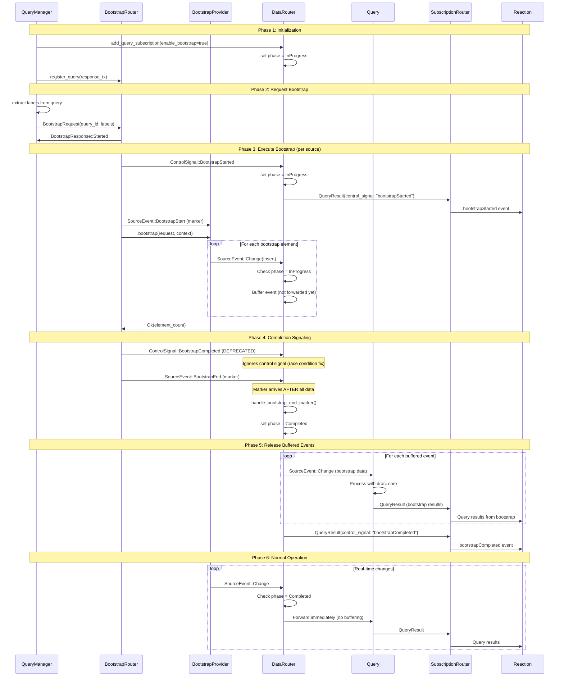
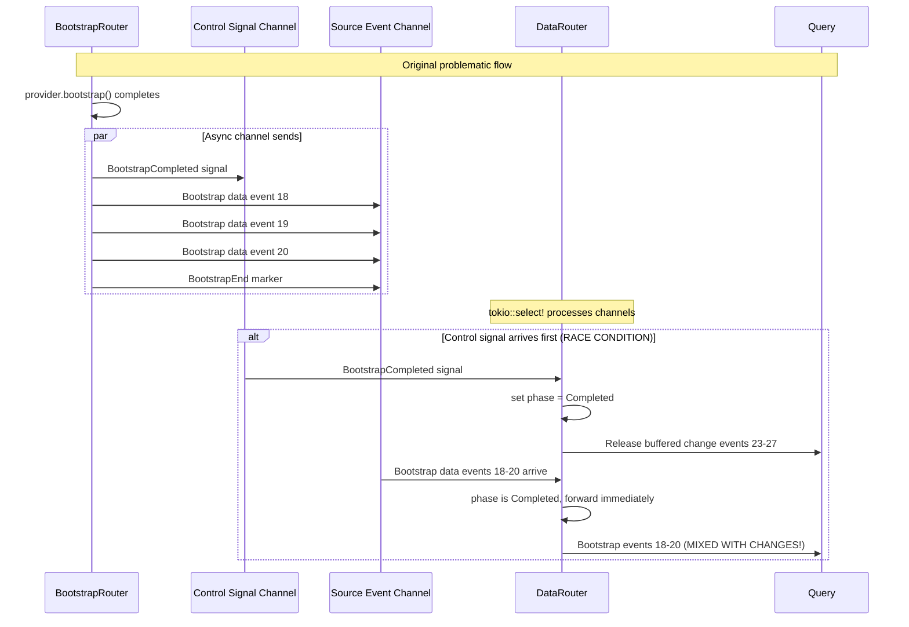
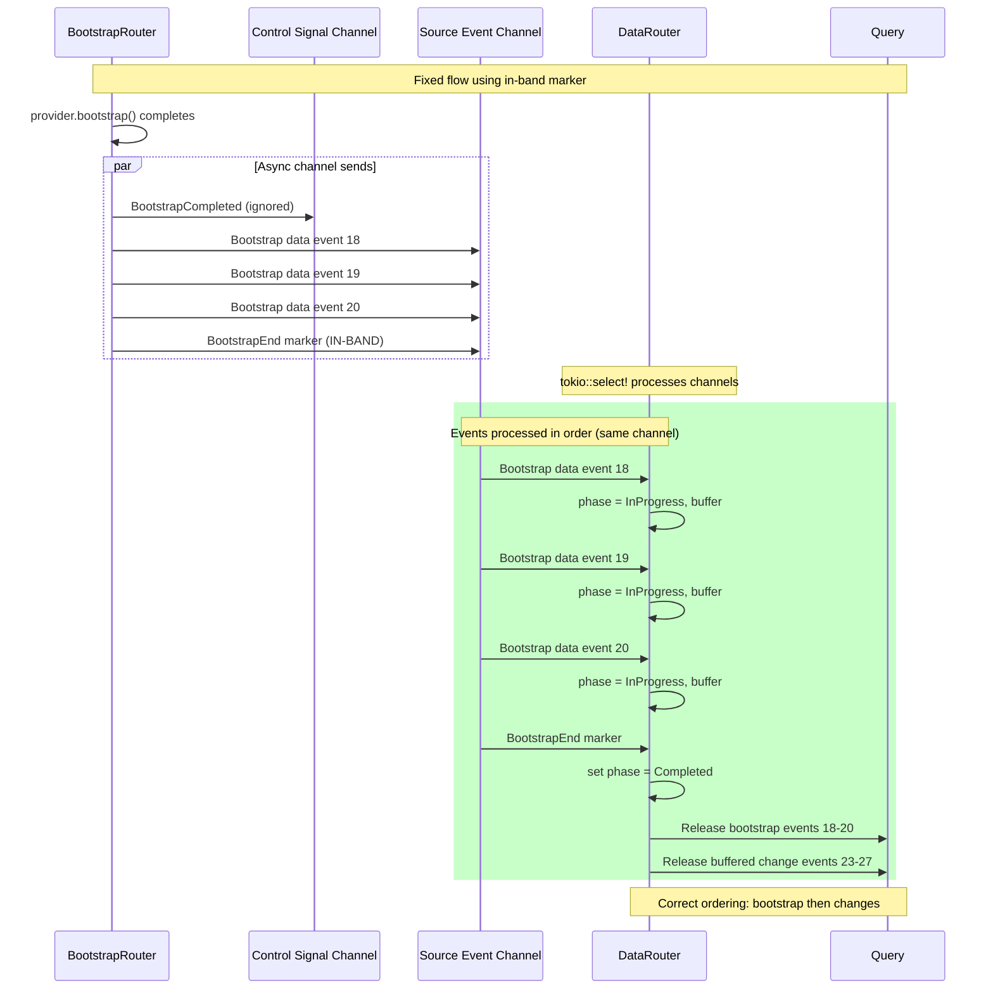
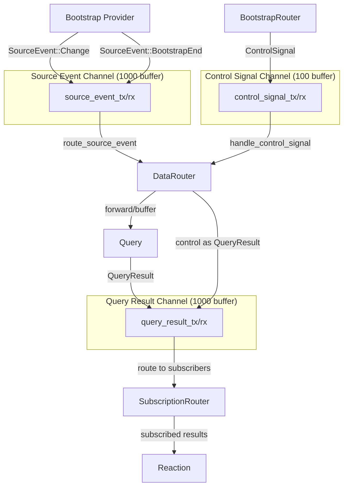
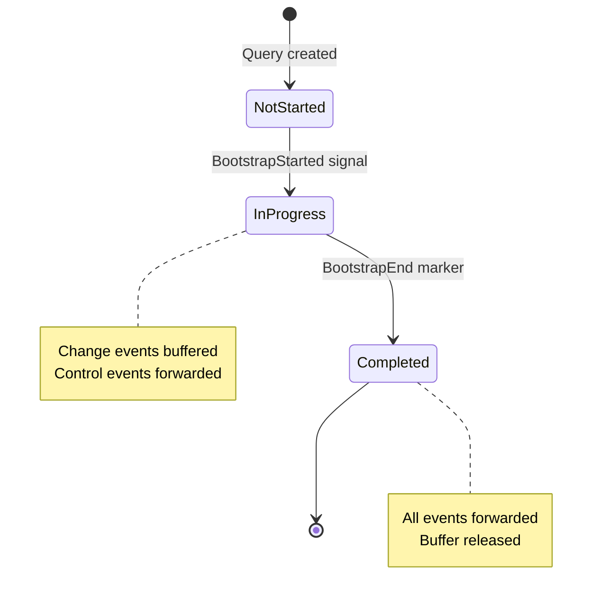

# Drasi Server-Core Bootstrap Architecture

## Table of Contents
1. [Overview](#overview)
2. [Key Components](#key-components)
3. [Bootstrap Flow Sequence](#bootstrap-flow-sequence)
4. [Channel Architecture](#channel-architecture)
5. [Component Responsibilities](#component-responsibilities)
6. [Event Types and Timing](#event-types-and-timing)
7. [Phase Management](#phase-management)
8. [Code Locations](#code-locations)
9. [Known Issues](#known-issues)

---

## Overview

The Drasi server-core bootstrap system delivers initial data to queries when they start, ensuring complete context before processing real-time changes. Bootstrap involves multiple components coordinating through async channels to deliver data reliably and in the correct order.

### Design Goals

1. **Complete Initial State**: Queries receive all relevant existing data before incremental updates
2. **Ordered Delivery**: Bootstrap data completes before change events are processed
3. **Per-Source Independence**: Each query-source pair bootstraps independently
4. **Provider Flexibility**: Different sources use different bootstrap mechanisms
5. **Timeout Protection**: Stuck bootstraps don't block queries indefinitely

---

## Key Components

### 1. QueryManager
**Location**: `src/queries/manager.rs`

**Responsibilities**:
- Initiates bootstrap when query starts
- Extracts labels from query text to request relevant data
- Creates and sends bootstrap requests
- Monitors bootstrap progress through response channel

### 2. BootstrapRouter
**Location**: `src/routers/bootstrap_router.rs`

**Responsibilities**:
- Receives bootstrap requests from queries
- Coordinates with registered providers
- Sends control signals for phase transitions
- Sends in-band markers for synchronization
- Tracks bootstrap state per query-source pair

### 3. DataRouter
**Location**: `src/routers/data_router.rs`

**Responsibilities**:
- Manages bootstrap phases per query-source pair
- Buffers change events during bootstrap
- Routes events to appropriate queries
- Detects bootstrap completion via BootstrapEnd marker
- Releases buffered events after completion
- Emits control signals to reactions

### 4. Bootstrap Providers
**Location**: `src/bootstrap/providers/`

**Responsibilities**:
- Implement source-specific bootstrap logic
- Deliver existing data as SourceChange::Insert events
- Signal completion through return value

**Provider Types**:
- **Platform**: Bootstrap from remote Query API
- **PostgreSQL**: Snapshot-based bootstrap from database
- **Application**: Replay stored insert events
- **ScriptFile**: Read JSONL bootstrap scripts
- **Noop**: No bootstrap (returns 0 elements)

### 5. SubscriptionRouter
**Location**: `src/routers/subscription_router.rs`

**Responsibilities**:
- Routes query results to subscribed reactions
- Forwards control signals (as QueryResults) to reactions

---

## Bootstrap Flow Sequence

### Sequence Diagram: Complete Bootstrap Flow



### Sequence Diagram: Race Condition (Original Issue)



### Sequence Diagram: Fixed Flow (BootstrapEnd Marker)



---

## Channel Architecture

### Three Primary Channels



### Channel Event Types

#### 1. Source Event Channel (`source_event_tx`)

**Event Types**:
```rust
pub enum SourceEvent {
    Change(SourceChange),           // Data insert/update/delete
    Control(SourceControl),         // Subscription control
    BootstrapStart { query_id },    // Start marker (deprecated)
    BootstrapEnd { query_id },      // End marker (CRITICAL)
}
```

**Buffer Size**: 1000 events
**Flow**: Providers → DataRouter → Queries
**Purpose**: Carries all data events and in-band synchronization markers

#### 2. Control Signal Channel (`control_signal_tx`)

**Signal Types**:
```rust
pub enum ControlSignal {
    BootstrapStarted { query_id, source_id },   // Bootstrap begins
    BootstrapCompleted { query_id, source_id }, // Bootstrap ends (DEPRECATED)
    Running { query_id },                       // Query running
    Stopped { query_id },                       // Query stopped
    Deleted { query_id },                       // Query deleted
}
```

**Buffer Size**: 100 signals
**Flow**: BootstrapRouter → DataRouter
**Purpose**: Fast coordination of bootstrap phases

**Critical Note**: `BootstrapCompleted` is now **deprecated** and **ignored** by DataRouter to prevent race conditions. Completion is triggered by the `BootstrapEnd` marker in the source event channel.

#### 3. Query Result Channel (`query_result_tx`)

**Result Type**:
```rust
pub struct QueryResult {
    pub query_id: String,
    pub timestamp: DateTime<Utc>,
    pub results: Vec<Value>,        // Query result rows
    pub metadata: HashMap<String, Value>,  // Including control_signal
    pub profiling: Option<ProfilingMetadata>,
}
```

**Buffer Size**: 1000 results
**Flow**: Query → SubscriptionRouter → Reactions
**Purpose**: Delivers query results and control signals to reactions

---

## Component Responsibilities

### QueryManager Responsibilities

**File**: `src/queries/manager.rs`

#### Bootstrap Initiation (Lines 155-317)

1. **Label Extraction** (Lines 253-266):
   ```rust
   let labels = LabelExtractor::extract_labels(&config.query)
       .unwrap_or_else(|e| {
           warn!("Failed to extract labels from query '{}': {}", query_id, e);
           ExtractedLabels::default()
       });
   ```
   - Parses Cypher/GQL query to find node and relation labels
   - Requests only relevant data from bootstrap

2. **Request Creation** (Lines 277-282):
   ```rust
   let bootstrap_request = BootstrapRequest {
       query_id: self.config.id.clone(),
       node_labels: labels.node_labels,
       relation_labels: labels.relation_labels,
       request_id: uuid::Uuid::new_v4().to_string(),
   };
   ```

3. **Send Request** (Line 284):
   ```rust
   self.bootstrap_request_tx.send(bootstrap_request).await?;
   ```

4. **Monitor Progress** (Lines 292-315):
   - Spawns async task to receive bootstrap responses
   - Logs: Started → InProgress → Completed/Failed
   - Non-blocking - query continues initialization

#### Query Registration (Lines 641-684)

```rust
async fn add_query_internal(&self, config: QueryConfig) -> Result<()> {
    // Create bootstrap response channel
    let (response_tx, response_rx) = mpsc::channel(100);

    // Register with bootstrap router
    self.bootstrap_response_senders
        .write()
        .await
        .insert(config.id.clone(), response_tx);

    // Create query with bootstrap channels
    let query = Arc::new(DrasiQuery::new(
        config,
        self.query_result_tx.clone(),
        self.bootstrap_request_tx.clone(),
        response_rx,
    ));
}
```

---

### BootstrapRouter Responsibilities

**File**: `src/routers/bootstrap_router.rs`

#### Provider Registration (Lines 75-110)

```rust
pub async fn register_provider(
    &mut self,
    server_id: String,
    source_config: Arc<SourceConfig>,
    provider_config: BootstrapProviderConfig,
    source_event_tx: SourceEventSender,
) -> Result<()>
```

**Process**:
1. Create provider based on config type (Platform, Postgres, ScriptFile, etc.)
2. Store in providers map by source_id
3. Create BootstrapContext with source_event_tx
4. Store context for later use

#### Bootstrap Execution (Lines 147-355)

**Main Loop**:
```rust
pub async fn start(
    &self,
    mut bootstrap_request_rx: BootstrapRequestReceiver
) {
    while let Some(request) = bootstrap_request_rx.recv().await {
        // Process request for each provider
    }
}
```

**Per-Provider Process** (Lines 185-348):

1. **Send Acknowledgment** (Lines 169-181):
   ```rust
   let started_response = BootstrapResponse {
       request_id: request_id.clone(),
       status: BootstrapStatus::Started,
       message: Some("Bootstrap started".to_string()),
   };
   response_tx.send(started_response).await
   ```

2. **Update State** (Lines 189-193):
   ```rust
   self.bootstrap_state.write().await.insert(
       state_key,
       BootstrapState::InProgress
   );
   ```

3. **Send BootstrapStarted Signal** (Lines 196-214):
   ```rust
   let start_signal = ControlSignalWrapper::new(
       ControlSignal::BootstrapStarted {
           query_id: query_id.clone(),
           source_id: source_id.clone(),
       }
   );
   control_tx.send(start_signal).await
   ```
   - Sent to DataRouter via control_signal_tx
   - Triggers InProgress phase

4. **Send BootstrapStart Marker** (Lines 217-236):
   ```rust
   let start_marker = SourceEventWrapper::new(
       source_id.clone(),
       SourceEvent::BootstrapStart { query_id: query_id.clone() },
       chrono::Utc::now(),
   );
   context.source_event_tx.send(start_marker).await
   ```
   - For backward compatibility
   - Currently ignored by queries

5. **Execute Provider** (Line 239):
   ```rust
   match provider.bootstrap(request.clone(), context).await {
       Ok(element_count) => { /* handle success */ }
       Err(e) => { /* handle failure */ }
   }
   ```

6. **On Success** (Lines 240-311):

   a. **Send BootstrapCompleted Signal** (Lines 247-265):
   ```rust
   let complete_signal = ControlSignalWrapper::new(
       ControlSignal::BootstrapCompleted {
           query_id: query_id.clone(),
           source_id: source_id.clone(),
       }
   );
   control_tx.send(complete_signal).await
   ```
   - **DEPRECATED** - ignored by DataRouter

   b. **Send BootstrapEnd Marker** (Lines 268-286):
   ```rust
   let end_marker = SourceEventWrapper::new(
       source_id.clone(),
       SourceEvent::BootstrapEnd { query_id: query_id.clone() },
       chrono::Utc::now(),
   );
   context.source_event_tx.send(end_marker).await
   ```
   - **CRITICAL** - triggers actual completion in DataRouter
   - Flows through same channel as bootstrap data

   c. **Update State** (Lines 289-292):
   ```rust
   self.bootstrap_state.write().await.insert(
       state_key,
       BootstrapState::Completed { element_count }
   );
   ```

   d. **Send Completion Response** (Lines 295-311):
   ```rust
   let complete_response = BootstrapResponse {
       request_id: request_id.clone(),
       status: BootstrapStatus::Completed { total_count: element_count },
       message: Some(format!("Bootstrap from source '{}' completed", source_id)),
   };
   response_tx.send(complete_response).await
   ```

---

### DataRouter Responsibilities

**File**: `src/routers/data_router.rs`

#### Subscription Management (Lines 124-213)

```rust
pub async fn add_query_subscription(
    &self,
    query_id: String,
    source_ids: Vec<String>,
    enable_bootstrap: bool,
) -> Result<SourceEventReceiver, String>
```

**Process**:

1. **Prevent Duplicates** (Lines 147-159):
   ```rust
   if self.query_event_senders.read().await.contains_key(&query_id) {
       return Err(format!("Query '{}' already subscribed", query_id));
   }
   ```

2. **Create Event Channel** (Line 161):
   ```rust
   let (tx, rx) = mpsc::channel(1000);
   ```
   - Query receives events through this channel

3. **Register Sender** (Lines 164-168):
   ```rust
   self.query_event_senders.write().await.insert(query_id.clone(), tx);
   ```

4. **Update Subscriptions** (Lines 171-190):
   ```rust
   for source_id in &source_ids {
       subscriptions
           .entry(source_id.clone())
           .or_insert_with(Vec::new)
           .push(query_id.clone());
   }
   ```
   - Enables routing from source to multiple queries

5. **Initialize Bootstrap Phase** (Lines 192-202):
   ```rust
   if enable_bootstrap {
       for source_id in &source_ids {
           self.set_bootstrap_phase(
               query_id.clone(),
               source_id.clone(),
               BootstrapPhase::InProgress
           ).await;
       }
   }
   ```
   - Sets initial phase to InProgress
   - Triggers event buffering from the start

#### Phase Management (Lines 240-259)

**Get Phase** (Lines 261-271):
```rust
async fn get_bootstrap_phase(
    &self,
    query_id: &str,
    source_id: &str
) -> BootstrapPhase {
    let key = QuerySourceKey {
        query_id: query_id.to_string(),
        source_id: source_id.to_string(),
    };
    self.bootstrap_state.read().await
        .get(&key)
        .copied()
        .unwrap_or(BootstrapPhase::NotStarted)
}
```

**Set Phase** (Lines 240-259):
```rust
async fn set_bootstrap_phase(
    &self,
    query_id: String,
    source_id: String,
    phase: BootstrapPhase
) {
    let key = QuerySourceKey { query_id, source_id };

    match phase {
        BootstrapPhase::InProgress => {
            // Record start time for timeout tracking
            self.bootstrap_start_times.write().await
                .insert(key.clone(), Instant::now());
        }
        BootstrapPhase::Completed => {
            // Remove start time when completed
            self.bootstrap_start_times.write().await.remove(&key);
        }
        _ => {}
    }

    self.bootstrap_state.write().await.insert(key, phase);
}
```

#### Event Buffering (Lines 272-290)

```rust
async fn buffer_event(
    &self,
    query_id: String,
    source_id: String,
    event: SourceEventWrapper
) -> Result<(), String> {
    let key = QuerySourceKey { query_id, source_id };
    let mut buffer_map = self.event_buffer.write().await;
    let buffer = buffer_map.entry(key).or_insert_with(VecDeque::new);

    // Check buffer size
    if buffer.len() >= self.max_buffer_size {
        warn!("Buffer full for query-source pair, dropping oldest event");
        buffer.pop_front(); // Drop oldest
    }

    buffer.push_back(event);
    Ok(())
}
```

**Features**:
- Per-query-source buffer using `VecDeque`
- Max size: 10,000 events (configurable)
- FIFO - oldest events dropped when full
- Maintains insertion order for release

#### Event Routing (Lines 389-474)

**Main Routing Logic**:
```rust
async fn route_source_event(&self, source_event_wrapper: SourceEventWrapper) {
    let source_id = &source_event_wrapper.source_id;

    // Handle special events (markers)
    match &source_event_wrapper.event {
        SourceEvent::BootstrapStart { query_id } => {
            // Ignored (deprecated)
            return;
        }
        SourceEvent::BootstrapEnd { query_id } => {
            // CRITICAL: Trigger completion
            self.handle_bootstrap_end_marker(
                query_id.clone(),
                source_id.clone()
            ).await;
            return;
        }
        _ => {}
    }

    // Route to subscribed queries
    if let Some(query_ids) = self.source_subscriptions.read().await.get(source_id) {
        for query_id in query_ids {
            let phase = self.get_bootstrap_phase(query_id, source_id).await;

            match phase {
                BootstrapPhase::NotStarted | BootstrapPhase::Completed => {
                    // Forward immediately
                    let senders = self.query_event_senders.read().await;
                    if let Some(sender) = senders.get(query_id) {
                        sender.send(source_event_wrapper.clone()).await;
                    }
                }
                BootstrapPhase::InProgress => {
                    // Buffer or forward based on event type
                    match &source_event_wrapper.event {
                        SourceEvent::Change(_) => {
                            // Buffer change events
                            self.buffer_event(
                                query_id.clone(),
                                source_id.clone(),
                                source_event_wrapper.clone()
                            ).await;
                        }
                        SourceEvent::Control(_) => {
                            // Forward control events immediately
                            let senders = self.query_event_senders.read().await;
                            if let Some(sender) = senders.get(query_id) {
                                sender.send(source_event_wrapper.clone()).await;
                            }
                        }
                        _ => {}
                    }
                }
            }
        }
    }
}
```

**Phase-Based Behavior**:
- **NotStarted/Completed**: Forward all events immediately
- **InProgress**:
  - Change events → Buffer
  - Control events → Forward (for coordination)

#### Bootstrap Completion (Lines 328-356)

**Critical Completion Handler**:
```rust
async fn handle_bootstrap_end_marker(
    &self,
    query_id: String,
    source_id: String
) {
    info!("[BOOTSTRAP] Processing BootstrapEnd marker for query '{}' source '{}'",
        query_id, source_id);

    // Verify phase
    let phase = self.get_bootstrap_phase(&query_id, &source_id).await;
    if phase != BootstrapPhase::InProgress {
        warn!("[BOOTSTRAP] Received BootstrapEnd but phase is {:?}, ignoring",
            phase);
        return;
    }

    info!("[BOOTSTRAP] Completing bootstrap - all data received");

    // Transition to Completed
    self.set_bootstrap_phase(
        query_id.clone(),
        source_id.clone(),
        BootstrapPhase::Completed
    ).await;

    // Release buffered events
    self.release_buffered_events(
        query_id.clone(),
        source_id.clone()
    ).await;

    // Emit control signal to reactions
    self.emit_control_signal_as_result(&query_id, "bootstrapCompleted").await;

    info!("[BOOTSTRAP] Bootstrap completed for query '{}' source '{}'",
        query_id, source_id);
}
```

**Key Points**:
1. Only processes if phase is InProgress
2. Transitions to Completed AFTER marker arrives
3. Releases buffered events in order
4. Emits control signal to reactions
5. **Guarantees**: All bootstrap data delivered before completion

#### Buffer Release (Lines 293-326)

```rust
async fn release_buffered_events(
    &self,
    query_id: String,
    source_id: String
) {
    let key = QuerySourceKey {
        query_id: query_id.clone(),
        source_id: source_id.clone(),
    };

    // Take ownership of buffer
    let buffer = {
        let mut buffer_map = self.event_buffer.write().await;
        buffer_map.remove(&key)
    };

    if let Some(buffer) = buffer {
        let count = buffer.len();
        info!("Releasing {} buffered events for query '{}' source '{}'",
            count, query_id, source_id);

        // Get sender
        let senders = self.query_event_senders.read().await;
        if let Some(sender) = senders.get(&query_id) {
            // Send all events in order
            for event in buffer {
                match sender.send(event).await {
                    Ok(_) => {}
                    Err(e) => {
                        error!("Failed to release buffered event: {}", e);
                        break; // Stop on channel close
                    }
                }
            }
        }
    }
}
```

**Features**:
- Removes buffer from map (one-time operation)
- Sends all events in original order
- Stops on channel close
- Comprehensive logging

#### Control Signal Handling (Lines 477-506)

```rust
async fn handle_control_signal(&self, signal_wrapper: ControlSignalWrapper) {
    match signal_wrapper.signal {
        ControlSignal::BootstrapStarted { query_id, source_id } => {
            info!("Received BootstrapStarted signal");

            // Set phase
            self.set_bootstrap_phase(
                query_id.clone(),
                source_id,
                BootstrapPhase::InProgress
            ).await;

            // Emit to reactions
            self.emit_control_signal_as_result(&query_id, "bootstrapStarted").await;
        }

        ControlSignal::BootstrapCompleted { query_id, source_id } => {
            // DEPRECATED - ignored to prevent race condition
            debug!("Received deprecated BootstrapCompleted signal - ignoring");
            // Actual completion handled by BootstrapEnd marker
        }

        ControlSignal::Running { query_id } => {
            debug!("Query '{}' is now running", query_id);
        }

        ControlSignal::Stopped { query_id } => {
            debug!("Query '{}' has stopped", query_id);
        }

        ControlSignal::Deleted { query_id } => {
            debug!("Query '{}' has been deleted", query_id);
            self.remove_query_subscription(&query_id).await;
        }
    }
}
```

**BootstrapCompleted Deprecation**:
- Originally triggered completion
- Now ignored because it can arrive before data
- Replaced by BootstrapEnd marker for reliable ordering

#### Control Signal to Reactions (Lines 89-113)

```rust
async fn emit_control_signal_as_result(
    &self,
    query_id: &str,
    signal_type: &str
) {
    if let Some(ref tx) = self.query_result_tx {
        let mut metadata = HashMap::new();
        metadata.insert("control_signal".to_string(), json!(signal_type));

        let control_result = QueryResult::new(
            query_id.to_string(),
            chrono::Utc::now(),
            vec![], // No data results
            metadata,
        );

        if let Err(e) = tx.send(control_result).await {
            error!("Failed to send control signal: {}", e);
        } else {
            info!("Emitted control signal '{}' for query '{}'",
                signal_type, query_id);
        }
    }
}
```

**Purpose**:
- Converts control signals to QueryResults
- Reactions can detect via `control_signal` metadata field
- Enables reactions to respond to bootstrap lifecycle

---

## Event Types and Timing

### Event Timeline Analysis

Based on the test output in `room-comfort-level-results.json`:

| Sequence | Event Type | Timestamp (ms) | Delta (ms) | Description |
|----------|------------|----------------|------------|-------------|
| 1 | Running | 1761006866273 | 0 | Query started |
| 2 | **bootstrapStarted** | 1761006866275 | +2 | Bootstrap begins |
| 3 | **bootstrapCompleted** | 1761006866276 | +1 | **WRONG: Too early!** |
| 4 | Bootstrap data 1 | 1761006866277 | +1 | Room R_000_000_000 |
| 5 | Bootstrap data 2 | 1761006866278 | +1 | Room R_000_000_001 |
| 6 | Bootstrap data 3 | 1761006866279 | +1 | Room R_000_000_002 |
| 7 | Bootstrap data 4 | 1761006866280 | +1 | Room R_000_000_003 |
| 8 | Bootstrap data 5 | 1761006866280 | +0 | Room R_000_000_004 |

### Problem Analysis

**Issue**: bootstrapCompleted (seq 3) appears before bootstrap data (seq 4-8)

**Root Cause**:
1. BootstrapRouter sends BootstrapCompleted control signal immediately after provider completes
2. Control signal travels through `control_signal_tx` channel
3. Bootstrap data still in transit through `source_event_tx` channel
4. DataRouter processes control signal first (race condition)
5. Phase transitions to Completed before data arrives
6. Bootstrap data forwarded immediately instead of being part of bootstrap batch

**Expected Flow**:
```
Seq 1: Running
Seq 2: bootstrapStarted
Seq 3: Bootstrap data 1
Seq 4: Bootstrap data 2
Seq 5: Bootstrap data 3
Seq 6: Bootstrap data 4
Seq 7: Bootstrap data 5
Seq 8: bootstrapCompleted  ← Should be LAST
```

### Profiling Metadata in Events

**Bootstrap Events** (Seq 4-8):

```json
"metadata": {
  "tracking": {
    "source": {
      "source_ns": 0,  ← ALWAYS 0 for bootstrap
      "seq": 4,
      "changeDispatcherEnd_ns": 1761006866272030383,
      "changeDispatcherStart_ns": 1761006866272030383,
      "changeRouterEnd_ns": 1761006866272030383,
      "changeRouterStart_ns": 1761006866272030342,
      "reactivatorEnd_ns": 1761006866272030383,
      "reactivatorStart_ns": 1761006866272030383
    },
    "query": {
      "enqueue_ns": 1761006866272030383,
      "dequeue_ns": 1761006866272382133,
      "queryStart_ns": 1761006866272382175,
      "queryEnd_ns": 1761006866273055883
    }
  }
}
```

**Key Indicators**:
- `source_ns = 0`: Distinguishes bootstrap from live events
- `seq`: Sequence number from BootstrapContext counter
- Timestamps track latency through the pipeline

---

## Phase Management

### Bootstrap Phases

```rust
pub enum BootstrapPhase {
    NotStarted,  // Initial state, no bootstrap yet
    InProgress,  // Bootstrap active, buffering changes
    Completed,   // Bootstrap done, forwarding all events
}
```

### Phase Transitions



### Phase State Storage

**Per Query-Source Pair**:
```rust
struct QuerySourceKey {
    query_id: String,
    source_id: String,
}

bootstrap_state: Arc<RwLock<HashMap<QuerySourceKey, BootstrapPhase>>>
```

**Granularity**:
- Each (query, source) pair has independent phase
- Allows partial bootstrap completion
- One source can complete while another continues

**Example**:
```
Query "q1" subscribed to sources ["s1", "s2", "s3"]

States:
- (q1, s1): Completed
- (q1, s2): InProgress  ← Still bootstrapping
- (q1, s3): Completed
```

### Timeout Management

**Timeout Checker** (Lines 358-388):

```rust
async fn check_bootstrap_timeouts(&self) {
    let now = Instant::now();

    // Find timed-out pairs
    let timed_out_pairs: Vec<QuerySourceKey> = {
        let start_times = self.bootstrap_start_times.read().await;
        start_times
            .iter()
            .filter_map(|(key, start_time)| {
                if now.duration_since(*start_time) > self.bootstrap_timeout {
                    Some(key.clone())
                } else {
                    None
                }
            })
            .collect()
    };

    // Force completion
    for key in timed_out_pairs {
        warn!("Bootstrap timeout for query '{}' source '{}'",
            key.query_id, key.source_id);

        self.set_bootstrap_phase(
            key.query_id.clone(),
            key.source_id.clone(),
            BootstrapPhase::Completed
        ).await;

        self.release_buffered_events(key.query_id, key.source_id).await;
    }
}
```

**Configuration**:
- Default timeout: 300 seconds (5 minutes)
- Check interval: 10 seconds
- Configured in DataRouter constructor (line 72)

**Purpose**:
- Prevents indefinite blocking
- Releases buffered events on timeout
- Allows query to proceed with partial data

---

## Code Locations

### Core Files

| File | Lines | Description |
|------|-------|-------------|
| `src/queries/manager.rs` | 155-317 | Bootstrap request creation and monitoring |
| `src/queries/manager.rs` | 641-684 | Query registration with bootstrap channels |
| `src/routers/bootstrap_router.rs` | 75-110 | Provider registration |
| `src/routers/bootstrap_router.rs` | 126-132 | Query response channel registration |
| `src/routers/bootstrap_router.rs` | 147-355 | Main bootstrap execution loop |
| `src/routers/data_router.rs` | 124-213 | Query subscription and phase initialization |
| `src/routers/data_router.rs` | 240-259 | Phase state management |
| `src/routers/data_router.rs` | 272-290 | Event buffering |
| `src/routers/data_router.rs` | 293-326 | Buffer release |
| `src/routers/data_router.rs` | 328-356 | BootstrapEnd marker handling |
| `src/routers/data_router.rs` | 358-388 | Timeout checking |
| `src/routers/data_router.rs` | 389-474 | Event routing with phase checks |
| `src/routers/data_router.rs` | 477-506 | Control signal handling |
| `src/routers/data_router.rs` | 509-541 | Main event loop |
| `src/bootstrap/mod.rs` | 38-88 | BootstrapContext definition |
| `src/bootstrap/mod.rs` | 92-101 | BootstrapProvider trait |
| `src/bootstrap/providers/script_file.rs` | 245-283 | Example provider implementation |
| `src/channels/events.rs` | 67-76 | SourceEvent enum |
| `src/channels/events.rs` | 221-244 | ControlSignal enum |
| `src/channels/events.rs` | 15-112 | QueryResult struct |
| `src/server_core.rs` | 1309-1331 | Router initialization |
| `src/server_core.rs` | 1334-1369 | Source and provider registration |
| `src/server_core.rs` | 1371-1399 | Query registration |

### Key Operations

| Operation | File | Lines | Description |
|-----------|------|-------|-------------|
| Extract labels | `manager.rs` | 253-266 | Parse query for label filters |
| Create request | `manager.rs` | 277-282 | Build BootstrapRequest |
| Send request | `manager.rs` | 284 | Submit to BootstrapRouter |
| Register provider | `bootstrap_router.rs` | 75-110 | Add provider for source |
| Send BootstrapStarted | `bootstrap_router.rs` | 196-214 | Start signal to DataRouter |
| Execute provider | `bootstrap_router.rs` | 239 | Call provider.bootstrap() |
| Send BootstrapEnd | `bootstrap_router.rs` | 268-286 | End marker to data channel |
| Handle end marker | `data_router.rs` | 328-356 | Process completion |
| Set phase | `data_router.rs` | 240-259 | Update bootstrap state |
| Buffer event | `data_router.rs` | 272-290 | Store during bootstrap |
| Release buffer | `data_router.rs` | 293-326 | Forward after completion |
| Route event | `data_router.rs` | 389-474 | Phase-aware routing |
| Check timeout | `data_router.rs` | 358-388 | Force completion on timeout |
| Emit to reactions | `data_router.rs` | 89-113 | Send control signal |

---

## Known Issues

### Issue 1: Control Signal Arrives Before Data (FIXED in recent commit)

**Problem**: Bootstrap data appearing after bootstrapCompleted signal

**Root Cause**:
- BootstrapCompleted control signal sent through separate channel
- Can arrive at DataRouter before bootstrap data
- Phase transitions to Completed prematurely
- Bootstrap data then forwarded immediately instead of being recognized as bootstrap

**Fix Applied**:
- DataRouter now ignores BootstrapCompleted control signal
- Uses BootstrapEnd marker (in source event channel) for completion
- Marker flows with data, ensuring correct ordering

**Code Changes**:
- `data_router.rs:376-381`: Process BootstrapEnd marker
- `data_router.rs:328-356`: New handle_bootstrap_end_marker() method
- `data_router.rs:487-494`: Ignore BootstrapCompleted signal

**Verification**:
- Bootstrap data should appear BEFORE bootstrapCompleted
- All events maintain source_ns=0 for bootstrap
- Sequence numbers should be monotonic

### Issue 2: Query Results vs Control Signals

**Current Behavior**:
- Control signals sent as synthetic QueryResults
- Requires reactions to check metadata for "control_signal" field

**Potential Issue**:
- Reactions may not distinguish control from data results
- Mixing control and data in same channel

**Alternative Design**:
- Separate control event channel for reactions
- Explicit control signal delivery
- Clear separation of concerns

### Issue 3: No Bootstrap Restart

**Current Limitation**:
- Once bootstrap completes or fails, cannot restart
- Must delete and recreate query

**Potential Need**:
- Re-bootstrap after source reconnect
- Refresh stale data
- Recovery from partial bootstrap

**Workaround**:
- Delete query
- Recreate with same configuration
- Bootstrap runs again from scratch

---

## Best Practices

### For Provider Implementers

1. **Send All Data First**:
   ```rust
   // Send all bootstrap events
   for element in elements {
       context.source_event_tx.send(event).await?;
   }
   // Then return count
   Ok(element_count)
   ```

2. **Add Profiling Metadata**:
   ```rust
   let mut profiling = ProfilingMetadata::new();
   profiling.source_ns = Some(0); // Mark as bootstrap
   profiling.source_send_ns = Some(timestamp_ns());
   ```

3. **Use Sequence Counter**:
   ```rust
   let sequence = context.next_sequence(); // Atomic increment
   ```

4. **Handle Errors Gracefully**:
   ```rust
   match send_result {
       Ok(_) => continue,
       Err(e) => return Err(anyhow!("Failed to send: {}", e))
   }
   ```

### For Query Developers

1. **Always Enable Bootstrap**:
   ```rust
   data_router.add_query_subscription(
       query_id,
       source_ids,
       true  // enable_bootstrap
   ).await
   ```

2. **Monitor Bootstrap Progress**:
   ```rust
   while let Some(response) = response_rx.recv().await {
       match response.status {
           BootstrapStatus::Started => { /* log */ }
           BootstrapStatus::InProgress => { /* log */ }
           BootstrapStatus::Completed { total_count } => { /* log */ }
           BootstrapStatus::Failed { error } => { /* handle */ }
       }
   }
   ```

3. **Extract Labels Accurately**:
   - Use LabelExtractor for Cypher/GQL queries
   - Request only needed labels to reduce data
   - Fall back to empty labels (all data) if extraction fails

### For Reaction Developers

1. **Detect Control Signals**:
   ```rust
   if let Some(signal) = result.metadata.get("control_signal") {
       match signal.as_str() {
           Some("bootstrapStarted") => { /* handle */ }
           Some("bootstrapCompleted") => { /* handle */ }
           _ => {}
       }
   } else {
       // Regular query result
   }
   ```

2. **Wait for Bootstrap Completion**:
   - Don't assume first results are complete dataset
   - Wait for bootstrapCompleted before critical operations
   - Buffer results if needed during bootstrap

---

## Troubleshooting

### Bootstrap Hangs

**Symptoms**:
- Query never receives data
- No bootstrapCompleted signal

**Checks**:
1. Check logs for provider errors
2. Verify provider registered for source
3. Check timeout (default 5 minutes)
4. Verify source event channel not full

**Resolution**:
- Check provider implementation
- Increase timeout if needed
- Add logging to provider
- Verify channel buffer sizes

### Events Out of Order

**Symptoms**:
- Bootstrap data after bootstrapCompleted
- Change events mixed with bootstrap

**Checks**:
1. Verify BootstrapEnd marker sent
2. Check DataRouter processes marker
3. Verify phase transitions

**Resolution**:
- Ensure provider sends all data before returning
- Verify BootstrapRouter sends marker
- Check DataRouter marker handling (lines 376-381)

### Missing Bootstrap Data

**Symptoms**:
- Some expected data not appearing
- Partial results

**Checks**:
1. Verify label extraction
2. Check provider filtering logic
3. Verify event buffer not full

**Resolution**:
- Adjust label extraction
- Check provider label matching
- Increase buffer size if needed

### Control Signals Not Reaching Reactions

**Symptoms**:
- Reactions don't see bootstrapStarted/Completed

**Checks**:
1. Verify DataRouter has query_result_tx set
2. Check subscription router forwarding
3. Verify reaction subscribed to query

**Resolution**:
- Verify DataRouter.set_query_result_tx() called
- Check subscription router logs
- Verify reaction subscription

---

## Future Enhancements

### 1. Checkpoint-Based Bootstrap

**Current**: Full snapshot each time
**Proposed**: Resume from last checkpoint
**Benefits**: Faster restarts, less data transfer

### 2. Incremental Bootstrap

**Current**: All-or-nothing
**Proposed**: Stream data in batches
**Benefits**: Faster time-to-first-result

### 3. Bootstrap Progress Reporting

**Current**: Count only at end
**Proposed**: Periodic progress updates
**Benefits**: Better UX, early error detection

### 4. Bootstrap Pause/Resume

**Current**: Can't pause
**Proposed**: Pause and resume bootstrap
**Benefits**: Resource management, debugging

### 5. Bootstrap Data Validation

**Current**: No validation
**Proposed**: Schema validation during bootstrap
**Benefits**: Early error detection, data quality

---

## Glossary

**Bootstrap**: Process of delivering existing data to a new query before real-time updates

**Provider**: Component that implements bootstrap logic for a specific source type

**Phase**: Current state of bootstrap for a query-source pair (NotStarted, InProgress, Completed)

**Marker**: Special event that flows through data channel for synchronization

**Control Signal**: Out-of-band message for coordination (BootstrapStarted, BootstrapCompleted)

**Buffer**: Temporary storage for change events during bootstrap

**Query-Source Pair**: Combination of one query and one source, the unit of bootstrap tracking

**Element Count**: Number of data items delivered during bootstrap

**Label Extraction**: Parsing query text to determine which node/relation types to bootstrap

**Profiling Metadata**: Timing information attached to events for performance tracking

**BootstrapContext**: Runtime environment provided to bootstrap providers

**BootstrapRequest**: Request from query to bootstrap router specifying required data

**BootstrapResponse**: Status update from bootstrap router to query